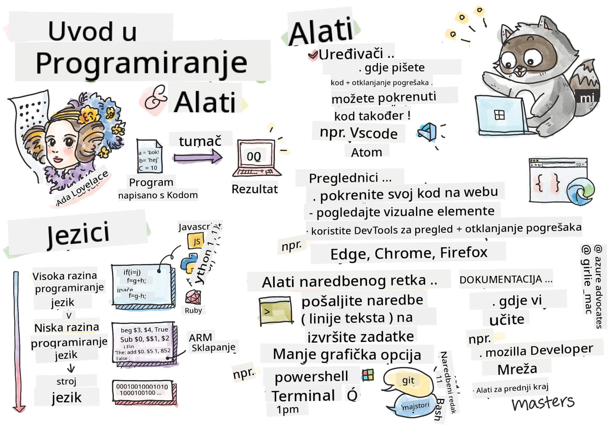

<!--
CO_OP_TRANSLATOR_METADATA:
{
  "original_hash": "c63675cfaf1d223b37bb9fecbfe7c252",
  "translation_date": "2025-08-28T00:14:47+00:00",
  "source_file": "1-getting-started-lessons/1-intro-to-programming-languages/README.md",
  "language_code": "hr"
}
-->
# Uvod u programske jezike i alate za razvoj

Ova lekcija pokriva osnove programskih jezika. Teme obrađene ovdje primjenjive su na većinu modernih programskih jezika danas. U odjeljku 'Alati za razvoj' naučit ćete o korisnom softveru koji vam pomaže kao programeru.


> Sketchnote od [Tomomi Imura](https://twitter.com/girlie_mac)

## Kviz prije predavanja
[Kviz prije predavanja](https://forms.office.com/r/dru4TE0U9n?origin=lprLink)

## Uvod

U ovoj lekciji obradit ćemo:

- Što je programiranje?
- Vrste programskih jezika
- Osnovni elementi programa
- Koristan softver i alati za profesionalne programere

> Ovu lekciju možete pratiti na [Microsoft Learn](https://docs.microsoft.com/learn/modules/web-development-101/introduction-programming/?WT.mc_id=academic-77807-sagibbon)!

## Što je programiranje?

Programiranje (poznato i kao kodiranje) je proces pisanja uputa za uređaj poput računala ili mobilnog uređaja. Te upute pišemo pomoću programskog jezika, koji uređaj zatim interpretira. Ovi skupovi uputa mogu se nazivati različitim imenima, ali *program*, *računalni program*, *aplikacija (app)* i *izvršna datoteka* su neki od popularnih naziva.

*Program* može biti bilo što što je napisano kodom; web stranice, igre i aplikacije za telefon su programi. Iako je moguće stvoriti program bez pisanja koda, osnovna logika interpretira se od strane uređaja, a ta logika najvjerojatnije je napisana kodom. Program koji *radi* ili *izvršava* kod provodi upute. Uređaj na kojem čitate ovu lekciju pokreće program kako bi je prikazao na vašem ekranu.

✅ Malo istražite: tko se smatra prvim računalnim programerom na svijetu?

## Programski jezici

Programski jezici omogućuju programerima pisanje uputa za uređaj. Uređaji mogu razumjeti samo binarni kod (1 i 0), a za *većinu* programera to nije vrlo učinkovit način komunikacije. Programski jezici su sredstvo komunikacije između ljudi i računala.

Programski jezici dolaze u različitim formatima i mogu služiti različitim svrhama. Na primjer, JavaScript se prvenstveno koristi za web aplikacije, dok se Bash prvenstveno koristi za operativne sustave.

*Jezici niske razine* obično zahtijevaju manje koraka nego *jezici visoke razine* da bi uređaj interpretirao upute. Međutim, ono što jezike visoke razine čini popularnima je njihova čitljivost i podrška. JavaScript se smatra jezikom visoke razine.

Sljedeći kod ilustrira razliku između jezika visoke razine (JavaScript) i jezika niske razine (ARM assembly kod).

```javascript
let number = 10
let n1 = 0, n2 = 1, nextTerm;

for (let i = 1; i <= number; i++) {
    console.log(n1);
    nextTerm = n1 + n2;
    n1 = n2;
    n2 = nextTerm;
}
```

```c
 area ascen,code,readonly
 entry
 code32
 adr r0,thumb+1
 bx r0
 code16
thumb
 mov r0,#00
 sub r0,r0,#01
 mov r1,#01
 mov r4,#10
 ldr r2,=0x40000000
back add r0,r1
 str r0,[r2]
 add r2,#04
 mov r3,r0
 mov r0,r1
 mov r1,r3
 sub r4,#01
 cmp r4,#00
 bne back
 end
```

Vjerovali ili ne, *oba rade istu stvar*: ispisuju Fibonacci niz do 10.

✅ Fibonacci niz je [definiran](https://en.wikipedia.org/wiki/Fibonacci_number) kao skup brojeva gdje je svaki broj zbroj dva prethodna, počevši od 0 i 1. Prvih 10 brojeva Fibonacci niza su 0, 1, 1, 2, 3, 5, 8, 13, 21 i 34.

## Elementi programa

Jedna uputa u programu naziva se *izjava* i obično ima znak ili razmak koji označava gdje uputa završava, odnosno *terminira*. Način na koji program terminira varira ovisno o jeziku.

Izjave unutar programa mogu se oslanjati na podatke koje pruža korisnik ili drugi izvori kako bi izvršile upute. Podaci mogu promijeniti ponašanje programa, pa programski jezici dolaze s načinom privremenog pohranjivanja podataka kako bi se mogli koristiti kasnije. To se naziva *varijable*. Varijable su izjave koje upućuju uređaj da pohrani podatke u svoju memoriju. Varijable u programima slične su varijablama u algebri, gdje imaju jedinstveno ime, a njihova vrijednost može se mijenjati tijekom vremena.

Postoji mogućnost da neke izjave neće biti izvršene od strane uređaja. To je obično namjerno kada ih napiše programer ili slučajno kada se dogodi neočekivana greška. Ova vrsta kontrole nad aplikacijom čini je robusnijom i lakšom za održavanje. Obično se ove promjene u kontroli događaju kada su ispunjeni određeni uvjeti. U modernom programiranju često se koristi izjava `if..else` za kontrolu načina na koji program radi.

✅ Više o ovoj vrsti izjave naučit ćete u sljedećim lekcijama.

## Alati za razvoj

[](https://youtube.com/watch?v=69WJeXGBdxg "Alati za razvoj")

> 🎥 Kliknite na sliku iznad za video o alatima

U ovom odjeljku naučit ćete o nekim softverima koji vam mogu biti vrlo korisni dok započinjete svoj profesionalni razvojni put.

**Razvojno okruženje** je jedinstven skup alata i značajki koje programer često koristi pri pisanju softvera. Neki od tih alata prilagođeni su specifičnim potrebama programera i mogu se mijenjati tijekom vremena ako programer promijeni prioritete u radu, osobnim projektima ili kada koristi drugi programski jezik. Razvojna okruženja su jedinstvena kao i programeri koji ih koriste.

### Uređivači

Jedan od najvažnijih alata za razvoj softvera je uređivač. Uređivači su mjesto gdje pišete svoj kod, a ponekad i gdje ga pokrećete.

Programeri se oslanjaju na uređivače iz nekoliko dodatnih razloga:

- *Otklanjanje grešaka* pomaže otkriti greške i pogreške korak po korak, liniju po liniju. Neki uređivači imaju mogućnosti otklanjanja grešaka; mogu se prilagoditi i dodati za specifične programske jezike.
- *Isticanje sintakse* dodaje boje i formatiranje tekstu koda, čineći ga lakšim za čitanje. Većina uređivača omogućuje prilagođeno isticanje sintakse.
- *Ekstenzije i integracije* su specijalizirani alati za programere, od strane programera. Ovi alati nisu ugrađeni u osnovni uređivač. Na primjer, mnogi programeri dokumentiraju svoj kod kako bi objasnili kako radi. Mogu instalirati ekstenziju za provjeru pravopisa kako bi pronašli tipografske pogreške unutar dokumentacije. Većina ekstenzija namijenjena je za korištenje unutar specifičnog uređivača, a većina uređivača dolazi s načinom pretraživanja dostupnih ekstenzija.
- *Prilagodba* omogućuje programerima stvaranje jedinstvenog razvojnog okruženja koje odgovara njihovim potrebama. Većina uređivača je izuzetno prilagodljiva i također može omogućiti programerima stvaranje vlastitih ekstenzija.

#### Popularni uređivači i ekstenzije za web razvoj

- [Visual Studio Code](https://code.visualstudio.com/?WT.mc_id=academic-77807-sagibbon)
  - [Code Spell Checker](https://marketplace.visualstudio.com/items?itemName=streetsidesoftware.code-spell-checker)
  - [Live Share](https://marketplace.visualstudio.com/items?itemName=MS-vsliveshare.vsliveshare)
  - [Prettier - Code formatter](https://marketplace.visualstudio.com/items?itemName=esbenp.prettier-vscode)
- [Atom](https://atom.io/)
  - [spell-check](https://atom.io/packages/spell-check)
  - [teletype](https://atom.io/packages/teletype)
  - [atom-beautify](https://atom.io/packages/atom-beautify)
  
- [Sublimetext](https://www.sublimetext.com/)
  - [emmet](https://emmet.io/)
  - [SublimeLinter](http://www.sublimelinter.com/en/stable/)

### Preglednici

Još jedan ključni alat je preglednik. Web programeri se oslanjaju na preglednik kako bi vidjeli kako njihov kod radi na webu. Također se koristi za prikaz vizualnih elemenata web stranice koji su napisani u uređivaču, poput HTML-a.

Mnogi preglednici dolaze s *razvojnim alatima* (DevTools) koji sadrže skup korisnih značajki i informacija za pomoć programerima u prikupljanju i hvatanju važnih informacija o njihovoj aplikaciji. Na primjer: Ako web stranica ima greške, ponekad je korisno znati kada su se dogodile. DevTools u pregledniku može se konfigurirati za prikupljanje tih informacija.

#### Popularni preglednici i DevTools

- [Edge](https://docs.microsoft.com/microsoft-edge/devtools-guide-chromium/?WT.mc_id=academic-77807-sagibbon)
- [Chrome](https://developers.google.com/web/tools/chrome-devtools/)
- [Firefox](https://developer.mozilla.org/docs/Tools)

### Alati naredbenog retka

Neki programeri preferiraju manje grafički prikaz za svoje svakodnevne zadatke i oslanjaju se na naredbeni redak za postizanje toga. Pisanje koda zahtijeva značajnu količinu tipkanja, a neki programeri preferiraju ne prekidati svoj tok na tipkovnici. Koriste prečace na tipkovnici za prebacivanje između prozora na radnoj površini, rad na različitim datotekama i korištenje alata. Većina zadataka može se obaviti mišem, ali jedna prednost korištenja naredbenog retka je da se puno toga može obaviti alatima naredbenog retka bez potrebe za prebacivanjem između miša i tipkovnice. Još jedna prednost naredbenog retka je da su konfigurabilni i možete spremiti prilagođenu konfiguraciju, kasnije je promijeniti i uvesti na druge razvojne strojeve. Budući da su razvojna okruženja tako jedinstvena za svakog programera, neki će izbjegavati korištenje naredbenog retka, neki će se u potpunosti oslanjati na njega, a neki preferiraju kombinaciju oba.

### Popularne opcije naredbenog retka

Opcije za naredbeni redak razlikovat će se ovisno o operativnom sustavu koji koristite.

*💻 = dolazi unaprijed instaliran na operativnom sustavu.*

#### Windows

- [Powershell](https://docs.microsoft.com/powershell/scripting/overview?view=powershell-7/?WT.mc_id=academic-77807-sagibbon) 💻
- [Command Line](https://docs.microsoft.com/windows-server/administration/windows-commands/windows-commands/?WT.mc_id=academic-77807-sagibbon) (poznat i kao CMD) 💻
- [Windows Terminal](https://docs.microsoft.com/windows/terminal/?WT.mc_id=academic-77807-sagibbon)
- [mintty](https://mintty.github.io/)
  
#### MacOS

- [Terminal](https://support.apple.com/guide/terminal/open-or-quit-terminal-apd5265185d-f365-44cb-8b09-71a064a42125/mac) 💻
- [iTerm](https://iterm2.com/)
- [Powershell](https://docs.microsoft.com/powershell/scripting/install/installing-powershell-core-on-macos?view=powershell-7/?WT.mc_id=academic-77807-sagibbon)

#### Linux

- [Bash](https://www.gnu.org/software/bash/manual/html_node/index.html) 💻
- [KDE Konsole](https://docs.kde.org/trunk5/en/konsole/konsole/index.html)
- [Powershell](https://docs.microsoft.com/powershell/scripting/install/installing-powershell-core-on-linux?view=powershell-7/?WT.mc_id=academic-77807-sagibbon)

#### Popularni alati naredbenog retka

- [Git](https://git-scm.com/) (💻 na većini operativnih sustava)
- [NPM](https://www.npmjs.com/)
- [Yarn](https://classic.yarnpkg.com/en/docs/cli/)

### Dokumentacija

Kada programer želi naučiti nešto novo, najvjerojatnije će se obratiti dokumentaciji kako bi naučio kako to koristiti. Programeri se često oslanjaju na dokumentaciju kako bi ih vodila kroz pravilno korištenje alata i jezika, ali i kako bi stekli dublje razumijevanje kako nešto funkcionira.

#### Popularna dokumentacija o web razvoju

- [Mozilla Developer Network (MDN)](https://developer.mozilla.org/docs/Web), od Mozille, izdavača preglednika [Firefox](https://www.mozilla.org/firefox/)
- [Frontend Masters](https://frontendmasters.com/learn/)
- [Web.dev](https://web.dev), od Googlea, izdavača preglednika [Chrome](https://www.google.com/chrome/)
- [Microsoftova vlastita dokumentacija za programere](https://docs.microsoft.com/microsoft-edge/#microsoft-edge-for-developers), za [Microsoft Edge](https://www.microsoft.com/edge)
- [W3 Schools](https://www.w3schools.com/where_to_start.asp)

✅ Malo istražite: Sada kada znate osnove okruženja web programera, usporedite ga s okruženjem web dizajnera.

---

## 🚀 Izazov

Usporedite neke programske jezike. Koje su jedinstvene karakteristike JavaScripta u odnosu na Javu? A što je s COBOL-om u odnosu na Go?

## Kviz nakon predavanja
[Kviz nakon predavanja](https://ashy-river-0debb7803.1.azurestaticapps.net/quiz/2)

## Pregled i samostalno učenje

Proučite različite jezike dostupne programeru. Pokušajte napisati jednu liniju u jednom jeziku, a zatim je prepišite u dva druga. Što ste naučili?

## Zadatak

[Čitanje dokumentacije](assignment.md)

---

**Odricanje od odgovornosti**:  
Ovaj dokument je preveden pomoću AI usluge za prevođenje [Co-op Translator](https://github.com/Azure/co-op-translator). Iako nastojimo osigurati točnost, imajte na umu da automatski prijevodi mogu sadržavati pogreške ili netočnosti. Izvorni dokument na izvornom jeziku treba smatrati autoritativnim izvorom. Za ključne informacije preporučuje se profesionalni prijevod od strane ljudskog prevoditelja. Ne preuzimamo odgovornost za nesporazume ili pogrešne interpretacije koje mogu proizaći iz korištenja ovog prijevoda.