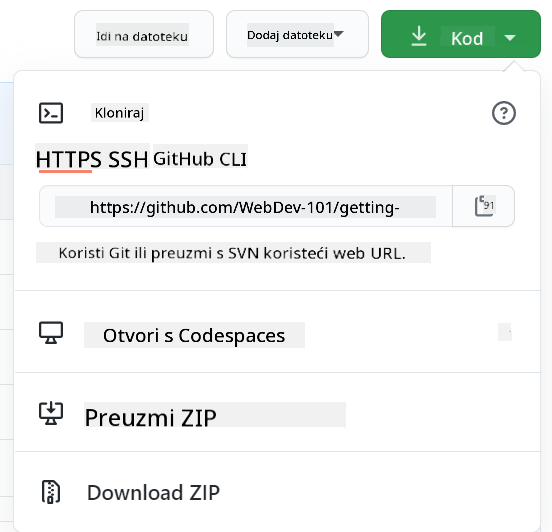

<!--
CO_OP_TRANSLATOR_METADATA:
{
  "original_hash": "05666cecb8983a72cf0ce1d18932b5b7",
  "translation_date": "2025-08-28T00:20:59+00:00",
  "source_file": "1-getting-started-lessons/2-github-basics/README.md",
  "language_code": "hr"
}
-->
# Uvod u GitHub

Ova lekcija pokriva osnove GitHuba, platforme za hostanje i upravljanje promjenama u vašem kodu.


> Sketchnote autorice [Tomomi Imura](https://twitter.com/girlie_mac)

## Kviz prije predavanja
[Kviz prije predavanja](https://ashy-river-0debb7803.1.azurestaticapps.net/quiz/3)

## Uvod

U ovoj lekciji obradit ćemo:

- praćenje rada na vašem računalu
- rad na projektima s drugima
- kako doprinositi softveru otvorenog koda

### Preduvjeti

Prije nego što počnete, provjerite je li Git instaliran. U terminal upišite:  
`git --version`

Ako Git nije instaliran, [preuzmite Git](https://git-scm.com/downloads). Zatim postavite svoj lokalni Git profil u terminalu:
* `git config --global user.name "vaše-ime"`
* `git config --global user.email "vaš-email"`

Da biste provjerili je li Git već konfiguriran, možete upisati:  
`git config --list`

Također će vam trebati GitHub račun, uređivač koda (poput Visual Studio Codea) i otvoren terminal (ili: naredbeni redak).

Idite na [github.com](https://github.com/) i kreirajte račun ako ga već nemate, ili se prijavite i ispunite svoj profil.

✅ GitHub nije jedini repozitorij koda na svijetu; postoje i drugi, ali GitHub je najpoznatiji.

### Priprema

Trebat će vam mapa s projektom koda na vašem lokalnom računalu (laptopu ili PC-u) i javni repozitorij na GitHubu, koji će poslužiti kao primjer kako doprinositi projektima drugih.

---

## Upravljanje kodom

Recimo da imate mapu lokalno s nekim projektom koda i želite početi pratiti svoj napredak koristeći git - sustav za kontrolu verzija. Neki ljudi uspoređuju korištenje gita s pisanjem ljubavnog pisma svom budućem ja. Čitajući svoje poruke o promjenama (commit messages) danima, tjednima ili mjesecima kasnije, moći ćete se prisjetiti zašto ste donijeli određenu odluku ili "vratiti" promjenu - pod uvjetom da pišete dobre poruke o promjenama.

### Zadatak: Napravite repozitorij i spremite kod  

> Pogledajte video  
>  
> [](https://www.youtube.com/watch?v=9R31OUPpxU4)

1. **Kreirajte repozitorij na GitHubu**. Na GitHub.com, u kartici repozitorija ili iz navigacijske trake u gornjem desnom kutu, pronađite gumb **new repo**.

   1. Dajte svom repozitoriju (mapi) ime.
   1. Odaberite **create repository**.

1. **Idite do svoje radne mape**. U terminalu se prebacite u mapu (poznatu i kao direktorij) koju želite početi pratiti. Upišite:

   ```bash
   cd [name of your folder]
   ```

1. **Inicijalizirajte git repozitorij**. U svom projektu upišite:

   ```bash
   git init
   ```

1. **Provjerite status**. Da biste provjerili status svog repozitorija, upišite:

   ```bash
   git status
   ```

   izlaz može izgledati ovako:

   ```output
   Changes not staged for commit:
   (use "git add <file>..." to update what will be committed)
   (use "git checkout -- <file>..." to discard changes in working directory)

        modified:   file.txt
        modified:   file2.txt
   ```

   Obično naredba `git status` govori stvari poput toga koji su datoteke spremne za _spremanje_ u repozitorij ili imaju promjene koje biste možda željeli sačuvati.

1. **Dodajte sve datoteke za praćenje**  
   Ovo se također naziva postavljanje datoteka/dodavanje datoteka u područje za postavljanje.

   ```bash
   git add .
   ```

   Argument `git add` plus `.` označava da su sve vaše datoteke i promjene spremne za praćenje.

1. **Dodajte odabrane datoteke za praćenje**

   ```bash
   git add [file or folder name]
   ```

   Ovo nam pomaže dodati samo odabrane datoteke u područje za postavljanje kada ne želimo sve datoteke odjednom spremiti.

1. **Uklonite sve datoteke iz područja za postavljanje**

   ```bash
   git reset
   ```

   Ova naredba pomaže ukloniti sve datoteke iz područja za postavljanje odjednom.

1. **Uklonite određenu datoteku iz područja za postavljanje**

   ```bash
   git reset [file or folder name]
   ```

   Ova naredba pomaže ukloniti samo određenu datoteku iz područja za postavljanje koju ne želimo uključiti u sljedeći commit.

1. **Spremanje vašeg rada**. U ovom trenutku ste dodali datoteke u takozvano _područje za postavljanje_. Mjesto gdje Git prati vaše datoteke. Da biste promjenu učinili trajnom, trebate _spremiti_ datoteke. To činite stvaranjem _commita_ pomoću naredbe `git commit`. Commit predstavlja točku spremanja u povijesti vašeg repozitorija. Upišite sljedeće da biste stvorili commit:

   ```bash
   git commit -m "first commit"
   ```

   Ovo sprema sve vaše datoteke, dodajući poruku "first commit". Za buduće poruke o promjenama trebali biste biti detaljniji u opisu kako biste prenijeli kakvu ste promjenu napravili.

1. **Povežite svoj lokalni Git repozitorij s GitHubom**. Git repozitorij je koristan na vašem računalu, ali u nekom trenutku želite imati sigurnosnu kopiju svojih datoteka negdje i također pozvati druge ljude da rade s vama na vašem repozitoriju. Jedno od sjajnih mjesta za to je GitHub. Sjetite se da smo već kreirali repozitorij na GitHubu, tako da jedino što trebamo učiniti je povezati naš lokalni Git repozitorij s GitHubom. Naredba `git remote add` to će učiniti. Upišite sljedeću naredbu:

   > Napomena: prije nego što upišete naredbu, idite na stranicu svog GitHub repozitorija kako biste pronašli URL repozitorija. Koristit ćete ga u naredbi ispod. Zamijenite ```https://github.com/username/repository_name.git``` s vašim GitHub URL-om.

   ```bash
   git remote add origin https://github.com/username/repository_name.git
   ```

   Ovo stvara _remote_, ili vezu, nazvanu "origin" koja pokazuje na GitHub repozitorij koji ste ranije kreirali.

1. **Pošaljite lokalne datoteke na GitHub**. Do sada ste stvorili _vezu_ između lokalnog repozitorija i GitHub repozitorija. Pošaljimo ove datoteke na GitHub pomoću sljedeće naredbe `git push`, ovako:  
   
   > Napomena: naziv vaše grane može se razlikovati od ```main```.

   ```bash
   git push -u origin main
   ```

   Ovo šalje vaše commitove u vašu "main" granu na GitHub.

2. **Dodavanje više promjena**. Ako želite nastaviti s promjenama i slati ih na GitHub, samo ćete trebati koristiti sljedeće tri naredbe:

   ```bash
   git add .
   git commit -m "type your commit message here"
   git push
   ```

   > Savjet: Možda biste također željeli usvojiti `.gitignore` datoteku kako biste spriječili da se datoteke koje ne želite pratiti pojavljuju na GitHubu - poput bilješki koje pohranjujete u istoj mapi, ali nemaju mjesto u javnom repozitoriju. Možete pronaći predloške za `.gitignore` datoteke na [.gitignore templates](https://github.com/github/gitignore).

#### Poruke o promjenama (Commit messages)

Sjajna poruka o promjeni u Gitu završava sljedeću rečenicu:  
Ako se primijeni, ovaj commit će <vaša poruka ovdje>

Za naslov koristite imperativ, sadašnje vrijeme: "promijeni" umjesto "promijenio" ili "mijenja".  
Kao i u naslovu, u tijelu (opcionalno) također koristite imperativ, sadašnje vrijeme. Tijelo bi trebalo uključivati motivaciju za promjenu i usporedbu s prethodnim ponašanjem. Objašnjavate `zašto`, a ne `kako`.

✅ Odvojite nekoliko minuta da pregledate GitHub. Možete li pronaći zaista sjajnu poruku o promjeni? Možete li pronaći vrlo minimalnu? Koje informacije smatrate najvažnijima i najkorisnijima za prenijeti u poruci o promjeni?

### Zadatak: Suradnja

Glavni razlog za postavljanje stvari na GitHub bio je omogućiti suradnju s drugim programerima.

## Rad na projektima s drugima

> Pogledajte video  
>  
> [](https://www.youtube.com/watch?v=bFCM-PC3cu8)

U svom repozitoriju idite na `Insights > Community` kako biste vidjeli kako se vaš projekt uspoređuje s preporučenim standardima zajednice.

   Evo nekoliko stvari koje mogu poboljšati vaš GitHub repozitorij:
   - **Opis**. Jeste li dodali opis za svoj projekt?
   - **README**. Jeste li dodali README? GitHub pruža smjernice za pisanje [README](https://docs.github.com/articles/about-readmes/?WT.mc_id=academic-77807-sagibbon).
   - **Smjernice za doprinos**. Ima li vaš projekt [smjernice za doprinos](https://docs.github.com/articles/setting-guidelines-for-repository-contributors/?WT.mc_id=academic-77807-sagibbon)?
   - **Kodeks ponašanja**. Ima li vaš projekt [Kodeks ponašanja](https://docs.github.com/articles/adding-a-code-of-conduct-to-your-project/)?
   - **Licenca**. Možda najvažnije, ima li vaš projekt [licencu](https://docs.github.com/articles/adding-a-license-to-a-repository/)?

Svi ovi resursi koristit će za onboardanje novih članova tima. To su obično stvari koje novi suradnici prvo pregledavaju prije nego što uopće pogledaju vaš kod, kako bi saznali je li vaš projekt pravo mjesto za njihovo ulaganje vremena.

✅ README datoteke, iako zahtijevaju vrijeme za pripremu, često su zanemarene od strane zauzetih održavatelja. Možete li pronaći primjer posebno opisnog README-a? Napomena: postoje neki [alati za pomoć pri izradi dobrih README-a](https://www.makeareadme.com/) koje biste mogli isprobati.

### Zadatak: Spojite kod

Dokumentacija za doprinos pomaže ljudima da doprinesu projektu. Objašnjava koje vrste doprinosa tražite i kako proces funkcionira. Suradnici će morati proći kroz niz koraka kako bi mogli doprinositi vašem repozitoriju na GitHubu:

1. **Forkanje vašeg repozitorija**. Vjerojatno ćete htjeti da ljudi _forkaju_ vaš projekt. Forkanje znači stvaranje replike vašeg repozitorija na njihovom GitHub profilu.
1. **Kloniranje**. Nakon toga će klonirati projekt na svoje lokalno računalo.
1. **Kreiranje grane**. Zamolit ćete ih da kreiraju _granu_ za svoj rad.
1. **Fokusiranje promjena na jedno područje**. Zamolite suradnike da se koncentriraju na jednu stvar odjednom - na taj način su veće šanse da možete _spojiti_ njihov rad. Zamislite da napišu ispravak greške, dodaju novu značajku i ažuriraju nekoliko testova - što ako želite ili možete implementirati samo 2 od 3, ili 1 od 3 promjene?

✅ Zamislite situaciju u kojoj su grane posebno kritične za pisanje i isporuku dobrog koda. Koje slučajeve upotrebe možete zamisliti?

> Napomena: budite promjena koju želite vidjeti u svijetu i kreirajte grane za svoj rad također. Svi commitovi koje napravite bit će napravljeni na grani na kojoj ste trenutno "prijavljeni". Koristite `git status` da vidite na kojoj ste grani.

Prođimo kroz tijek rada suradnika. Pretpostavimo da je suradnik već _forkao_ i _klonirao_ repozitorij, tako da ima Git repozitorij spreman za rad na svom lokalnom računalu:

1. **Kreirajte granu**. Koristite naredbu `git branch` za kreiranje grane koja će sadržavati promjene koje namjeravaju doprinijeti:

   ```bash
   git branch [branch-name]
   ```

1. **Prebacite se na radnu granu**. Prebacite se na određenu granu i ažurirajte radni direktorij pomoću `git switch`:

   ```bash
   git switch [branch-name]
   ```

1. **Radite na promjenama**. U ovom trenutku želite dodati svoje promjene. Ne zaboravite obavijestiti Git o tome pomoću sljedećih naredbi:

   ```bash
   git add .
   git commit -m "my changes"
   ```

   Pobrinite se da svojoj poruci o promjeni date dobro ime, za vaše dobro kao i za dobro održavatelja repozitorija kojem pomažete.

1. **Spojite svoj rad s `main` granom**. U nekom trenutku završavate s radom i želite spojiti svoj rad s onim na `main` grani. `Main` grana se možda promijenila u međuvremenu, pa je važno prvo je ažurirati na najnoviju verziju pomoću sljedećih naredbi:

   ```bash
   git switch main
   git pull
   ```

   U ovom trenutku želite osigurati da se svi _sukobi_, situacije u kojima Git ne može lako _spojiti_ promjene, dogode u vašoj radnoj grani. Stoga pokrenite sljedeće naredbe:

   ```bash
   git switch [branch_name]
   git merge main
   ```

   Ovo će unijeti sve promjene iz `main` grane u vašu granu i, nadamo se, omogućiti vam da nastavite. Ako ne, VS Code će vam pokazati gdje je Git _zbunjen_ i samo trebate izmijeniti zahvaćene datoteke kako biste odredili koji je sadržaj najtočniji.

1. **Pošaljite svoj rad na GitHub**. Slanje vašeg rada na GitHub znači dvije stvari. Guranje vaše grane na vaš forkani repozitorij i zatim otvaranje PR-a (Pull Request).

   ```bash
   git push --set-upstream origin [branch-name]
   ```

   Gornja naredba kreira granu na vašem forkiranom repozitoriju.

1. **Otvorite PR**. Zatim želite otvoriti PR. To radite tako da odete na forkani repozitorij na GitHubu. Vidjet ćete naznaku na GitHubu gdje vas pita želite li kreirati novi PR, kliknite na to i bit ćete preusmjereni na sučelje gdje možete promijeniti naslov poruke o promjeni, dati joj prikladniji opis. Sada održavatelj repozitorija koji ste forkali vidi ovaj PR i _držimo palčeve_ da će ga cijeniti i _spojiti_ vaš PR. Sada ste suradnik, bravo :)

1. **Očistite**. Smatra se dobrom praksom _očistiti_ nakon što uspješno spojite PR. Želite očistiti i svoju lokalnu granu i granu koju ste gurnuli na GitHub. Prvo je izbrišite lokalno pomoću sljedeće naredbe:

   ```bash
   git branch -d [branch-name]
   ```
Idite na GitHub stranicu za forkani repozitorij i uklonite udaljenu granu koju ste upravo gurnuli na njega.

`Pull request` može zvučati kao čudan izraz jer zapravo želite gurnuti svoje promjene u projekt. No, održavatelj (vlasnik projekta) ili glavni tim mora razmotriti vaše promjene prije nego što ih spoji s "main" granom projekta, pa zapravo tražite odluku o promjeni od održavatelja.

Pull request je mjesto gdje možete usporediti i raspraviti razlike uvedene na grani uz recenzije, komentare, integrirane testove i više. Dobar pull request slijedi otprilike ista pravila kao i poruka commit-a. Možete dodati referencu na problem u trackeru problema, na primjer kada vaš rad rješava neki problem. To se radi pomoću `#` praćenog brojem vašeg problema. Na primjer, `#97`.

🤞Držimo palčeve da svi provjeri prođu i da vlasnik(i) projekta spoje vaše promjene u projekt🤞

Ažurirajte svoju trenutnu lokalnu radnu granu sa svim novim commit-ovima iz odgovarajuće udaljene grane na GitHubu:

`git pull`

## Kako doprinijeti otvorenom kodu

Prvo, pronađimo repozitorij (ili **repo**) na GitHubu koji vas zanima i kojem želite doprinijeti promjenom. Željet ćete kopirati njegov sadržaj na svoje računalo.

✅ Dobar način za pronalaženje repozitorija prilagođenih početnicima je [pretraživanje prema oznaci 'good-first-issue'](https://github.blog/2020-01-22-browse-good-first-issues-to-start-contributing-to-open-source/).



Postoji nekoliko načina za kopiranje koda. Jedan od načina je "kloniranje" sadržaja repozitorija, koristeći HTTPS, SSH ili GitHub CLI (Command Line Interface).

Otvorite svoj terminal i klonirajte repozitorij ovako:
`git clone https://github.com/ProjectURL`

Za rad na projektu, prebacite se u odgovarajuću mapu:
`cd ProjectURL`

Također možete otvoriti cijeli projekt koristeći [Codespaces](https://github.com/features/codespaces), GitHubov ugrađeni uređivač koda / razvojno okruženje u oblaku, ili [GitHub Desktop](https://desktop.github.com/).

Na kraju, možete preuzeti kod u zipanoj mapi.

### Još nekoliko zanimljivih stvari o GitHubu

Možete označiti zvjezdicom, pratiti i/ili "forkati" bilo koji javni repozitorij na GitHubu. Svoje označene repozitorije možete pronaći u padajućem izborniku u gornjem desnom kutu. To je poput označavanja stranica, ali za kod.

Projekti imaju tracker problema, uglavnom na GitHubu u kartici "Issues" osim ako nije drugačije navedeno, gdje ljudi raspravljaju o problemima vezanim za projekt. Kartica Pull Requests je mjesto gdje ljudi raspravljaju i pregledavaju promjene koje su u tijeku.

Projekti također mogu imati rasprave u forumima, mailing listama ili chat kanalima poput Slacka, Discorda ili IRC-a.

✅ Pogledajte svoj novi GitHub repo i isprobajte nekoliko stvari, poput uređivanja postavki, dodavanja informacija u repo i stvaranja projekta (poput Kanban ploče). Puno toga možete učiniti!

---

## 🚀 Izazov

Udružite se s prijateljem kako biste radili na kodu jedno drugoga. Zajedno stvorite projekt, forkajte kod, kreirajte grane i spojite promjene.

## Kviz nakon predavanja
[Kviz nakon predavanja](https://ashy-river-0debb7803.1.azurestaticapps.net/quiz/4)

## Pregled i samostalno učenje

Pročitajte više o [doprinosu otvorenom softveru](https://opensource.guide/how-to-contribute/#how-to-submit-a-contribution).

[Git cheatsheet](https://training.github.com/downloads/github-git-cheat-sheet/).

Vježbajte, vježbajte, vježbajte. GitHub ima odlične putove za učenje dostupne putem [skills.github.com](https://skills.github.com):

- [Prvi tjedan na GitHubu](https://skills.github.com/#first-week-on-github)

Također ćete pronaći naprednije tečajeve.

## Zadatak

Dovršite [tečaj Prvi tjedan na GitHubu](https://skills.github.com/#first-week-on-github)

---

**Odricanje od odgovornosti**:  
Ovaj dokument je preveden pomoću AI usluge za prevođenje [Co-op Translator](https://github.com/Azure/co-op-translator). Iako nastojimo osigurati točnost, imajte na umu da automatski prijevodi mogu sadržavati pogreške ili netočnosti. Izvorni dokument na izvornom jeziku treba smatrati autoritativnim izvorom. Za ključne informacije preporučuje se profesionalni prijevod od strane čovjeka. Ne preuzimamo odgovornost za nesporazume ili pogrešne interpretacije koje mogu proizaći iz korištenja ovog prijevoda.