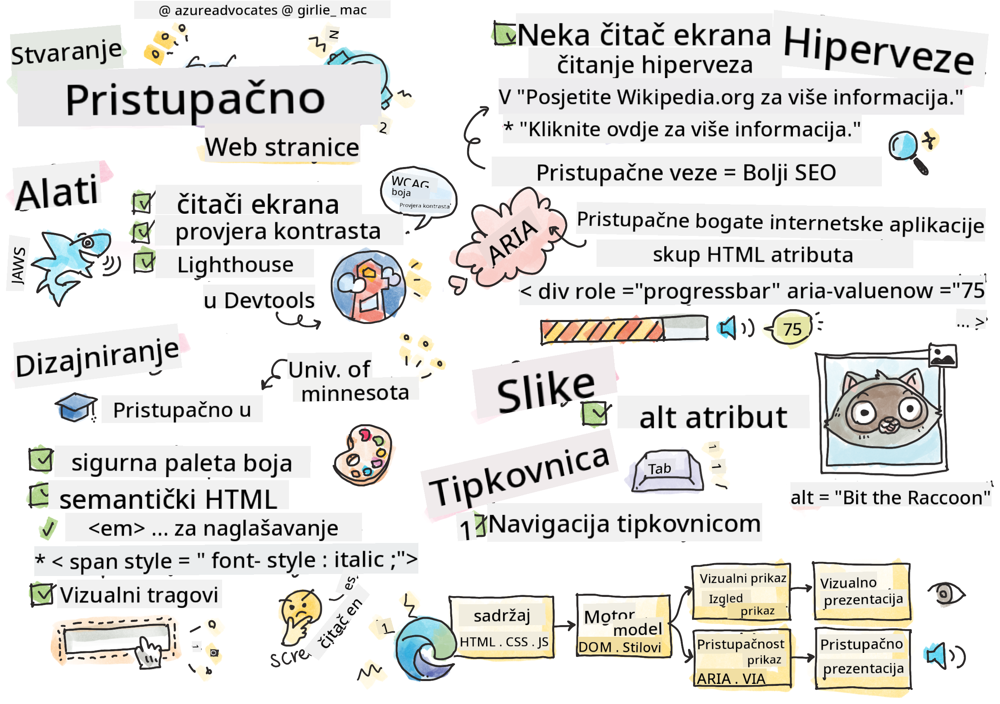

<!--
CO_OP_TRANSLATOR_METADATA:
{
  "original_hash": "e4cd5b1faed4adab5acf720f82798003",
  "translation_date": "2025-08-28T00:18:06+00:00",
  "source_file": "1-getting-started-lessons/3-accessibility/README.md",
  "language_code": "hr"
}
-->
# Izrada pristupačnih web stranica


> Sketchnote autor [Tomomi Imura](https://twitter.com/girlie_mac)

## Kviz prije predavanja
[Kviz prije predavanja](https://ashy-river-0debb7803.1.azurestaticapps.net/quiz/5)

> Snaga weba leži u njegovoj univerzalnosti. Pristup svima, bez obzira na invaliditet, ključni je aspekt.
>
> \- Sir Timothy Berners-Lee, direktor W3C-a i izumitelj World Wide Weba

Ovaj citat savršeno naglašava važnost izrade pristupačnih web stranica. Aplikacija koja nije dostupna svima po definiciji je isključiva. Kao web programeri, uvijek bismo trebali imati pristupačnost na umu. Ako se fokusiramo na to od samog početka, bit ćemo na dobrom putu da osiguramo da svi mogu pristupiti stranicama koje kreiramo. U ovoj lekciji naučit ćete o alatima koji vam mogu pomoći da osigurate pristupačnost vaših web resursa i kako graditi s pristupačnošću na umu.

> Ovu lekciju možete pronaći na [Microsoft Learn](https://docs.microsoft.com/learn/modules/web-development-101/accessibility/?WT.mc_id=academic-77807-sagibbon)!

## Alati za korištenje

### Čitači ekrana

Jedan od najpoznatijih alata za pristupačnost su čitači ekrana.

[Čitači ekrana](https://en.wikipedia.org/wiki/Screen_reader) su često korišteni klijenti za osobe s oštećenjem vida. Dok provodimo vrijeme osiguravajući da preglednik pravilno prenosi informacije koje želimo podijeliti, također moramo osigurati da čitač ekrana radi isto.

U svojoj osnovi, čitač ekrana će čitati stranicu od vrha do dna glasovno. Ako je vaša stranica samo tekst, čitač će prenijeti informacije na sličan način kao preglednik. Naravno, web stranice rijetko su samo tekst; sadrže poveznice, grafike, boje i druge vizualne komponente. Potrebno je paziti da se te informacije pravilno čitaju putem čitača ekrana.

Svaki web programer trebao bi se upoznati s čitačem ekrana. Kao što je gore istaknuto, to je klijent koji će vaši korisnici koristiti. Na isti način na koji ste upoznati s radom preglednika, trebali biste naučiti kako radi čitač ekrana. Srećom, čitači ekrana ugrađeni su u većinu operativnih sustava.

Neki preglednici također imaju ugrađene alate i proširenja koja mogu čitati tekst naglas ili čak pružiti osnovne navigacijske značajke, poput [ovih alata za pristupačnost u Edge pregledniku](https://support.microsoft.com/help/4000734/microsoft-edge-accessibility-features). Iako su i oni važni alati za pristupačnost, funkcioniraju vrlo različito od čitača ekrana i ne bi ih trebalo zamijeniti za alate za testiranje čitača ekrana.

✅ Isprobajte čitač ekrana i čitač teksta u pregledniku. Na Windowsu je [Narrator](https://support.microsoft.com/windows/complete-guide-to-narrator-e4397a0d-ef4f-b386-d8ae-c172f109bdb1/?WT.mc_id=academic-77807-sagibbon) uključen po defaultu, a [JAWS](https://webaim.org/articles/jaws/) i [NVDA](https://www.nvaccess.org/about-nvda/) također se mogu instalirati. Na macOS-u i iOS-u, [VoiceOver](https://support.apple.com/guide/voiceover/welcome/10) je instaliran po defaultu.

### Zumiranje

Još jedan alat koji često koriste osobe s oštećenjem vida je zumiranje. Najosnovniji tip zumiranja je statički zum, kontroliran putem `Control + plus znak (+)` ili smanjenjem rezolucije ekrana. Ova vrsta zumiranja uzrokuje promjenu veličine cijele stranice, pa je korištenje [responsivnog dizajna](https://developer.mozilla.org/docs/Learn/CSS/CSS_layout/Responsive_Design) važno za pružanje dobrog korisničkog iskustva pri povećanim razinama zumiranja.

Druga vrsta zumiranja oslanja se na specijalizirani softver za povećanje jednog dijela ekrana i pomicanje, slično korištenju stvarne povećala. Na Windowsu je [Magnifier](https://support.microsoft.com/windows/use-magnifier-to-make-things-on-the-screen-easier-to-see-414948ba-8b1c-d3bd-8615-0e5e32204198) ugrađen, a [ZoomText](https://www.freedomscientific.com/training/zoomtext/getting-started/) je softver treće strane za povećanje s više značajki i većom korisničkom bazom. I macOS i iOS imaju ugrađeni softver za povećanje pod nazivom [Zoom](https://www.apple.com/accessibility/mac/vision/).

### Provjera kontrasta

Boje na web stranicama moraju biti pažljivo odabrane kako bi zadovoljile potrebe korisnika s daltonizmom ili osoba koje imaju poteškoće s vidom pri slabom kontrastu boja.

✅ Testirajte web stranicu koju volite koristiti za upotrebu boja pomoću proširenja za preglednik poput [WCAG-ovog provjerivača kontrasta boja](https://microsoftedge.microsoft.com/addons/detail/wcag-color-contrast-check/idahaggnlnekelhgplklhfpchbfdmkjp?hl=en-US&WT.mc_id=academic-77807-sagibbon). Što ste naučili?

### Lighthouse

U području alata za razvoj u vašem pregledniku pronaći ćete alat Lighthouse. Ovaj alat je važan za dobivanje prvog pregleda pristupačnosti (kao i drugih analiza) web stranice. Iako je važno ne oslanjati se isključivo na Lighthouse, rezultat od 100% vrlo je koristan kao polazna točka.

✅ Pronađite Lighthouse u panelu alata za razvoj vašeg preglednika i pokrenite analizu na bilo kojoj stranici. Što ste otkrili?

## Dizajniranje za pristupačnost

Pristupačnost je relativno velika tema. Kako bismo vam pomogli, dostupni su brojni resursi.

- [Accessible U - Sveučilište u Minnesoti](https://accessibility.umn.edu/your-role/web-developers)

Iako nećemo moći pokriti svaki aspekt izrade pristupačnih stranica, u nastavku su neki od osnovnih principa koje ćete htjeti implementirati. Dizajniranje pristupačne stranice od početka **uvijek** je lakše nego vraćanje na postojeću stranicu kako bi se učinila pristupačnom.

## Dobri principi prikaza

### Sigurne palete boja

Ljudi vide svijet na različite načine, uključujući boje. Kada birate shemu boja za svoju stranicu, trebali biste osigurati da je dostupna svima. Jedan odličan [alat za generiranje paleta boja je Color Safe](http://colorsafe.co/).

✅ Identificirajte web stranicu koja ima vrlo problematičnu upotrebu boja. Zašto?

### Korištenje ispravnog HTML-a

Uz CSS i JavaScript moguće je učiniti da bilo koji element izgleda kao bilo koja vrsta kontrole. `<span>` se može koristiti za stvaranje `<button>`, a `<b>` može postati hiperveza. Iako se to može smatrati lakšim za stiliziranje, ne prenosi ništa čitaču ekrana. Koristite odgovarajući HTML prilikom stvaranja kontrola na stranici. Ako želite hipervezu, koristite `<a>`. Korištenje ispravnog HTML-a za odgovarajuću kontrolu naziva se korištenje semantičkog HTML-a.

✅ Posjetite bilo koju web stranicu i provjerite koriste li dizajneri i programeri HTML pravilno. Možete li pronaći gumb koji bi trebao biti poveznica? Savjet: desni klik i odaberite 'View Page Source' u pregledniku kako biste pogledali osnovni kod.

### Stvaranje opisne hijerarhije naslova

Korisnici čitača ekrana [uvelike se oslanjaju na naslove](https://webaim.org/projects/screenreadersurvey8/#finding) kako bi pronašli informacije i navigirali kroz stranicu. Pisanje opisnog sadržaja naslova i korištenje semantičkih oznaka naslova važno je za stvaranje lako navigabilne stranice za korisnike čitača ekrana.

### Korištenje dobrih vizualnih tragova

CSS nudi potpunu kontrolu nad izgledom bilo kojeg elementa na stranici. Možete stvoriti tekstualne okvire bez obrisa ili hiperveze bez podcrtavanja. Nažalost, uklanjanje tih tragova može otežati nekome tko ovisi o njima da prepozna vrstu kontrole.

## Važnost teksta poveznica

Hiperveze su ključne za navigaciju webom. Kao rezultat toga, osiguravanje da čitač ekrana može pravilno čitati poveznice omogućuje svim korisnicima navigaciju vašom stranicom.

### Čitači ekrana i poveznice

Kao što biste očekivali, čitači ekrana čitaju tekst poveznica na isti način na koji bi čitali bilo koji drugi tekst na stranici. Imajući to na umu, tekst prikazan u nastavku može se činiti potpuno prihvatljivim.

> Mali pingvin, ponekad poznat kao vilinski pingvin, najmanji je pingvin na svijetu. [Kliknite ovdje](https://en.wikipedia.org/wiki/Little_penguin) za više informacija.

> Mali pingvin, ponekad poznat kao vilinski pingvin, najmanji je pingvin na svijetu. Posjetite https://en.wikipedia.org/wiki/Little_penguin za više informacija.

> **NOTE** Kao što ćete uskoro pročitati, **nikada** ne biste trebali stvarati poveznice koje izgledaju kao gore navedene.

Zapamtite, čitači ekrana su drugačije sučelje od preglednika s drugačijim skupom značajki.

### Problem s korištenjem URL-a

Čitači ekrana čitaju tekst. Ako se URL pojavi u tekstu, čitač ekrana će pročitati URL. Općenito govoreći, URL ne prenosi značajne informacije i može zvučati iritantno. Možda ste to iskusili ako vam je telefon ikada glasovno pročitao tekstualnu poruku s URL-om.

### Problem s "kliknite ovdje"

Čitači ekrana također imaju mogućnost čitanja samo hiperveza na stranici, slično kao što bi osoba s vidom skenirala stranicu tražeći poveznice. Ako je tekst poveznice uvijek "kliknite ovdje", sve što će korisnik čuti je "kliknite ovdje, kliknite ovdje, kliknite ovdje, kliknite ovdje, kliknite ovdje, ..." Sve poveznice sada su neprepoznatljive jedna od druge.

### Dobar tekst poveznice

Dobar tekst poveznice ukratko opisuje što se nalazi na drugoj strani poveznice. U gore navedenom primjeru koji govori o malim pingvinima, poveznica vodi na Wikipedijinu stranicu o toj vrsti. Fraza *mali pingvini* bila bi savršen tekst poveznice jer jasno daje do znanja što će netko naučiti ako klikne na poveznicu - mali pingvini.

> [Mali pingvin](https://en.wikipedia.org/wiki/Little_penguin), ponekad poznat kao vilinski pingvin, najmanji je pingvin na svijetu.

✅ Surfajte webom nekoliko minuta kako biste pronašli stranice koje koriste nejasne strategije povezivanja. Usporedite ih s drugim, bolje povezanim stranicama. Što ste naučili?

#### Napomene o tražilicama

Kao dodatna prednost osiguravanja da vaša stranica bude pristupačna svima, pomoći ćete tražilicama da navigiraju vašom stranicom. Tražilice koriste tekst poveznica kako bi saznale teme stranica. Dakle, korištenje dobrog teksta poveznica pomaže svima!

### ARIA

Zamislite sljedeću stranicu:

| Proizvod      | Opis              | Narudžba     |
| ------------- | ----------------- | ------------ |
| Widget        | [Opis](../../../../1-getting-started-lessons/3-accessibility/')       | [Narudžba](../../../../1-getting-started-lessons/3-accessibility/') |
| Super widget  | [Opis](../../../../1-getting-started-lessons/3-accessibility/')       | [Narudžba](../../../../1-getting-started-lessons/3-accessibility/') |

U ovom primjeru, dupliciranje teksta opisa i narudžbe ima smisla za nekoga tko koristi preglednik. Međutim, netko tko koristi čitač ekrana čuo bi samo riječi *opis* i *narudžba* ponavljane bez konteksta.

Kako bi podržali ovakve scenarije, HTML podržava skup atributa poznatih kao [Pristupačne bogate internetske aplikacije (ARIA)](https://developer.mozilla.org/docs/Web/Accessibility/ARIA). Ovi atributi omogućuju pružanje dodatnih informacija čitačima ekrana.

> **NOTE**: Kao i kod mnogih aspekata HTML-a, podrška preglednika i čitača ekrana može varirati. Međutim, većina glavnih klijenata podržava ARIA atribute.

Možete koristiti `aria-label` za opisivanje poveznice kada format stranice to ne dopušta. Opis za widget mogao bi biti postavljen kao

``` html
<a href="#" aria-label="Widget description">description</a>
```

✅ Općenito, korištenje semantičkog označavanja kao što je gore opisano nadmašuje upotrebu ARIA-e, ali ponekad ne postoji semantički ekvivalent za razne HTML widgete. Dobar primjer je stablo. Ne postoji HTML ekvivalent za stablo, pa identificirate generički `<div>` za ovaj element s odgovarajućom ulogom i ARIA vrijednostima. [MDN dokumentacija o ARIA-i](https://developer.mozilla.org/docs/Web/Accessibility/ARIA) sadrži više korisnih informacija.

```html
<h2 id="tree-label">File Viewer</h2>
<div role="tree" aria-labelledby="tree-label">
  <div role="treeitem" aria-expanded="false" tabindex="0">Uploads</div>
</div>
```

## Slike

Podrazumijeva se da čitači ekrana ne mogu automatski čitati što se nalazi na slici. Osiguravanje pristupačnosti slika ne zahtijeva puno rada - upravo za to služi atribut `alt`. Sve značajne slike trebale bi imati `alt` koji opisuje što su.
Slike koje su isključivo dekorativne trebale bi imati atribut `alt` postavljen na prazan string: `alt=""`. To sprječava čitače ekrana da nepotrebno najavljuju dekorativnu sliku.

✅ Kao što biste mogli očekivati, tražilice također ne mogu razumjeti što se nalazi na slici. One također koriste alt tekst. Dakle, još jednom, osiguravanje pristupačnosti vaše stranice donosi dodatne prednosti!

## Tipkovnica

Neki korisnici ne mogu koristiti miš ili trackpad, već se oslanjaju na interakcije putem tipkovnice kako bi prelazili s jednog elementa na drugi. Važno je da vaša web stranica prikazuje vaš sadržaj logičnim redoslijedom kako bi korisnik tipkovnice mogao pristupiti svakom interaktivnom elementu dok se kreće niz dokument. Ako gradite svoje web stranice sa semantičkim označavanjem i koristite CSS za stiliziranje njihovog vizualnog izgleda, vaša stranica bi trebala biti navigabilna tipkovnicom, ali važno je testirati ovaj aspekt ručno. Saznajte više o [strategijama navigacije tipkovnicom](https://webaim.org/techniques/keyboard/).

✅ Posjetite bilo koju web stranicu i pokušajte navigirati kroz nju koristeći samo tipkovnicu. Što funkcionira, što ne funkcionira? Zašto?

## Sažetak

Web koji je dostupan samo nekima nije pravi 'svjetski web'. Najbolji način da osigurate da stranice koje kreirate budu pristupačne jest da od početka uključite najbolje prakse pristupačnosti. Iako postoje dodatni koraci, uključivanje ovih vještina u vaš radni proces sada znači da će sve stranice koje kreirate biti pristupačne.

---

## 🚀 Izazov

Uzmite ovaj HTML i prepišite ga kako bi bio što pristupačniji, koristeći strategije koje ste naučili.

```html
<!DOCTYPE html>
<html>
  <head>
    <title>
      Example
    </title>
    <link href='../assets/style.css' rel='stylesheet' type='text/css'>
  </head>
  <body>
    <div class="site-header">
      <p class="site-title">Turtle Ipsum</p>
      <p class="site-subtitle">The World's Premier Turtle Fan Club</p>
    </div>
    <div class="main-nav">
      <p class="nav-header">Resources</p>
      <div class="nav-list">
        <p class="nav-item nav-item-bull"><a href="https://www.youtube.com/watch?v=CMNry4PE93Y">"I like turtles"</a></p>
        <p class="nav-item nav-item-bull"><a href="https://en.wikipedia.org/wiki/Turtle">Basic Turtle Info</a></p>
        <p class="nav-item nav-item-bull"><a href="https://en.wikipedia.org/wiki/Turtles_(chocolate)">Chocolate Turtles</a></p>
      </div>
    </div>
    <div class="main-content">
      <div>
        <p class="page-title">Welcome to Turtle Ipsum. 
            <a href="">Click here</a> to learn more.
        </p>
        <p class="article-text">
          Turtle ipsum dolor sit amet, consectetur adipiscing elit, sed do eiusmod tempor incididunt ut labore et dolore magna aliqua. Ut enim ad minim veniam, quis nostrud exercitation ullamco laboris nisi ut aliquip ex ea commodo consequat. Duis aute irure dolor in reprehenderit in voluptate velit esse cillum dolore eu fugiat nulla pariatur. Excepteur sint occaecat cupidatat non proident, sunt in culpa qui officia deserunt mollit anim id est laborum
        </p>
      </div>
    </div>
    <div class="footer">
      <div class="footer-section">
        <span class="button">Sign up for turtle news</span>
      </div><div class="footer-section">
        <p class="nav-header footer-title">
          Internal Pages
        </p>
        <div class="nav-list">
          <p class="nav-item nav-item-bull"><a href="../">Index</a></p>
          <p class="nav-item nav-item-bull"><a href="../semantic">Semantic Example</a></p>
        </div>
      </div>
      <p class="footer-copyright">&copy; 2016 Instrument</span>
    </div>
  </body>
</html>
```

## Kviz nakon predavanja
[Kviz nakon predavanja](https://ashy-river-0debb7803.1.azurestaticapps.net/quiz/6)

## Pregled i samostalno učenje
Mnoge vlade imaju zakone koji se odnose na zahtjeve za pristupačnost. Informirajte se o zakonima o pristupačnosti u svojoj zemlji. Što je obuhvaćeno, a što nije? Primjer je [ova vladina web stranica](https://accessibility.blog.gov.uk/).

## Zadatak

[Analizirajte nepristupačnu web stranicu](assignment.md)

Zasluge: [Turtle Ipsum](https://github.com/Instrument/semantic-html-sample) od Instrument

---

**Odricanje od odgovornosti**:  
Ovaj dokument je preveden pomoću AI usluge za prevođenje [Co-op Translator](https://github.com/Azure/co-op-translator). Iako nastojimo osigurati točnost, imajte na umu da automatski prijevodi mogu sadržavati pogreške ili netočnosti. Izvorni dokument na izvornom jeziku treba smatrati autoritativnim izvorom. Za ključne informacije preporučuje se profesionalni prijevod od strane ljudskog prevoditelja. Ne preuzimamo odgovornost za bilo kakve nesporazume ili pogrešne interpretacije koje proizlaze iz korištenja ovog prijevoda.