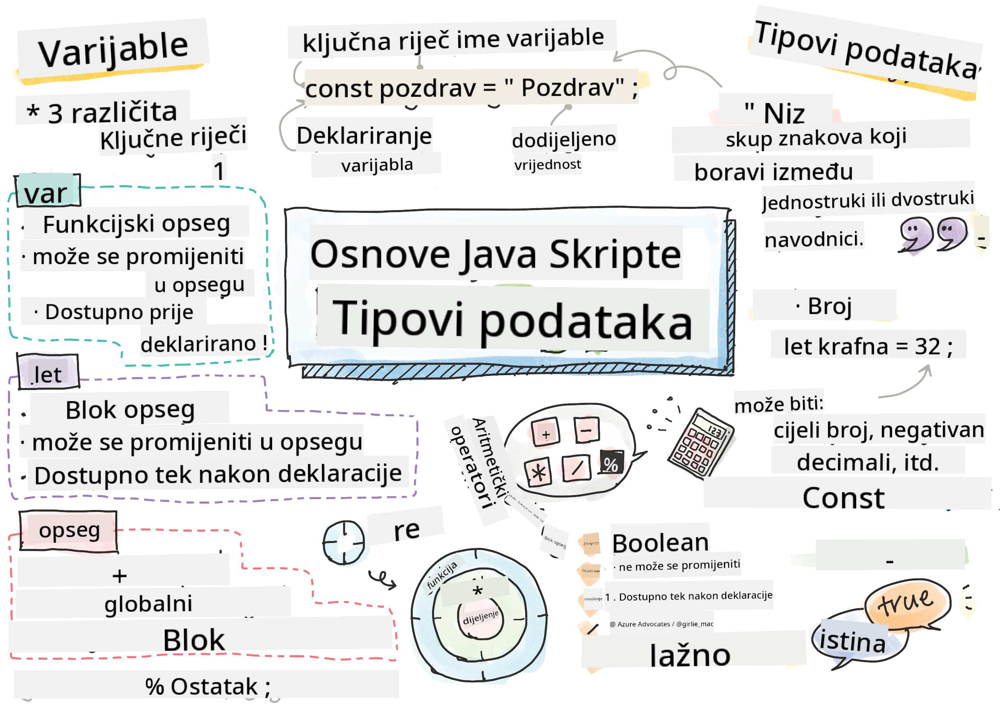

<!--
CO_OP_TRANSLATOR_METADATA:
{
  "original_hash": "fc6aef8ecfdd5b0ad2afa6e6ba52bfde",
  "translation_date": "2025-08-27T23:54:54+00:00",
  "source_file": "2-js-basics/1-data-types/README.md",
  "language_code": "hr"
}
-->
# Osnove JavaScripta: Tipovi podataka


> Sketchnote autorice [Tomomi Imura](https://twitter.com/girlie_mac)

## Kviz prije predavanja
[Kviz prije predavanja](https://ashy-river-0debb7803.1.azurestaticapps.net/quiz/7)

Ova lekcija pokriva osnove JavaScripta, jezika koji omogućuje interaktivnost na webu.

> Ovu lekciju možete pronaći na [Microsoft Learn](https://docs.microsoft.com/learn/modules/web-development-101-variables/?WT.mc_id=academic-77807-sagibbon)!

[](https://youtube.com/watch?v=JNIXfGiDWM8 "Varijable u JavaScriptu")

[](https://youtube.com/watch?v=AWfA95eLdq8 "Tipovi podataka u JavaScriptu")

> 🎥 Kliknite na slike iznad za videozapise o varijablama i tipovima podataka

Započnimo s varijablama i tipovima podataka koji ih ispunjavaju!

## Varijable

Varijable pohranjuju vrijednosti koje se mogu koristiti i mijenjati unutar vašeg koda.

Kreiranje i **deklariranje** varijable ima sljedeću sintaksu **[ključna riječ] [ime]**. Sastoji se od dva dijela:

- **Ključna riječ**. Ključne riječi mogu biti `let` ili `var`.  

✅ Ključna riječ `let` uvedena je u ES6 i daje vašoj varijabli tzv. _blok scope_. Preporučuje se koristiti `let` umjesto `var`. Blok scope ćemo detaljnije obraditi u budućim dijelovima.
- **Ime varijable**, koje sami odabirete.

### Zadatak - rad s varijablama

1. **Deklarirajte varijablu**. Deklarirajmo varijablu koristeći ključnu riječ `let`:

    ```javascript
    let myVariable;
    ```

   `myVariable` je sada deklarirana pomoću ključne riječi `let`. Trenutno nema vrijednost.

1. **Dodijelite vrijednost**. Pohranite vrijednost u varijablu koristeći operator `=`, nakon kojeg slijedi očekivana vrijednost.

    ```javascript
    myVariable = 123;
    ```

   > Napomena: korištenje `=` u ovoj lekciji označava "operator dodjele", koji se koristi za postavljanje vrijednosti varijabli. Ne označava jednakost.

   `myVariable` je sada *inicijalizirana* s vrijednošću 123.

1. **Refaktorirajte**. Zamijenite svoj kod sljedećom naredbom.

    ```javascript
    let myVariable = 123;
    ```

    Gornje se naziva _eksplicitna inicijalizacija_ kada se varijabla deklarira i istovremeno joj se dodijeli vrijednost.

1. **Promijenite vrijednost varijable**. Promijenite vrijednost varijable na sljedeći način:

   ```javascript
   myVariable = 321;
   ```

   Nakon što je varijabla deklarirana, možete promijeniti njezinu vrijednost u bilo kojem trenutku u svom kodu pomoću operatora `=` i nove vrijednosti.

   ✅ Isprobajte! Možete pisati JavaScript izravno u svom pregledniku. Otvorite prozor preglednika i idite na Alate za razvojne programere. U konzoli ćete pronaći prompt; upišite `let myVariable = 123`, pritisnite Enter, a zatim upišite `myVariable`. Što se događa? Napomena, više o ovim konceptima naučit ćete u sljedećim lekcijama.

## Konstante

Deklaracija i inicijalizacija konstante slijedi iste koncepte kao i varijabla, s izuzetkom ključne riječi `const`. Konstante se obično deklariraju velikim slovima.

```javascript
const MY_VARIABLE = 123;
```

Konstante su slične varijablama, s dvije iznimke:

- **Moraju imati vrijednost**. Konstante moraju biti inicijalizirane, inače će doći do greške prilikom pokretanja koda.
- **Referenca se ne može promijeniti**. Referenca konstante ne može se promijeniti nakon inicijalizacije, inače će doći do greške prilikom pokretanja koda. Pogledajmo dva primjera:
   - **Jednostavna vrijednost**. Sljedeće NIJE dopušteno:
   
      ```javascript
      const PI = 3;
      PI = 4; // not allowed
      ```
 
   - **Referenca objekta je zaštićena**. Sljedeće NIJE dopušteno.
   
      ```javascript
      const obj = { a: 3 };
      obj = { b: 5 } // not allowed
      ```

    - **Vrijednost objekta nije zaštićena**. Sljedeće JE dopušteno:
    
      ```javascript
      const obj = { a: 3 };
      obj.a = 5;  // allowed
      ```

      Gore mijenjate vrijednost objekta, ali ne i samu referencu, što je dopušteno.

   > Napomena, `const` znači da je referenca zaštićena od ponovnog dodjeljivanja. Vrijednost, međutim, nije _nepromjenjiva_ i može se mijenjati, posebno ako je riječ o složenoj strukturi poput objekta.

## Tipovi podataka

Varijable mogu pohranjivati različite vrste vrijednosti, poput brojeva i teksta. Ove različite vrste vrijednosti poznate su kao **tipovi podataka**. Tipovi podataka važan su dio razvoja softvera jer pomažu programerima donijeti odluke o tome kako bi kod trebao biti napisan i kako bi softver trebao raditi. Nadalje, neki tipovi podataka imaju jedinstvene značajke koje pomažu transformirati ili izvući dodatne informacije iz vrijednosti.

✅ Tipovi podataka također se nazivaju JavaScript primitivima podataka, jer su to najniži tipovi podataka koje jezik pruža. Postoji 7 primitivnih tipova podataka: string, number, bigint, boolean, undefined, null i symbol. Odvojite trenutak da vizualizirate što svaki od ovih primitiva može predstavljati. Što je `zebra`? A `0`? `true`?

### Brojevi

U prethodnom odjeljku, vrijednost `myVariable` bila je brojčani tip podataka.

`let myVariable = 123;`

Varijable mogu pohranjivati sve vrste brojeva, uključujući decimalne ili negativne brojeve. Brojevi se također mogu koristiti s aritmetičkim operatorima, koji su obrađeni u [sljedećem odjeljku](../../../../2-js-basics/1-data-types).

### Aritmetički operatori

Postoji nekoliko vrsta operatora za izvođenje aritmetičkih funkcija, a neki su navedeni ovdje:

| Simbol | Opis                                                                   | Primjer                          |
| ------ | ---------------------------------------------------------------------- | -------------------------------- |
| `+`    | **Zbrajanje**: Izračunava zbroj dvaju brojeva                          | `1 + 2 //očekivani odgovor je 3` |
| `-`    | **Oduzimanje**: Izračunava razliku dvaju brojeva                       | `1 - 2 //očekivani odgovor je -1`|
| `*`    | **Množenje**: Izračunava umnožak dvaju brojeva                         | `1 * 2 //očekivani odgovor je 2` |
| `/`    | **Dijeljenje**: Izračunava kvocijent dvaju brojeva                     | `1 / 2 //očekivani odgovor je 0.5` |
| `%`    | **Ostatak**: Izračunava ostatak od dijeljenja dvaju brojeva            | `1 % 2 //očekivani odgovor je 1` |

✅ Isprobajte! Isprobajte aritmetičku operaciju u konzoli svog preglednika. Iznenađuju li vas rezultati?

### Stringovi

Stringovi su nizovi znakova koji se nalaze između jednostrukih ili dvostrukih navodnika.

- `'Ovo je string'`
- `"Ovo je također string"`
- `let myString = 'Ovo je vrijednost stringa pohranjena u varijabli';`

Zapamtite koristiti navodnike kada pišete string, inače će JavaScript pretpostaviti da je to ime varijable.

### Formatiranje stringova

Stringovi su tekstualni i ponekad će zahtijevati formatiranje.

Za **spajanje** dvaju ili više stringova, koristite operator `+`.

```javascript
let myString1 = "Hello";
let myString2 = "World";

myString1 + myString2 + "!"; //HelloWorld!
myString1 + " " + myString2 + "!"; //Hello World!
myString1 + ", " + myString2 + "!"; //Hello, World!

```

✅ Zašto `1 + 1 = 2` u JavaScriptu, ali `'1' + '1' = 11?` Razmislite o tome. Što je s `'1' + 1`?

**Predlošci stringova** (template literals) su još jedan način formatiranja stringova, osim što se umjesto navodnika koristi znak `backtick`. Sve što nije običan tekst mora biti smješteno unutar oznaka `${ }`. Ovo uključuje sve varijable koje mogu biti stringovi.

```javascript
let myString1 = "Hello";
let myString2 = "World";

`${myString1} ${myString2}!` //Hello World!
`${myString1}, ${myString2}!` //Hello, World!
```

Možete postići svoje ciljeve formatiranja bilo kojom metodom, ali predlošci stringova poštuju razmake i prijelome linija.

✅ Kada biste koristili predložak stringa umjesto običnog stringa?

### Booleovi

Booleovi mogu imati samo dvije vrijednosti: `true` ili `false`. Booleovi pomažu u donošenju odluka o tome koje linije koda bi se trebale izvršiti kada su određeni uvjeti ispunjeni. U mnogim slučajevima, [operatori](../../../../2-js-basics/1-data-types) pomažu u postavljanju vrijednosti Booleova, a često ćete primijetiti i pisati varijable koje se inicijaliziraju ili njihove vrijednosti ažuriraju pomoću operatora.

- `let myTrueBool = true`
- `let myFalseBool = false`

✅ Varijabla se može smatrati 'istinastom' (truthy) ako se procjenjuje kao boolean `true`. Zanimljivo je da su u JavaScriptu [sve vrijednosti istinite osim ako nisu definirane kao lažne](https://developer.mozilla.org/docs/Glossary/Truthy).

---

## 🚀 Izazov

JavaScript je poznat po svojim iznenađujućim načinima rukovanja tipovima podataka. Istražite malo o ovim 'zamkama'. Na primjer: osjetljivost na velika i mala slova može vas zavarati! Isprobajte ovo u svojoj konzoli: `let age = 1; let Age = 2; age == Age` (rezultat je `false` -- zašto?). Koje još zamke možete pronaći?

## Kviz nakon predavanja
[Kviz nakon predavanja](https://ashy-river-0debb7803.1.azurestaticapps.net/quiz/8)

## Pregled i samostalno učenje

Pogledajte [ovaj popis JavaScript vježbi](https://css-tricks.com/snippets/javascript/) i isprobajte jednu. Što ste naučili?

## Zadatak

[Vježba s tipovima podataka](assignment.md)

---

**Odricanje od odgovornosti**:  
Ovaj dokument je preveden pomoću AI usluge za prevođenje [Co-op Translator](https://github.com/Azure/co-op-translator). Iako nastojimo osigurati točnost, imajte na umu da automatski prijevodi mogu sadržavati pogreške ili netočnosti. Izvorni dokument na izvornom jeziku treba smatrati mjerodavnim izvorom. Za ključne informacije preporučuje se profesionalni prijevod od strane stručnjaka. Ne preuzimamo odgovornost za nesporazume ili pogrešna tumačenja koja mogu proizaći iz korištenja ovog prijevoda.