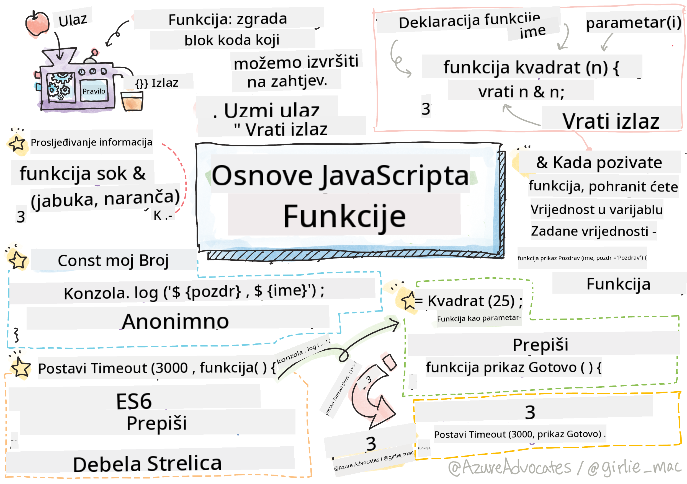

<!--
CO_OP_TRANSLATOR_METADATA:
{
  "original_hash": "b4612bbb9ace984f374fcc80e3e035ad",
  "translation_date": "2025-08-27T23:50:54+00:00",
  "source_file": "2-js-basics/2-functions-methods/README.md",
  "language_code": "hr"
}
-->
# Osnove JavaScripta: Metode i Funkcije


> Sketchnote autorice [Tomomi Imura](https://twitter.com/girlie_mac)

## Kviz prije predavanja
[Kviz prije predavanja](https://ashy-river-0debb7803.1.azurestaticapps.net/quiz/9)

Kada razmišljamo o pisanju koda, uvijek želimo osigurati da je naš kod čitljiv. Iako to zvuči kontraintuitivno, kod se čita mnogo više puta nego što se piše. Jedan od ključnih alata u arsenalu svakog programera za osiguravanje održivog koda je **funkcija**.

[](https://youtube.com/watch?v=XgKsD6Zwvlc "Metode i Funkcije")

> 🎥 Kliknite na sliku iznad za video o metodama i funkcijama.

> Ovu lekciju možete pronaći na [Microsoft Learn](https://docs.microsoft.com/learn/modules/web-development-101-functions/?WT.mc_id=academic-77807-sagibbon)!

## Funkcije

U svojoj osnovi, funkcija je blok koda koji možemo izvršiti po potrebi. Ovo je savršeno za scenarije u kojima trebamo obaviti isti zadatak više puta; umjesto da dupliciramo logiku na više mjesta (što bi otežalo ažuriranje kada za to dođe vrijeme), možemo je centralizirati na jednom mjestu i pozvati kad god trebamo izvršiti operaciju - čak možete pozivati funkcije iz drugih funkcija!

Jednako je važna i mogućnost imenovanja funkcije. Iako se to može činiti trivijalnim, ime pruža brz način dokumentiranja dijela koda. Možete to zamisliti kao naljepnicu na gumbu. Ako kliknem na gumb na kojem piše "Zaustavi tajmer", znam da će zaustaviti odbrojavanje.

## Kreiranje i pozivanje funkcije

Sintaksa za funkciju izgleda ovako:

```javascript
function nameOfFunction() { // function definition
 // function definition/body
}
```

Ako želim kreirati funkciju za prikaz pozdrava, mogla bi izgledati ovako:

```javascript
function displayGreeting() {
  console.log('Hello, world!');
}
```

Kad god želimo pozvati (ili aktivirati) našu funkciju, koristimo ime funkcije praćeno `()`. Vrijedi napomenuti da naša funkcija može biti definirana prije ili nakon što odlučimo pozvati je; JavaScript kompajler će je pronaći za vas.

```javascript
// calling our function
displayGreeting();
```

> **NOTE:** Postoji posebna vrsta funkcije poznata kao **metoda**, koju ste već koristili! Zapravo, vidjeli smo to u našem primjeru gore kada smo koristili `console.log`. Ono što metodu razlikuje od funkcije je to što je metoda vezana za objekt (`console` u našem primjeru), dok je funkcija slobodna. Mnogi programeri koriste ove termine naizmjenično.

### Najbolje prakse za funkcije

Postoji nekoliko najboljih praksi koje treba imati na umu prilikom kreiranja funkcija:

- Kao i uvijek, koristite opisna imena kako biste znali što funkcija radi
- Koristite **camelCase** za spajanje riječi
- Držite funkcije fokusirane na specifičan zadatak

## Prosljeđivanje informacija funkciji

Kako bi funkcija bila korisnija, često ćete joj htjeti proslijediti informacije. Ako uzmemo naš primjer `displayGreeting` iznad, on će prikazati samo **Hello, world!**. Nije baš najkorisnija funkcija koju bismo mogli kreirati. Ako želimo učiniti funkciju malo fleksibilnijom, poput omogućavanja nekome da specificira ime osobe koju pozdravljamo, možemo dodati **parametar**. Parametar (ponekad nazvan i **argument**) je dodatna informacija koja se šalje funkciji.

Parametri se navode u definiciji unutar zagrada i odvajaju zarezima, ovako:

```javascript
function name(param, param2, param3) {

}
```

Možemo ažurirati naš `displayGreeting` da prihvati ime i prikaže ga.

```javascript
function displayGreeting(name) {
  const message = `Hello, ${name}!`;
  console.log(message);
}
```

Kada želimo pozvati funkciju i proslijediti parametar, specificiramo ga unutar zagrada.

```javascript
displayGreeting('Christopher');
// displays "Hello, Christopher!" when run
```

## Zadane vrijednosti

Funkciju možemo učiniti još fleksibilnijom dodavanjem više parametara. Ali što ako ne želimo zahtijevati da svaka vrijednost bude specificirana? U skladu s našim primjerom pozdrava, mogli bismo ostaviti ime kao obavezno (trebamo znati koga pozdravljamo), ali želimo omogućiti prilagodbu samog pozdrava. Ako netko ne želi prilagoditi pozdrav, možemo pružiti zadanu vrijednost. Da bismo postavili zadanu vrijednost za parametar, radimo to na isti način kao što postavljamo vrijednost za varijablu - `parameterName = 'defaultValue'`. Evo potpunog primjera:

```javascript
function displayGreeting(name, salutation='Hello') {
  console.log(`${salutation}, ${name}`);
}
```

Kada pozivamo funkciju, tada možemo odlučiti želimo li postaviti vrijednost za `salutation`.

```javascript
displayGreeting('Christopher');
// displays "Hello, Christopher"

displayGreeting('Christopher', 'Hi');
// displays "Hi, Christopher"
```

## Povratne vrijednosti

Do sada su funkcije koje smo kreirali uvijek ispisivale u [konzolu](https://developer.mozilla.org/docs/Web/API/console). Ponekad je to upravo ono što tražimo, posebno kada kreiramo funkcije koje će pozivati druge servise. Ali što ako želim kreirati pomoćnu funkciju za izvođenje izračuna i dobiti vrijednost natrag kako bih je mogao koristiti negdje drugdje?

To možemo učiniti korištenjem **povratne vrijednosti**. Povratna vrijednost vraća se iz funkcije i može se pohraniti u varijablu na isti način kao što bismo pohranili literalnu vrijednost poput stringa ili broja.

Ako funkcija vraća nešto, koristi se ključna riječ `return`. Ključna riječ `return` očekuje vrijednost ili referencu onoga što se vraća, ovako:

```javascript
return myVariable;
```  

Možemo kreirati funkciju za kreiranje poruke pozdrava i vraćanje vrijednosti pozivatelju.

```javascript
function createGreetingMessage(name) {
  const message = `Hello, ${name}`;
  return message;
}
```

Kada pozivamo ovu funkciju, pohranit ćemo vrijednost u varijablu. Ovo je vrlo slično načinu na koji bismo postavili varijablu na statičnu vrijednost (poput `const name = 'Christopher'`).

```javascript
const greetingMessage = createGreetingMessage('Christopher');
```

## Funkcije kao parametri za funkcije

Kako napredujete u svojoj programerskoj karijeri, naići ćete na funkcije koje prihvaćaju druge funkcije kao parametre. Ovaj zgodan trik često se koristi kada ne znamo kada će se nešto dogoditi ili završiti, ali znamo da trebamo izvršiti operaciju kao odgovor.

Na primjer, razmotrite [setTimeout](https://developer.mozilla.org/docs/Web/API/WindowOrWorkerGlobalScope/setTimeout), koji pokreće tajmer i izvršava kod kada završi. Moramo mu reći koji kod želimo izvršiti. Zvuči kao savršen posao za funkciju!

Ako pokrenete kod ispod, nakon 3 sekunde vidjet ćete poruku **3 sekunde su prošle**.

```javascript
function displayDone() {
  console.log('3 seconds has elapsed');
}
// timer value is in milliseconds
setTimeout(displayDone, 3000);
```

### Anonimne funkcije

Pogledajmo još jednom što smo izgradili. Kreiramo funkciju s imenom koja će se koristiti samo jednom. Kako naša aplikacija postaje složenija, možemo se naći u situaciji da kreiramo puno funkcija koje će se koristiti samo jednom. Ovo nije idealno. Ispostavilo se da ne moramo uvijek davati ime funkciji!

Kada prosljeđujemo funkciju kao parametar, možemo preskočiti njeno prethodno kreiranje i umjesto toga je izgraditi kao dio parametra. Koristimo istu ključnu riječ `function`, ali je gradimo kao parametar.

Prepišimo kod iznad kako bismo koristili anonimnu funkciju:

```javascript
setTimeout(function() {
  console.log('3 seconds has elapsed');
}, 3000);
```

Ako pokrenete naš novi kod, primijetit ćete da dobivamo iste rezultate. Kreirali smo funkciju, ali joj nismo morali dati ime!

### Fat arrow funkcije

Jedna od skraćenica uobičajenih u mnogim programskim jezicima (uključujući JavaScript) je mogućnost korištenja tzv. **arrow** ili **fat arrow** funkcija. Koristi se poseban simbol `=>`, koji izgleda kao strelica - otuda i naziv! Korištenjem `=>`, možemo preskočiti ključnu riječ `function`.

Prepišimo naš kod još jednom kako bismo koristili fat arrow funkciju:

```javascript
setTimeout(() => {
  console.log('3 seconds has elapsed');
}, 3000);
```

### Kada koristiti koju strategiju

Sada ste vidjeli da imamo tri načina za prosljeđivanje funkcije kao parametra i možda se pitate kada koristiti koji. Ako znate da ćete funkciju koristiti više puta, kreirajte je na uobičajen način. Ako ćete je koristiti samo na jednom mjestu, općenito je najbolje koristiti anonimnu funkciju. Hoćete li koristiti fat arrow funkciju ili tradicionalnu sintaksu `function` ovisi o vama, ali primijetit ćete da većina modernih programera preferira `=>`.

---

## 🚀 Izazov

Možete li u jednoj rečenici objasniti razliku između funkcija i metoda? Pokušajte!

## Kviz nakon predavanja
[Kviz nakon predavanja](https://ashy-river-0debb7803.1.azurestaticapps.net/quiz/10)

## Pregled i samostalno učenje

Vrijedi [pročitati malo više o arrow funkcijama](https://developer.mozilla.org/docs/Web/JavaScript/Reference/Functions/Arrow_functions), jer se sve više koriste u kodnim bazama. Vježbajte pisanje funkcije, a zatim je prepišite koristeći ovu sintaksu.

## Zadaci

[Zabava s funkcijama](assignment.md)

---

**Odricanje od odgovornosti**:  
Ovaj dokument je preveden pomoću AI usluge za prevođenje [Co-op Translator](https://github.com/Azure/co-op-translator). Iako nastojimo osigurati točnost, imajte na umu da automatski prijevodi mogu sadržavati pogreške ili netočnosti. Izvorni dokument na izvornom jeziku treba smatrati autoritativnim izvorom. Za kritične informacije preporučuje se profesionalni prijevod od strane ljudskog prevoditelja. Ne preuzimamo odgovornost za bilo kakve nesporazume ili pogrešne interpretacije koje proizlaze iz korištenja ovog prijevoda.