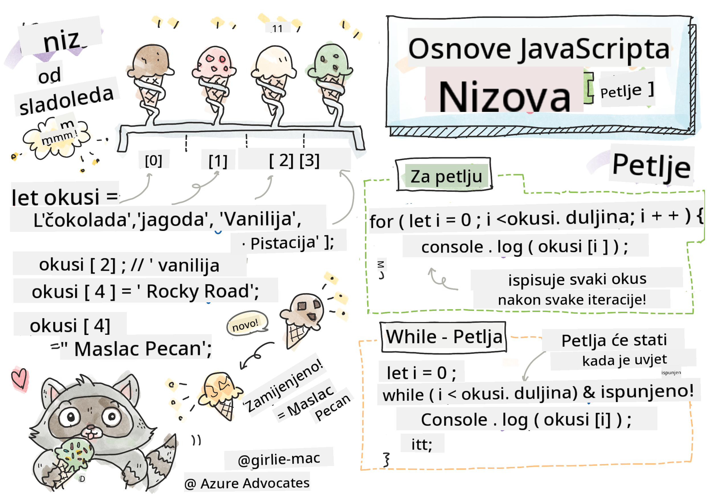

<!--
CO_OP_TRANSLATOR_METADATA:
{
  "original_hash": "3f7f87871312cf6cc12662da7d973182",
  "translation_date": "2025-08-27T23:56:33+00:00",
  "source_file": "2-js-basics/4-arrays-loops/README.md",
  "language_code": "hr"
}
-->
# Osnove JavaScripta: Polja i Petlje

  
> Sketchnote autorice [Tomomi Imura](https://twitter.com/girlie_mac)

## Kviz prije predavanja  
[Kviz prije predavanja](https://ashy-river-0debb7803.1.azurestaticapps.net/quiz/13)

Ova lekcija pokriva osnove JavaScripta, jezika koji omogućuje interaktivnost na webu. U ovoj lekciji naučit ćete o poljima i petljama, koje se koriste za manipulaciju podacima.

[](https://youtube.com/watch?v=1U4qTyq02Xw "Polja")

[](https://www.youtube.com/watch?v=Eeh7pxtTZ3k "Petlje")

> 🎥 Kliknite na slike iznad za videozapise o poljima i petljama.

> Ovu lekciju možete pronaći na [Microsoft Learn](https://docs.microsoft.com/learn/modules/web-development-101-arrays/?WT.mc_id=academic-77807-sagibbon)!

## Polja

Rad s podacima čest je zadatak u bilo kojem jeziku, a taj zadatak postaje puno lakši kada su podaci organizirani u strukturalnom formatu, poput polja. Uz polja, podaci se pohranjuju u strukturi sličnoj popisu. Jedna od glavnih prednosti polja je ta što možete pohraniti različite vrste podataka u jedno polje.

✅ Polja su svuda oko nas! Možete li smisliti primjer polja iz stvarnog života, poput niza solarnih panela?

Sintaksa za polje je par uglatih zagrada.

```javascript
let myArray = [];
```

Ovo je prazno polje, ali polja se mogu deklarirati već popunjena podacima. Višestruke vrijednosti u polju odvajaju se zarezom.

```javascript
let iceCreamFlavors = ["Chocolate", "Strawberry", "Vanilla", "Pistachio", "Rocky Road"];
```

Vrijednosti u polju dobivaju jedinstvenu vrijednost zvanu **indeks**, cijeli broj koji se dodjeljuje na temelju udaljenosti od početka polja. U gornjem primjeru, string vrijednost "Chocolate" ima indeks 0, a indeks "Rocky Road" je 4. Koristite indeks s uglatim zagradama za dohvaćanje, promjenu ili umetanje vrijednosti u polje.

✅ Iznenađuje li vas što polja počinju s indeksom nula? U nekim programskim jezicima indeksi počinju od 1. Postoji zanimljiva povijest o tome, koju možete [pročitati na Wikipediji](https://en.wikipedia.org/wiki/Zero-based_numbering).

```javascript
let iceCreamFlavors = ["Chocolate", "Strawberry", "Vanilla", "Pistachio", "Rocky Road"];
iceCreamFlavors[2]; //"Vanilla"
```

Indeks možete iskoristiti za promjenu vrijednosti, ovako:

```javascript
iceCreamFlavors[4] = "Butter Pecan"; //Changed "Rocky Road" to "Butter Pecan"
```

I možete umetnuti novu vrijednost na određeni indeks ovako:

```javascript
iceCreamFlavors[5] = "Cookie Dough"; //Added "Cookie Dough"
```

✅ Češći način dodavanja vrijednosti u polje je korištenje operatora polja poput array.push()

Da biste saznali koliko stavki ima u polju, koristite svojstvo `length`.

```javascript
let iceCreamFlavors = ["Chocolate", "Strawberry", "Vanilla", "Pistachio", "Rocky Road"];
iceCreamFlavors.length; //5
```

✅ Isprobajte sami! Koristite konzolu svog preglednika za stvaranje i manipulaciju poljem koje sami osmislite.

## Petlje

Petlje nam omogućuju izvođenje ponavljajućih ili **iterativnih** zadataka, što može uštedjeti puno vremena i koda. Svaka iteracija može se razlikovati po svojim varijablama, vrijednostima i uvjetima. Postoje različite vrste petlji u JavaScriptu, i sve imaju male razlike, ali u suštini rade isto: prolaze kroz podatke.

### For petlja

`for` petlja zahtijeva 3 dijela za iteraciju:  
- `counter` Varijabla koja se obično inicijalizira brojem koji broji broj iteracija  
- `condition` Izraz koji koristi operatore usporedbe kako bi zaustavio petlju kada postane `false`  
- `iteration-expression` Izvršava se na kraju svake iteracije, obično se koristi za promjenu vrijednosti brojača  

```javascript
// Counting up to 10
for (let i = 0; i < 10; i++) {
  console.log(i);
}
```

✅ Pokrenite ovaj kod u konzoli preglednika. Što se događa kada napravite male promjene na brojaču, uvjetu ili izrazu iteracije? Možete li učiniti da radi unatrag, stvarajući odbrojavanje?

### While petlja

Za razliku od sintakse `for` petlje, `while` petlje zahtijevaju samo uvjet koji će zaustaviti petlju kada uvjet postane `false`. Uvjeti u petljama obično ovise o drugim vrijednostima poput brojača i moraju se upravljati tijekom petlje. Početne vrijednosti za brojače moraju se stvoriti izvan petlje, a svi izrazi za ispunjavanje uvjeta, uključujući promjenu brojača, moraju se održavati unutar petlje.

```javascript
//Counting up to 10
let i = 0;
while (i < 10) {
 console.log(i);
 i++;
}
```

✅ Zašto biste odabrali for petlju umjesto while petlje? 17 tisuća korisnika imalo je isto pitanje na StackOverflowu, a neka od mišljenja [mogla bi vam biti zanimljiva](https://stackoverflow.com/questions/39969145/while-loops-vs-for-loops-in-javascript).

## Petlje i Polja

Polja se često koriste s petljama jer većina uvjeta zahtijeva duljinu polja za zaustavljanje petlje, a indeks također može biti vrijednost brojača.

```javascript
let iceCreamFlavors = ["Chocolate", "Strawberry", "Vanilla", "Pistachio", "Rocky Road"];

for (let i = 0; i < iceCreamFlavors.length; i++) {
  console.log(iceCreamFlavors[i]);
} //Ends when all flavors are printed
```

✅ Eksperimentirajte s prolaskom kroz polje koje sami osmislite u konzoli preglednika.

---

## 🚀 Izazov

Postoje i drugi načini prolaska kroz polja osim for i while petlji. Postoje [forEach](https://developer.mozilla.org/docs/Web/JavaScript/Reference/Global_Objects/Array/forEach), [for-of](https://developer.mozilla.org/docs/Web/JavaScript/Reference/Statements/for...of) i [map](https://developer.mozilla.org/docs/Web/JavaScript/Reference/Global_Objects/Array/map). Prepišite svoju petlju kroz polje koristeći jednu od ovih tehnika.

## Kviz nakon predavanja  
[Kviz nakon predavanja](https://ashy-river-0debb7803.1.azurestaticapps.net/quiz/14)

## Pregled i Samostalno Učenje

Polja u JavaScriptu imaju mnogo metoda koje su izuzetno korisne za manipulaciju podacima. [Pročitajte o tim metodama](https://developer.mozilla.org/docs/Web/JavaScript/Reference/Global_Objects/Array) i isprobajte neke od njih (poput push, pop, slice i splice) na polju koje sami osmislite.

## Zadatak

[Prođite kroz polje](assignment.md)

---

**Odricanje od odgovornosti**:  
Ovaj dokument je preveden pomoću AI usluge za prevođenje [Co-op Translator](https://github.com/Azure/co-op-translator). Iako nastojimo osigurati točnost, imajte na umu da automatski prijevodi mogu sadržavati pogreške ili netočnosti. Izvorni dokument na izvornom jeziku treba smatrati autoritativnim izvorom. Za ključne informacije preporučuje se profesionalni prijevod od strane čovjeka. Ne preuzimamo odgovornost za bilo kakva nesporazuma ili pogrešna tumačenja koja proizlaze iz korištenja ovog prijevoda.