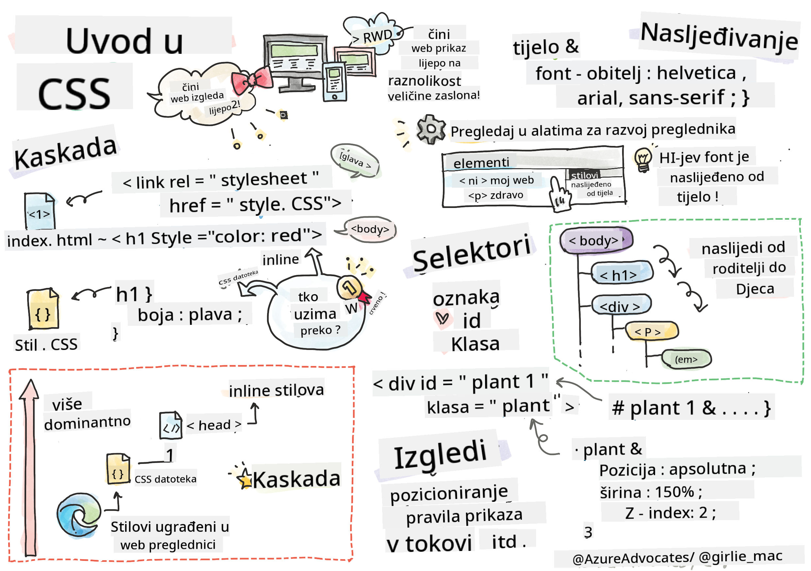
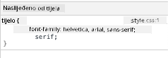
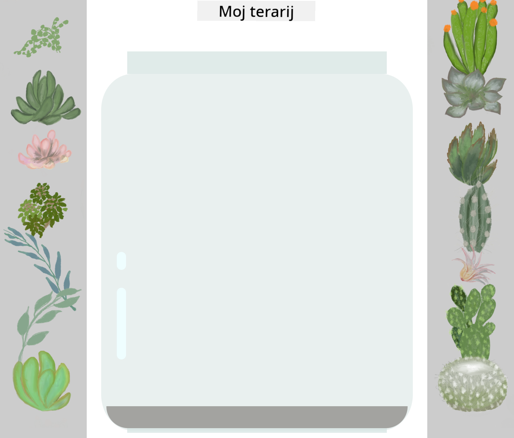

<!--
CO_OP_TRANSLATOR_METADATA:
{
  "original_hash": "e375c2aeb94e2407f2667633d39580bd",
  "translation_date": "2025-08-28T00:02:47+00:00",
  "source_file": "3-terrarium/2-intro-to-css/README.md",
  "language_code": "hr"
}
-->
# Projekt Terarij, 2. dio: Uvod u CSS


> Sketchnote autorice [Tomomi Imura](https://twitter.com/girlie_mac)

## Kviz prije predavanja

[Kviz prije predavanja](https://ashy-river-0debb7803.1.azurestaticapps.net/quiz/17)

### Uvod

CSS, ili kaskadni stilovi (Cascading Style Sheets), rješava važan problem u razvoju weba: kako učiniti da vaša web stranica izgleda lijepo. Stiliziranje vaših aplikacija čini ih upotrebljivijima i vizualno privlačnijima; također možete koristiti CSS za stvaranje responzivnog web dizajna (RWD) - omogućujući vašim aplikacijama da izgledaju dobro bez obzira na veličinu zaslona na kojem se prikazuju. CSS nije samo za uljepšavanje aplikacija; njegova specifikacija uključuje animacije i transformacije koje omogućuju sofisticirane interakcije u vašim aplikacijama. CSS radna grupa održava trenutne specifikacije CSS-a; njihov rad možete pratiti na [web stranici World Wide Web konzorcija](https://www.w3.org/Style/CSS/members).

> Napomena: CSS je jezik koji se razvija, kao i sve na webu, i nisu svi preglednici podržali novije dijelove specifikacije. Uvijek provjerite svoje implementacije konzultirajući [CanIUse.com](https://caniuse.com).

U ovoj lekciji dodat ćemo stilove našem online terariju i naučiti više o nekoliko CSS koncepata: kaskadi, nasljeđivanju, korištenju selektora, pozicioniranju i korištenju CSS-a za izradu izgleda stranice. Tijekom procesa postavit ćemo izgled terarija i stvoriti sam terarij.

### Preduvjet

HTML za vaš terarij trebao bi biti izrađen i spreman za stiliziranje.

> Pogledajte video

> 
> [](https://www.youtube.com/watch?v=6yIdOIV9p1I)

### Zadatak

U mapi vašeg terarija, stvorite novu datoteku pod nazivom `style.css`. Uvezite tu datoteku u odjeljak `<head>`:

```html
<link rel="stylesheet" href="./style.css" />
```

---

## Kaskada

Kaskadni stilovi uključuju ideju da se stilovi 'kaskadno' primjenjuju, pri čemu je primjena stila vođena njegovim prioritetom. Stilovi koje postavi autor web stranice imaju prioritet nad onima koje postavi preglednik. Stilovi postavljeni 'inline' imaju prioritet nad onima postavljenima u vanjskoj datoteci sa stilovima.

### Zadatak

Dodajte inline stil "color: red" u svoj `<h1>` tag:

```HTML
<h1 style="color: red">My Terrarium</h1>
```

Zatim dodajte sljedeći kod u svoju datoteku `style.css`:

```CSS
h1 {
 color: blue;
}
```

✅ Koja se boja prikazuje u vašoj web aplikaciji? Zašto? Možete li pronaći način da nadjačate stilove? Kada biste to željeli učiniti, a kada ne?

---

## Nasljeđivanje

Stilovi se nasljeđuju od roditeljskog stila prema potomcima, tako da ugniježđeni elementi nasljeđuju stilove svojih roditelja.

### Zadatak

Postavite font tijela na određeni font i provjerite font ugniježđenog elementa:

```CSS
body {
	font-family: helvetica, arial, sans-serif;
}
```

Otvorite konzolu preglednika na kartici 'Elements' i promatrajte font H1 elementa. On nasljeđuje svoj font od tijela, kako je navedeno unutar preglednika:



✅ Možete li učiniti da ugniježđeni stil naslijedi neko drugo svojstvo?

---

## CSS selektori

### Tagovi

Do sada vaša datoteka `style.css` ima stilizirano samo nekoliko tagova, a aplikacija izgleda prilično čudno:

```CSS
body {
	font-family: helvetica, arial, sans-serif;
}

h1 {
	color: #3a241d;
	text-align: center;
}
```

Ovaj način stiliziranja taga daje vam kontrolu nad jedinstvenim elementima, ali trebate kontrolirati stilove mnogih biljaka u svom terariju. Da biste to učinili, trebate iskoristiti CSS selektore.

### Id-ovi

Dodajte malo stila za postavljanje lijevih i desnih spremnika. Budući da postoji samo jedan lijevi i jedan desni spremnik, u oznaci su im dodijeljeni id-ovi. Za njihovo stiliziranje koristite `#`:

```CSS
#left-container {
	background-color: #eee;
	width: 15%;
	left: 0px;
	top: 0px;
	position: absolute;
	height: 100%;
	padding: 10px;
}

#right-container {
	background-color: #eee;
	width: 15%;
	right: 0px;
	top: 0px;
	position: absolute;
	height: 100%;
	padding: 10px;
}
```

Ovdje ste postavili ove spremnike s apsolutnim pozicioniranjem na krajnju lijevu i desnu stranu zaslona te koristili postotke za njihovu širinu kako bi se mogli prilagoditi malim mobilnim zaslonima.

✅ Ovaj je kod prilično ponovljen, stoga nije "DRY" (Don't Repeat Yourself); možete li pronaći bolji način za stiliziranje ovih id-ova, možda kombinacijom id-a i klase? Trebali biste promijeniti oznaku i refaktorirati CSS:

```html
<div id="left-container" class="container"></div>
```

### Klase

U gornjem primjeru stilizirali ste dva jedinstvena elementa na zaslonu. Ako želite da se stilovi primjenjuju na više elemenata na zaslonu, možete koristiti CSS klase. Učinite to za postavljanje biljaka u lijeve i desne spremnike.

Primijetite da svaka biljka u HTML oznaci ima kombinaciju id-ova i klasa. Id-ovi se ovdje koriste za JavaScript koji ćete kasnije dodati kako biste manipulirali postavljanjem biljaka u terariju. Klase, međutim, daju svim biljkama određeni stil.

```html
<div class="plant-holder">
	
</div>
```

Dodajte sljedeće u svoju datoteku `style.css`:

```CSS
.plant-holder {
	position: relative;
	height: 13%;
	left: -10px;
}

.plant {
	position: absolute;
	max-width: 150%;
	max-height: 150%;
	z-index: 2;
}
```

Značajno u ovom isječku je miješanje relativnog i apsolutnog pozicioniranja, o čemu ćemo govoriti u sljedećem odjeljku. Pogledajte kako su visine obrađene pomoću postotaka:

Postavili ste visinu držača biljaka na 13%, što je dobar broj kako bi se sve biljke prikazale u svakom vertikalnom spremniku bez potrebe za pomicanjem.

Držač biljaka pomaknut je ulijevo kako bi biljke bile više centrirane unutar spremnika. Slike imaju veliku količinu prozirne pozadine kako bi bile lakše za povlačenje, pa ih je potrebno pomaknuti ulijevo kako bi bolje pristajale na zaslon.

Zatim, sama biljka ima maksimalnu širinu od 150%. To joj omogućuje da se smanji kako se preglednik smanjuje. Pokušajte promijeniti veličinu preglednika; biljke ostaju u svojim spremnicima, ali se smanjuju kako bi stale.

Također je značajna upotreba z-indexa, koji kontrolira relativnu visinu elementa (tako da biljke sjede iznad spremnika i izgledaju kao da su unutar terarija).

✅ Zašto su vam potrebni i selektor za držač biljaka i selektor za biljke?

## CSS pozicioniranje

Miješanje svojstava pozicioniranja (postoje statična, relativna, fiksna, apsolutna i ljepljiva pozicioniranja) može biti malo nezgodno, ali kada se pravilno koristi, daje vam dobru kontrolu nad elementima na vašim stranicama.

Apsolutno pozicionirani elementi pozicionirani su u odnosu na svoje najbliže pozicionirane pretke, a ako ih nema, pozicionirani su prema tijelu dokumenta.

Relativno pozicionirani elementi pozicionirani su na temelju CSS-ovih uputa za prilagodbu njihovog položaja u odnosu na početni položaj.

U našem primjeru, `plant-holder` je relativno pozicionirani element koji je pozicioniran unutar apsolutno pozicioniranog spremnika. Rezultirajuće ponašanje je da su bočni spremnici pričvršćeni lijevo i desno, a `plant-holder` je ugniježđen, prilagođavajući se unutar bočnih spremnika, ostavljajući prostor za biljke koje će biti postavljene u vertikalni red.

> Sama `plant` također ima apsolutno pozicioniranje, što je potrebno kako bi bila povlačiva, što ćete otkriti u sljedećoj lekciji.

✅ Eksperimentirajte s promjenom vrsta pozicioniranja bočnih spremnika i `plant-holdera`. Što se događa?

## CSS izgledi

Sada ćete koristiti ono što ste naučili kako biste izgradili sam terarij, koristeći samo CSS!

Prvo, stilizirajte `.terrarium` div djecu kao zaobljeni pravokutnik koristeći CSS:

```CSS
.jar-walls {
	height: 80%;
	width: 60%;
	background: #d1e1df;
	border-radius: 1rem;
	position: absolute;
	bottom: 0.5%;
	left: 20%;
	opacity: 0.5;
	z-index: 1;
}

.jar-top {
	width: 50%;
	height: 5%;
	background: #d1e1df;
	position: absolute;
	bottom: 80.5%;
	left: 25%;
	opacity: 0.7;
	z-index: 1;
}

.jar-bottom {
	width: 50%;
	height: 1%;
	background: #d1e1df;
	position: absolute;
	bottom: 0%;
	left: 25%;
	opacity: 0.7;
}

.dirt {
	width: 60%;
	height: 5%;
	background: #3a241d;
	position: absolute;
	border-radius: 0 0 1rem 1rem;
	bottom: 1%;
	left: 20%;
	opacity: 0.7;
	z-index: -1;
}
```

Primijetite upotrebu postotaka ovdje. Ako smanjite preglednik, možete vidjeti kako se staklenka također smanjuje. Također primijetite širine i visine postotaka za elemente staklenke i kako je svaki element apsolutno pozicioniran u središtu, pričvršćen na dno prikaza.

Također koristimo `rem` za border-radius, duljinu relativnu na font. Pročitajte više o ovoj vrsti relativnog mjerenja u [CSS specifikaciji](https://www.w3.org/TR/css-values-3/#font-relative-lengths).

✅ Pokušajte promijeniti boje staklenke i neprozirnost u odnosu na one zemlje. Što se događa? Zašto?

---

## 🚀Izazov

Dodajte 'mjehurićasti' sjaj na donji lijevi dio staklenke kako bi izgledala više poput stakla. Stilizirat ćete `.jar-glossy-long` i `.jar-glossy-short` kako bi izgledali kao odsjaj. Evo kako bi to izgledalo:



Za dovršetak kviza nakon predavanja, prođite kroz ovaj Learn modul: [Stilizirajte svoju HTML aplikaciju pomoću CSS-a](https://docs.microsoft.com/learn/modules/build-simple-website/4-css-basics/?WT.mc_id=academic-77807-sagibbon)

## Kviz nakon predavanja

[Kviz nakon predavanja](https://ashy-river-0debb7803.1.azurestaticapps.net/quiz/18)

## Pregled i samostalno učenje

CSS se čini obmanjujuće jednostavnim, ali postoje mnogi izazovi kada pokušavate savršeno stilizirati aplikaciju za sve preglednike i sve veličine zaslona. CSS-Grid i Flexbox alati su razvijeni kako bi posao učinili malo strukturiranijim i pouzdanijim. Naučite o tim alatima igrajući [Flexbox Froggy](https://flexboxfroggy.com/) i [Grid Garden](https://codepip.com/games/grid-garden/).

## Zadatak

[CSS Refaktoriranje](assignment.md)

---

**Odricanje od odgovornosti**:  
Ovaj dokument je preveden pomoću AI usluge za prevođenje [Co-op Translator](https://github.com/Azure/co-op-translator). Iako nastojimo osigurati točnost, imajte na umu da automatski prijevodi mogu sadržavati pogreške ili netočnosti. Izvorni dokument na izvornom jeziku treba smatrati autoritativnim izvorom. Za ključne informacije preporučuje se profesionalni prijevod od strane ljudskog prevoditelja. Ne preuzimamo odgovornost za bilo kakve nesporazume ili pogrešne interpretacije koje proizlaze iz korištenja ovog prijevoda.