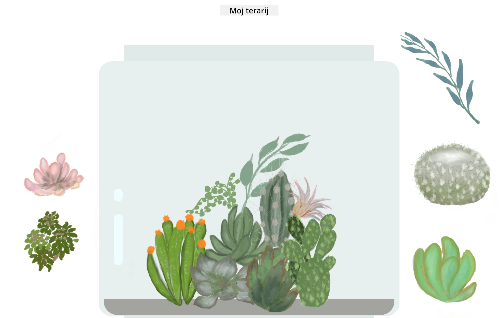

<!--
CO_OP_TRANSLATOR_METADATA:
{
  "original_hash": "7965cd2bc5dc92ad888dc4c6ab2ab70a",
  "translation_date": "2025-08-27T23:59:11+00:00",
  "source_file": "3-terrarium/README.md",
  "language_code": "hr"
}
-->
# Moj terarij: Projekt za učenje o HTML-u, CSS-u i manipulaciji DOM-a pomoću JavaScripta 🌵🌱

Mala vježba povuci i ispusti. Uz malo HTML-a, JS-a i CSS-a, moći ćete izraditi web sučelje, stilizirati ga i dodati više interakcija po vašem izboru.

# Lekcije

1. [Uvod u HTML](./1-intro-to-html/README.md)
2. [Uvod u CSS](./2-intro-to-css/README.md)
3. [Uvod u DOM i zatvaranja u JS-u](./3-intro-to-DOM-and-closures/README.md)

## Zasluge

Napisano s ♥️ od strane [Jen Looper](https://www.twitter.com/jenlooper)

Terarij kreiran pomoću CSS-a inspiriran je staklenkom Jakuba Mandre na [codepen](https://codepen.io/Rotarepmi/pen/rjpNZY).

Umjetnički rad ručno je nacrtala [Jen Looper](http://jenlooper.com) uz pomoć Procreate-a.

## Objavite svoj terarij

Možete objaviti ili postaviti svoj terarij na web koristeći Azure Static Web Apps.

1. Forkajte ovaj repozitorij

2. Pritisnite ovaj gumb

3. Prođite kroz čarobnjak za kreiranje vaše aplikacije. Pobrinite se da postavite korijen aplikacije na `/solution` ili korijen vaše baze koda. U ovoj aplikaciji nema API-ja, pa se ne morate brinuti oko dodavanja. Github mapa će biti kreirana u vašem forkiranom repozitoriju koja će pomoći Azure Static Web Apps servisima da izgrade i objave vašu aplikaciju na novu URL adresu.

---

**Odricanje od odgovornosti**:  
Ovaj dokument je preveden pomoću AI usluge za prevođenje [Co-op Translator](https://github.com/Azure/co-op-translator). Iako nastojimo osigurati točnost, imajte na umu da automatski prijevodi mogu sadržavati pogreške ili netočnosti. Izvorni dokument na izvornom jeziku treba smatrati autoritativnim izvorom. Za ključne informacije preporučuje se profesionalni prijevod od strane ljudskog prevoditelja. Ne preuzimamo odgovornost za bilo kakve nesporazume ili pogrešne interpretacije koje proizlaze iz korištenja ovog prijevoda.