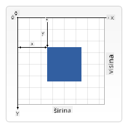

<!--
CO_OP_TRANSLATOR_METADATA:
{
  "original_hash": "41be8d35e7f30aa9dad10773c35e89c4",
  "translation_date": "2025-08-27T23:45:56+00:00",
  "source_file": "6-space-game/2-drawing-to-canvas/README.md",
  "language_code": "hr"
}
-->
# Izgradnja svemirske igre, dio 2: Crtanje heroja i čudovišta na platno

## Kviz prije predavanja

[Kviz prije predavanja](https://ashy-river-0debb7803.1.azurestaticapps.net/quiz/31)

## Platno

Platno je HTML element koji po defaultu nema sadržaj; to je prazna površina. Morate ga popuniti crtanjem.

✅ Pročitajte [više o Canvas API-ju](https://developer.mozilla.org/docs/Web/API/Canvas_API) na MDN-u.

Evo kako se obično deklarira, kao dio tijela stranice:

```html
<canvas id="myCanvas" width="200" height="100"></canvas>
```

Gore postavljamo `id`, `width` i `height`.

- `id`: postavite ovo kako biste mogli dobiti referencu kada trebate raditi s njim.
- `width`: ovo je širina elementa.
- `height`: ovo je visina elementa.

## Crtanje jednostavne geometrije

Platno koristi kartezijanski koordinatni sustav za crtanje. Dakle, koristi x-os i y-os za izražavanje gdje se nešto nalazi. Lokacija `0,0` je gornji lijevi kut, a donji desni kut je ono što ste postavili kao ŠIRINU i VISINU platna.

  
> Slika s [MDN-a](https://developer.mozilla.org/docs/Web/API/Canvas_API/Tutorial/Drawing_shapes)

Da biste crtali na elementu platna, trebate proći kroz sljedeće korake:

1. **Dobiti referencu** na element platna.
2. **Dobiti referencu** na element konteksta koji se nalazi na elementu platna.
3. **Izvršiti operaciju crtanja** koristeći element konteksta.

Kod za gore navedene korake obično izgleda ovako:

```javascript
// draws a red rectangle
//1. get the canvas reference
canvas = document.getElementById("myCanvas");

//2. set the context to 2D to draw basic shapes
ctx = canvas.getContext("2d");

//3. fill it with the color red
ctx.fillStyle = 'red';

//4. and draw a rectangle with these parameters, setting location and size
ctx.fillRect(0,0, 200, 200) // x,y,width, height
```

✅ Canvas API se uglavnom fokusira na 2D oblike, ali možete crtati i 3D elemente na web stranici; za to možete koristiti [WebGL API](https://developer.mozilla.org/docs/Web/API/WebGL_API).

Možete crtati razne stvari pomoću Canvas API-ja, poput:

- **Geometrijskih oblika**, već smo pokazali kako nacrtati pravokutnik, ali postoji mnogo više što možete nacrtati.
- **Teksta**, možete nacrtati tekst s bilo kojim fontom i bojom koju želite.
- **Slika**, možete nacrtati sliku na temelju slikovne datoteke, poput .jpg ili .png.

✅ Isprobajte! Znate kako nacrtati pravokutnik, možete li nacrtati krug na stranici? Pogledajte neke zanimljive crteže na platnu na CodePenu. Evo [posebno impresivnog primjera](https://codepen.io/dissimulate/pen/KrAwx).

## Učitavanje i crtanje slikovnih datoteka

Slikovnu datoteku učitavate stvaranjem objekta `Image` i postavljanjem njegove `src` vrijednosti. Zatim slušate događaj `load` kako biste znali kada je spreman za korištenje. Kod izgleda ovako:

### Učitavanje datoteke

```javascript
const img = new Image();
img.src = 'path/to/my/image.png';
img.onload = () => {
  // image loaded and ready to be used
}
```

### Uzorak učitavanja datoteke

Preporučuje se da gore navedeno omotate u konstrukciju poput ove, kako bi bilo lakše koristiti i kako biste manipulirali slikom tek kad je potpuno učitana:

```javascript
function loadAsset(path) {
  return new Promise((resolve) => {
    const img = new Image();
    img.src = path;
    img.onload = () => {
      // image loaded and ready to be used
      resolve(img);
    }
  })
}

// use like so

async function run() {
  const heroImg = await loadAsset('hero.png')
  const monsterImg = await loadAsset('monster.png')
}

```

Da biste nacrtali elemente igre na ekranu, vaš kod bi izgledao ovako:

```javascript
async function run() {
  const heroImg = await loadAsset('hero.png')
  const monsterImg = await loadAsset('monster.png')

  canvas = document.getElementById("myCanvas");
  ctx = canvas.getContext("2d");
  ctx.drawImage(heroImg, canvas.width/2,canvas.height/2);
  ctx.drawImage(monsterImg, 0,0);
}
```

## Vrijeme je da počnete graditi svoju igru

### Što izgraditi

Izgradit ćete web stranicu s elementom platna. Trebala bi prikazivati crni ekran `1024*768`. Dostavili smo vam dvije slike:

- Herojski brod

   

- 5*5 čudovišta

   

### Preporučeni koraci za početak razvoja

Pronađite datoteke koje su kreirane za vas u podmapi `your-work`. Trebala bi sadržavati sljedeće:

```bash
-| assets
  -| enemyShip.png
  -| player.png
-| index.html
-| app.js
-| package.json
```

Otvorite kopiju ove mape u Visual Studio Codeu. Trebate imati postavljeno lokalno razvojno okruženje, po mogućnosti s Visual Studio Codeom, NPM-om i Nodeom instaliranim. Ako nemate postavljen `npm` na svom računalu, [evo kako to učiniti](https://www.npmjs.com/get-npm).

Pokrenite svoj projekt navigacijom do mape `your_work`:

```bash
cd your-work
npm start
```

Gore navedeno će pokrenuti HTTP server na adresi `http://localhost:5000`. Otvorite preglednik i unesite tu adresu. Trenutno je prazna stranica, ali to će se promijeniti.

> Napomena: da biste vidjeli promjene na ekranu, osvježite preglednik.

### Dodavanje koda

Dodajte potreban kod u `your-work/app.js` kako biste riješili sljedeće:

1. **Nacrtajte** platno s crnom pozadinom  
   > savjet: dodajte dvije linije ispod odgovarajućeg TODO u `/app.js`, postavljajući element `ctx` da bude crn, a gornje/lijeve koordinate na 0,0, dok visina i širina trebaju biti jednake onima platna.
2. **Učitajte** teksture  
   > savjet: dodajte slike igrača i neprijatelja koristeći `await loadTexture` i prosljeđujući put slike. Još ih nećete vidjeti na ekranu!
3. **Nacrtajte** heroja u centru ekrana u donjoj polovici  
   > savjet: koristite `drawImage` API za crtanje heroImg na ekranu, postavljajući `canvas.width / 2 - 45` i `canvas.height - canvas.height / 4)`.
4. **Nacrtajte** 5*5 čudovišta  
   > savjet: sada možete otkomentirati kod za crtanje neprijatelja na ekranu. Zatim idite na funkciju `createEnemies` i izgradite je.

   Prvo, postavite neke konstante:

    ```javascript
    const MONSTER_TOTAL = 5;
    const MONSTER_WIDTH = MONSTER_TOTAL * 98;
    const START_X = (canvas.width - MONSTER_WIDTH) / 2;
    const STOP_X = START_X + MONSTER_WIDTH;
    ```

    zatim, kreirajte petlju za crtanje niza čudovišta na ekranu:

    ```javascript
    for (let x = START_X; x < STOP_X; x += 98) {
        for (let y = 0; y < 50 * 5; y += 50) {
          ctx.drawImage(enemyImg, x, y);
        }
      }
    ```

## Rezultat

Završni rezultat trebao bi izgledati ovako:


## Rješenje

Pokušajte prvo sami riješiti, ali ako zapnete, pogledajte [rješenje](../../../../6-space-game/2-drawing-to-canvas/solution/app.js).

---

## 🚀 Izazov

Naučili ste o crtanju s Canvas API-jem fokusiranim na 2D; pogledajte [WebGL API](https://developer.mozilla.org/docs/Web/API/WebGL_API) i pokušajte nacrtati 3D objekt.

## Kviz nakon predavanja

[Kviz nakon predavanja](https://ashy-river-0debb7803.1.azurestaticapps.net/quiz/32)

## Pregled i samostalno učenje

Saznajte više o Canvas API-ju [čitajući o njemu](https://developer.mozilla.org/docs/Web/API/Canvas_API).

## Zadatak

[Igrajte se s Canvas API-jem](assignment.md)

---

**Odricanje od odgovornosti**:  
Ovaj dokument je preveden pomoću AI usluge za prevođenje [Co-op Translator](https://github.com/Azure/co-op-translator). Iako nastojimo osigurati točnost, imajte na umu da automatski prijevodi mogu sadržavati pogreške ili netočnosti. Izvorni dokument na izvornom jeziku treba smatrati autoritativnim izvorom. Za ključne informacije preporučuje se profesionalni prijevod od strane čovjeka. Ne preuzimamo odgovornost za bilo kakva nesporazuma ili pogrešna tumačenja koja proizlaze iz korištenja ovog prijevoda.