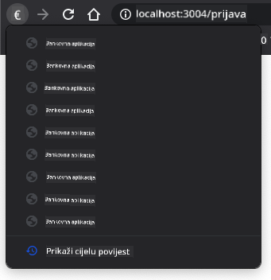

<!--
CO_OP_TRANSLATOR_METADATA:
{
  "original_hash": "8da1b5e2c63f749808858c53f37b8ce7",
  "translation_date": "2025-08-27T23:24:54+00:00",
  "source_file": "7-bank-project/1-template-route/README.md",
  "language_code": "hr"
}
-->
# Izrada bankovne aplikacije, 1. dio: HTML predlošci i rute u web aplikaciji

## Predavanje - kviz

[Pre-predavanje kviz](https://ashy-river-0debb7803.1.azurestaticapps.net/quiz/41)

### Uvod

Od pojave JavaScripta u preglednicima, web stranice postaju interaktivnije i složenije nego ikad. Web tehnologije sada se često koriste za stvaranje potpuno funkcionalnih aplikacija koje se pokreću izravno u pregledniku, a nazivamo ih [web aplikacijama](https://en.wikipedia.org/wiki/Web_application). Budući da su web aplikacije vrlo interaktivne, korisnici ne žele čekati potpuno ponovno učitavanje stranice svaki put kada se izvrši neka radnja. Zbog toga se JavaScript koristi za ažuriranje HTML-a izravno putem DOM-a, kako bi se pružilo glatko korisničko iskustvo.

U ovom ćemo predavanju postaviti temelje za izradu bankovne web aplikacije, koristeći HTML predloške za stvaranje više zaslona koji se mogu prikazivati i ažurirati bez potrebe za ponovnim učitavanjem cijele HTML stranice.

### Preduvjeti

Potrebno vam je lokalni web poslužitelj za testiranje web aplikacije koju ćemo izraditi u ovom predavanju. Ako ga nemate, možete instalirati [Node.js](https://nodejs.org) i koristiti naredbu `npx lite-server` iz mape vašeg projekta. To će stvoriti lokalni web poslužitelj i otvoriti vašu aplikaciju u pregledniku.

### Priprema

Na svom računalu stvorite mapu pod nazivom `bank` s datotekom `index.html` unutar nje. Počet ćemo s ovim HTML [boilerplateom](https://en.wikipedia.org/wiki/Boilerplate_code):

```html
<!DOCTYPE html>
<html lang="en">
  <head>
    <meta charset="UTF-8">
    <meta name="viewport" content="width=device-width, initial-scale=1.0">
    <title>Bank App</title>
  </head>
  <body>
    <!-- This is where you'll work -->
  </body>
</html>
```

---

## HTML predlošci

Ako želite stvoriti više zaslona za web stranicu, jedno rješenje bilo bi stvoriti jednu HTML datoteku za svaki zaslon koji želite prikazati. Međutim, ovo rješenje dolazi s nekim nedostacima:

- Morate ponovno učitati cijeli HTML prilikom prebacivanja zaslona, što može biti sporo.
- Teško je dijeliti podatke između različitih zaslona.

Drugi pristup je imati samo jednu HTML datoteku i definirati više [HTML predložaka](https://developer.mozilla.org/docs/Web/HTML/Element/template) koristeći element `<template>`. Predložak je višekratni HTML blok koji preglednik ne prikazuje, a mora se instancirati u vrijeme izvođenja pomoću JavaScripta.

### Zadatak

Izradit ćemo bankovnu aplikaciju s dva zaslona: stranica za prijavu i nadzorna ploča. Prvo, dodajmo u HTML tijelo element rezerviranog mjesta koji ćemo koristiti za instanciranje različitih zaslona naše aplikacije:

```html
<div id="app">Loading...</div>
```

Dodijelili smo mu `id` kako bismo ga kasnije lakše pronašli pomoću JavaScripta.

> Savjet: budući da će sadržaj ovog elementa biti zamijenjen, možemo staviti poruku ili indikator učitavanja koji će se prikazivati dok se aplikacija učitava.

Zatim dodajmo ispod HTML predložak za stranicu za prijavu. Za sada ćemo tamo staviti samo naslov i odjeljak koji sadrži poveznicu koju ćemo koristiti za navigaciju.

```html
<template id="login">
  <h1>Bank App</h1>
  <section>
    <a href="/dashboard">Login</a>
  </section>
</template>
```

Zatim ćemo dodati još jedan HTML predložak za stranicu nadzorne ploče. Ova stranica će sadržavati različite odjeljke:

- Zaglavlje s naslovom i poveznicom za odjavu
- Trenutni saldo bankovnog računa
- Popis transakcija prikazan u tablici

```html
<template id="dashboard">
  <header>
    <h1>Bank App</h1>
    <a href="/login">Logout</a>
  </header>
  <section>
    Balance: 100$
  </section>
  <section>
    <h2>Transactions</h2>
    <table>
      <thead>
        <tr>
          <th>Date</th>
          <th>Object</th>
          <th>Amount</th>
        </tr>
      </thead>
      <tbody></tbody>
    </table>
  </section>
</template>
```

> Savjet: kada izrađujete HTML predloške, ako želite vidjeti kako će izgledati, možete komentirati linije `<template>` i `</template>` tako da ih obuhvatite s `<!-- -->`.

✅ Zašto mislite da koristimo `id` atribute na predlošcima? Bismo li mogli koristiti nešto drugo, poput klasa?

## Prikazivanje predložaka pomoću JavaScripta

Ako pokušate otvoriti trenutnu HTML datoteku u pregledniku, vidjet ćete da se zaglavilo na prikazu `Loading...`. To je zato što trebamo dodati JavaScript kod za instanciranje i prikazivanje HTML predložaka.

Instanciranje predloška obično se radi u 3 koraka:

1. Dohvatite element predloška u DOM-u, na primjer pomoću [`document.getElementById`](https://developer.mozilla.org/docs/Web/API/Document/getElementById).
2. Klonirajte element predloška pomoću [`cloneNode`](https://developer.mozilla.org/docs/Web/API/Node/cloneNode).
3. Priložite ga DOM-u ispod vidljivog elementa, na primjer pomoću [`appendChild`](https://developer.mozilla.org/docs/Web/API/Node/appendChild).

✅ Zašto trebamo klonirati predložak prije nego što ga priložimo DOM-u? Što mislite da bi se dogodilo ako preskočimo ovaj korak?

### Zadatak

Stvorite novu datoteku pod nazivom `app.js` u mapi vašeg projekta i uvezite tu datoteku u `<head>` sekciju vašeg HTML-a:

```html
<script src="app.js" defer></script>
```

Sada u `app.js` stvorit ćemo novu funkciju `updateRoute`:

```js
function updateRoute(templateId) {
  const template = document.getElementById(templateId);
  const view = template.content.cloneNode(true);
  const app = document.getElementById('app');
  app.innerHTML = '';
  app.appendChild(view);
}
```

Ovdje radimo upravo 3 gore opisana koraka. Instanciramo predložak s `id`-om `templateId` i stavljamo njegov klonirani sadržaj unutar našeg rezerviranog mjesta aplikacije. Napominjemo da trebamo koristiti `cloneNode(true)` kako bismo kopirali cijelo podstablo predloška.

Sada pozovite ovu funkciju s jednim od predložaka i pogledajte rezultat.

```js
updateRoute('login');
```

✅ Koja je svrha ovog koda `app.innerHTML = '';`? Što se događa bez njega?

## Stvaranje ruta

Kada govorimo o web aplikaciji, *Routing* označava namjeru mapiranja **URL-ova** na određene zaslone koji bi se trebali prikazati. Na web stranici s više HTML datoteka, to se automatski radi jer se putovi datoteka odražavaju na URL-u. Na primjer, s ovim datotekama u mapi vašeg projekta:

```
mywebsite/index.html
mywebsite/login.html
mywebsite/admin/index.html
```

Ako stvorite web poslužitelj s `mywebsite` kao korijenom, mapiranje URL-a bit će:

```
https://site.com            --> mywebsite/index.html
https://site.com/login.html --> mywebsite/login.html
https://site.com/admin/     --> mywebsite/admin/index.html
```

Međutim, za našu web aplikaciju koristimo jednu HTML datoteku koja sadrži sve zaslone, pa nam ovo zadano ponašanje neće pomoći. Moramo ručno stvoriti ovu mapu i ažurirati prikazani predložak pomoću JavaScripta.

### Zadatak

Koristit ćemo jednostavan objekt za implementaciju [mape](https://en.wikipedia.org/wiki/Associative_array) između URL putova i naših predložaka. Dodajte ovaj objekt na vrh vaše `app.js` datoteke.

```js
const routes = {
  '/login': { templateId: 'login' },
  '/dashboard': { templateId: 'dashboard' },
};
```

Sada malo izmijenimo funkciju `updateRoute`. Umjesto da izravno prosljeđujemo `templateId` kao argument, želimo ga dohvatiti prvo gledajući trenutni URL, a zatim koristiti našu mapu za dobivanje odgovarajuće vrijednosti `templateId`. Možemo koristiti [`window.location.pathname`](https://developer.mozilla.org/docs/Web/API/Location/pathname) za dobivanje samo dijela puta iz URL-a.

```js
function updateRoute() {
  const path = window.location.pathname;
  const route = routes[path];

  const template = document.getElementById(route.templateId);
  const view = template.content.cloneNode(true);
  const app = document.getElementById('app');
  app.innerHTML = '';
  app.appendChild(view);
}
```

Ovdje smo mapirali rute koje smo deklarirali na odgovarajući predložak. Možete provjeriti radi li ispravno tako da ručno promijenite URL u pregledniku.

✅ Što se događa ako unesete nepoznati put u URL? Kako bismo to mogli riješiti?

## Dodavanje navigacije

Sljedeći korak za našu aplikaciju je dodavanje mogućnosti navigacije između stranica bez potrebe za ručnim mijenjanjem URL-a. To podrazumijeva dvije stvari:

1. Ažuriranje trenutnog URL-a
2. Ažuriranje prikazanog predloška na temelju novog URL-a

Drugi dio već smo riješili funkcijom `updateRoute`, pa moramo smisliti kako ažurirati trenutni URL.

Morat ćemo koristiti JavaScript, a posebno [`history.pushState`](https://developer.mozilla.org/docs/Web/API/History/pushState) koji omogućuje ažuriranje URL-a i stvaranje novog unosa u povijesti pregledavanja, bez ponovnog učitavanja HTML-a.

> Napomena: Iako se HTML element sidra [`<a href>`](https://developer.mozilla.org/docs/Web/HTML/Element/a) može koristiti samostalno za stvaranje hiperveza na različite URL-ove, on će prema zadanim postavkama učiniti da preglednik ponovno učita HTML. Potrebno je spriječiti ovo ponašanje prilikom rukovanja rutama pomoću prilagođenog JavaScripta, koristeći funkciju preventDefault() na događaju klika.

### Zadatak

Stvorimo novu funkciju koju možemo koristiti za navigaciju u našoj aplikaciji:

```js
function navigate(path) {
  window.history.pushState({}, path, path);
  updateRoute();
}
```

Ova metoda prvo ažurira trenutni URL na temelju zadanog puta, a zatim ažurira predložak. Svojstvo `window.location.origin` vraća korijen URL-a, omogućujući nam rekonstrukciju potpunog URL-a iz zadanog puta.

Sada kada imamo ovu funkciju, možemo riješiti problem koji imamo ako put ne odgovara nijednoj definiranoj ruti. Izmijenit ćemo funkciju `updateRoute` dodavanjem povratne opcije na jednu od postojećih ruta ako ne možemo pronaći podudaranje.

```js
function updateRoute() {
  const path = window.location.pathname;
  const route = routes[path];

  if (!route) {
    return navigate('/login');
  }

  ...
```

Ako ruta ne može biti pronađena, sada ćemo preusmjeriti na stranicu za prijavu.

Sada stvorimo funkciju za dohvaćanje URL-a kada se klikne na poveznicu i za sprječavanje zadano ponašanje preglednika za poveznice:

```js
function onLinkClick(event) {
  event.preventDefault();
  navigate(event.target.href);
}
```

Dovršimo navigacijski sustav dodavanjem veza za naše *Login* i *Logout* poveznice u HTML-u.

```html
<a href="/dashboard" onclick="onLinkClick(event)">Login</a>
...
<a href="/login" onclick="onLinkClick(event)">Logout</a>
```

Objekt `event` iznad hvata događaj `click` i prosljeđuje ga našoj funkciji `onLinkClick`.

Koristeći atribut [`onclick`](https://developer.mozilla.org/docs/Web/API/GlobalEventHandlers/onclick), povežite događaj `click` s JavaScript kodom, ovdje pozivom funkcije `navigate()`.

Pokušajte kliknuti na ove poveznice, sada biste trebali moći navigirati između različitih zaslona vaše aplikacije.

✅ Metoda `history.pushState` dio je HTML5 standarda i implementirana je u [svim modernim preglednicima](https://caniuse.com/?search=pushState). Ako izrađujete web aplikaciju za starije preglednike, postoji trik koji možete koristiti umjesto ove API-je: koristeći [hash (`#`)](https://en.wikipedia.org/wiki/URI_fragment) prije puta možete implementirati rute koje rade s redovnom navigacijom sidra i ne učitavaju ponovno stranicu, jer je njegova svrha bila stvaranje unutarnjih poveznica unutar stranice.

## Rukovanje gumbima za povratak i naprijed u pregledniku

Korištenje `history.pushState` stvara nove unose u povijesti navigacije preglednika. Možete to provjeriti držeći *gumb za povratak* vašeg preglednika, trebao bi prikazati nešto poput ovoga:



Ako pokušate kliknuti na gumb za povratak nekoliko puta, vidjet ćete da se trenutni URL mijenja i povijest se ažurira, ali isti predložak ostaje prikazan.

To je zato što aplikacija ne zna da trebamo pozvati `updateRoute()` svaki put kada se povijest promijeni. Ako pogledate dokumentaciju za [`history.pushState`](https://developer.mozilla.org/docs/Web/API/History/pushState), možete vidjeti da ako se stanje promijeni - što znači da smo se pomaknuli na drugi URL - događaj [`popstate`](https://developer.mozilla.org/docs/Web/API/Window/popstate_event) se aktivira. Koristit ćemo to za rješavanje ovog problema.

### Zadatak

Kako bismo osigurali da se prikazani predložak ažurira kada se povijest preglednika promijeni, priložit ćemo novu funkciju koja poziva `updateRoute()`. To ćemo učiniti na dnu naše `app.js` datoteke:

```js
window.onpopstate = () => updateRoute();
updateRoute();
```

> Napomena: ovdje smo koristili [arrow funkciju](https://developer.mozilla.org/docs/Web/JavaScript/Reference/Functions/Arrow_functions) za deklariranje našeg `popstate` event handlera radi sažetosti, ali regularna funkcija bi radila isto.

Evo osvježavajućeg videa o arrow funkcijama:

[](https://youtube.com/watch?v=OP6eEbOj2sc "Arrow Functions")

> 🎥 Kliknite na sliku iznad za video o arrow funkcijama.

Sada pokušajte koristiti gumbe za povratak i naprijed u pregledniku i provjerite da se prikazana ruta ispravno ažurira ovaj put.

---

## 🚀 Izazov

Dodajte novi predložak i rutu za treću stranicu koja prikazuje zasluge za ovu aplikaciju.

## Kviz nakon predavanja

[Kviz nakon predavanja](https://ashy-river-0debb7803.1.azurestaticapps.net/quiz/42)

## Pregled i samostalno učenje

Rute su jedan od iznenađujuće složenih dijelova web razvoja, posebno kako se web kreće od ponašanja osvježavanja stranica prema osvježavanju stranica u aplikacijama s jednom stranicom (SPA). Pročitajte malo o [kako Azure Static Web App usluga](https://docs.microsoft.com/azure/static-web-apps/routes/?WT.mc_id=academic-77807-sagibbon) rukuje rutama. Možete li objasniti zašto su neke od odluka opisanih u tom dokumentu nužne?

## Zadatak

[Poboljšajte rute](assignment.md)

---

**Odricanje od odgovornosti**:  
Ovaj dokument je preveden pomoću AI usluge za prevođenje [Co-op Translator](https://github.com/Azure/co-op-translator). Iako nastojimo osigurati točnost, imajte na umu da automatski prijevodi mogu sadržavati pogreške ili netočnosti. Izvorni dokument na izvornom jeziku treba smatrati autoritativnim izvorom. Za kritične informacije preporučuje se profesionalni prijevod od strane čovjeka. Ne preuzimamo odgovornost za bilo kakva nesporazuma ili pogrešna tumačenja koja proizlaze iz korištenja ovog prijevoda.