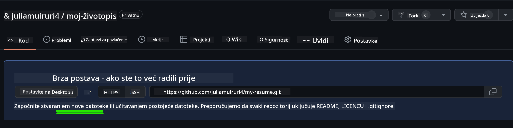
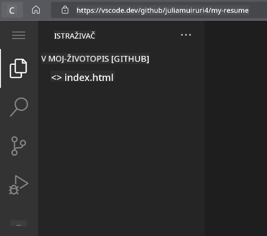
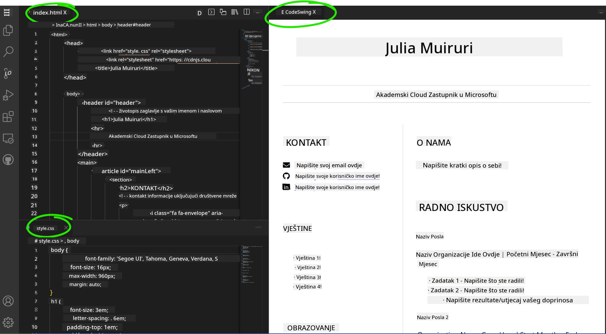

<!--
CO_OP_TRANSLATOR_METADATA:
{
  "original_hash": "2fcb983b8dbadadb1bc2e97f8c12dac5",
  "translation_date": "2025-08-28T00:09:37+00:00",
  "source_file": "8-code-editor/1-using-a-code-editor/assignment.md",
  "language_code": "hr"
}
-->
# Kreirajte web stranicu za životopis koristeći vscode.dev

_Kako bi bilo cool da vas regruter zatraži vaš životopis, a vi mu pošaljete URL?_ 😎

## Ciljevi

Nakon ovog zadatka naučit ćete:

- Kreirati web stranicu za prikaz vašeg životopisa

### Preduvjeti

1. GitHub račun. Posjetite [GitHub](https://github.com/) i kreirajte račun ako ga već nemate.

## Koraci

**Korak 1:** Kreirajte novi GitHub repozitorij i dajte mu ime `my-resume`

**Korak 2:** Kreirajte datoteku `index.html` u svom repozitoriju. Dodati ćemo barem jednu datoteku dok smo još na github.com jer ne možete otvoriti prazan repozitorij na vscode.dev.

Kliknite na poveznicu `creating a new file`, upišite naziv `index.html` i odaberite gumb `Commit new file`.



**Korak 3:** Otvorite [VSCode.dev](https://vscode.dev) i odaberite gumb `Open Remote Repository`.

Kopirajte URL repozitorija koji ste upravo kreirali za svoju web stranicu životopisa i zalijepite ga u polje za unos:

_Zamijenite `your-username` svojim GitHub korisničkim imenom._

```
https://github.com/your-username/my-resume
```

✅ Ako je uspješno, vidjet ćete svoj projekt i datoteku index.html otvorenu u tekstualnom editoru u pregledniku.



**Korak 4:** Otvorite datoteku `index.html`, zalijepite kod ispod u svoj kodni prostor i spremite.

<details>
    <summary><b>HTML kod odgovoran za sadržaj vaše web stranice životopisa.</b></summary>
    
        <html>

            <head>
                <link href="style.css" rel="stylesheet">
                <link rel="stylesheet" href="https://cdnjs.cloudflare.com/ajax/libs/font-awesome/5.15.4/css/all.min.css">
                <title>Vaše ime ovdje!</title>
            </head>
            <body>
                <header id="header">
                    <!-- zaglavlje životopisa s vašim imenom i titulom -->
                    <h1>Vaše ime ovdje!</h1>
                    <hr>
                    Vaša uloga!
                    <hr>
                </header>
                <main>
                    <article id="mainLeft">
                        <section>
                            <h2>KONTAKT</h2>
                            <!-- kontakt informacije uključujući društvene mreže -->
                            <p>
                                <i class="fa fa-envelope" aria-hidden="true"></i>
                                <a href="mailto:username@domain.top-level domain">Upišite svoj email ovdje</a>
                            </p>
                            <p>
                                <i class="fab fa-github" aria-hidden="true"></i>
                                <a href="github.com/yourGitHubUsername">Upišite svoje korisničko ime ovdje!</a>
                            </p>
                            <p>
                                <i class="fab fa-linkedin" aria-hidden="true"></i>
                                <a href="linkedin.com/yourLinkedInUsername">Upišite svoje korisničko ime ovdje!</a>
                            </p>
                        </section>
                        <section>
                            <h2>VJEŠTINE</h2>
                            <!-- vaše vještine -->
                            <ul>
                                <li>Vještina 1!</li>
                                <li>Vještina 2!</li>
                                <li>Vještina 3!</li>
                                <li>Vještina 4!</li>
                            </ul>
                        </section>
                        <section>
                            <h2>OBRAZOVANJE</h2>
                            <!-- vaše obrazovanje -->
                            <h3>Upišite svoj studij ovdje!</h3>
                            <p>
                                Upišite svoju instituciju ovdje!
                            </p>
                            <p>
                                Početak - Završetak
                            </p>
                        </section>            
                    </article>
                    <article id="mainRight">
                        <section>
                            <h2>O MENI</h2>
                            <!-- o vama -->
                            <p>Upišite nešto o sebi!</p>
                        </section>
                        <section>
                            <h2>RADNO ISKUSTVO</h2>
                            <!-- vaše radno iskustvo -->
                            <h3>Naziv posla</h3>
                            <p>
                                Naziv organizacije ovdje | Početni mjesec – Završni mjesec
                            </p>
                            <ul>
                                    <li>Zadatak 1 - Napišite što ste radili!</li>
                                    <li>Zadatak 2 - Napišite što ste radili!</li>
                                    <li>Napišite rezultate/utjecaj vašeg doprinosa</li>
                                    
                            </ul>
                            <h3>Naziv posla 2</h3>
                            <p>
                                Naziv organizacije ovdje | Početni mjesec – Završni mjesec
                            </p>
                            <ul>
                                    <li>Zadatak 1 - Napišite što ste radili!</li>
                                    <li>Zadatak 2 - Napišite što ste radili!</li>
                                    <li>Napišite rezultate/utjecaj vašeg doprinosa</li>
                                    
                            </ul>
                        </section>
                    </article>
                </main>
            </body>
        </html>
</details>

Dodajte detalje svog životopisa kako biste zamijenili _tekst rezerviranog mjesta_ u HTML kodu.

**Korak 5:** Zadržite pokazivač iznad mape My-Resume, kliknite ikonu `New File ...` i kreirajte 2 nove datoteke u svom projektu: `style.css` i `codeswing.json`.

**Korak 6:** Otvorite datoteku `style.css`, zalijepite kod ispod i spremite.

<details>
        <summary><b>CSS kod za formatiranje izgleda stranice.</b></summary>
            
            body {
                font-family: 'Segoe UI', Tahoma, Geneva, Verdana, sans-serif;
                font-size: 16px;
                max-width: 960px;
                margin: auto;
            }
            h1 {
                font-size: 3em;
                letter-spacing: .6em;
                padding-top: 1em;
                padding-bottom: 1em;
            }

            h2 {
                font-size: 1.5em;
                padding-bottom: 1em;
            }

            h3 {
                font-size: 1em;
                padding-bottom: 1em;
            }
            main { 
                display: grid;
                grid-template-columns: 40% 60%;
                margin-top: 3em;
            }
            header {
                text-align: center;
                margin: auto 2em;
            }

            section {
                margin: auto 1em 4em 2em;
            }

            i {
                margin-right: .5em;
            }

            p {
                margin: .2em auto
            }

            hr {
                border: none;
                background-color: lightgray;
                height: 1px;
            }

            h1, h2, h3 {
                font-weight: 100;
                margin-bottom: 0;
            }
            #mainLeft {
                border-right: 1px solid lightgray;
            }
            
</details>

**Korak 6:** Otvorite datoteku `codeswing.json`, zalijepite kod ispod i spremite.

    {
    "scripts": [],
    "styles": []
    }

**Korak 7:** Instalirajte ekstenziju `Codeswing` kako biste vizualizirali web stranicu životopisa u kodnom prostoru.

Kliknite ikonu _`Extensions`_ na traci aktivnosti i upišite Codeswing. Kliknite _plavi gumb za instalaciju_ na proširenoj traci aktivnosti za instalaciju ili koristite gumb za instalaciju koji se pojavljuje u kodnom prostoru nakon što odaberete ekstenziju za učitavanje dodatnih informacija. Odmah nakon instalacije ekstenzije, promatrajte promjene u svom projektu 😃.


Ovo je ono što ćete vidjeti na svom ekranu nakon instalacije ekstenzije.



Ako ste zadovoljni promjenama koje ste napravili, zadržite pokazivač iznad mape `Changes` i kliknite gumb `+` za postavljanje promjena.

Upišite poruku za commit _(Opis promjene koju ste napravili u projektu)_ i potvrdite svoje promjene klikom na `check`. Kada završite s radom na projektu, odaberite ikonu hamburger menija u gornjem lijevom kutu za povratak na repozitorij na GitHubu.

Čestitamo 🎉 Upravo ste kreirali svoju web stranicu životopisa koristeći vscode.dev u nekoliko koraka.

## 🚀 Izazov

Otvorite udaljeni repozitorij za koji imate dozvolu za izmjene i ažurirajte neke datoteke. Zatim pokušajte kreirati novu granu sa svojim promjenama i napraviti Pull Request.

## Pregled i samostalno učenje

Pročitajte više o [VSCode.dev](https://code.visualstudio.com/docs/editor/vscode-web?WT.mc_id=academic-0000-alfredodeza) i nekim njegovim drugim značajkama.

---

**Odricanje od odgovornosti**:  
Ovaj dokument je preveden pomoću AI usluge za prevođenje [Co-op Translator](https://github.com/Azure/co-op-translator). Iako nastojimo osigurati točnost, imajte na umu da automatski prijevodi mogu sadržavati pogreške ili netočnosti. Izvorni dokument na izvornom jeziku treba smatrati autoritativnim izvorom. Za ključne informacije preporučuje se profesionalni prijevod od strane čovjeka. Ne preuzimamo odgovornost za nesporazume ili pogrešna tumačenja koja mogu proizaći iz korištenja ovog prijevoda.