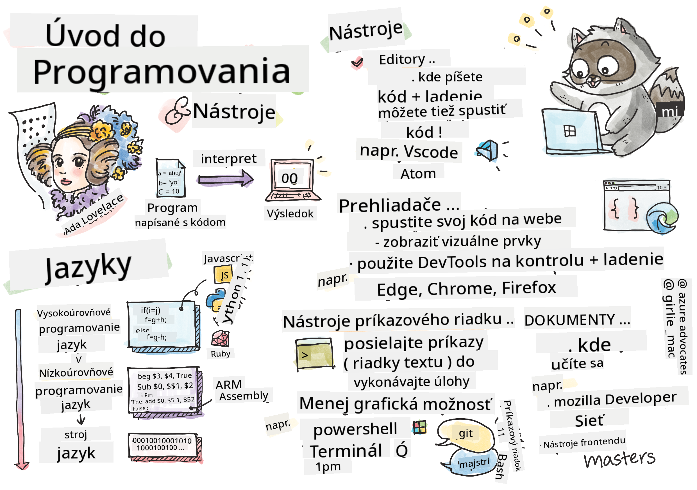

<!--
CO_OP_TRANSLATOR_METADATA:
{
  "original_hash": "c63675cfaf1d223b37bb9fecbfe7c252",
  "translation_date": "2025-08-28T00:13:54+00:00",
  "source_file": "1-getting-started-lessons/1-intro-to-programming-languages/README.md",
  "language_code": "sk"
}
-->
# Úvod do programovacích jazykov a nástrojov pre vývojárov

Táto lekcia pokrýva základy programovacích jazykov. Témy uvedené tu sa vzťahujú na väčšinu moderných programovacích jazykov. V sekcii "Nástroje pre vývojárov" sa naučíte o užitočnom softvéri, ktorý vám pomôže ako vývojárovi.

  
> Sketchnote od [Tomomi Imura](https://twitter.com/girlie_mac)

## Kvíz pred prednáškou  
[Kvíz pred prednáškou](https://forms.office.com/r/dru4TE0U9n?origin=lprLink)

## Úvod

V tejto lekcii sa budeme venovať:

- Čo je programovanie?
- Typy programovacích jazykov
- Základné prvky programu
- Užitočný softvér a nástroje pre profesionálneho vývojára

> Túto lekciu si môžete prejsť na [Microsoft Learn](https://docs.microsoft.com/learn/modules/web-development-101/introduction-programming/?WT.mc_id=academic-77807-sagibbon)!

## Čo je programovanie?

Programovanie (známe aj ako kódovanie) je proces písania inštrukcií pre zariadenie, ako je počítač alebo mobilné zariadenie. Tieto inštrukcie píšeme pomocou programovacieho jazyka, ktorý zariadenie následne interpretuje. Tieto sady inštrukcií môžu byť označované rôznymi názvami, ako napríklad *program*, *počítačový program*, *aplikácia (app)* alebo *spustiteľný súbor*.

*Program* môže byť čokoľvek, čo je napísané pomocou kódu; webové stránky, hry a mobilné aplikácie sú programy. Aj keď je možné vytvoriť program bez písania kódu, základná logika je interpretovaná zariadením a táto logika bola pravdepodobne napísaná kódom. Program, ktorý *beží* alebo *vykonáva* kód, vykonáva inštrukcie. Zariadenie, na ktorom čítate túto lekciu, práve spúšťa program, aby ju zobrazilo na vašej obrazovke.

✅ Urobte si malý prieskum: Kto je považovaný za prvého programátora na svete?

## Programovacie jazyky

Programovacie jazyky umožňujú vývojárom písať inštrukcie pre zariadenie. Zariadenia rozumejú iba binárnemu kódu (1 a 0), a pre *väčšinu* vývojárov to nie je veľmi efektívny spôsob komunikácie. Programovacie jazyky sú prostriedkom komunikácie medzi ľuďmi a počítačmi.

Programovacie jazyky majú rôzne formáty a môžu slúžiť rôznym účelom. Napríklad JavaScript sa primárne používa na webové aplikácie, zatiaľ čo Bash sa používa hlavne pre operačné systémy.

*Nízkoúrovňové jazyky* zvyčajne vyžadujú menej krokov na interpretáciu inštrukcií zariadením ako *vysokoúrovňové jazyky*. Čo však robí vysokoúrovňové jazyky populárnymi, je ich čitateľnosť a podpora. JavaScript je považovaný za vysokoúrovňový jazyk.

Nasledujúci kód ilustruje rozdiel medzi vysokoúrovňovým jazykom (JavaScript) a nízkoúrovňovým jazykom (ARM assembly kód).

```javascript
let number = 10
let n1 = 0, n2 = 1, nextTerm;

for (let i = 1; i <= number; i++) {
    console.log(n1);
    nextTerm = n1 + n2;
    n1 = n2;
    n2 = nextTerm;
}
```

```c
 area ascen,code,readonly
 entry
 code32
 adr r0,thumb+1
 bx r0
 code16
thumb
 mov r0,#00
 sub r0,r0,#01
 mov r1,#01
 mov r4,#10
 ldr r2,=0x40000000
back add r0,r1
 str r0,[r2]
 add r2,#04
 mov r3,r0
 mov r0,r1
 mov r1,r3
 sub r4,#01
 cmp r4,#00
 bne back
 end
```

Verte alebo nie, *oba robia to isté*: vypisujú Fibonacciho postupnosť do 10.

✅ Fibonacciho postupnosť je [definovaná](https://en.wikipedia.org/wiki/Fibonacci_number) ako sada čísel, kde každé číslo je súčtom dvoch predchádzajúcich, počnúc od 0 a 1. Prvých 10 čísel Fibonacciho postupnosti je 0, 1, 1, 2, 3, 5, 8, 13, 21 a 34.

## Prvky programu

Jedna inštrukcia v programe sa nazýva *príkaz* a zvyčajne má znak alebo medzeru, ktorá označuje, kde inštrukcia končí, alebo *terminuje*. Spôsob, akým program terminujú, sa líši podľa jazyka.

Príkazy v programe môžu závisieť od údajov poskytnutých používateľom alebo z iného zdroja na vykonanie inštrukcií. Údaje môžu zmeniť správanie programu, a preto programovacie jazyky obsahujú spôsob, ako dočasne ukladať údaje, aby sa mohli použiť neskôr. Tieto sa nazývajú *premenné*. Premenné sú príkazy, ktoré inštruujú zariadenie, aby uložilo údaje do svojej pamäte. Premenné v programoch sú podobné premenným v algebre, kde majú jedinečný názov a ich hodnota sa môže časom meniť.

Existuje možnosť, že niektoré príkazy nebudú zariadením vykonané. Toto je zvyčajne zámer vývojára alebo náhoda, keď nastane neočakávaná chyba. Tento typ kontroly nad aplikáciou ju robí robustnejšou a udržiavateľnejšou. Typicky tieto zmeny v kontrole nastávajú, keď sú splnené určité podmienky. Bežný príkaz používaný v modernom programovaní na kontrolu, ako program beží, je `if..else` príkaz.

✅ O tomto type príkazu sa dozviete viac v nasledujúcich lekciách.

## Nástroje pre vývojárov

[](https://youtube.com/watch?v=69WJeXGBdxg "Nástroje pre vývojárov")

> 🎥 Kliknite na obrázok vyššie pre video o nástrojoch

V tejto sekcii sa dozviete o niektorých softvéroch, ktoré môžu byť veľmi užitočné, keď začínate svoju profesionálnu vývojársku cestu.

**Vývojové prostredie** je jedinečná sada nástrojov a funkcií, ktoré vývojár často používa pri písaní softvéru. Niektoré z týchto nástrojov boli prispôsobené špecifickým potrebám vývojára a môžu sa časom meniť, ak vývojár zmení priority v práci, osobných projektoch alebo pri používaní iného programovacieho jazyka. Vývojové prostredia sú tak jedinečné, ako vývojári, ktorí ich používajú.

### Editory

Jedným z najdôležitejších nástrojov pre vývoj softvéru je editor. Editory sú miestom, kde píšete svoj kód a niekedy aj spúšťate svoj kód.

Vývojári sa spoliehajú na editory z niekoľkých ďalších dôvodov:

- *Ladenie* pomáha odhaliť chyby a problémy tým, že prechádza kód riadok po riadku. Niektoré editory majú schopnosti ladenia; môžu byť prispôsobené a pridané pre konkrétne programovacie jazyky.
- *Zvýraznenie syntaxe* pridáva farby a formátovanie textu do kódu, čo uľahčuje jeho čítanie. Väčšina editorov umožňuje prispôsobené zvýraznenie syntaxe.
- *Rozšírenia a integrácie* sú špecializované nástroje pre vývojárov, vytvorené vývojármi. Tieto nástroje neboli súčasťou základného editora. Napríklad mnohí vývojári dokumentujú svoj kód, aby vysvetlili, ako funguje. Môžu si nainštalovať rozšírenie na kontrolu pravopisu, aby našli preklepy v dokumentácii. Väčšina rozšírení je určená na použitie v konkrétnom editore a väčšina editorov má spôsob, ako vyhľadávať dostupné rozšírenia.
- *Prispôsobenie* umožňuje vývojárom vytvoriť jedinečné vývojové prostredie, ktoré vyhovuje ich potrebám. Väčšina editorov je extrémne prispôsobiteľná a môže tiež umožniť vývojárom vytvárať vlastné rozšírenia.

#### Populárne editory a rozšírenia pre webový vývoj

- [Visual Studio Code](https://code.visualstudio.com/?WT.mc_id=academic-77807-sagibbon)  
  - [Code Spell Checker](https://marketplace.visualstudio.com/items?itemName=streetsidesoftware.code-spell-checker)  
  - [Live Share](https://marketplace.visualstudio.com/items?itemName=MS-vsliveshare.vsliveshare)  
  - [Prettier - Code formatter](https://marketplace.visualstudio.com/items?itemName=esbenp.prettier-vscode)  
- [Atom](https://atom.io/)  
  - [spell-check](https://atom.io/packages/spell-check)  
  - [teletype](https://atom.io/packages/teletype)  
  - [atom-beautify](https://atom.io/packages/atom-beautify)  
- [Sublimetext](https://www.sublimetext.com/)  
  - [emmet](https://emmet.io/)  
  - [SublimeLinter](http://www.sublimelinter.com/en/stable/)  

### Prehliadače

Ďalším kľúčovým nástrojom je prehliadač. Weboví vývojári sa spoliehajú na prehliadač, aby videli, ako ich kód funguje na webe. Používa sa tiež na zobrazenie vizuálnych prvkov webovej stránky, ktoré sú napísané v editore, ako je HTML.

Mnohé prehliadače obsahujú *nástroje pre vývojárov* (DevTools), ktoré obsahujú sadu užitočných funkcií a informácií na pomoc vývojárom pri zhromažďovaní a zachytávaní dôležitých informácií o ich aplikácii. Napríklad: Ak má webová stránka chyby, niekedy je užitočné vedieť, kedy sa vyskytli. DevTools v prehliadači môžu byť nakonfigurované na zachytenie týchto informácií.

#### Populárne prehliadače a DevTools

- [Edge](https://docs.microsoft.com/microsoft-edge/devtools-guide-chromium/?WT.mc_id=academic-77807-sagibbon)  
- [Chrome](https://developers.google.com/web/tools/chrome-devtools/)  
- [Firefox](https://developer.mozilla.org/docs/Tools)  

### Nástroje príkazového riadku

Niektorí vývojári preferujú menej grafický pohľad na svoje každodenné úlohy a spoliehajú sa na príkazový riadok. Písanie kódu vyžaduje značné množstvo písania a niektorí vývojári preferujú neprerušovať svoj tok na klávesnici. Používajú klávesové skratky na prepínanie medzi oknami, prácu na rôznych súboroch a používanie nástrojov. Väčšinu úloh je možné vykonať pomocou myši, ale jednou z výhod príkazového riadku je, že veľa sa dá urobiť bez potreby prepínania medzi myšou a klávesnicou. Ďalšou výhodou príkazového riadku je, že je konfigurovateľný a môžete si uložiť vlastnú konfiguráciu, neskôr ju zmeniť a importovať na iné vývojové stroje. Pretože vývojové prostredia sú tak jedinečné pre každého vývojára, niektorí sa vyhýbajú používaniu príkazového riadku, iní sa naň úplne spoliehajú a niektorí preferujú mix oboch.

### Populárne možnosti príkazového riadku

Možnosti príkazového riadku sa líšia v závislosti od operačného systému, ktorý používate.

*💻 = predinštalované v operačnom systéme.*

#### Windows

- [Powershell](https://docs.microsoft.com/powershell/scripting/overview?view=powershell-7/?WT.mc_id=academic-77807-sagibbon) 💻  
- [Command Line](https://docs.microsoft.com/windows-server/administration/windows-commands/windows-commands/?WT.mc_id=academic-77807-sagibbon) (známy aj ako CMD) 💻  
- [Windows Terminal](https://docs.microsoft.com/windows/terminal/?WT.mc_id=academic-77807-sagibbon)  
- [mintty](https://mintty.github.io/)  

#### MacOS

- [Terminal](https://support.apple.com/guide/terminal/open-or-quit-terminal-apd5265185d-f365-44cb-8b09-71a064a42125/mac) 💻  
- [iTerm](https://iterm2.com/)  
- [Powershell](https://docs.microsoft.com/powershell/scripting/install/installing-powershell-core-on-macos?view=powershell-7/?WT.mc_id=academic-77807-sagibbon)  

#### Linux

- [Bash](https://www.gnu.org/software/bash/manual/html_node/index.html) 💻  
- [KDE Konsole](https://docs.kde.org/trunk5/en/konsole/konsole/index.html)  
- [Powershell](https://docs.microsoft.com/powershell/scripting/install/installing-powershell-core-on-linux?view=powershell-7/?WT.mc_id=academic-77807-sagibbon)  

#### Populárne nástroje príkazového riadku

- [Git](https://git-scm.com/) (💻 na väčšine operačných systémov)  
- [NPM](https://www.npmjs.com/)  
- [Yarn](https://classic.yarnpkg.com/en/docs/cli/)  

### Dokumentácia

Keď sa vývojár chce naučiť niečo nové, pravdepodobne sa obráti na dokumentáciu, aby sa naučil, ako to používať. Vývojári sa často spoliehajú na dokumentáciu, aby ich viedla, ako správne používať nástroje a jazyky, a tiež aby získali hlbšie znalosti o tom, ako fungujú.

#### Populárna dokumentácia o webovom vývoji

- [Mozilla Developer Network (MDN)](https://developer.mozilla.org/docs/Web), od Mozilly, vydavateľov prehliadača [Firefox](https://www.mozilla.org/firefox/)  
- [Frontend Masters](https://frontendmasters.com/learn/)  
- [Web.dev](https://web.dev), od Google, vydavateľov [Chrome](https://www.google.com/chrome/)  
- [Microsoftova dokumentácia pre vývojárov](https://docs.microsoft.com/microsoft-edge/#microsoft-edge-for-developers), pre [Microsoft Edge](https://www.microsoft.com/edge)  
- [W3 Schools](https://www.w3schools.com/where_to_start.asp)  

✅ Urobte si prieskum: Teraz, keď poznáte základy prostredia webového vývojára, porovnajte ho s prostredím webového dizajnéra.

---

## 🚀 Výzva

Porovnajte niektoré programovacie jazyky. Aké sú niektoré jedinečné vlastnosti JavaScriptu oproti Jave? A čo COBOL oproti Go?

## Kvíz po prednáške  
[Kvíz po prednáške](https://ashy-river-0debb7803.1.azurestaticapps.net/quiz/2)

## Prehľad a samoštúdium

Študujte rôzne jazyky dostupné pre programátora. Skúste napísať riadok v jednom jazyku a potom ho prepísať do dvoch ďalších. Čo ste sa naučili?

## Zadanie

[Čítanie dokumentácie](assignment.md)

---

**Upozornenie**:  
Tento dokument bol preložený pomocou služby AI prekladu [Co-op Translator](https://github.com/Azure/co-op-translator). Aj keď sa snažíme o presnosť, prosím, berte na vedomie, že automatizované preklady môžu obsahovať chyby alebo nepresnosti. Pôvodný dokument v jeho pôvodnom jazyku by mal byť považovaný za autoritatívny zdroj. Pre kritické informácie sa odporúča profesionálny ľudský preklad. Nie sme zodpovední za žiadne nedorozumenia alebo nesprávne interpretácie vyplývajúce z použitia tohto prekladu.