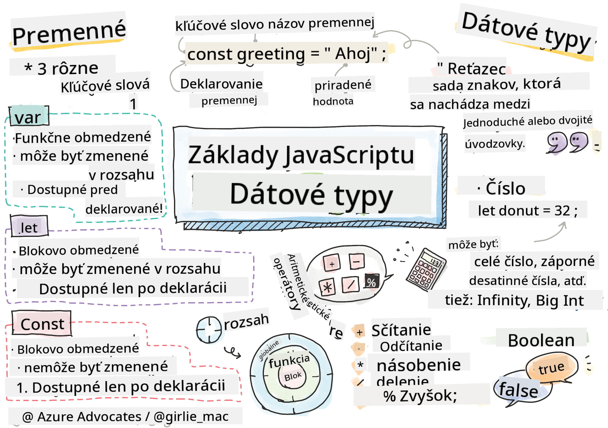

<!--
CO_OP_TRANSLATOR_METADATA:
{
  "original_hash": "fc6aef8ecfdd5b0ad2afa6e6ba52bfde",
  "translation_date": "2025-08-27T23:53:40+00:00",
  "source_file": "2-js-basics/1-data-types/README.md",
  "language_code": "sk"
}
-->
# Základy JavaScriptu: Dátové typy

  
> Sketchnote od [Tomomi Imura](https://twitter.com/girlie_mac)

## Kvíz pred prednáškou  
[Kvíz pred prednáškou](https://ashy-river-0debb7803.1.azurestaticapps.net/quiz/7)

Táto lekcia pokrýva základy JavaScriptu, jazyka, ktorý poskytuje interaktivitu na webe.

> Túto lekciu si môžete prejsť na [Microsoft Learn](https://docs.microsoft.com/learn/modules/web-development-101-variables/?WT.mc_id=academic-77807-sagibbon)!

[](https://youtube.com/watch?v=JNIXfGiDWM8 "Premenné v JavaScripte")

[](https://youtube.com/watch?v=AWfA95eLdq8 "Dátové typy v JavaScripte")

> 🎥 Kliknite na obrázky vyššie pre videá o premenných a dátových typoch

Začnime s premennými a dátovými typmi, ktoré ich napĺňajú!

## Premenné

Premenné ukladajú hodnoty, ktoré môžu byť použité a zmenené v priebehu vášho kódu.

Vytvorenie a **deklarácia** premennej má nasledujúcu syntax **[kľúčové slovo] [názov]**. Skladá sa z dvoch častí:

- **Kľúčové slovo**. Kľúčové slová môžu byť `let` alebo `var`.  

✅ Kľúčové slovo `let` bolo zavedené v ES6 a poskytuje premenným tzv. _blokový rozsah_. Odporúča sa používať `let` namiesto `var`. Blokové rozsahy si podrobnejšie vysvetlíme v ďalších častiach.
- **Názov premennej**, ktorý si sami zvolíte.

### Úloha - práca s premennými

1. **Deklarujte premennú**. Deklarujme premennú pomocou kľúčového slova `let`:

    ```javascript
    let myVariable;
    ```

   `myVariable` bola teraz deklarovaná pomocou kľúčového slova `let`. Momentálne nemá žiadnu hodnotu.

1. **Priraďte hodnotu**. Uložte hodnotu do premennej pomocou operátora `=`, za ktorým nasleduje očakávaná hodnota.

    ```javascript
    myVariable = 123;
    ```

   > Poznámka: použitie `=` v tejto lekcii znamená, že používame "priraďovací operátor", ktorý slúži na nastavenie hodnoty premennej. Neznamená rovnosť.

   `myVariable` bola teraz *inicializovaná* s hodnotou 123.

1. **Refaktorujte**. Nahraďte svoj kód nasledujúcim príkazom.

    ```javascript
    let myVariable = 123;
    ```

    Vyššie uvedené sa nazýva _explicitná inicializácia_, keď je premenná deklarovaná a zároveň jej je priradená hodnota.

1. **Zmeňte hodnotu premennej**. Zmeňte hodnotu premennej nasledujúcim spôsobom:

   ```javascript
   myVariable = 321;
   ```

   Po deklarovaní premennej môžete jej hodnotu kedykoľvek v kóde zmeniť pomocou operátora `=` a novej hodnoty.

   ✅ Vyskúšajte to! Môžete písať JavaScript priamo vo svojom prehliadači. Otvorte okno prehliadača a prejdite do Nástrojov pre vývojárov. V konzole nájdete výzvu; napíšte `let myVariable = 123`, stlačte Enter a potom napíšte `myVariable`. Čo sa stane? Poznámka: o týchto konceptoch sa dozviete viac v ďalších lekciách.

## Konštanty

Deklarácia a inicializácia konštanty nasleduje rovnaké koncepty ako premenná, s výnimkou použitia kľúčového slova `const`. Konštanty sa zvyčajne deklarujú veľkými písmenami.

```javascript
const MY_VARIABLE = 123;
```

Konštanty sú podobné premenným, s dvoma výnimkami:

- **Musí mať hodnotu**. Konštanty musia byť inicializované, inak pri spustení kódu dôjde k chybe.
- **Referenciu nie je možné zmeniť**. Referenciu konštanty nie je možné zmeniť po jej inicializácii, inak dôjde k chybe pri spustení kódu. Pozrime sa na dva príklady:
   - **Jednoduchá hodnota**. Nasledujúce NIE je povolené:
   
      ```javascript
      const PI = 3;
      PI = 4; // not allowed
      ```
 
   - **Referenciu objektu nie je možné zmeniť**. Nasledujúce NIE je povolené.
   
      ```javascript
      const obj = { a: 3 };
      obj = { b: 5 } // not allowed
      ```

    - **Hodnotu objektu je možné zmeniť**. Nasledujúce JE povolené:
    
      ```javascript
      const obj = { a: 3 };
      obj.a = 5;  // allowed
      ```

      Vyššie meníte hodnotu objektu, ale nie samotnú referenciu, čo je povolené.

   > Poznámka: `const` znamená, že referencia je chránená pred priradením. Hodnota však nie je _nemenná_ a môže sa zmeniť, najmä ak ide o zložitú štruktúru, ako je objekt.

## Dátové typy

Premenné môžu ukladať rôzne typy hodnôt, ako sú čísla a text. Tieto rôzne typy hodnôt sú známe ako **dátové typy**. Dátové typy sú dôležitou súčasťou vývoja softvéru, pretože pomáhajú vývojárom rozhodovať sa, ako by mal byť kód napísaný a ako by mal softvér fungovať. Navyše, niektoré dátové typy majú jedinečné vlastnosti, ktoré pomáhajú transformovať alebo extrahovať ďalšie informácie z hodnoty.

✅ Dátové typy sa tiež označujú ako primitíva JavaScriptu, pretože sú to najnižšie úrovne dátových typov poskytovaných jazykom. Existuje 7 primitívnych dátových typov: string, number, bigint, boolean, undefined, null a symbol. Skúste si predstaviť, čo každý z týchto primitív predstavuje. Čo je `zebra`? A čo `0`? `true`?

### Čísla

V predchádzajúcej časti bola hodnota `myVariable` dátového typu číslo.

`let myVariable = 123;`

Premenné môžu ukladať všetky typy čísel, vrátane desatinných alebo záporných čísel. Čísla môžu byť tiež použité s aritmetickými operátormi, ktoré sú pokryté v [nasledujúcej časti](../../../../2-js-basics/1-data-types).

### Aritmetické operátory

Existuje niekoľko typov operátorov na vykonávanie aritmetických funkcií, niektoré sú uvedené nižšie:

| Symbol | Popis                                                                  | Príklad                          |
| ------ | ---------------------------------------------------------------------- | -------------------------------- |
| `+`    | **Sčítanie**: Vypočíta súčet dvoch čísel                               | `1 + 2 //očakávaný výsledok je 3`   |
| `-`    | **Odčítanie**: Vypočíta rozdiel dvoch čísel                            | `1 - 2 //očakávaný výsledok je -1`  |
| `*`    | **Násobenie**: Vypočíta súčin dvoch čísel                              | `1 * 2 //očakávaný výsledok je 2`   |
| `/`    | **Delenie**: Vypočíta podiel dvoch čísel                               | `1 / 2 //očakávaný výsledok je 0.5` |
| `%`    | **Zvyšok**: Vypočíta zvyšok z delenia dvoch čísel                      | `1 % 2 //očakávaný výsledok je 1`   |

✅ Vyskúšajte to! Skúste aritmetickú operáciu v konzole vášho prehliadača. Prekvapili vás výsledky?

### Reťazce

Reťazce sú sady znakov, ktoré sa nachádzajú medzi jednoduchými alebo dvojitými úvodzovkami.

- `'Toto je reťazec'`
- `"Toto je tiež reťazec"`
- `let myString = 'Toto je hodnota reťazca uložená v premennej';`

Pamätajte, že pri písaní reťazca musíte použiť úvodzovky, inak JavaScript predpokladá, že ide o názov premennej.

### Formátovanie reťazcov

Reťazce sú textové a občas budú vyžadovať formátovanie.

Na **zreťazenie** dvoch alebo viacerých reťazcov, teda ich spojenie, použite operátor `+`.

```javascript
let myString1 = "Hello";
let myString2 = "World";

myString1 + myString2 + "!"; //HelloWorld!
myString1 + " " + myString2 + "!"; //Hello World!
myString1 + ", " + myString2 + "!"; //Hello, World!

```

✅ Prečo v JavaScripte `1 + 1 = 2`, ale `'1' + '1' = 11`? Zamyslite sa nad tým. A čo `'1' + 1`?

**Šablónové literály** sú ďalším spôsobom formátovania reťazcov, okrem úvodzoviek sa však používa spätný apostrof. Čokoľvek, čo nie je obyčajný text, musí byť umiestnené do zátvoriek `${ }`. To zahŕňa akékoľvek premenné, ktoré môžu byť reťazcami.

```javascript
let myString1 = "Hello";
let myString2 = "World";

`${myString1} ${myString2}!` //Hello World!
`${myString1}, ${myString2}!` //Hello, World!
```

Svoje formátovacie ciele môžete dosiahnuť ktoroukoľvek metódou, ale šablónové literály budú rešpektovať akékoľvek medzery a zalomenia riadkov.

✅ Kedy by ste použili šablónový literál namiesto obyčajného reťazca?

### Booleovské hodnoty

Booleovské hodnoty môžu byť iba dve: `true` alebo `false`. Booleovské hodnoty môžu pomôcť rozhodnúť, ktoré riadky kódu by sa mali spustiť, keď sú splnené určité podmienky. V mnohých prípadoch [operátory](../../../../2-js-basics/1-data-types) pomáhajú nastaviť hodnotu booleovskej premennej a často si všimnete a napíšete premenné, ktoré sú inicializované alebo ich hodnoty aktualizované pomocou operátora.

- `let myTrueBool = true`
- `let myFalseBool = false`

✅ Premenná môže byť považovaná za 'pravdivú', ak sa vyhodnotí ako booleovská hodnota `true`. Zaujímavé je, že v JavaScripte sú [všetky hodnoty pravdivé, pokiaľ nie sú definované ako nepravdivé](https://developer.mozilla.org/docs/Glossary/Truthy).

---

## 🚀 Výzva

JavaScript je známy svojimi prekvapivými spôsobmi, ako občas zaobchádza s dátovými typmi. Urobte si malý prieskum o týchto 'nástrahách'. Napríklad: citlivosť na veľké a malé písmená vás môže prekvapiť! Skúste toto vo svojej konzole: `let age = 1; let Age = 2; age == Age` (výsledok je `false` -- prečo?). Aké ďalšie nástrahy nájdete?

## Kvíz po prednáške  
[Kvíz po prednáške](https://ashy-river-0debb7803.1.azurestaticapps.net/quiz/8)

## Prehľad a samoštúdium

Pozrite si [tento zoznam cvičení v JavaScripte](https://css-tricks.com/snippets/javascript/) a vyskúšajte jedno. Čo ste sa naučili?

## Zadanie

[Cvičenie na dátové typy](assignment.md)

---

**Upozornenie**:  
Tento dokument bol preložený pomocou služby AI prekladu [Co-op Translator](https://github.com/Azure/co-op-translator). Hoci sa snažíme o presnosť, prosím, berte na vedomie, že automatizované preklady môžu obsahovať chyby alebo nepresnosti. Pôvodný dokument v jeho rodnom jazyku by mal byť považovaný za autoritatívny zdroj. Pre kritické informácie sa odporúča profesionálny ľudský preklad. Nie sme zodpovední za žiadne nedorozumenia alebo nesprávne interpretácie vyplývajúce z použitia tohto prekladu.