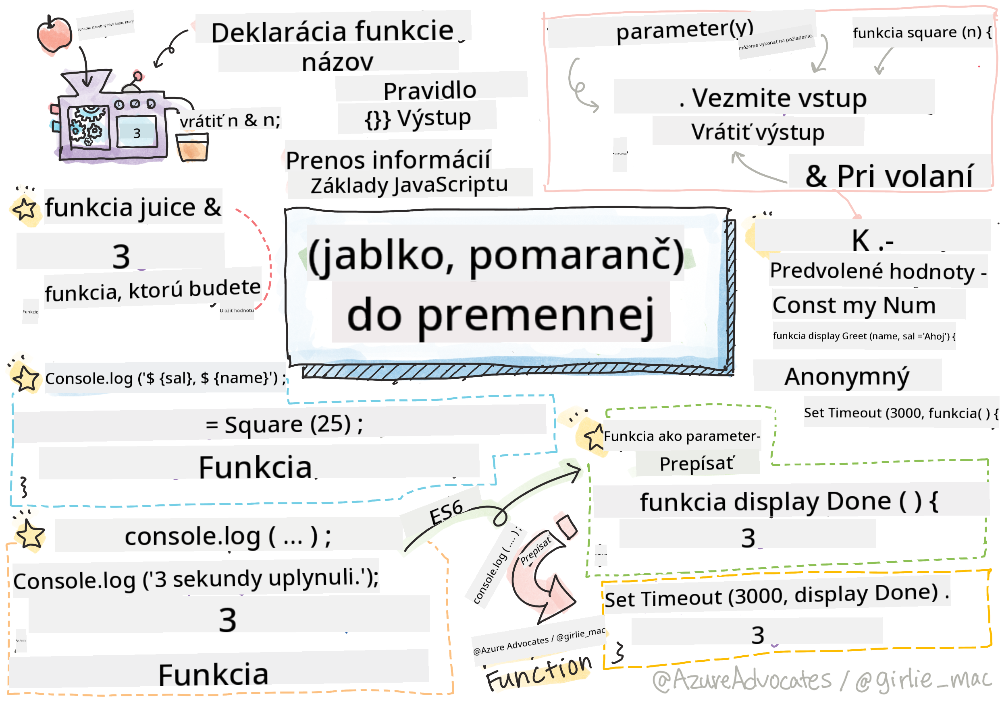

<!--
CO_OP_TRANSLATOR_METADATA:
{
  "original_hash": "b4612bbb9ace984f374fcc80e3e035ad",
  "translation_date": "2025-08-27T23:50:24+00:00",
  "source_file": "2-js-basics/2-functions-methods/README.md",
  "language_code": "sk"
}
-->
# Základy JavaScriptu: Metódy a funkcie


> Sketchnote od [Tomomi Imura](https://twitter.com/girlie_mac)

## Kvíz pred prednáškou
[Kvíz pred prednáškou](https://ashy-river-0debb7803.1.azurestaticapps.net/quiz/9)

Keď premýšľame o písaní kódu, vždy chceme zabezpečiť, aby bol náš kód čitateľný. Aj keď to môže znieť protichodne, kód sa číta oveľa častejšie, než sa píše. Jedným z hlavných nástrojov v arzenáli vývojára na zabezpečenie udržateľného kódu je **funkcia**.

[](https://youtube.com/watch?v=XgKsD6Zwvlc "Metódy a funkcie")

> 🎥 Kliknite na obrázok vyššie pre video o metódach a funkciách.

> Túto lekciu si môžete prejsť na [Microsoft Learn](https://docs.microsoft.com/learn/modules/web-development-101-functions/?WT.mc_id=academic-77807-sagibbon)!

## Funkcie

V jadre je funkcia blok kódu, ktorý môžeme vykonať na požiadanie. To je ideálne pre situácie, keď potrebujeme vykonať rovnakú úlohu viackrát; namiesto duplicity logiky na viacerých miestach (čo by bolo ťažké aktualizovať, keď príde čas), ju môžeme centralizovať na jednom mieste a zavolať ju vždy, keď potrebujeme vykonať operáciu - funkcie môžete dokonca volať z iných funkcií!

Rovnako dôležité je schopnosť pomenovať funkciu. Aj keď sa to môže zdať triviálne, názov poskytuje rýchly spôsob dokumentovania časti kódu. Môžete si to predstaviť ako štítok na tlačidle. Ak kliknem na tlačidlo s nápisom "Zrušiť časovač", viem, že zastaví beh hodín.

## Vytvorenie a volanie funkcie

Syntax funkcie vyzerá nasledovne:

```javascript
function nameOfFunction() { // function definition
 // function definition/body
}
```

Ak by som chcel vytvoriť funkciu na zobrazenie pozdravu, mohla by vyzerať takto:

```javascript
function displayGreeting() {
  console.log('Hello, world!');
}
```

Kedykoľvek chceme zavolať (alebo spustiť) našu funkciu, použijeme názov funkcie nasledovaný `()`. Stojí za zmienku, že naša funkcia môže byť definovaná pred alebo po tom, ako sa rozhodneme ju zavolať; JavaScriptový kompilátor ju nájde za nás.

```javascript
// calling our function
displayGreeting();
```

> **NOTE:** Existuje špeciálny typ funkcie známy ako **metóda**, ktorú ste už používali! V skutočnosti sme to videli v našej ukážke vyššie, keď sme použili `console.log`. Čo odlišuje metódu od funkcie je to, že metóda je pripojená k objektu (`console` v našom príklade), zatiaľ čo funkcia je voľne plávajúca. Mnoho vývojárov používa tieto pojmy zameniteľne.

### Najlepšie praktiky pri funkciách

Existuje niekoľko najlepších praktík, ktoré treba mať na pamäti pri vytváraní funkcií:

- Ako vždy, používajte popisné názvy, aby ste vedeli, čo funkcia robí
- Používajte **camelCasing** na kombinovanie slov
- Udržujte svoje funkcie zamerané na konkrétnu úlohu

## Prenos informácií do funkcie

Aby bola funkcia viac použiteľná, často budete chcieť do nej preniesť informácie. Ak vezmeme do úvahy náš príklad `displayGreeting` vyššie, zobrazí iba **Hello, world!**. Nie je to najužitočnejšia funkcia, ktorú by ste mohli vytvoriť. Ak ju chceme urobiť trochu flexibilnejšou, napríklad umožniť niekomu špecifikovať meno osoby, ktorú chceme pozdraviť, môžeme pridať **parameter**. Parameter (niekedy nazývaný aj **argument**) je dodatočná informácia odoslaná do funkcie.

Parametre sú uvedené v časti definície v zátvorkách a sú oddelené čiarkami, ako napríklad:

```javascript
function name(param, param2, param3) {

}
```

Môžeme aktualizovať našu funkciu `displayGreeting`, aby prijímala meno a zobrazila ho.

```javascript
function displayGreeting(name) {
  const message = `Hello, ${name}!`;
  console.log(message);
}
```

Keď chceme zavolať našu funkciu a preniesť parameter, špecifikujeme ho v zátvorkách.

```javascript
displayGreeting('Christopher');
// displays "Hello, Christopher!" when run
```

## Predvolené hodnoty

Môžeme našu funkciu urobiť ešte flexibilnejšou pridaním viacerých parametrov. Ale čo ak nechceme vyžadovať, aby bola každá hodnota špecifikovaná? Ak zostaneme pri našom príklade pozdravu, meno môže byť povinné (potrebujeme vedieť, koho pozdravujeme), ale chceme umožniť, aby bol samotný pozdrav prispôsobený podľa potreby. Ak niekto nechce prispôsobiť pozdrav, poskytneme predvolenú hodnotu. Na poskytnutie predvolenej hodnoty parametru ju nastavíme podobne ako hodnotu pre premennú - `parameterName = 'defaultValue'`. Kompletný príklad:

```javascript
function displayGreeting(name, salutation='Hello') {
  console.log(`${salutation}, ${name}`);
}
```

Keď voláme funkciu, môžeme sa rozhodnúť, či chceme nastaviť hodnotu pre `salutation`.

```javascript
displayGreeting('Christopher');
// displays "Hello, Christopher"

displayGreeting('Christopher', 'Hi');
// displays "Hi, Christopher"
```

## Návratové hodnoty

Doteraz funkcia, ktorú sme vytvorili, vždy vypíše výsledok do [konzoly](https://developer.mozilla.org/docs/Web/API/console). Niekedy to môže byť presne to, čo hľadáme, najmä keď vytvárame funkcie, ktoré budú volať iné služby. Ale čo ak chcem vytvoriť pomocnú funkciu na vykonanie výpočtu a poskytnúť hodnotu späť, aby som ju mohol použiť inde?

Môžeme to urobiť pomocou **návratovej hodnoty**. Návratová hodnota je vrátená funkciou a môže byť uložená do premennej rovnako ako by sme mohli uložiť literálnu hodnotu, napríklad reťazec alebo číslo.

Ak funkcia niečo vracia, použije sa kľúčové slovo `return`. Kľúčové slovo `return` očakáva hodnotu alebo referenciu toho, čo sa vracia, ako napríklad:

```javascript
return myVariable;
```  

Môžeme vytvoriť funkciu na vytvorenie správy pozdravu a vrátiť hodnotu späť volajúcemu.

```javascript
function createGreetingMessage(name) {
  const message = `Hello, ${name}`;
  return message;
}
```

Keď voláme túto funkciu, uložíme hodnotu do premennej. Je to veľmi podobné tomu, ako by sme nastavili premennú na statickú hodnotu (napríklad `const name = 'Christopher'`).

```javascript
const greetingMessage = createGreetingMessage('Christopher');
```

## Funkcie ako parametre pre funkcie

Ako budete napredovať vo svojej programátorskej kariére, narazíte na funkcie, ktoré prijímajú funkcie ako parametre. Tento šikovný trik sa často používa, keď nevieme, kedy sa niečo stane alebo dokončí, ale vieme, že potrebujeme vykonať operáciu ako odpoveď.

Ako príklad si vezmite [setTimeout](https://developer.mozilla.org/docs/Web/API/WindowOrWorkerGlobalScope/setTimeout), ktorý spustí časovač a vykoná kód, keď sa dokončí. Musíme mu povedať, aký kód chceme vykonať. Znie to ako ideálna práca pre funkciu!

Ak spustíte kód nižšie, po 3 sekundách uvidíte správu **3 sekundy uplynuli**.

```javascript
function displayDone() {
  console.log('3 seconds has elapsed');
}
// timer value is in milliseconds
setTimeout(displayDone, 3000);
```

### Anonymné funkcie

Pozrime sa ešte raz na to, čo sme vytvorili. Vytvárame funkciu s názvom, ktorá bude použitá iba raz. Ako sa naša aplikácia stáva zložitejšou, môžeme si predstaviť, že vytvárame veľa funkcií, ktoré budú volané iba raz. To nie je ideálne. Ako sa ukazuje, nemusíme vždy poskytovať názov!

Keď odovzdávame funkciu ako parameter, môžeme obísť jej vytvorenie vopred a namiesto toho ju vytvoriť ako súčasť parametra. Používame rovnaké kľúčové slovo `function`, ale namiesto toho ju vytvoríme ako parameter.

Prepíšme kód vyššie tak, aby používal anonymnú funkciu:

```javascript
setTimeout(function() {
  console.log('3 seconds has elapsed');
}, 3000);
```

Ak spustíte náš nový kód, všimnete si, že dostaneme rovnaké výsledky. Vytvorili sme funkciu, ale nemuseli sme jej dať názov!

### Fat arrow funkcie

Jednou skratkou, ktorá je bežná v mnohých programovacích jazykoch (vrátane JavaScriptu), je schopnosť používať tzv. **arrow** alebo **fat arrow** funkcie. Používa špeciálny indikátor `=>`, ktorý vyzerá ako šípka - odtiaľ názov! Použitím `=>` môžeme preskočiť kľúčové slovo `function`.

Prepíšme náš kód ešte raz, aby používal fat arrow funkciu:

```javascript
setTimeout(() => {
  console.log('3 seconds has elapsed');
}, 3000);
```

### Kedy použiť každú stratégiu

Teraz ste videli, že máme tri spôsoby, ako odovzdať funkciu ako parameter, a možno sa pýtate, kedy použiť každý. Ak viete, že budete funkciu používať viackrát, vytvorte ju normálne. Ak ju budete používať iba na jednom mieste, je všeobecne najlepšie použiť anonymnú funkciu. Či už použijete fat arrow funkciu alebo tradičnú syntax `function`, je na vás, ale všimnete si, že väčšina moderných vývojárov preferuje `=>`.

---

## 🚀 Výzva

Dokážete jednou vetou vysvetliť rozdiel medzi funkciami a metódami? Skúste to!

## Kvíz po prednáške
[Kvíz po prednáške](https://ashy-river-0debb7803.1.azurestaticapps.net/quiz/10)

## Prehľad a samostatné štúdium

Stojí za to [prečítať si trochu viac o arrow funkciách](https://developer.mozilla.org/docs/Web/JavaScript/Reference/Functions/Arrow_functions), pretože sú čoraz viac používané v kódoch. Precvičte si písanie funkcie a potom ju prepíšte pomocou tejto syntaxe.

## Zadanie

[Zábava s funkciami](assignment.md)

---

**Upozornenie**:  
Tento dokument bol preložený pomocou služby AI prekladu [Co-op Translator](https://github.com/Azure/co-op-translator). Hoci sa snažíme o presnosť, prosím, berte na vedomie, že automatizované preklady môžu obsahovať chyby alebo nepresnosti. Pôvodný dokument v jeho rodnom jazyku by mal byť považovaný za autoritatívny zdroj. Pre kritické informácie sa odporúča profesionálny ľudský preklad. Nie sme zodpovední za akékoľvek nedorozumenia alebo nesprávne interpretácie vyplývajúce z použitia tohto prekladu.