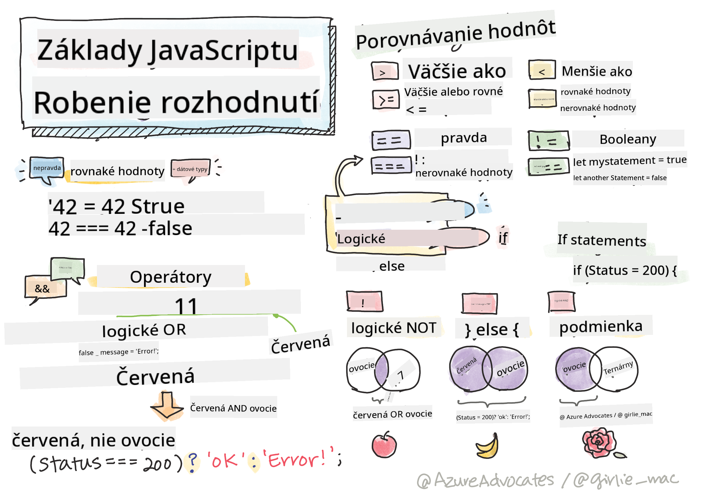

<!--
CO_OP_TRANSLATOR_METADATA:
{
  "original_hash": "888609c48329c280ca2477d2df40f2e5",
  "translation_date": "2025-08-27T23:52:10+00:00",
  "source_file": "2-js-basics/3-making-decisions/README.md",
  "language_code": "sk"
}
-->
# Základy JavaScriptu: Rozhodovanie



> Sketchnote od [Tomomi Imura](https://twitter.com/girlie_mac)

## Kvíz pred prednáškou

[Kvíz pred prednáškou](https://ashy-river-0debb7803.1.azurestaticapps.net/quiz/11)

Rozhodovanie a kontrola poradia, v akom váš kód beží, robí váš kód opakovane použiteľným a robustným. Táto sekcia pokrýva syntax na kontrolu toku dát v JavaScripte a jeho význam pri použití s dátovými typmi Boolean.

[](https://youtube.com/watch?v=SxTp8j-fMMY "Rozhodovanie")

> 🎥 Kliknite na obrázok vyššie pre video o rozhodovaní.

> Túto lekciu si môžete prejsť na [Microsoft Learn](https://docs.microsoft.com/learn/modules/web-development-101-if-else/?WT.mc_id=academic-77807-sagibbon)!

## Stručné opakovanie o Booleans

Booleans môžu mať iba dve hodnoty: `true` alebo `false`. Booleans pomáhajú rozhodovať, ktoré riadky kódu by sa mali spustiť, keď sú splnené určité podmienky.

Nastavte svoj boolean na hodnotu true alebo false takto:

`let myTrueBool = true`  
`let myFalseBool = false`

✅ Booleans sú pomenované po anglickom matematikovi, filozofovi a logikovi Georgeovi Boolovi (1815–1864).

## Porovnávacie operátory a Booleans

Operátory sa používajú na vyhodnocovanie podmienok porovnávaním, ktoré vytvoria hodnotu Boolean. Nasleduje zoznam často používaných operátorov.

| Symbol | Popis                                                                                                                                                        | Príklad            |
| ------ | ------------------------------------------------------------------------------------------------------------------------------------------------------------ | ------------------ |
| `<`    | **Menej ako**: Porovnáva dve hodnoty a vráti hodnotu Boolean `true`, ak je hodnota na ľavej strane menšia ako na pravej                                       | `5 < 6 // true`    |
| `<=`   | **Menej alebo rovné**: Porovnáva dve hodnoty a vráti hodnotu Boolean `true`, ak je hodnota na ľavej strane menšia alebo rovná ako na pravej                  | `5 <= 6 // true`   |
| `>`    | **Väčšie ako**: Porovnáva dve hodnoty a vráti hodnotu Boolean `true`, ak je hodnota na ľavej strane väčšia ako na pravej                                      | `5 > 6 // false`   |
| `>=`   | **Väčšie alebo rovné**: Porovnáva dve hodnoty a vráti hodnotu Boolean `true`, ak je hodnota na ľavej strane väčšia alebo rovná ako na pravej                 | `5 >= 6 // false`  |
| `===`  | **Striktná rovnosť**: Porovnáva dve hodnoty a vráti hodnotu Boolean `true`, ak sú hodnoty na pravej a ľavej strane rovnaké A sú rovnakého dátového typu       | `5 === 6 // false` |
| `!==`  | **Nerovnosť**: Porovnáva dve hodnoty a vráti opačnú hodnotu Boolean, než by vrátil operátor striktná rovnosť                                                 | `5 !== 6 // true`  |

✅ Otestujte svoje znalosti napísaním niekoľkých porovnaní v konzole vášho prehliadača. Prekvapili vás niektoré vrátené hodnoty?

## If Statement

Príkaz if spustí kód medzi svojimi blokmi, ak je podmienka pravdivá.

```javascript
if (condition) {
  //Condition is true. Code in this block will run.
}
```

Logické operátory sa často používajú na vytvorenie podmienky.

```javascript
let currentMoney;
let laptopPrice;

if (currentMoney >= laptopPrice) {
  //Condition is true. Code in this block will run.
  console.log("Getting a new laptop!");
}
```

## If..Else Statement

Príkaz `else` spustí kód medzi svojimi blokmi, keď je podmienka nepravdivá. Je voliteľný pri príkaze `if`.

```javascript
let currentMoney;
let laptopPrice;

if (currentMoney >= laptopPrice) {
  //Condition is true. Code in this block will run.
  console.log("Getting a new laptop!");
} else {
  //Condition is false. Code in this block will run.
  console.log("Can't afford a new laptop, yet!");
}
```

✅ Otestujte svoje pochopenie tohto kódu a nasledujúceho kódu jeho spustením v konzole prehliadača. Zmeňte hodnoty premenných currentMoney a laptopPrice, aby ste zmenili vrátený `console.log()`.

## Switch Statement

Príkaz `switch` sa používa na vykonanie rôznych akcií na základe rôznych podmienok. Použite príkaz `switch` na výber jedného z mnohých blokov kódu, ktoré sa majú vykonať.

```javascript
switch (expression) {
  case x:
    // code block
    break;
  case y:
    // code block
    break;
  default:
  // code block
}
```

```javascript
// program using switch statement
let a = 2;

switch (a) {
  case 1:
    a = "one";
    break;
  case 2:
    a = "two";
    break;
  default:
    a = "not found";
    break;
}
console.log(`The value is ${a}`);
```

✅ Otestujte svoje pochopenie tohto kódu a nasledujúceho kódu jeho spustením v konzole prehliadača. Zmeňte hodnoty premennej a, aby ste zmenili vrátený `console.log()`.

## Logické operátory a Booleans

Rozhodnutia môžu vyžadovať viac ako jedno porovnanie a môžu byť spojené logickými operátormi na vytvorenie hodnoty Boolean.

| Symbol | Popis                                                                                     | Príklad                                                                 |
| ------ | ----------------------------------------------------------------------------------------- | ----------------------------------------------------------------------- |
| `&&`   | **Logické AND**: Porovnáva dva Boolean výrazy. Vráti true **iba** ak sú obe strany pravdivé | `(5 > 6) && (5 < 6 ) //Jedna strana je nepravdivá, druhá je pravdivá. Vráti false` |
| `\|\|` | **Logické OR**: Porovnáva dva Boolean výrazy. Vráti true, ak je aspoň jedna strana pravdivá | `(5 > 6) \|\| (5 < 6) //Jedna strana je nepravdivá, druhá je pravdivá. Vráti true` |
| `!`    | **Logické NOT**: Vráti opačnú hodnotu Boolean výrazu                                     | `!(5 > 6) // 5 nie je väčšie ako 6, ale "!" vráti true`                 |

## Podmienky a rozhodnutia s logickými operátormi

Logické operátory môžu byť použité na vytvorenie podmienok v príkazoch if..else.

```javascript
let currentMoney;
let laptopPrice;
let laptopDiscountPrice = laptopPrice - laptopPrice * 0.2; //Laptop price at 20 percent off

if (currentMoney >= laptopPrice || currentMoney >= laptopDiscountPrice) {
  //Condition is true. Code in this block will run.
  console.log("Getting a new laptop!");
} else {
  //Condition is true. Code in this block will run.
  console.log("Can't afford a new laptop, yet!");
}
```

### Operátor negácie

Doteraz ste videli, ako môžete použiť príkaz `if...else` na vytvorenie podmienkovej logiky. Čokoľvek, čo ide do `if`, musí byť vyhodnotené ako true/false. Použitím operátora `!` môžete _negovať_ výraz. Vyzeralo by to takto:

```javascript
if (!condition) {
  // runs if condition is false
} else {
  // runs if condition is true
}
```

### Ternárne výrazy

`if...else` nie je jediný spôsob, ako vyjadriť rozhodovaciu logiku. Môžete tiež použiť niečo, čo sa nazýva ternárny operátor. Syntax preň vyzerá takto:

```javascript
let variable = condition ? <return this if true> : <return this if false>
```

Nižšie je konkrétnejší príklad:

```javascript
let firstNumber = 20;
let secondNumber = 10;
let biggestNumber = firstNumber > secondNumber ? firstNumber : secondNumber;
```

✅ Venujte chvíľu čítaniu tohto kódu niekoľkokrát. Rozumiete tomu, ako tieto operátory fungujú?

Vyššie uvedené hovorí, že:

- ak je `firstNumber` väčšie ako `secondNumber`
- potom priraďte `firstNumber` k `biggestNumber`
- inak priraďte `secondNumber`.

Ternárny výraz je len kompaktný spôsob, ako napísať kód nižšie:

```javascript
let biggestNumber;
if (firstNumber > secondNumber) {
  biggestNumber = firstNumber;
} else {
  biggestNumber = secondNumber;
}
```

---

## 🚀 Výzva

Vytvorte program, ktorý je najprv napísaný s logickými operátormi, a potom ho prepíšte pomocou ternárneho výrazu. Aká syntax vám vyhovuje viac?

---

## Kvíz po prednáške

[Kvíz po prednáške](https://ashy-river-0debb7803.1.azurestaticapps.net/quiz/12)

## Opakovanie a samostatné štúdium

Prečítajte si viac o mnohých operátoroch dostupných používateľovi [na MDN](https://developer.mozilla.org/docs/Web/JavaScript/Reference/Operators).

Prejdite si skvelý [prehľad operátorov](https://joshwcomeau.com/operator-lookup/) od Josha Comeaua!

## Zadanie

[Operátory](assignment.md)

---

**Upozornenie**:  
Tento dokument bol preložený pomocou služby AI prekladu [Co-op Translator](https://github.com/Azure/co-op-translator). Aj keď sa snažíme o presnosť, prosím, berte na vedomie, že automatizované preklady môžu obsahovať chyby alebo nepresnosti. Pôvodný dokument v jeho pôvodnom jazyku by mal byť považovaný za autoritatívny zdroj. Pre kritické informácie sa odporúča profesionálny ľudský preklad. Nie sme zodpovední za akékoľvek nedorozumenia alebo nesprávne interpretácie vyplývajúce z použitia tohto prekladu.