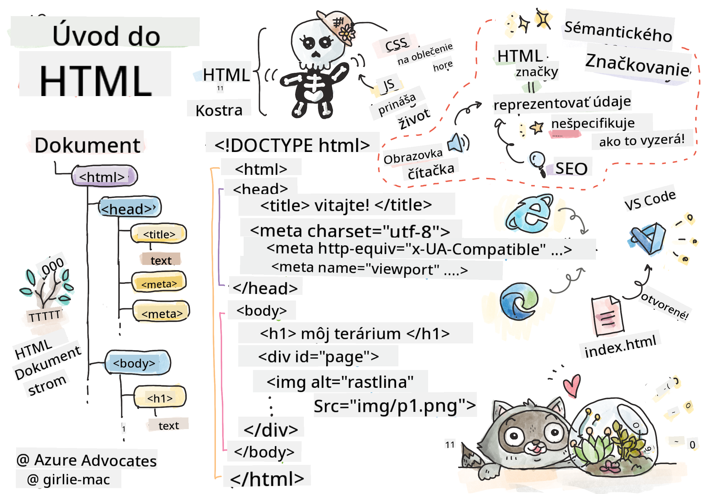
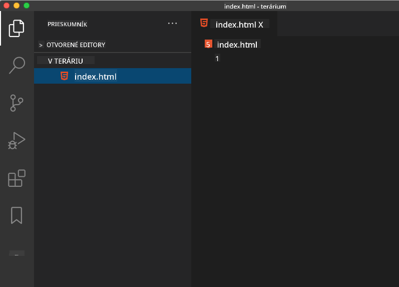

<!--
CO_OP_TRANSLATOR_METADATA:
{
  "original_hash": "46a0639e719b9cf1dfd062aa24cad639",
  "translation_date": "2025-08-27T23:59:29+00:00",
  "source_file": "3-terrarium/1-intro-to-html/README.md",
  "language_code": "sk"
}
-->
# Projekt Terrárium Časť 1: Úvod do HTML


> Sketchnote od [Tomomi Imura](https://twitter.com/girlie_mac)

## Kvíz pred prednáškou

[Kvíz pred prednáškou](https://ashy-river-0debb7803.1.azurestaticapps.net/quiz/15)

> Pozrite si video

> 
> [](https://www.youtube.com/watch?v=1TvxJKBzhyQ)

### Úvod

HTML, alebo HyperText Markup Language, je „kostra“ webu. Ak CSS „obliekne“ váš HTML a JavaScript ho oživí, HTML je telom vašej webovej aplikácie. Syntax HTML dokonca odráža túto myšlienku, pretože obsahuje značky „head“, „body“ a „footer“.

V tejto lekcii použijeme HTML na rozloženie „kostry“ rozhrania nášho virtuálneho terária. Bude mať názov a tri stĺpce: pravý a ľavý stĺpec, kde budú umiestnené rastliny, ktoré je možné presúvať, a strednú oblasť, ktorá bude skutočným skleneným teráriom. Na konci tejto lekcie budete môcť vidieť rastliny v stĺpcoch, ale rozhranie bude vyzerať trochu zvláštne; nebojte sa, v ďalšej časti pridáte CSS štýly, aby rozhranie vyzeralo lepšie.

### Úloha

Na svojom počítači vytvorte priečinok s názvom 'terrarium' a v ňom súbor s názvom 'index.html'. Môžete to urobiť vo Visual Studio Code po vytvorení priečinka terrarium tak, že otvoríte nové okno VS Code, kliknete na 'open folder' a prejdete do svojho nového priečinka. Kliknite na malé tlačidlo 'file' v paneli Explorer a vytvorte nový súbor:



Alebo

Použite tieto príkazy vo svojom git bash:
* `mkdir terrarium`
* `cd terrarium`
* `touch index.html`
* `code index.html` alebo `nano index.html`

> Súbory index.html naznačujú prehliadaču, že ide o predvolený súbor v priečinku; URL ako `https://anysite.com/test` môžu byť vytvorené pomocou štruktúry priečinkov vrátane priečinka s názvom `test` so súborom `index.html` vo vnútri; `index.html` nemusí byť viditeľný v URL.

---

## DocType a značky html

Prvý riadok HTML súboru je jeho doctype. Je trochu prekvapujúce, že tento riadok musí byť na úplnom vrchu súboru, ale hovorí starším prehliadačom, že stránka sa má vykresliť v štandardnom režime podľa aktuálnej špecifikácie HTML.

> Tip: vo VS Code môžete prejsť kurzorom na značku a získať informácie o jej použití z referenčných príručiek MDN.

Druhý riadok by mal byť otváracou značkou `<html>`, hneď za ktorou nasleduje jej zatváracia značka `</html>`. Tieto značky sú koreňovými prvkami vášho rozhrania.

### Úloha

Pridajte tieto riadky na začiatok vášho súboru `index.html`:

```HTML
<!DOCTYPE html>
<html></html>
```

✅ Existuje niekoľko rôznych režimov, ktoré je možné určiť nastavením DocType pomocou dotazovacieho reťazca: [Quirks Mode a Standards Mode](https://developer.mozilla.org/docs/Web/HTML/Quirks_Mode_and_Standards_Mode). Tieto režimy slúžili na podporu veľmi starých prehliadačov, ktoré sa dnes bežne nepoužívajú (Netscape Navigator 4 a Internet Explorer 5). Môžete sa držať štandardného vyhlásenia doctype.

---

## 'head' dokumentu

Oblasť 'head' HTML dokumentu obsahuje dôležité informácie o vašej webovej stránke, známe ako [metadata](https://developer.mozilla.org/docs/Web/HTML/Element/meta). V našom prípade serveru, na ktorý bude táto stránka odoslaná na vykreslenie, oznámime tieto štyri veci:

-   názov stránky
-   metadata stránky vrátane:
    -   'character set', ktorý informuje o tom, aké kódovanie znakov sa používa na stránke
    -   informácie o prehliadači, vrátane `x-ua-compatible`, čo naznačuje, že je podporovaný prehliadač IE=edge
    -   informácie o tom, ako by sa mal viewport správať pri načítaní. Nastavenie viewportu na počiatočnú mierku 1 kontroluje úroveň priblíženia pri prvom načítaní stránky.

### Úloha

Pridajte blok 'head' do vášho dokumentu medzi otváracie a zatváracie značky `<html>`.

```html
<head>
	<title>Welcome to my Virtual Terrarium</title>
	<meta charset="utf-8" />
	<meta http-equiv="X-UA-Compatible" content="IE=edge" />
	<meta name="viewport" content="width=device-width, initial-scale=1" />
</head>
```

✅ Čo by sa stalo, keby ste nastavili meta značku viewportu takto: `<meta name="viewport" content="width=600">`? Prečítajte si viac o [viewporte](https://developer.mozilla.org/docs/Web/HTML/Viewport_meta_tag).

---

## 'body' dokumentu

### HTML značky

V HTML pridávate značky do vášho .html súboru na vytvorenie prvkov webovej stránky. Každá značka má zvyčajne otváraciu a zatváraciu značku, napríklad: `<p>hello</p>` na označenie odseku. Vytvorte telo vášho rozhrania pridaním sady značiek `<body>` do páru značiek `<html>`; váš kód teraz vyzerá takto:

### Úloha

```html
<!DOCTYPE html>
<html>
	<head>
		<title>Welcome to my Virtual Terrarium</title>
		<meta charset="utf-8" />
		<meta http-equiv="X-UA-Compatible" content="IE=edge" />
		<meta name="viewport" content="width=device-width, initial-scale=1" />
	</head>
	<body></body>
</html>
```

Teraz môžete začať budovať svoju stránku. Zvyčajne používate značky `<div>` na vytvorenie samostatných prvkov na stránke. Vytvoríme sériu prvkov `<div>`, ktoré budú obsahovať obrázky.

### Obrázky

Jedna HTML značka, ktorá nepotrebuje zatváraciu značku, je značka ``, pretože má prvok `src`, ktorý obsahuje všetky informácie potrebné na vykreslenie položky na stránke.

Vytvorte priečinok vo vašej aplikácii s názvom `images` a do neho pridajte všetky obrázky zo [zdrojového priečinka](../../../../3-terrarium/solution/images); (je tam 14 obrázkov rastlín).

### Úloha

Pridajte tieto obrázky rastlín do dvoch stĺpcov medzi značky `<body></body>`:

```html
<div id="page">
	<div id="left-container" class="container">
		<div class="plant-holder">
			
		</div>
		<div class="plant-holder">
			
		</div>
		<div class="plant-holder">
			
		</div>
		<div class="plant-holder">
			
		</div>
		<div class="plant-holder">
			
		</div>
		<div class="plant-holder">
			
		</div>
		<div class="plant-holder">
			
		</div>
	</div>
	<div id="right-container" class="container">
		<div class="plant-holder">
			
		</div>
		<div class="plant-holder">
			
		</div>
		<div class="plant-holder">
			
		</div>
		<div class="plant-holder">
			
		</div>
		<div class="plant-holder">
			
		</div>
		<div class="plant-holder">
			
		</div>
		<div class="plant-holder">
			
		</div>
	</div>
</div>
```

> Poznámka: Spany vs. Divy. Divy sa považujú za 'blokové' prvky, zatiaľ čo Spany sú 'inline'. Čo by sa stalo, keby ste tieto divy zmenili na spany?

S týmto kódom sa rastliny teraz zobrazia na obrazovke. Vyzerá to dosť zle, pretože ešte nie sú štýlovo upravené pomocou CSS, čo urobíme v ďalšej lekcii.

Každý obrázok má alternatívny text, ktorý sa zobrazí, aj keď obrázok nemôžete vidieť alebo vykresliť. Toto je dôležitý atribút, ktorý treba zahrnúť kvôli prístupnosti. Viac o prístupnosti sa dozviete v budúcich lekciách; zatiaľ si pamätajte, že atribút alt poskytuje alternatívne informácie o obrázku, ak ho používateľ z nejakého dôvodu nemôže zobraziť (kvôli pomalému pripojeniu, chybe v atribúte src alebo ak používateľ používa čítačku obrazovky).

✅ Všimli ste si, že každý obrázok má rovnaký alt tag? Je to dobrá prax? Prečo áno alebo nie? Môžete tento kód vylepšiť?

---

## Semantické značkovanie

Vo všeobecnosti je lepšie používať zmysluplnú 'semantiku' pri písaní HTML. Čo to znamená? Znamená to, že používate HTML značky na reprezentáciu typu údajov alebo interakcie, na ktoré boli navrhnuté. Napríklad hlavný názov textu na stránke by mal používať značku `<h1>`.

Pridajte nasledujúci riadok hneď pod otváraciu značku `<body>`:

```html
<h1>My Terrarium</h1>
```

Používanie semantického značkovania, ako je napríklad použitie hlavičiek `<h1>` a neriadených zoznamov `<ul>`, pomáha čítačkám obrazovky navigovať cez stránku. Vo všeobecnosti by tlačidlá mali byť napísané ako `<button>` a zoznamy ako `<li>`. Aj keď je _možné_ používať špeciálne štýlované prvky `<span>` s obslužnými programami kliknutí na simuláciu tlačidiel, je lepšie pre používateľov so zdravotným postihnutím používať technológie na určenie, kde sa na stránke nachádza tlačidlo, a interagovať s ním, ak sa prvok zobrazuje ako tlačidlo. Z tohto dôvodu sa snažte používať semantické značkovanie čo najviac.

✅ Pozrite si čítačku obrazovky a [ako interaguje s webovou stránkou](https://www.youtube.com/watch?v=OUDV1gqs9GA). Vidíte, prečo by nesemantické značkovanie mohlo frustrovať používateľa?

## Terárium

Posledná časť tohto rozhrania zahŕňa vytvorenie značkovania, ktoré bude štýlovo upravené na vytvorenie terária.

### Úloha:

Pridajte toto značkovanie nad poslednú značku `</div>`:

```html
<div id="terrarium">
	<div class="jar-top"></div>
	<div class="jar-walls">
		<div class="jar-glossy-long"></div>
		<div class="jar-glossy-short"></div>
	</div>
	<div class="dirt"></div>
	<div class="jar-bottom"></div>
</div>
```

✅ Aj keď ste pridali toto značkovanie na obrazovku, nevidíte absolútne nič vykreslené. Prečo?

---

## 🚀Výzva

Existujú niektoré zábavné 'staršie' značky v HTML, ktoré je stále zábavné používať, aj keď by ste nemali používať zastarané značky, ako sú [tieto značky](https://developer.mozilla.org/docs/Web/HTML/Element#Obsolete_and_deprecated_elements) vo vašom značkovaní. Napriek tomu, môžete použiť starú značku `<marquee>` na to, aby sa názov h1 posúval horizontálne? (ak to urobíte, nezabudnite ju potom odstrániť)

## Kvíz po prednáške

[Kvíz po prednáške](https://ashy-river-0debb7803.1.azurestaticapps.net/quiz/16)

## Prehľad a samostatné štúdium

HTML je „osvedčený“ systém stavebných blokov, ktorý pomohol vybudovať web do podoby, akú má dnes. Naučte sa niečo o jeho histórii štúdiom starých a nových značiek. Dokážete zistiť, prečo boli niektoré značky zastarané a niektoré pridané? Aké značky by mohli byť zavedené v budúcnosti?

Viac o tvorbe stránok pre web a mobilné zariadenia sa dozviete na [Microsoft Learn](https://docs.microsoft.com/learn/modules/build-simple-website/?WT.mc_id=academic-77807-sagibbon).

## Zadanie

[Precvičte si HTML: Vytvorte maketu blogu](assignment.md)

---

**Upozornenie**:  
Tento dokument bol preložený pomocou služby AI prekladu [Co-op Translator](https://github.com/Azure/co-op-translator). Hoci sa snažíme o presnosť, prosím, berte na vedomie, že automatizované preklady môžu obsahovať chyby alebo nepresnosti. Pôvodný dokument v jeho rodnom jazyku by mal byť považovaný za autoritatívny zdroj. Pre kritické informácie sa odporúča profesionálny ľudský preklad. Nie sme zodpovední za žiadne nedorozumenia alebo nesprávne interpretácie vyplývajúce z použitia tohto prekladu.