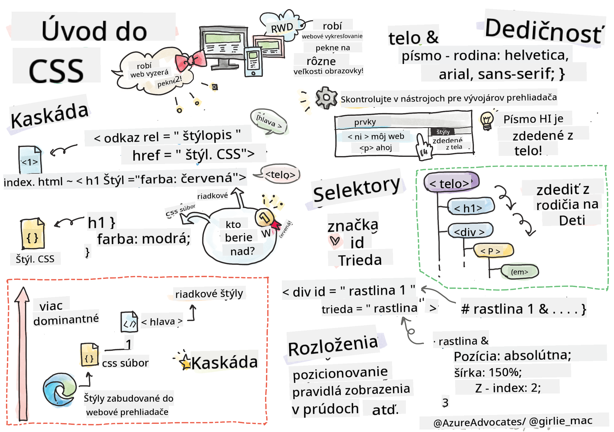
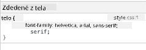
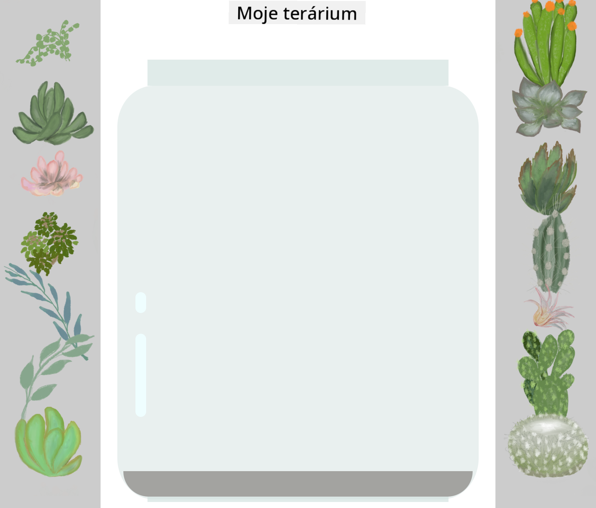

<!--
CO_OP_TRANSLATOR_METADATA:
{
  "original_hash": "e375c2aeb94e2407f2667633d39580bd",
  "translation_date": "2025-08-28T00:02:17+00:00",
  "source_file": "3-terrarium/2-intro-to-css/README.md",
  "language_code": "sk"
}
-->
# Projekt Terrárium Časť 2: Úvod do CSS


> Sketchnote od [Tomomi Imura](https://twitter.com/girlie_mac)

## Kvíz pred prednáškou

[Kvíz pred prednáškou](https://ashy-river-0debb7803.1.azurestaticapps.net/quiz/17)

### Úvod

CSS, alebo Cascading Style Sheets, rieši dôležitý problém webového vývoja: ako urobiť váš web pekným. Štýlovanie vašich aplikácií ich robí použiteľnejšími a vizuálne atraktívnejšími; CSS môžete tiež použiť na vytvorenie responzívneho webového dizajnu (RWD) – umožňujúceho vašim aplikáciám vyzerať dobre bez ohľadu na veľkosť obrazovky, na ktorej sú zobrazené. CSS nie je len o tom, aby vaša aplikácia vyzerala pekne; jeho špecifikácia zahŕňa animácie a transformácie, ktoré môžu umožniť sofistikované interakcie vo vašich aplikáciách. CSS Working Group pomáha udržiavať aktuálne špecifikácie CSS; ich prácu môžete sledovať na [stránke World Wide Web Consortium](https://www.w3.org/Style/CSS/members).

> Poznámka: CSS je jazyk, ktorý sa vyvíja, rovnako ako všetko na webe, a nie všetky prehliadače podporujú novšie časti špecifikácie. Vždy si overte svoje implementácie konzultáciou na [CanIUse.com](https://caniuse.com).

V tejto lekcii pridáme štýly do nášho online terária a dozvieme sa viac o niekoľkých konceptoch CSS: kaskáde, dedičnosti, použití selektorov, pozícií a využití CSS na tvorbu rozloženia. Počas procesu navrhneme rozloženie terária a vytvoríme samotné terárium.

### Predpoklad

Mali by ste mať HTML pre vaše terárium pripravené na štýlovanie.

> Pozrite si video

> 
> [](https://www.youtube.com/watch?v=6yIdOIV9p1I)

### Úloha

Vo vašom priečinku terária vytvorte nový súbor s názvom `style.css`. Importujte tento súbor do sekcie `<head>`:

```html
<link rel="stylesheet" href="./style.css" />
```

---

## Kaskáda

Cascading Style Sheets zahŕňajú myšlienku, že štýly „kaskádujú“, takže aplikácia štýlu je riadená jeho prioritou. Štýly nastavené autorom webovej stránky majú prednosť pred tými, ktoré nastaví prehliadač. Štýly nastavené „inline“ majú prednosť pred tými, ktoré sú nastavené v externom štýlovom súbore.

### Úloha

Pridajte inline štýl "color: red" do vášho `<h1>` tagu:

```HTML
<h1 style="color: red">My Terrarium</h1>
```

Potom pridajte nasledujúci kód do vášho súboru `style.css`:

```CSS
h1 {
 color: blue;
}
```

✅ Ktorá farba sa zobrazí vo vašej webovej aplikácii? Prečo? Dokážete nájsť spôsob, ako prepísať štýly? Kedy by ste to chceli urobiť, alebo prečo nie?

---

## Dedičnosť

Štýly sa dedia od štýlu predka k potomkovi, takže vnorené prvky dedia štýly svojich rodičov.

### Úloha

Nastavte font tela na daný font a skontrolujte font vnoreného prvku:

```CSS
body {
	font-family: helvetica, arial, sans-serif;
}
```

Otvorte konzolu vášho prehliadača na kartu 'Elements' a pozorujte font H1. Dedi svoj font z tela, ako je uvedené v prehliadači:



✅ Dokážete urobiť, aby vnorený štýl zdedil inú vlastnosť?

---

## Selektory CSS

### Tagy

Doteraz váš súbor `style.css` obsahuje len niekoľko štýlov tagov a aplikácia vyzerá dosť zvláštne:

```CSS
body {
	font-family: helvetica, arial, sans-serif;
}

h1 {
	color: #3a241d;
	text-align: center;
}
```

Tento spôsob štýlovania tagu vám dáva kontrolu nad unikátnymi prvkami, ale potrebujete kontrolovať štýly mnohých rastlín vo vašom teráriu. Na to musíte využiť selektory CSS.

### Ids

Pridajte nejaký štýl na rozloženie ľavého a pravého kontajnera. Keďže existuje len jeden ľavý kontajner a jeden pravý kontajner, dostali v značkách id. Na ich štýlovanie použite `#`:

```CSS
#left-container {
	background-color: #eee;
	width: 15%;
	left: 0px;
	top: 0px;
	position: absolute;
	height: 100%;
	padding: 10px;
}

#right-container {
	background-color: #eee;
	width: 15%;
	right: 0px;
	top: 0px;
	position: absolute;
	height: 100%;
	padding: 10px;
}
```

Tu ste umiestnili tieto kontajnery s absolútnym pozícionovaním na úplne ľavú a pravú stranu obrazovky a použili percentá pre ich šírku, aby sa mohli prispôsobiť malým mobilným obrazovkám.

✅ Tento kód je dosť opakovaný, teda nie "DRY" (Don't Repeat Yourself); dokážete nájsť lepší spôsob, ako štýlovať tieto id, možno pomocou id a triedy? Museli by ste zmeniť značky a refaktorovať CSS:

```html
<div id="left-container" class="container"></div>
```

### Triedy

V predchádzajúcom príklade ste štýlovali dva unikátne prvky na obrazovke. Ak chcete, aby sa štýly aplikovali na mnoho prvkov na obrazovke, môžete použiť triedy CSS. Urobte to na rozloženie rastlín v ľavých a pravých kontajneroch.

Všimnite si, že každá rastlina v HTML značkách má kombináciu id a tried. Id sú tu použité JavaScriptom, ktorý pridáte neskôr na manipuláciu s umiestnením rastlín v teráriu. Triedy však dávajú všetkým rastlinám daný štýl.

```html
<div class="plant-holder">
	
</div>
```

Pridajte nasledujúce do vášho súboru `style.css`:

```CSS
.plant-holder {
	position: relative;
	height: 13%;
	left: -10px;
}

.plant {
	position: absolute;
	max-width: 150%;
	max-height: 150%;
	z-index: 2;
}
```

Pozoruhodné v tomto úryvku je zmes relatívneho a absolútneho pozícionovania, ktoré pokryjeme v ďalšej sekcii. Pozrite sa na spôsob, akým sú výšky spracované pomocou percent:

Nastavili ste výšku držiaka rastlín na 13 %, čo je dobré číslo na zabezpečenie toho, aby všetky rastliny boli zobrazené v každom vertikálnom kontajneri bez potreby posúvania.

Držiak rastlín je posunutý doľava, aby rastliny boli viac vycentrované v ich kontajneri. Obrázky majú veľké množstvo transparentného pozadia, aby boli ľahšie presúvateľné, takže musia byť posunuté doľava, aby lepšie zapadli na obrazovku.

Potom samotná rastlina dostane maximálnu šírku 150 %. To jej umožňuje zmenšiť sa, keď sa prehliadač zmenší. Skúste zmeniť veľkosť vášho prehliadača; rastliny zostanú vo svojich kontajneroch, ale zmenšia sa, aby sa prispôsobili.

Pozoruhodné je tiež použitie z-indexu, ktorý kontroluje relatívnu výšku prvku (takže rastliny sedia na kontajneri a zdajú sa byť vo vnútri terária).

✅ Prečo potrebujete selektor CSS pre držiak rastlín aj pre samotnú rastlinu?

## Pozícionovanie CSS

Miešanie vlastností pozícií (existujú statické, relatívne, fixné, absolútne a sticky pozície) môže byť trochu zložité, ale ak je vykonané správne, poskytuje dobrú kontrolu nad prvkami na vašich stránkach.

Absolútne pozícionované prvky sú pozícionované relatívne k ich najbližším pozícionovaným predkom, a ak žiadne neexistujú, sú pozícionované podľa dokumentového tela.

Relatívne pozícionované prvky sú pozícionované na základe pokynov CSS na úpravu ich umiestnenia od ich počiatočnej pozície.

V našom príklade je `plant-holder` relatívne pozícionovaný prvok, ktorý je pozícionovaný v absolútne pozícionovanom kontajneri. Výsledné správanie je, že bočné kontajnery sú pripnuté naľavo a napravo, a `plant-holder` je vnorený, upravuje sa v rámci bočných kontajnerov, čím vytvára priestor na umiestnenie rastlín do vertikálneho radu.

> Samotná `plant` má tiež absolútne pozícionovanie, čo je nevyhnutné na to, aby bola presúvateľná, ako zistíte v ďalšej lekcii.

✅ Experimentujte s prepínaním typov pozícií bočných kontajnerov a `plant-holder`. Čo sa stane?

## Rozloženia CSS

Teraz použijete to, čo ste sa naučili, na vytvorenie samotného terária, všetko pomocou CSS!

Najprv štýlujte deti divu `.terrarium` ako zaoblený obdĺžnik pomocou CSS:

```CSS
.jar-walls {
	height: 80%;
	width: 60%;
	background: #d1e1df;
	border-radius: 1rem;
	position: absolute;
	bottom: 0.5%;
	left: 20%;
	opacity: 0.5;
	z-index: 1;
}

.jar-top {
	width: 50%;
	height: 5%;
	background: #d1e1df;
	position: absolute;
	bottom: 80.5%;
	left: 25%;
	opacity: 0.7;
	z-index: 1;
}

.jar-bottom {
	width: 50%;
	height: 1%;
	background: #d1e1df;
	position: absolute;
	bottom: 0%;
	left: 25%;
	opacity: 0.7;
}

.dirt {
	width: 60%;
	height: 5%;
	background: #3a241d;
	position: absolute;
	border-radius: 0 0 1rem 1rem;
	bottom: 1%;
	left: 20%;
	opacity: 0.7;
	z-index: -1;
}
```

Všimnite si použitie percent tu. Ak zmenšíte váš prehliadač, môžete vidieť, ako sa nádoba tiež prispôsobuje. Tiež si všimnite šírky a výšky percent pre prvky nádoby a ako je každý prvok absolútne pozícionovaný v strede, pripnutý na spodok zobrazenia.

Používame tiež `rem` pre border-radius, font-relatívnu dĺžku. Prečítajte si viac o tomto type relatívneho merania v [špecifikácii CSS](https://www.w3.org/TR/css-values-3/#font-relative-lengths).

✅ Skúste zmeniť farby nádoby a jej priehľadnosť oproti farbám pôdy. Čo sa stane? Prečo?

---

## 🚀Výzva

Pridajte „bublinkový“ lesk do ľavej spodnej oblasti nádoby, aby vyzerala viac ako sklo. Budete štýlovať `.jar-glossy-long` a `.jar-glossy-short`, aby vyzerali ako odrazený lesk. Takto by to malo vyzerať:



Na dokončenie kvízu po prednáške prejdite tento modul Learn: [Štýlovanie HTML aplikácie pomocou CSS](https://docs.microsoft.com/learn/modules/build-simple-website/4-css-basics/?WT.mc_id=academic-77807-sagibbon)

## Kvíz po prednáške

[Kvíz po prednáške](https://ashy-river-0debb7803.1.azurestaticapps.net/quiz/18)

## Prehľad a samostatné štúdium

CSS sa zdá byť klamlivo jednoduché, ale existuje mnoho výziev pri pokuse o dokonalé štýlovanie aplikácie pre všetky prehliadače a všetky veľkosti obrazoviek. CSS-Grid a Flexbox sú nástroje, ktoré boli vyvinuté na to, aby bola práca trochu štruktúrovanejšia a spoľahlivejšia. Naučte sa o týchto nástrojoch hraním [Flexbox Froggy](https://flexboxfroggy.com/) a [Grid Garden](https://codepip.com/games/grid-garden/).

## Zadanie

[Refaktorovanie CSS](assignment.md)

---

**Upozornenie**:  
Tento dokument bol preložený pomocou služby AI prekladu [Co-op Translator](https://github.com/Azure/co-op-translator). Aj keď sa snažíme o presnosť, prosím, berte na vedomie, že automatizované preklady môžu obsahovať chyby alebo nepresnosti. Pôvodný dokument v jeho pôvodnom jazyku by mal byť považovaný za autoritatívny zdroj. Pre kritické informácie sa odporúča profesionálny ľudský preklad. Nie sme zodpovední za akékoľvek nedorozumenia alebo nesprávne interpretácie vyplývajúce z použitia tohto prekladu.