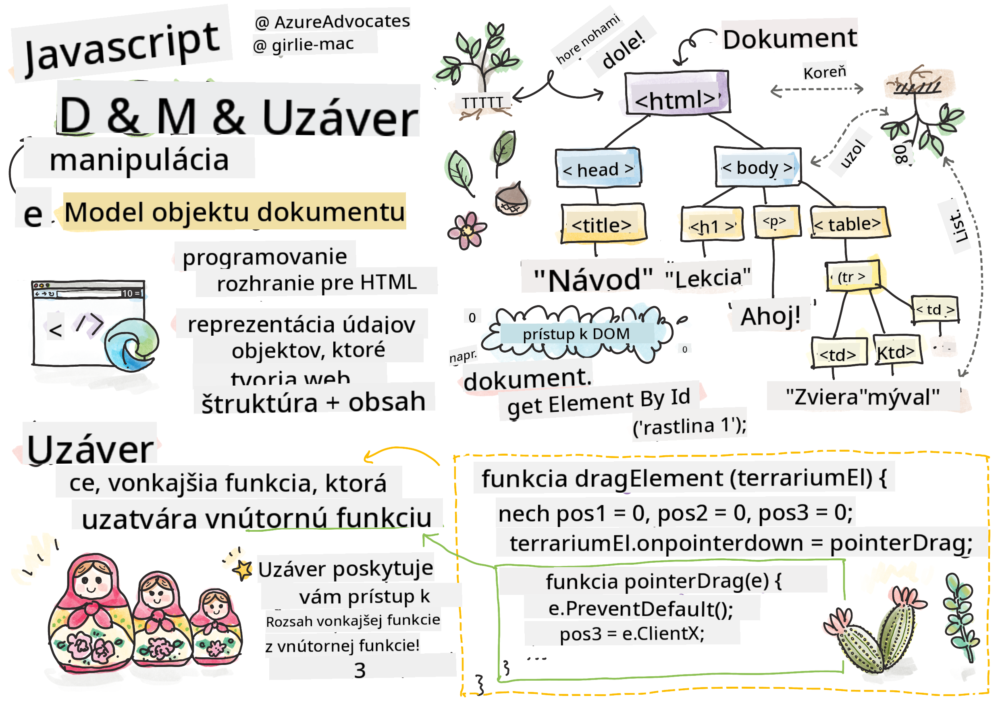
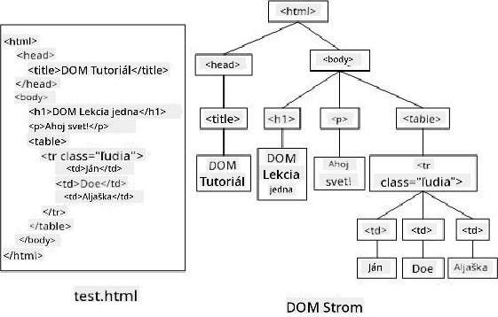
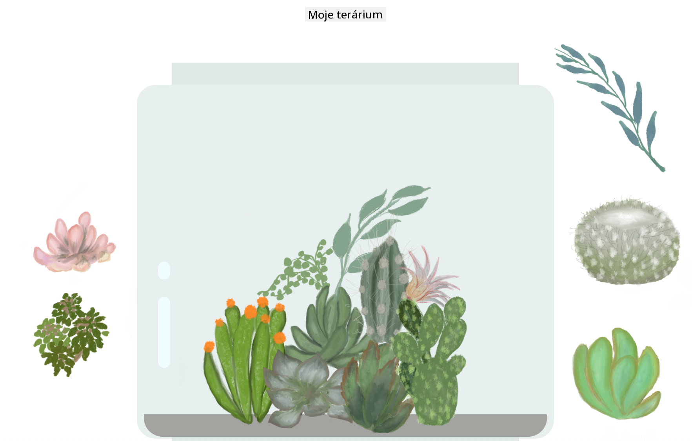

<!--
CO_OP_TRANSLATOR_METADATA:
{
  "original_hash": "30f8903a1f290e3d438dc2c70fe60259",
  "translation_date": "2025-08-28T00:04:12+00:00",
  "source_file": "3-terrarium/3-intro-to-DOM-and-closures/README.md",
  "language_code": "sk"
}
-->
# Projekt Terrárium, časť 3: Manipulácia s DOM a uzáver


> Sketchnote od [Tomomi Imura](https://twitter.com/girlie_mac)

## Kvíz pred prednáškou

[Kvíz pred prednáškou](https://ashy-river-0debb7803.1.azurestaticapps.net/quiz/19)

### Úvod

Manipulácia s DOM, alebo "Document Object Model", je kľúčovým aspektom vývoja webu. Podľa [MDN](https://developer.mozilla.org/docs/Web/API/Document_Object_Model/Introduction): "Document Object Model (DOM) je dátová reprezentácia objektov, ktoré tvoria štruktúru a obsah dokumentu na webe." Výzvy spojené s manipuláciou DOM na webe často viedli k používaniu JavaScriptových frameworkov namiesto čistého JavaScriptu na správu DOM, ale my to zvládneme sami!

Okrem toho táto lekcia predstaví koncept [JavaScriptového uzáveru (closure)](https://developer.mozilla.org/docs/Web/JavaScript/Closures), ktorý si môžete predstaviť ako funkciu uzavretú inou funkciou, takže vnútorná funkcia má prístup k rozsahu vonkajšej funkcie.

> JavaScriptové uzávery sú rozsiahla a komplexná téma. Táto lekcia sa dotýka najzákladnejšej myšlienky, že v kóde tohto terrária nájdete uzáver: vnútornú funkciu a vonkajšiu funkciu skonštruované tak, aby vnútorná funkcia mala prístup k rozsahu vonkajšej funkcie. Pre oveľa viac informácií o tom, ako to funguje, navštívte [rozsiahlu dokumentáciu](https://developer.mozilla.org/docs/Web/JavaScript/Closures).

Použijeme uzáver na manipuláciu s DOM.

Predstavte si DOM ako strom, ktorý reprezentuje všetky spôsoby, akými je možné manipulovať s dokumentom webovej stránky. Boli napísané rôzne API (Application Program Interfaces), aby programátori mohli pomocou svojho preferovaného programovacieho jazyka pristupovať k DOM a upravovať, meniť, preusporadúvať a inak ho spravovať.



> Reprezentácia DOM a HTML značiek, ktoré naň odkazujú. Od [Olfa Nasraoui](https://www.researchgate.net/publication/221417012_Profile-Based_Focused_Crawler_for_Social_Media-Sharing_Websites)

V tejto lekcii dokončíme náš interaktívny projekt terrária vytvorením JavaScriptu, ktorý umožní používateľovi manipulovať s rastlinami na stránke.

### Predpoklad

Mali by ste mať vytvorený HTML a CSS pre vaše terrárium. Na konci tejto lekcie budete schopní presúvať rastliny do a z terrária ich ťahaním.

### Úloha

Vo vašom priečinku terrária vytvorte nový súbor s názvom `script.js`. Importujte tento súbor do sekcie `<head>`:

```html
	<script src="./script.js" defer></script>
```

> Poznámka: použite `defer` pri importe externého JavaScriptového súboru do HTML súboru, aby sa JavaScript vykonal až po úplnom načítaní HTML súboru. Môžete tiež použiť atribút `async`, ktorý umožňuje skriptu vykonávať sa počas parsovania HTML súboru, ale v našom prípade je dôležité, aby boli HTML elementy plne dostupné na ťahanie predtým, ako umožníme vykonanie skriptu na ťahanie.
---

## Elementy DOM

Prvá vec, ktorú musíte urobiť, je vytvoriť referencie na elementy, ktoré chcete manipulovať v DOM. V našom prípade ide o 14 rastlín, ktoré momentálne čakajú v bočných paneloch.

### Úloha

```html
dragElement(document.getElementById('plant1'));
dragElement(document.getElementById('plant2'));
dragElement(document.getElementById('plant3'));
dragElement(document.getElementById('plant4'));
dragElement(document.getElementById('plant5'));
dragElement(document.getElementById('plant6'));
dragElement(document.getElementById('plant7'));
dragElement(document.getElementById('plant8'));
dragElement(document.getElementById('plant9'));
dragElement(document.getElementById('plant10'));
dragElement(document.getElementById('plant11'));
dragElement(document.getElementById('plant12'));
dragElement(document.getElementById('plant13'));
dragElement(document.getElementById('plant14'));
```

Čo sa tu deje? Odkazujete na dokument a prehľadávate jeho DOM, aby ste našli element s konkrétnym Id. Pamätáte si z prvej lekcie o HTML, že ste každému obrázku rastliny priradili individuálne Id (`id="plant1"`)? Teraz túto prácu využijete. Po identifikovaní každého elementu ho odovzdáte funkcii s názvom `dragElement`, ktorú o chvíľu vytvoríte. Týmto spôsobom sa element v HTML stane ťahateľným, alebo čoskoro bude.

✅ Prečo odkazujeme na elementy podľa Id? Prečo nie podľa ich CSS triedy? Môžete sa vrátiť k predchádzajúcej lekcii o CSS, aby ste odpovedali na túto otázku.

---

## Uzáver

Teraz ste pripravení vytvoriť uzáver `dragElement`, ktorý je vonkajšou funkciou uzatvárajúcou vnútornú funkciu alebo funkcie (v našom prípade budú tri).

Uzávery sú užitočné, keď jedna alebo viac funkcií potrebuje prístup k rozsahu vonkajšej funkcie. Tu je príklad:

```javascript
function displayCandy(){
	let candy = ['jellybeans'];
	function addCandy(candyType) {
		candy.push(candyType)
	}
	addCandy('gumdrops');
}
displayCandy();
console.log(candy)
```

V tomto príklade funkcia `displayCandy` obklopuje funkciu, ktorá pridáva nový typ cukríka do poľa, ktoré už existuje vo funkcii. Ak by ste tento kód spustili, pole `candy` by bolo nedefinované, pretože ide o lokálnu premennú (lokálnu pre uzáver).

✅ Ako môžete spraviť pole `candy` prístupným? Skúste ho presunúť mimo uzáver. Týmto spôsobom sa pole stane globálnym, namiesto toho, aby zostalo dostupné iba v lokálnom rozsahu uzáveru.

### Úloha

Pod deklaráciami elementov v `script.js` vytvorte funkciu:

```javascript
function dragElement(terrariumElement) {
	//set 4 positions for positioning on the screen
	let pos1 = 0,
		pos2 = 0,
		pos3 = 0,
		pos4 = 0;
	terrariumElement.onpointerdown = pointerDrag;
}
```

`dragElement` získava svoj objekt `terrariumElement` z deklarácií na začiatku skriptu. Potom nastavíte niektoré lokálne pozície na `0` pre objekt odovzdaný do funkcie. Toto sú lokálne premenné, ktoré budú manipulované pre každý element, keď pridáte funkciu ťahania a púšťania v rámci uzáveru pre každý element. Terrárium bude naplnené týmito ťahanými elementmi, takže aplikácia musí sledovať, kde sú umiestnené.

Okrem toho je elementu `terrariumElement`, ktorý je odovzdaný tejto funkcii, priradená udalosť `pointerdown`, ktorá je súčasťou [webových API](https://developer.mozilla.org/docs/Web/API) navrhnutých na pomoc pri správe DOM. `onpointerdown` sa spustí, keď je stlačené tlačidlo, alebo v našom prípade, keď sa dotknete ťahateľného elementu. Tento obslužný program udalostí funguje na [webových aj mobilných prehliadačoch](https://caniuse.com/?search=onpointerdown), s niekoľkými výnimkami.

✅ [Obslužný program udalostí `onclick`](https://developer.mozilla.org/docs/Web/API/GlobalEventHandlers/onclick) má oveľa väčšiu podporu naprieč prehliadačmi; prečo by ste ho tu nepoužili? Zamyslite sa nad presným typom interakcie obrazovky, ktorú sa tu snažíte vytvoriť.

---

## Funkcia Pointerdrag

Element `terrariumElement` je pripravený na ťahanie; keď sa spustí udalosť `onpointerdown`, vyvolá sa funkcia `pointerDrag`. Pridajte túto funkciu hneď pod tento riadok: `terrariumElement.onpointerdown = pointerDrag;`:

### Úloha 

```javascript
function pointerDrag(e) {
	e.preventDefault();
	console.log(e);
	pos3 = e.clientX;
	pos4 = e.clientY;
}
```

Deje sa niekoľko vecí. Najprv zabránite predvoleným udalostiam, ktoré sa normálne dejú pri pointerdown, pomocou `e.preventDefault();`. Týmto spôsobom máte väčšiu kontrolu nad správaním rozhrania.

> Vráťte sa k tomuto riadku, keď úplne dokončíte súbor skriptu, a skúste to bez `e.preventDefault()` - čo sa stane?

Po druhé, otvorte `index.html` v okne prehliadača a skontrolujte rozhranie. Keď kliknete na rastlinu, môžete vidieť, ako sa zachytáva udalosť 'e'. Preskúmajte udalosť, aby ste videli, koľko informácií sa zhromažďuje jednou udalosťou pointerdown!  

Ďalej si všimnite, ako sú lokálne premenné `pos3` a `pos4` nastavené na e.clientX. Tieto hodnoty zachytávajú súradnice x a y rastliny v momente, keď na ňu kliknete alebo sa jej dotknete. Budete potrebovať jemnú kontrolu nad správaním rastlín, keď na ne kliknete a ťaháte ich, takže sledujete ich súradnice.

✅ Je už jasnejšie, prečo je celá táto aplikácia postavená na jednom veľkom uzávere? Ak by nebola, ako by ste udržali rozsah pre každú zo 14 ťahateľných rastlín?

Dokončite počiatočnú funkciu pridaním ďalších dvoch manipulácií udalostí pointer pod `pos4 = e.clientY`:

```html
document.onpointermove = elementDrag;
document.onpointerup = stopElementDrag;
```
Teraz naznačujete, že chcete, aby sa rastlina ťahala spolu s ukazovateľom, keď ju presúvate, a aby sa gesto ťahania zastavilo, keď rastlinu odznačíte. `onpointermove` a `onpointerup` sú všetky súčasťou rovnakého API ako `onpointerdown`. Rozhranie teraz vyhodí chyby, pretože ste ešte nedefinovali funkcie `elementDrag` a `stopElementDrag`, takže ich teraz vytvorte.

## Funkcie elementDrag a stopElementDrag

Uzáver dokončíte pridaním ďalších dvoch vnútorných funkcií, ktoré budú spracovávať, čo sa stane, keď rastlinu ťaháte a keď prestanete ťahať. Chcete, aby ste mohli kedykoľvek ťahať akúkoľvek rastlinu a umiestniť ju kdekoľvek na obrazovke. Toto rozhranie je pomerne neobmedzené (napríklad neexistuje zóna na púšťanie), aby ste si mohli navrhnúť svoje terrárium presne podľa svojich predstáv pridaním, odstránením a preusporiadaním rastlín.

### Úloha

Pridajte funkciu `elementDrag` hneď za zatváraciu zloženú zátvorku `pointerDrag`:

```javascript
function elementDrag(e) {
	pos1 = pos3 - e.clientX;
	pos2 = pos4 - e.clientY;
	pos3 = e.clientX;
	pos4 = e.clientY;
	console.log(pos1, pos2, pos3, pos4);
	terrariumElement.style.top = terrariumElement.offsetTop - pos2 + 'px';
	terrariumElement.style.left = terrariumElement.offsetLeft - pos1 + 'px';
}
```
V tejto funkcii robíte veľa úprav počiatočných pozícií 1-4, ktoré ste nastavili ako lokálne premenné vo vonkajšej funkcii. Čo sa tu deje?

Keď ťaháte, priradíte `pos1` tak, že ho nastavíte na `pos3` (ktoré ste nastavili skôr ako `e.clientX`) mínus aktuálnu hodnotu `e.clientX`. Podobnú operáciu vykonáte s `pos2`. Potom resetujete `pos3` a `pos4` na nové súradnice X a Y elementu. Tieto zmeny môžete sledovať v konzole počas ťahania. Potom manipulujete so štýlom CSS rastliny, aby ste nastavili jej novú pozíciu na základe nových pozícií `pos1` a `pos2`, pričom vypočítate súradnice X a Y rastliny na základe porovnania jej offsetu s týmito novými pozíciami.

> `offsetTop` a `offsetLeft` sú vlastnosti CSS, ktoré nastavujú pozíciu elementu na základe jeho rodiča; jeho rodičom môže byť akýkoľvek element, ktorý nie je pozicionovaný ako `static`. 

Všetky tieto prepočty pozícií vám umožňujú doladiť správanie terrária a jeho rastlín.

### Úloha 

Poslednou úlohou na dokončenie rozhrania je pridať funkciu `stopElementDrag` za zatváraciu zloženú zátvorku `elementDrag`:

```javascript
function stopElementDrag() {
	document.onpointerup = null;
	document.onpointermove = null;
}
```

Táto malá funkcia resetuje udalosti `onpointerup` a `onpointermove`, aby ste mohli buď reštartovať pohyb rastliny tým, že ju začnete znova ťahať, alebo začať ťahať novú rastlinu.

✅ Čo sa stane, ak nenastavíte tieto udalosti na null?

Teraz ste dokončili svoj projekt!

🥇Gratulujeme! Dokončili ste svoje krásne terrárium. 

---

## 🚀Výzva

Pridajte nový obslužný program udalostí do vášho uzáveru, aby ste s rastlinami mohli robiť niečo viac; napríklad dvojitým kliknutím na rastlinu ju presuňte do popredia. Buďte kreatívni!

## Kvíz po prednáške

[Kvíz po prednáške](https://ashy-river-0debb7803.1.azurestaticapps.net/quiz/20)

## Prehľad a samoštúdium

Hoci sa ťahanie elementov po obrazovke môže zdať triviálne, existuje mnoho spôsobov, ako to urobiť, a mnoho úskalí, v závislosti od efektu, ktorý chcete dosiahnuť. V skutočnosti existuje celé [API na ťahanie a púšťanie](https://developer.mozilla.org/docs/Web/API/HTML_Drag_and_Drop_API), ktoré si môžete vyskúšať. Nepoužili sme ho v tomto module, pretože efekt, ktorý sme chceli, bol trochu iný, ale vyskúšajte toto API na vlastnom projekte a uvidíte, čo dokážete.

Nájdite viac informácií o pointer udalostiach v [dokumentácii W3C](https://www.w3.org/TR/pointerevents1/) a na [MDN web docs](https://developer.mozilla.org/docs/Web/API/Pointer_events).

Vždy si overte schopnosti prehliadača pomocou [CanIUse.com](https://caniuse.com/).

## Zadanie

[Pracujte trochu viac s DOM](assignment.md)

---

**Upozornenie**:  
Tento dokument bol preložený pomocou služby AI prekladu [Co-op Translator](https://github.com/Azure/co-op-translator). Aj keď sa snažíme o presnosť, prosím, berte na vedomie, že automatizované preklady môžu obsahovať chyby alebo nepresnosti. Pôvodný dokument v jeho pôvodnom jazyku by mal byť považovaný za autoritatívny zdroj. Pre kritické informácie sa odporúča profesionálny ľudský preklad. Nie sme zodpovední za akékoľvek nedorozumenia alebo nesprávne interpretácie vyplývajúce z použitia tohto prekladu.