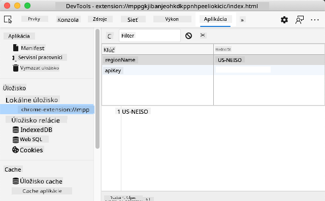

<!--
CO_OP_TRANSLATOR_METADATA:
{
  "original_hash": "e10f168beac4e7b05e30e0eb5c92bf11",
  "translation_date": "2025-08-27T23:36:38+00:00",
  "source_file": "5-browser-extension/2-forms-browsers-local-storage/README.md",
  "language_code": "sk"
}
-->
# Projekt rozšírenia prehliadača, časť 2: Volanie API, používanie lokálneho úložiska

## Kvíz pred lekciou

[Kvíz pred lekciou](https://ashy-river-0debb7803.1.azurestaticapps.net/quiz/25)

### Úvod

V tejto lekcii budete volať API odoslaním formulára vášho rozšírenia prehliadača a zobrazovať výsledky v rozšírení. Okrem toho sa naučíte, ako ukladať údaje do lokálneho úložiska prehliadača na budúce použitie.

✅ Postupujte podľa očíslovaných segmentov v príslušných súboroch, aby ste vedeli, kam umiestniť svoj kód.

### Nastavenie prvkov na manipuláciu v rozšírení:

Doteraz ste vytvorili HTML pre formulár a `<div>` na výsledky pre vaše rozšírenie prehliadača. Odteraz budete pracovať v súbore `/src/index.js` a postupne budovať svoje rozšírenie. Odkážte sa na [predchádzajúcu lekciu](../1-about-browsers/README.md) o nastavení projektu a procese zostavovania.

Pracujte vo svojom súbore `index.js` a začnite vytvorením niekoľkých `const` premenných na uchovanie hodnôt spojených s rôznymi poľami:

```JavaScript
// form fields
const form = document.querySelector('.form-data');
const region = document.querySelector('.region-name');
const apiKey = document.querySelector('.api-key');

// results
const errors = document.querySelector('.errors');
const loading = document.querySelector('.loading');
const results = document.querySelector('.result-container');
const usage = document.querySelector('.carbon-usage');
const fossilfuel = document.querySelector('.fossil-fuel');
const myregion = document.querySelector('.my-region');
const clearBtn = document.querySelector('.clear-btn');
```

Všetky tieto polia sú referencované podľa ich CSS triedy, ako ste ich nastavili v HTML v predchádzajúcej lekcii.

### Pridanie poslucháčov udalostí

Ďalej pridajte poslucháčov udalostí pre formulár a tlačidlo na vymazanie, ktoré resetuje formulár, aby sa pri odoslaní formulára alebo kliknutí na tlačidlo reset niečo stalo. Na konci súboru pridajte volanie na inicializáciu aplikácie:

```JavaScript
form.addEventListener('submit', (e) => handleSubmit(e));
clearBtn.addEventListener('click', (e) => reset(e));
init();
```

✅ Všimnite si skrátený zápis použitý na počúvanie udalostí submit alebo click a ako sa udalosť odovzdáva funkciám handleSubmit alebo reset. Dokážete napísať ekvivalent tohto skráteného zápisu v dlhšom formáte? Ktorý spôsob preferujete?

### Vytvorenie funkcií init() a reset():

Teraz vytvoríte funkciu, ktorá inicializuje rozšírenie, nazývanú init():

```JavaScript
function init() {
	//if anything is in localStorage, pick it up
	const storedApiKey = localStorage.getItem('apiKey');
	const storedRegion = localStorage.getItem('regionName');

	//set icon to be generic green
	//todo

	if (storedApiKey === null || storedRegion === null) {
		//if we don't have the keys, show the form
		form.style.display = 'block';
		results.style.display = 'none';
		loading.style.display = 'none';
		clearBtn.style.display = 'none';
		errors.textContent = '';
	} else {
        //if we have saved keys/regions in localStorage, show results when they load
        displayCarbonUsage(storedApiKey, storedRegion);
		results.style.display = 'none';
		form.style.display = 'none';
		clearBtn.style.display = 'block';
	}
};

function reset(e) {
	e.preventDefault();
	//clear local storage for region only
	localStorage.removeItem('regionName');
	init();
}

```

V tejto funkcii je zaujímavá logika. Keď si ju prečítate, vidíte, čo sa deje?

- sú nastavené dve `const`, ktoré kontrolujú, či používateľ uložil APIKey a regionálny kód do lokálneho úložiska.
- ak je niektorá z týchto hodnôt null, zobrazí sa formulár zmenou jeho štýlu na 'block'
- skryjú sa výsledky, načítavanie a tlačidlo clearBtn a akýkoľvek text chyby sa nastaví na prázdny reťazec
- ak existuje kľúč a región, spustí sa rutina na:
  - volanie API na získanie údajov o uhlíkovej stope
  - skrytie oblasti výsledkov
  - skrytie formulára
  - zobrazenie tlačidla reset

Pred pokračovaním je užitočné naučiť sa o veľmi dôležitom koncepte dostupnom v prehliadačoch: [LocalStorage](https://developer.mozilla.org/docs/Web/API/Window/localStorage). LocalStorage je užitočný spôsob, ako ukladať reťazce v prehliadači ako páry `kľúč-hodnota`. Tento typ webového úložiska môže byť manipulovaný pomocou JavaScriptu na správu údajov v prehliadači. LocalStorage nevyprší, zatiaľ čo SessionStorage, iný typ webového úložiska, sa vymaže po zatvorení prehliadača. Rôzne typy úložiska majú svoje výhody a nevýhody.

> Poznámka - vaše rozšírenie prehliadača má vlastné lokálne úložisko; hlavné okno prehliadača je iná inštancia a správa sa samostatne.

Nastavte svoj APIKey na hodnotu reťazca, napríklad, a môžete vidieť, že je nastavený v Edge, keď "skontrolujete" webovú stránku (môžete kliknúť pravým tlačidlom myši na prehliadač a skontrolovať) a prejdete na kartu Aplikácie, kde uvidíte úložisko.



✅ Zamyslite sa nad situáciami, kedy by ste NECHCELI ukladať niektoré údaje do LocalStorage. Vo všeobecnosti je umiestňovanie API kľúčov do LocalStorage zlý nápad! Vidíte prečo? V našom prípade, keďže naša aplikácia je čisto na učenie a nebude nasadená do obchodu s aplikáciami, použijeme túto metódu.

Všimnite si, že používate Web API na manipuláciu s LocalStorage, buď pomocou `getItem()`, `setItem()` alebo `removeItem()`. Je široko podporované vo všetkých prehliadačoch.

Pred vytvorením funkcie `displayCarbonUsage()`, ktorá je volaná v `init()`, vytvorme funkciu na spracovanie počiatočného odoslania formulára.

### Spracovanie odoslania formulára

Vytvorte funkciu nazvanú `handleSubmit`, ktorá prijíma argument udalosti `(e)`. Zastavte šírenie udalosti (v tomto prípade chceme zastaviť obnovenie prehliadača) a zavolajte novú funkciu `setUpUser`, pričom odovzdajte argumenty `apiKey.value` a `region.value`. Týmto spôsobom použijete dve hodnoty, ktoré sú privedené prostredníctvom počiatočného formulára, keď sú príslušné polia vyplnené.

```JavaScript
function handleSubmit(e) {
	e.preventDefault();
	setUpUser(apiKey.value, region.value);
}
```

✅ Osviežte si pamäť - HTML, ktoré ste nastavili v poslednej lekcii, má dve vstupné polia, ktorých `hodnoty` sú zachytené prostredníctvom `const`, ktoré ste nastavili na začiatku súboru, a obe sú `povinné`, takže prehliadač zabráni používateľom zadať null hodnoty.

### Nastavenie používateľa

Pokračujeme funkciou `setUpUser`, kde nastavíte hodnoty lokálneho úložiska pre apiKey a regionName. Pridajte novú funkciu:

```JavaScript
function setUpUser(apiKey, regionName) {
	localStorage.setItem('apiKey', apiKey);
	localStorage.setItem('regionName', regionName);
	loading.style.display = 'block';
	errors.textContent = '';
	clearBtn.style.display = 'block';
	//make initial call
	displayCarbonUsage(apiKey, regionName);
}
```

Táto funkcia nastaví správu o načítavaní, ktorá sa zobrazí počas volania API. V tomto bode ste sa dostali k vytvoreniu najdôležitejšej funkcie tohto rozšírenia prehliadača!

### Zobrazenie uhlíkovej stopy

Nakoniec je čas na dotazovanie API!

Predtým, než budeme pokračovať, mali by sme diskutovať o API. API, alebo [Application Programming Interfaces](https://www.webopedia.com/TERM/A/API.html), sú kritickým prvkom nástrojov webového vývojára. Poskytujú štandardné spôsoby, ako programy môžu navzájom komunikovať a spolupracovať. Napríklad, ak vytvárate webovú stránku, ktorá potrebuje dotazovať databázu, niekto mohol vytvoriť API, ktoré môžete použiť. Hoci existuje mnoho typov API, jedným z najpopulárnejších je [REST API](https://www.smashingmagazine.com/2018/01/understanding-using-rest-api/).

✅ Termín 'REST' znamená 'Representational State Transfer' a zahŕňa používanie rôzne nakonfigurovaných URL na získanie údajov. Urobte si malý prieskum o rôznych typoch API dostupných pre vývojárov. Ktorý formát vás oslovuje?

Existujú dôležité veci, ktoré si treba všimnúť o tejto funkcii. Najprv si všimnite kľúčové slovo [`async`](https://developer.mozilla.org/docs/Web/JavaScript/Reference/Statements/async_function). Písanie vašich funkcií tak, aby bežali asynchrónne, znamená, že čakajú na dokončenie akcie, ako je vrátenie údajov, predtým než budú pokračovať.

Tu je krátke video o `async`:

[](https://youtube.com/watch?v=YwmlRkrxvkk "Async a Await na správu sľubov")

> 🎥 Kliknite na obrázok vyššie pre video o async/await.

Vytvorte novú funkciu na dotazovanie API C02Signal:

```JavaScript
import axios from '../node_modules/axios';

async function displayCarbonUsage(apiKey, region) {
	try {
		await axios
			.get('https://api.co2signal.com/v1/latest', {
				params: {
					countryCode: region,
				},
				headers: {
					'auth-token': apiKey,
				},
			})
			.then((response) => {
				let CO2 = Math.floor(response.data.data.carbonIntensity);

				//calculateColor(CO2);

				loading.style.display = 'none';
				form.style.display = 'none';
				myregion.textContent = region;
				usage.textContent =
					Math.round(response.data.data.carbonIntensity) + ' grams (grams C02 emitted per kilowatt hour)';
				fossilfuel.textContent =
					response.data.data.fossilFuelPercentage.toFixed(2) +
					'% (percentage of fossil fuels used to generate electricity)';
				results.style.display = 'block';
			});
	} catch (error) {
		console.log(error);
		loading.style.display = 'none';
		results.style.display = 'none';
		errors.textContent = 'Sorry, we have no data for the region you have requested.';
	}
}
```

Toto je veľká funkcia. Čo sa tu deje?

- podľa najlepších postupov používate kľúčové slovo `async`, aby sa táto funkcia správala asynchrónne. Funkcia obsahuje blok `try/catch`, pretože vráti sľub, keď API vráti údaje. Keďže nemáte kontrolu nad rýchlosťou, akou API odpovie (nemusí odpovedať vôbec!), musíte túto neistotu zvládnuť volaním asynchrónne.
- dotazujete API co2signal na získanie údajov o vašom regióne, pomocou vášho API kľúča. Na použitie tohto kľúča musíte použiť typ autentifikácie v parametroch hlavičky.
- keď API odpovie, priradíte rôzne prvky jeho odpovedí k častiam obrazovky, ktoré ste nastavili na zobrazenie týchto údajov.
- ak dôjde k chybe alebo ak neexistuje žiadny výsledok, zobrazíte chybovú správu.

✅ Používanie asynchrónnych programovacích vzorov je ďalším veľmi užitočným nástrojom vo vašej vývojárskej výbave. Prečítajte si [o rôznych spôsoboch](https://developer.mozilla.org/docs/Web/JavaScript/Reference/Statements/async_function), ako môžete nakonfigurovať tento typ kódu.

Gratulujeme! Ak zostavíte svoje rozšírenie (`npm run build`) a obnovíte ho v paneli rozšírení, máte funkčné rozšírenie! Jediná vec, ktorá nefunguje, je ikona, a to opravíte v ďalšej lekcii.

---

## 🚀 Výzva

V týchto lekciách sme diskutovali o niekoľkých typoch API. Vyberte si webové API a podrobne preskúmajte, čo ponúka. Napríklad sa pozrite na API dostupné v prehliadačoch, ako je [HTML Drag and Drop API](https://developer.mozilla.org/docs/Web/API/HTML_Drag_and_Drop_API). Čo podľa vás robí API skvelým?

## Kvíz po lekcii

[Kvíz po lekcii](https://ashy-river-0debb7803.1.azurestaticapps.net/quiz/26)

## Prehľad a samoštúdium

V tejto lekcii ste sa naučili o LocalStorage a API, oboch veľmi užitočných pre profesionálneho webového vývojára. Dokážete si predstaviť, ako tieto dve veci spolupracujú? Premýšľajte o tom, ako by ste navrhli webovú stránku, ktorá by ukladala položky na použitie API.

## Zadanie

[Prijmite API](assignment.md)

---

**Upozornenie**:  
Tento dokument bol preložený pomocou služby AI prekladu [Co-op Translator](https://github.com/Azure/co-op-translator). Aj keď sa snažíme o presnosť, prosím, berte na vedomie, že automatizované preklady môžu obsahovať chyby alebo nepresnosti. Pôvodný dokument v jeho pôvodnom jazyku by mal byť považovaný za autoritatívny zdroj. Pre kritické informácie sa odporúča profesionálny ľudský preklad. Nenesieme zodpovednosť za akékoľvek nedorozumenia alebo nesprávne interpretácie vyplývajúce z použitia tohto prekladu.