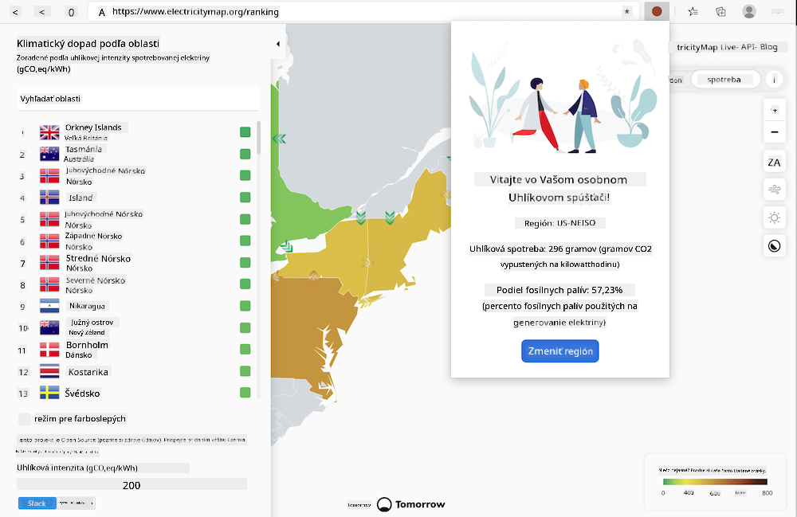
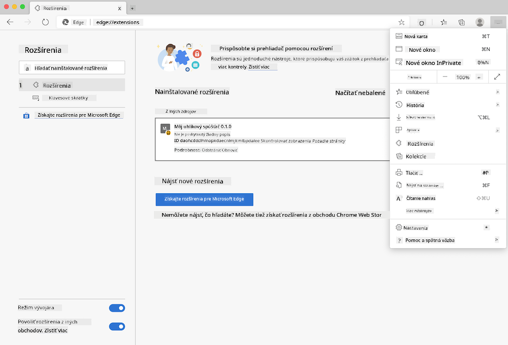

<!--
CO_OP_TRANSLATOR_METADATA:
{
  "original_hash": "21b364c158c8e4f698de65eeac16c9fe",
  "translation_date": "2025-08-27T23:35:03+00:00",
  "source_file": "5-browser-extension/solution/translation/README.ms.md",
  "language_code": "sk"
}
-->
# Rozšírenie prehliadača Carbon Trigger: Kompletný kód

Pomocou API CO2 Signal od tmrow na sledovanie spotreby elektriny vytvorte rozšírenie prehliadača, ktoré vám umožní dostávať upozornenia o tom, aká vysoká je spotreba elektriny vo vašom regióne. Používanie tohto rozšírenia vám konkrétne pomôže robiť rozhodnutia o vašich aktivitách na základe týchto informácií.



## Začíname

Musíte mať nainštalovaný [npm](https://npmjs.com). Stiahnite si kópiu tohto projektu do priečinka na vašom počítači.

Nainštalujte všetky potrebné balíčky:

```
npm install
```

Vytvorte rozšírenie pomocou webpacku:

```
npm run build
```

Ak chcete rozšírenie nainštalovať v prehliadači Edge, použite menu „tri bodky“ v pravom hornom rohu prehliadača na otvorenie panela Rozšírenia. Odtiaľ vyberte „Načítať nerozbalené“ na pridanie nového rozšírenia. Otvorte priečinok „dist“ podľa požiadavky a rozšírenie sa načíta. Na jeho používanie budete potrebovať API kľúč pre CO2 Signal API ([získajte ho tu prostredníctvom e-mailu](https://www.co2signal.com/) – zadajte svoj e-mail do poľa na tejto stránke) a [kód pre váš región](http://api.electricitymap.org/v3/zones), ktorý zodpovedá [Electricity Map](https://www.electricitymap.org/map) (napríklad v Bostone používam „US-NEISO“).



Po zadaní API kľúča a regiónu do rozhrania rozšírenia sa farebný bod na paneli rozšírenia prehliadača zmení, aby odrážal spotrebu energie vo vašom regióne, a poskytne vám odporúčania o aktivitách, ktoré sú pre vás vhodné. Koncept systému „bodiek“ mi bol inšpirovaný [rozšírením prehliadača Energy Lollipop](https://energylollipop.com/) pre Kaliforniu.

---

**Upozornenie**:  
Tento dokument bol preložený pomocou služby AI prekladu [Co-op Translator](https://github.com/Azure/co-op-translator). Hoci sa snažíme o presnosť, prosím, berte na vedomie, že automatizované preklady môžu obsahovať chyby alebo nepresnosti. Pôvodný dokument v jeho rodnom jazyku by mal byť považovaný za autoritatívny zdroj. Pre kritické informácie sa odporúča profesionálny ľudský preklad. Nie sme zodpovední za žiadne nedorozumenia alebo nesprávne interpretácie vyplývajúce z použitia tohto prekladu.