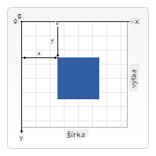
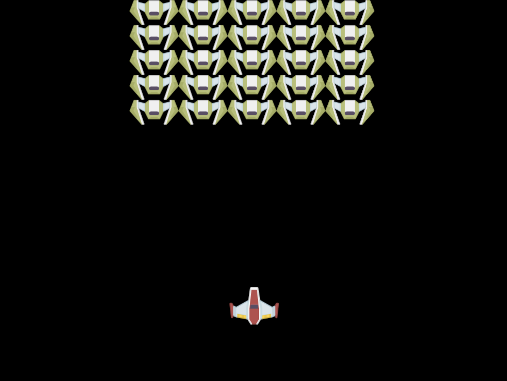

<!--
CO_OP_TRANSLATOR_METADATA:
{
  "original_hash": "41be8d35e7f30aa9dad10773c35e89c4",
  "translation_date": "2025-08-27T23:45:36+00:00",
  "source_file": "6-space-game/2-drawing-to-canvas/README.md",
  "language_code": "sk"
}
-->
# Vytvorenie vesmírnej hry, časť 2: Kreslenie hrdinu a monštier na plátno

## Kvíz pred prednáškou

[Kvíz pred prednáškou](https://ashy-river-0debb7803.1.azurestaticapps.net/quiz/31)

## Plátno

Plátno je HTML element, ktorý nemá predvolene žiadny obsah; je to prázdne plátno. Musíte naň kresliť, aby ste ho naplnili.

✅ Prečítajte si [viac o Canvas API](https://developer.mozilla.org/docs/Web/API/Canvas_API) na MDN.

Takto sa zvyčajne deklaruje ako súčasť tela stránky:

```html
<canvas id="myCanvas" width="200" height="100"></canvas>
```

Vyššie nastavujeme `id`, `width` a `height`.

- `id`: nastavte ho, aby ste mohli získať referenciu, keď s ním budete chcieť pracovať.
- `width`: šírka elementu.
- `height`: výška elementu.

## Kreslenie jednoduchých geometrických tvarov

Plátno používa kartézsky súradnicový systém na kreslenie objektov. Používa os x a os y na vyjadrenie polohy objektu. Poloha `0,0` je v ľavom hornom rohu a pravý dolný roh je to, čo ste nastavili ako ŠÍRKU a VÝŠKU plátna.

  
> Obrázok z [MDN](https://developer.mozilla.org/docs/Web/API/Canvas_API/Tutorial/Drawing_shapes)

Na kreslenie na plátno musíte prejsť nasledujúcimi krokmi:

1. **Získať referenciu** na element plátna.
2. **Získať referenciu** na element Context, ktorý sa nachádza na plátne.
3. **Vykonať kresliacu operáciu** pomocou elementu Context.

Kód pre vyššie uvedené kroky zvyčajne vyzerá takto:

```javascript
// draws a red rectangle
//1. get the canvas reference
canvas = document.getElementById("myCanvas");

//2. set the context to 2D to draw basic shapes
ctx = canvas.getContext("2d");

//3. fill it with the color red
ctx.fillStyle = 'red';

//4. and draw a rectangle with these parameters, setting location and size
ctx.fillRect(0,0, 200, 200) // x,y,width, height
```

✅ Canvas API sa zameriava hlavne na 2D tvary, ale môžete tiež kresliť 3D objekty na webovú stránku; na to môžete použiť [WebGL API](https://developer.mozilla.org/docs/Web/API/WebGL_API).

S Canvas API môžete kresliť rôzne veci, ako napríklad:

- **Geometrické tvary**, už sme ukázali, ako nakresliť obdĺžnik, ale môžete kresliť oveľa viac.
- **Text**, môžete kresliť text s akýmkoľvek fontom a farbou, akú si želáte.
- **Obrázky**, môžete kresliť obrázok na základe obrazového súboru, napríklad .jpg alebo .png.

✅ Skúste to! Už viete, ako nakresliť obdĺžnik, dokážete nakresliť kruh na stránku? Pozrite si niektoré zaujímavé kresby na plátne na CodePen. Tu je [obzvlášť pôsobivý príklad](https://codepen.io/dissimulate/pen/KrAwx).

## Načítanie a kreslenie obrazového súboru

Obrazový súbor načítate vytvorením objektu `Image` a nastavením jeho vlastnosti `src`. Potom počúvate udalosť `load`, aby ste vedeli, kedy je pripravený na použitie. Kód vyzerá takto:

### Načítanie súboru

```javascript
const img = new Image();
img.src = 'path/to/my/image.png';
img.onload = () => {
  // image loaded and ready to be used
}
```

### Vzor načítania súboru

Odporúča sa obaliť vyššie uvedené do konštruktu, ako je tento, aby sa to ľahšie používalo a aby ste sa pokúsili manipulovať s objektom až vtedy, keď je úplne načítaný:

```javascript
function loadAsset(path) {
  return new Promise((resolve) => {
    const img = new Image();
    img.src = path;
    img.onload = () => {
      // image loaded and ready to be used
      resolve(img);
    }
  })
}

// use like so

async function run() {
  const heroImg = await loadAsset('hero.png')
  const monsterImg = await loadAsset('monster.png')
}

```

Na kreslenie herných objektov na obrazovku by váš kód vyzeral takto:

```javascript
async function run() {
  const heroImg = await loadAsset('hero.png')
  const monsterImg = await loadAsset('monster.png')

  canvas = document.getElementById("myCanvas");
  ctx = canvas.getContext("2d");
  ctx.drawImage(heroImg, canvas.width/2,canvas.height/2);
  ctx.drawImage(monsterImg, 0,0);
}
```

## Teraz je čas začať budovať vašu hru

### Čo vytvoriť

Vytvoríte webovú stránku s elementom plátna. Mala by zobrazovať čiernu obrazovku `1024*768`. Poskytli sme vám dva obrázky:

- Loď hrdinu

   

- 5*5 monštrum

   

### Odporúčané kroky na začatie vývoja

Nájdite súbory, ktoré boli pre vás vytvorené v podpriečinku `your-work`. Mali by obsahovať nasledujúce:

```bash
-| assets
  -| enemyShip.png
  -| player.png
-| index.html
-| app.js
-| package.json
```

Otvorte kópiu tohto priečinka vo Visual Studio Code. Mali by ste mať nastavené lokálne vývojové prostredie, najlepšie s Visual Studio Code s NPM a Node nainštalovanými. Ak nemáte na počítači nastavené `npm`, [tu je návod, ako to urobiť](https://www.npmjs.com/get-npm).

Začnite svoj projekt navigáciou do priečinka `your_work`:

```bash
cd your-work
npm start
```

Vyššie uvedené spustí HTTP server na adrese `http://localhost:5000`. Otvorte prehliadač a zadajte túto adresu. Momentálne je to prázdna stránka, ale to sa zmení.

> Poznámka: aby ste videli zmeny na obrazovke, obnovte prehliadač.

### Pridanie kódu

Pridajte potrebný kód do `your-work/app.js`, aby ste vyriešili nasledujúce:

1. **Nakreslite** plátno s čiernym pozadím  
   > tip: pridajte dva riadky pod príslušné TODO v `/app.js`, nastavte element `ctx` na čiernu farbu a horné/ľavé súradnice na 0,0 a výšku a šírku na hodnoty plátna.
2. **Načítajte** textúry  
   > tip: pridajte obrázky hráča a nepriateľa pomocou `await loadTexture` a odovzdajte cestu k obrázku. Zatiaľ ich na obrazovke neuvidíte!
3. **Nakreslite** hrdinu do stredu obrazovky v dolnej polovici  
   > tip: použite API `drawImage` na nakreslenie heroImg na obrazovku, nastavte `canvas.width / 2 - 45` a `canvas.height - canvas.height / 4)`;
4. **Nakreslite** 5*5 monštier  
   > tip: Teraz môžete odkomentovať kód na kreslenie nepriateľov na obrazovku. Ďalej prejdite do funkcie `createEnemies` a vybudujte ju.

   Najprv nastavte niektoré konštanty:

    ```javascript
    const MONSTER_TOTAL = 5;
    const MONSTER_WIDTH = MONSTER_TOTAL * 98;
    const START_X = (canvas.width - MONSTER_WIDTH) / 2;
    const STOP_X = START_X + MONSTER_WIDTH;
    ```

    potom vytvorte slučku na nakreslenie poľa monštier na obrazovku:

    ```javascript
    for (let x = START_X; x < STOP_X; x += 98) {
        for (let y = 0; y < 50 * 5; y += 50) {
          ctx.drawImage(enemyImg, x, y);
        }
      }
    ```

## Výsledok

Hotový výsledok by mal vyzerať takto:



## Riešenie

Najskôr sa pokúste vyriešiť to sami, ale ak sa zaseknete, pozrite si [riešenie](../../../../6-space-game/2-drawing-to-canvas/solution/app.js).

---

## 🚀 Výzva

Naučili ste sa kresliť pomocou Canvas API zameraného na 2D; pozrite sa na [WebGL API](https://developer.mozilla.org/docs/Web/API/WebGL_API) a skúste nakresliť 3D objekt.

## Kvíz po prednáške

[Kvíz po prednáške](https://ashy-river-0debb7803.1.azurestaticapps.net/quiz/32)

## Prehľad a samoštúdium

Dozviete sa viac o Canvas API [čítaním o ňom](https://developer.mozilla.org/docs/Web/API/Canvas_API).

## Zadanie

[Hrajte sa s Canvas API](assignment.md)

---

**Upozornenie**:  
Tento dokument bol preložený pomocou služby AI prekladu [Co-op Translator](https://github.com/Azure/co-op-translator). Aj keď sa snažíme o presnosť, prosím, berte na vedomie, že automatizované preklady môžu obsahovať chyby alebo nepresnosti. Pôvodný dokument v jeho rodnom jazyku by mal byť považovaný za autoritatívny zdroj. Pre kritické informácie sa odporúča profesionálny ľudský preklad. Nie sme zodpovední za akékoľvek nedorozumenia alebo nesprávne interpretácie vyplývajúce z použitia tohto prekladu.