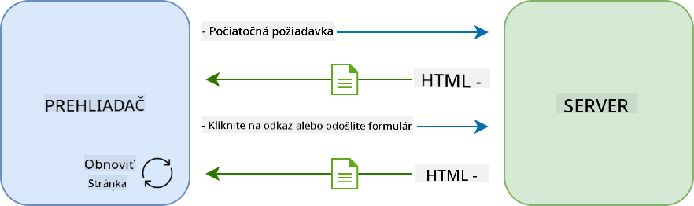
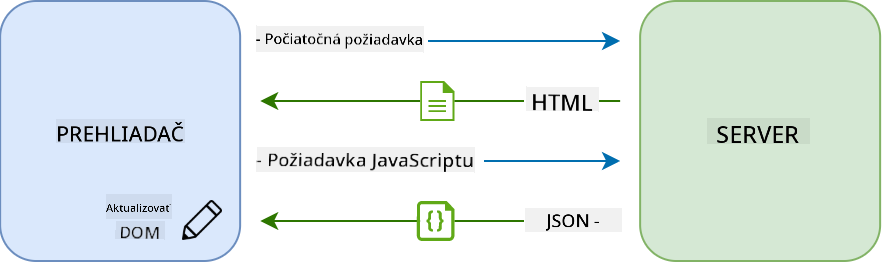
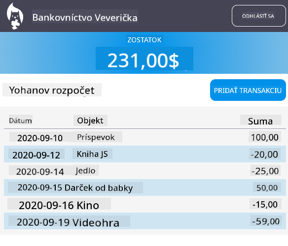

<!--
CO_OP_TRANSLATOR_METADATA:
{
  "original_hash": "f587e913e3f7c0b1c549a05dd74ee8e5",
  "translation_date": "2025-08-27T23:13:42+00:00",
  "source_file": "7-bank-project/3-data/README.md",
  "language_code": "sk"
}
-->
# Vytvorenie bankovej aplikácie, časť 3: Metódy získavania a používania dát

## Kvíz pred prednáškou

[Kvíz pred prednáškou](https://ashy-river-0debb7803.1.azurestaticapps.net/quiz/45)

### Úvod

Jadrom každej webovej aplikácie sú *dáta*. Dáta môžu mať rôzne podoby, ale ich hlavnou úlohou je vždy zobrazovať informácie používateľovi. S narastajúcou interaktivitou a komplexnosťou webových aplikácií sa spôsob, akým používateľ pristupuje k informáciám a interaguje s nimi, stal kľúčovou súčasťou vývoja webu.

V tejto lekcii sa naučíme, ako asynchrónne získavať dáta zo servera a používať ich na zobrazenie informácií na webovej stránke bez opätovného načítania HTML.

### Predpoklady

Pre túto lekciu je potrebné, aby ste už vytvorili [formulár na prihlásenie a registráciu](../2-forms/README.md) ako súčasť webovej aplikácie. Tiež je potrebné nainštalovať [Node.js](https://nodejs.org) a [spustiť server API](../api/README.md) lokálne, aby ste získali údaje o účtoch.

Môžete otestovať, či server beží správne, vykonaním tohto príkazu v termináli:

```sh
curl http://localhost:5000/api
# -> should return "Bank API v1.0.0" as a result
```

---

## AJAX a získavanie dát

Tradičné webové stránky aktualizujú zobrazovaný obsah, keď používateľ vyberie odkaz alebo odošle údaje prostredníctvom formulára, opätovným načítaním celej HTML stránky. Pri každom načítaní nových dát webový server vráti úplne novú HTML stránku, ktorú musí prehliadač spracovať, čím sa preruší aktuálna akcia používateľa a obmedzia interakcie počas načítania. Tento pracovný postup sa tiež nazýva *viacstránková aplikácia* alebo *MPA*.



Keď sa webové aplikácie začali stávať komplexnejšími a interaktívnejšími, objavila sa nová technika nazývaná [AJAX (Asynchronous JavaScript and XML)](https://en.wikipedia.org/wiki/Ajax_(programming)). Táto technika umožňuje webovým aplikáciám asynchrónne odosielať a získavať dáta zo servera pomocou JavaScriptu bez nutnosti opätovného načítania HTML stránky, čo vedie k rýchlejším aktualizáciám a plynulejším interakciám používateľa. Keď sú nové dáta prijaté zo servera, aktuálna HTML stránka môže byť aktualizovaná pomocou JavaScriptu prostredníctvom [DOM](https://developer.mozilla.org/docs/Web/API/Document_Object_Model) API. Postupom času sa tento prístup vyvinul do toho, čo sa dnes nazýva [*jednostránková aplikácia* alebo *SPA*](https://en.wikipedia.org/wiki/Single-page_application).



Keď bol AJAX prvýkrát predstavený, jediným dostupným API na asynchrónne získavanie dát bolo [`XMLHttpRequest`](https://developer.mozilla.org/docs/Web/API/XMLHttpRequest/Using_XMLHttpRequest). Moderné prehliadače však teraz implementujú pohodlnejšie a výkonnejšie [`Fetch` API](https://developer.mozilla.org/docs/Web/API/Fetch_API), ktoré používa promises a je lepšie prispôsobené na manipuláciu s JSON dátami.

> Hoci všetky moderné prehliadače podporujú `Fetch API`, ak chcete, aby vaša webová aplikácia fungovala na starších prehliadačoch, je vždy dobré najskôr skontrolovať [tabuľku kompatibility na caniuse.com](https://caniuse.com/fetch).

### Úloha

V [predchádzajúcej lekcii](../2-forms/README.md) sme implementovali registračný formulár na vytvorenie účtu. Teraz pridáme kód na prihlásenie pomocou existujúceho účtu a získanie jeho dát. Otvorte súbor `app.js` a pridajte novú funkciu `login`:

```js
async function login() {
  const loginForm = document.getElementById('loginForm')
  const user = loginForm.user.value;
}
```

Začíname získaním prvku formulára pomocou `getElementById()` a potom získame používateľské meno z inputu pomocou `loginForm.user.value`. Každý ovládací prvok formulára je možné pristupovať podľa jeho názvu (nastaveného v HTML pomocou atribútu `name`) ako vlastnosť formulára.

Podobne ako sme to urobili pri registrácii, vytvoríme ďalšiu funkciu na vykonanie požiadavky na server, tentokrát na získanie údajov o účte:

```js
async function getAccount(user) {
  try {
    const response = await fetch('//localhost:5000/api/accounts/' + encodeURIComponent(user));
    return await response.json();
  } catch (error) {
    return { error: error.message || 'Unknown error' };
  }
}
```

Používame `fetch` API na asynchrónne získanie dát zo servera, ale tentokrát nepotrebujeme žiadne ďalšie parametre okrem URL, ktorú chceme zavolať, pretože iba dotazujeme dáta. Predvolene `fetch` vytvára [`GET`](https://developer.mozilla.org/docs/Web/HTTP/Methods/GET) HTTP požiadavku, čo je presne to, čo tu potrebujeme.

✅ `encodeURIComponent()` je funkcia, ktorá uniká špeciálne znaky pre URL. Aké problémy by mohli nastať, ak by sme túto funkciu nevolali a použili priamo hodnotu `user` v URL?

Teraz aktualizujeme našu funkciu `login`, aby používala `getAccount`:

```js
async function login() {
  const loginForm = document.getElementById('loginForm')
  const user = loginForm.user.value;
  const data = await getAccount(user);

  if (data.error) {
    return console.log('loginError', data.error);
  }

  account = data;
  navigate('/dashboard');
}
```

Keďže `getAccount` je asynchrónna funkcia, musíme ju spárovať s kľúčovým slovom `await`, aby sme počkali na výsledok zo servera. Ako pri každej požiadavke na server, musíme sa zaoberať aj chybovými prípadmi. Zatiaľ pridáme iba logovaciu správu na zobrazenie chyby a neskôr sa k tomu vrátime.

Potom musíme uložiť dáta niekam, aby sme ich mohli neskôr použiť na zobrazenie informácií na dashboarde. Keďže premenná `account` zatiaľ neexistuje, vytvoríme globálnu premennú na začiatku nášho súboru:

```js
let account = null;
```

Po uložení údajov používateľa do premennej môžeme prejsť zo stránky *login* na *dashboard* pomocou funkcie `navigate()`, ktorú už máme.

Nakoniec musíme zavolať našu funkciu `login`, keď je formulár na prihlásenie odoslaný, úpravou HTML:

```html
<form id="loginForm" action="javascript:login()">
```

Otestujte, či všetko funguje správne, registráciou nového účtu a pokusom o prihlásenie pomocou toho istého účtu.

Predtým, než prejdeme na ďalšiu časť, môžeme tiež dokončiť funkciu `register` pridaním tohto na koniec funkcie:

```js
account = result;
navigate('/dashboard');
```

✅ Vedeli ste, že predvolene môžete volať serverové API iba z *rovnakého domény a portu*, ako je webová stránka, ktorú si prezeráte? Toto je bezpečnostný mechanizmus vynucovaný prehliadačmi. Ale počkajte, naša webová aplikácia beží na `localhost:3000`, zatiaľ čo server API beží na `localhost:5000`, prečo to funguje? Použitím techniky nazývanej [Cross-Origin Resource Sharing (CORS)](https://developer.mozilla.org/docs/Web/HTTP/CORS) je možné vykonávať cross-origin HTTP požiadavky, ak server pridá špeciálne hlavičky do odpovede, ktoré umožňujú výnimky pre konkrétne domény.

> Viac o API sa dozviete v tejto [lekcii](https://docs.microsoft.com/learn/modules/use-apis-discover-museum-art/?WT.mc_id=academic-77807-sagibbon)

## Aktualizácia HTML na zobrazenie dát

Teraz, keď máme údaje používateľa, musíme aktualizovať existujúce HTML, aby ich zobrazilo. Už vieme, ako získať prvok z DOM, napríklad pomocou `document.getElementById()`. Po získaní základného prvku tu sú niektoré API, ktoré môžete použiť na jeho úpravu alebo pridanie podriadených prvkov:

- Pomocou vlastnosti [`textContent`](https://developer.mozilla.org/docs/Web/API/Node/textContent) môžete zmeniť text prvku. Upozorňujeme, že zmena tejto hodnoty odstráni všetky podriadené prvky (ak nejaké existujú) a nahradí ich poskytnutým textom. Preto je to tiež efektívna metóda na odstránenie všetkých podriadených prvkov daného prvku priradením prázdneho reťazca `''`.

- Pomocou [`document.createElement()`](https://developer.mozilla.org/docs/Web/API/Document/createElement) spolu s metódou [`append()`](https://developer.mozilla.org/docs/Web/API/ParentNode/append) môžete vytvoriť a pripojiť jeden alebo viac nových podriadených prvkov.

✅ Použitím vlastnosti [`innerHTML`](https://developer.mozilla.org/docs/Web/API/Element/innerHTML) prvku je tiež možné zmeniť jeho HTML obsah, ale táto metóda by sa mala vyhnúť, pretože je zraniteľná voči útokom [cross-site scripting (XSS)](https://developer.mozilla.org/docs/Glossary/Cross-site_scripting).

### Úloha

Predtým, než prejdeme na obrazovku dashboardu, je tu ešte jedna vec, ktorú by sme mali urobiť na stránke *login*. Momentálne, ak sa pokúsite prihlásiť s používateľským menom, ktoré neexistuje, správa sa zobrazí v konzole, ale pre bežného používateľa sa nič nezmení a neviete, čo sa deje.

Pridajme prvok zástupného symbolu vo formulári na prihlásenie, kde môžeme v prípade potreby zobraziť chybovú správu. Dobré miesto by bolo tesne pred tlačidlom `<button>` na prihlásenie:

```html
...
<div id="loginError"></div>
<button>Login</button>
...
```

Tento `<div>` prvok je prázdny, čo znamená, že na obrazovke sa nič nezobrazí, kým do neho nepridáme nejaký obsah. Tiež mu priradíme `id`, aby sme ho mohli ľahko získať pomocou JavaScriptu.

Vráťte sa späť do súboru `app.js` a vytvorte novú pomocnú funkciu `updateElement`:

```js
function updateElement(id, text) {
  const element = document.getElementById(id);
  element.textContent = text;
}
```

Táto funkcia je pomerne jednoduchá: na základe *id* prvku a *textu* aktualizuje textový obsah prvku DOM, ktorý zodpovedá danému `id`. Použime túto metódu namiesto predchádzajúcej chybovej správy vo funkcii `login`:

```js
if (data.error) {
  return updateElement('loginError', data.error);
}
```

Teraz, ak sa pokúsite prihlásiť s neplatným účtom, mali by ste vidieť niečo takéto:


Teraz máme chybový text, ktorý sa zobrazí vizuálne, ale ak to skúsite s čítačkou obrazovky, všimnete si, že nič nie je oznámené. Aby bol text, ktorý je dynamicky pridaný na stránku, oznámený čítačkami obrazovky, bude potrebné použiť niečo nazývané [Live Region](https://developer.mozilla.org/docs/Web/Accessibility/ARIA/ARIA_Live_Regions). Tu použijeme špecifický typ live regionu nazývaný alert:

```html
<div id="loginError" role="alert"></div>
```

Implementujte rovnaké správanie pre chyby vo funkcii `register` (nezabudnite aktualizovať HTML).

## Zobrazenie informácií na dashboarde

Pomocou rovnakých techník, ktoré sme práve videli, sa postaráme o zobrazenie informácií o účte na stránke dashboardu.

Takto vyzerá objekt účtu prijatý zo servera:

```json
{
  "user": "test",
  "currency": "$",
  "description": "Test account",
  "balance": 75,
  "transactions": [
    { "id": "1", "date": "2020-10-01", "object": "Pocket money", "amount": 50 },
    { "id": "2", "date": "2020-10-03", "object": "Book", "amount": -10 },
    { "id": "3", "date": "2020-10-04", "object": "Sandwich", "amount": -5 }
  ],
}
```

> Poznámka: aby ste si uľahčili prácu, môžete použiť preddefinovaný účet `test`, ktorý už obsahuje dáta.

### Úloha

Začnime nahradením sekcie "Balance" v HTML, aby sme pridali zástupné prvky:

```html
<section>
  Balance: <span id="balance"></span><span id="currency"></span>
</section>
```

Tiež pridáme novú sekciu tesne pod ňu na zobrazenie popisu účtu:

```html
<h2 id="description"></h2>
```

✅ Keďže popis účtu funguje ako nadpis pre obsah pod ním, je označený semanticky ako nadpis. Viac o tom, ako [štruktúra nadpisov](https://www.nomensa.com/blog/2017/how-structure-headings-web-accessibility) je dôležitá pre prístupnosť, a kriticky sa pozrite na stránku, aby ste určili, čo iné by mohlo byť nadpisom.

Ďalej vytvoríme novú funkciu v `app.js`, ktorá vyplní zástupné prvky:

```js
function updateDashboard() {
  if (!account) {
    return navigate('/login');
  }

  updateElement('description', account.description);
  updateElement('balance', account.balance.toFixed(2));
  updateElement('currency', account.currency);
}
```

Najprv skontrolujeme, či máme potrebné údaje o účte, predtým než budeme pokračovať. Potom použijeme funkciu `updateElement()`, ktorú sme vytvorili skôr, na aktualizáciu HTML.

> Aby bol zobrazený zostatok krajší, používame metódu [`toFixed(2)`](https://developer.mozilla.org/docs/Web/JavaScript/Reference/Global_Objects/Number/toFixed), aby sme vynútili zobrazenie hodnoty s 2 desatinnými miestami.

Teraz musíme zavolať našu funkciu `updateDashboard()` vždy, keď sa načíta stránka dashboardu. Ak ste už dokončili [úlohu z lekcie 1](../1-template-route/assignment.md), toto by malo byť jednoduché, inak môžete použiť nasledujúcu implementáciu.

Pridajte tento kód na koniec funkcie `updateRoute()`:

```js
if (typeof route.init === 'function') {
  route.init();
}
```

A aktualizujte definíciu trás s:

```js
const routes = {
  '/login': { templateId: 'login' },
  '/dashboard': { templateId: 'dashboard', init: updateDashboard }
};
```

S touto zmenou sa funkcia `updateDashboard()` zavolá vždy, keď sa zobrazí stránka dashboardu. Po prihlásení by ste mali byť schopní vidieť zostatok účtu, menu a popis.

## Dynamické vytváranie riadkov tabuľky pomocou HTML šablón

V [prvej lekcii](../1-template-route/README.md) sme použili HTML šablóny spolu s metódou [`appendChild()`](https://developer.mozilla.org/docs/Web/API/Node/appendChild) na implementáciu navigácie v našej aplikácii. Šablóny môžu byť tiež menšie a používané na dynamické vyplnenie opakujúcich sa častí stránky.

Použijeme podobný prístup na zobrazenie zoznamu transakcií v HTML tabuľke.

### Úloha

Pridajte novú šablónu do `<body>` HTML:

```html
<template id="transaction">
  <tr>
    <td></td>
    <td></td>
    <td></td>
  </tr>
</template>
```

Táto šablóna predstavuje jeden riadok tabuľky s 3 stĺpcami, ktoré chceme vyplniť: *dátum*, *objekt* a *suma* transakcie.

Potom pridajte túto vlastnosť `id` do `<tbody>` elementu tabuľky v šablóne dashboardu, aby bolo jednoduchšie ho nájsť pomocou JavaScriptu:

```html
<tbody id="transactions"></tbody>
```

Naše HTML je pripravené, prejdime na JavaScript kód a vytvorme novú funkciu `createTransactionRow`:

```js
function createTransactionRow(transaction) {
  const template = document.getElementById('transaction');
  const transactionRow = template.content.cloneNode(true);
  const tr = transactionRow.querySelector('tr');
  tr.children[0].textContent = transaction.date;
  tr.children[1].textContent = transaction.object;
  tr.children[2].textContent = transaction.amount.toFixed(2);
  return transactionRow;
}
```

Táto funkcia robí presne to, čo naznačuje jej názov: pomocou šablóny, ktorú sme vytvorili skôr, vytvára nový riadok tabuľky a vyplní jeho obsah pomocou údajov o transakcii. Použijeme ju vo funkcii `updateDashboard()` na vyplnenie tabuľky:

```js
const transactionsRows = document.createDocumentFragment();
for (const transaction of account.transactions) {
  const transactionRow = createTransactionRow(transaction);
  transactionsRows.appendChild(transactionRow);
}
updateElement('transactions', transactionsRows);
```

Tu používame metódu [`document.createDocumentFragment()`](https://developer.mozilla.org/docs/Web/API/Document/createDocumentFragment), ktorá vytvára nový DOM fragment, na ktorom môžeme pracovať, predtým než ho nakoniec pripojíme k našej HTML tabuľke.

Ešte musíme urobiť jednu vec, aby tento kód fungoval, keďže naša funkcia `updateElement()` momentálne podporuje iba textový obsah. Zmeňme jej kód trochu:

```js
function updateElement(id, textOrNode) {
  const element = document.getElementById(id);
  element.textContent = ''; // Removes all children
  element.append(textOrNode);
}
```

Používame metódu [`append()`](https://developer.mozilla.org/docs/Web/API/ParentNode/append), pretože umožňuje pripojiť buď text alebo [DOM Nodes](https://developer.mozilla.org/docs/Web/API/Node) k nadradenému prvku, čo je ideálne pre všetky naše prípady použitia.
Ak sa pokúsite prihlásiť pomocou účtu `test`, mali by ste teraz vidieť zoznam transakcií na hlavnom paneli 🎉.

---

## 🚀 Výzva

Spolupracujte na tom, aby stránka hlavného panela vyzerala ako skutočná banková aplikácia. Ak ste už svoju aplikáciu naštýlovali, skúste použiť [media queries](https://developer.mozilla.org/docs/Web/CSS/Media_Queries) na vytvorenie [responzívneho dizajnu](https://developer.mozilla.org/docs/Web/Progressive_web_apps/Responsive/responsive_design_building_blocks), ktorý bude dobre fungovať na stolných počítačoch aj mobilných zariadeniach.

Tu je príklad naštýlovanej stránky hlavného panela:



## Kvíz po prednáške

[Kvíz po prednáške](https://ashy-river-0debb7803.1.azurestaticapps.net/quiz/46)

## Zadanie

[Refaktorujte a okomentujte svoj kód](assignment.md)

---

**Upozornenie**:  
Tento dokument bol preložený pomocou služby AI prekladu [Co-op Translator](https://github.com/Azure/co-op-translator). Aj keď sa snažíme o presnosť, prosím, berte na vedomie, že automatizované preklady môžu obsahovať chyby alebo nepresnosti. Pôvodný dokument v jeho pôvodnom jazyku by mal byť považovaný za autoritatívny zdroj. Pre kritické informácie sa odporúča profesionálny ľudský preklad. Nie sme zodpovední za žiadne nedorozumenia alebo nesprávne interpretácie vyplývajúce z použitia tohto prekladu.