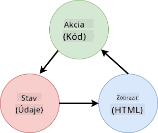
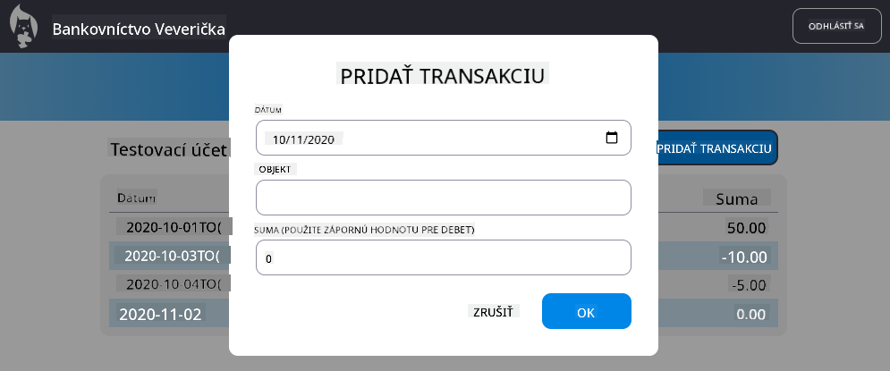

<!--
CO_OP_TRANSLATOR_METADATA:
{
  "original_hash": "4fa20c513e367e9cdd401bf49ae16e33",
  "translation_date": "2025-08-27T23:20:53+00:00",
  "source_file": "7-bank-project/4-state-management/README.md",
  "language_code": "sk"
}
-->
# Vytvorenie bankovej aplikácie, časť 4: Koncepty správy stavu

## Kvíz pred prednáškou

[Kvíz pred prednáškou](https://ashy-river-0debb7803.1.azurestaticapps.net/quiz/47)

### Úvod

Ako webová aplikácia rastie, stáva sa čoraz náročnejšie sledovať všetky toky dát. Ktorý kód získava dáta, ktorá stránka ich používa, kde a kedy ich treba aktualizovať... ľahko sa môže stať, že skončíte s neprehľadným kódom, ktorý je ťažké udržiavať. Toto je obzvlášť pravda, keď potrebujete zdieľať dáta medzi rôznymi stránkami aplikácie, napríklad údaje o používateľovi. Koncept *správy stavu* vždy existoval vo všetkých druhoch programov, ale ako webové aplikácie rastú na zložitosti, stáva sa to kľúčovým bodom, na ktorý treba myslieť počas vývoja.

V tejto poslednej časti sa pozrieme na aplikáciu, ktorú sme vytvorili, aby sme prehodnotili, ako je spravovaný stav, čo umožní podporu obnovenia prehliadača kedykoľvek a uchovanie dát medzi používateľskými reláciami.

### Predpoklady

Musíte mať dokončenú časť [získavania dát](../3-data/README.md) webovej aplikácie pre túto lekciu. Tiež musíte nainštalovať [Node.js](https://nodejs.org) a [spustiť serverovú API](../api/README.md) lokálne, aby ste mohli spravovať údaje o účtoch.

Môžete otestovať, či server beží správne, vykonaním tohto príkazu v termináli:

```sh
curl http://localhost:5000/api
# -> should return "Bank API v1.0.0" as a result
```

---

## Prehodnotenie správy stavu

V [predchádzajúcej lekcii](../3-data/README.md) sme predstavili základný koncept stavu v našej aplikácii s globálnou premennou `account`, ktorá obsahuje bankové údaje aktuálne prihláseného používateľa. Naša aktuálna implementácia však má niekoľko nedostatkov. Skúste obnoviť stránku, keď ste na hlavnom paneli. Čo sa stane?

Sú tu 3 problémy s aktuálnym kódom:

- Stav nie je uchovaný, pretože obnovenie prehliadača vás vráti na prihlasovaciu stránku.
- Existuje viacero funkcií, ktoré modifikujú stav. Ako aplikácia rastie, môže byť ťažké sledovať zmeny a ľahko sa zabudne na aktualizáciu jednej z nich.
- Stav nie je vyčistený, takže keď kliknete na *Odhlásiť sa*, údaje o účte tam stále sú, aj keď ste na prihlasovacej stránke.

Mohli by sme aktualizovať náš kód, aby sme tieto problémy riešili jeden po druhom, ale to by vytvorilo viac duplicity kódu a aplikácia by bola zložitejšia a ťažšie udržiavateľná. Alebo by sme sa mohli na chvíľu zastaviť a prehodnotiť našu stratégiu.

> Aké problémy sa tu vlastne snažíme vyriešiť?

[Správa stavu](https://en.wikipedia.org/wiki/State_management) je o nájdení dobrého prístupu na riešenie týchto dvoch konkrétnych problémov:

- Ako udržať toky dát v aplikácii zrozumiteľné?
- Ako udržať údaje o stave vždy synchronizované s používateľským rozhraním (a naopak)?

Keď sa postaráte o tieto problémy, akékoľvek ďalšie problémy, ktoré by ste mohli mať, môžu byť už vyriešené alebo sa stanú ľahšie riešiteľnými. Existuje mnoho možných prístupov na riešenie týchto problémov, ale my sa rozhodneme pre bežné riešenie, ktoré spočíva v **centralizácii dát a spôsobov ich zmeny**. Toky dát by vyzerali takto:



> Tu sa nebudeme zaoberať časťou, kde dáta automaticky spúšťajú aktualizáciu zobrazenia, pretože je to spojené s pokročilejšími konceptmi [Reaktívneho programovania](https://en.wikipedia.org/wiki/Reactive_programming). Je to dobrá téma na hlbšie štúdium, ak máte záujem.

✅ Existuje veľa knižníc s rôznymi prístupmi k správe stavu, pričom [Redux](https://redux.js.org) je populárnou možnosťou. Pozrite sa na koncepty a vzory, ktoré používa, pretože je to často dobrý spôsob, ako sa naučiť, aké potenciálne problémy môžete čeliť vo veľkých webových aplikáciách a ako ich možno vyriešiť.

### Úloha

Začneme malou refaktorizáciou. Nahraďte deklaráciu `account`:

```js
let account = null;
```

Nasledujúcim:

```js
let state = {
  account: null
};
```

Myšlienkou je *centralizovať* všetky dáta našej aplikácie do jedného objektu stavu. Zatiaľ máme v stave iba `account`, takže sa toho veľa nemení, ale vytvára to cestu pre budúce rozšírenia.

Musíme tiež aktualizovať funkcie, ktoré ho používajú. Vo funkciách `register()` a `login()` nahraďte `account = ...` za `state.account = ...`;

Na začiatok funkcie `updateDashboard()` pridajte tento riadok:

```js
const account = state.account;
```

Táto refaktorizácia sama o sebe nepriniesla veľa zlepšení, ale myšlienkou bolo položiť základy pre ďalšie zmeny.

## Sledovanie zmien dát

Teraz, keď sme zaviedli objekt `state` na ukladanie našich dát, ďalším krokom je centralizácia aktualizácií. Cieľom je uľahčiť sledovanie akýchkoľvek zmien a kedy k nim dochádza.

Aby sme sa vyhli zmenám objektu `state`, je tiež dobrým zvykom považovať ho za [*nemenný*](https://en.wikipedia.org/wiki/Immutable_object), čo znamená, že ho vôbec nemožno modifikovať. To tiež znamená, že musíte vytvoriť nový objekt stavu, ak chcete niečo v ňom zmeniť. Týmto spôsobom si vytvoríte ochranu pred potenciálne nežiaducimi [vedľajšími účinkami](https://en.wikipedia.org/wiki/Side_effect_(computer_science)) a otvoríte možnosti pre nové funkcie vo vašej aplikácii, ako je implementácia funkcií späť/vpred, pričom tiež uľahčíte ladenie. Napríklad by ste mohli zaznamenávať každú zmenu vykonanú v stave a uchovávať históriu zmien, aby ste pochopili zdroj chyby.

V JavaScripte môžete použiť [`Object.freeze()`](https://developer.mozilla.org/docs/Web/JavaScript/Reference/Global_Objects/Object/freeze) na vytvorenie nemennej verzie objektu. Ak sa pokúsite vykonať zmeny v nemennom objekte, vyvolá sa výnimka.

✅ Viete, aký je rozdiel medzi *povrchovo* a *hĺbkovo* nemenným objektom? Môžete si o tom prečítať [tu](https://developer.mozilla.org/docs/Web/JavaScript/Reference/Global_Objects/Object/freeze#What_is_shallow_freeze).

### Úloha

Vytvorme novú funkciu `updateState()`:

```js
function updateState(property, newData) {
  state = Object.freeze({
    ...state,
    [property]: newData
  });
}
```

V tejto funkcii vytvárame nový objekt stavu a kopírujeme dáta z predchádzajúceho stavu pomocou [*operátora rozšírenia (`...`)*](https://developer.mozilla.org/docs/Web/JavaScript/Reference/Operators/Spread_syntax#Spread_in_object_literals). Potom prepíšeme konkrétnu vlastnosť objektu stavu novými dátami pomocou [notácie s hranatými zátvorkami](https://developer.mozilla.org/docs/Web/JavaScript/Guide/Working_with_Objects#Objects_and_properties) `[property]` pre priradenie. Nakoniec objekt uzamkneme, aby sme zabránili modifikáciám pomocou `Object.freeze()`. Zatiaľ máme v stave uloženú iba vlastnosť `account`, ale s týmto prístupom môžete do stavu pridať toľko vlastností, koľko potrebujete.

Tiež aktualizujeme inicializáciu `state`, aby sme sa uistili, že počiatočný stav je tiež zmrazený:

```js
let state = Object.freeze({
  account: null
});
```

Potom aktualizujte funkciu `register` nahradením priradenia `state.account = result;` za:

```js
updateState('account', result);
```

Urobte to isté s funkciou `login`, nahraďte `state.account = data;` za:

```js
updateState('account', data);
```

Teraz využijeme príležitosť na opravu problému, že údaje o účte nie sú vymazané, keď používateľ klikne na *Odhlásiť sa*.

Vytvorte novú funkciu `logout()`:

```js
function logout() {
  updateState('account', null);
  navigate('/login');
}
```

V `updateDashboard()` nahraďte presmerovanie `return navigate('/login');` za `return logout();`;

Skúste zaregistrovať nový účet, odhlásiť sa a znova prihlásiť, aby ste overili, že všetko stále funguje správne.

> Tip: môžete si pozrieť všetky zmeny stavu pridaním `console.log(state)` na koniec `updateState()` a otvorením konzoly vo vývojárskych nástrojoch vášho prehliadača.

## Uchovanie stavu

Väčšina webových aplikácií potrebuje uchovávať dáta, aby mohla správne fungovať. Všetky kritické dáta sú zvyčajne uložené v databáze a prístupné cez serverovú API, ako napríklad údaje o používateľskom účte v našom prípade. Ale niekedy je tiež zaujímavé uchovávať niektoré dáta na strane klienta, ktorá beží vo vašom prehliadači, pre lepší používateľský zážitok alebo na zlepšenie výkonu načítania.

Keď chcete uchovávať dáta vo vašom prehliadači, mali by ste si položiť niekoľko dôležitých otázok:

- *Sú dáta citlivé?* Mali by ste sa vyhnúť ukladaniu akýchkoľvek citlivých dát na strane klienta, ako sú heslá používateľov.
- *Ako dlho potrebujete tieto dáta uchovávať?* Plánujete pristupovať k týmto dátam iba počas aktuálnej relácie alebo ich chcete uchovávať navždy?

Existuje viacero spôsobov, ako ukladať informácie vo webovej aplikácii, v závislosti od toho, čo chcete dosiahnuť. Napríklad môžete použiť URL na uloženie vyhľadávacieho dotazu a spraviť ho zdieľateľným medzi používateľmi. Môžete tiež použiť [HTTP cookies](https://developer.mozilla.org/docs/Web/HTTP/Cookies), ak je potrebné dáta zdieľať so serverom, ako napríklad informácie o [autentifikácii](https://en.wikipedia.org/wiki/Authentication).

Ďalšou možnosťou je použiť jednu z mnohých API prehliadača na ukladanie dát. Dve z nich sú obzvlášť zaujímavé:

- [`localStorage`](https://developer.mozilla.org/docs/Web/API/Window/localStorage): [Úložisko kľúč/hodnota](https://en.wikipedia.org/wiki/Key%E2%80%93value_database), ktoré umožňuje uchovávať dáta špecifické pre aktuálnu webovú stránku medzi rôznymi reláciami. Uložené dáta nikdy nevypršia.
- [`sessionStorage`](https://developer.mozilla.org/docs/Web/API/Window/sessionStorage): funguje rovnako ako `localStorage`, okrem toho, že uložené dáta sa vymažú, keď relácia skončí (keď sa prehliadač zatvorí).

Všimnite si, že obe tieto API umožňujú ukladať iba [reťazce](https://developer.mozilla.org/docs/Web/JavaScript/Reference/Global_Objects/String). Ak chcete ukladať zložité objekty, budete ich musieť serializovať do formátu [JSON](https://developer.mozilla.org/docs/Web/JavaScript/Reference/Global_Objects/JSON) pomocou [`JSON.stringify()`](https://developer.mozilla.org/docs/Web/JavaScript/Reference/Global_Objects/JSON/stringify).

✅ Ak chcete vytvoriť webovú aplikáciu, ktorá nepracuje so serverom, je tiež možné vytvoriť databázu na strane klienta pomocou [`IndexedDB` API](https://developer.mozilla.org/docs/Web/API/IndexedDB_API). Táto možnosť je vyhradená pre pokročilé prípady použitia alebo ak potrebujete ukladať značné množstvo dát, pretože je zložitejšia na použitie.

### Úloha

Chceme, aby naši používatelia zostali prihlásení, kým explicitne nekliknú na tlačidlo *Odhlásiť sa*, takže použijeme `localStorage` na uloženie údajov o účte. Najprv definujme kľúč, ktorý použijeme na uloženie našich dát.

```js
const storageKey = 'savedAccount';
```

Potom pridajte tento riadok na koniec funkcie `updateState()`:

```js
localStorage.setItem(storageKey, JSON.stringify(state.account));
```

Týmto spôsobom budú údaje o používateľskom účte uchované a vždy aktuálne, pretože sme predtým centralizovali všetky aktualizácie stavu. Tu začíname ťažiť zo všetkých našich predchádzajúcich refaktorov 🙂.

Keďže sú dáta uložené, musíme sa tiež postarať o ich obnovenie, keď sa aplikácia načíta. Keďže začneme mať viac inicializačného kódu, môže byť dobrý nápad vytvoriť novú funkciu `init`, ktorá tiež zahŕňa náš predchádzajúci kód na konci `app.js`:

```js
function init() {
  const savedAccount = localStorage.getItem(storageKey);
  if (savedAccount) {
    updateState('account', JSON.parse(savedAccount));
  }

  // Our previous initialization code
  window.onpopstate = () => updateRoute();
  updateRoute();
}

init();
```

Tu načítame uložené dáta a ak nejaké existujú, aktualizujeme stav podľa nich. Je dôležité to urobiť *pred* aktualizáciou trasy, pretože môže existovať kód, ktorý sa spolieha na stav počas aktualizácie stránky.

Môžeme tiež spraviť stránku *Dashboard* predvolenou stránkou našej aplikácie, pretože teraz uchovávame údaje o účte. Ak sa nenájdu žiadne dáta, hlavný panel sa postará o presmerovanie na stránku *Login*. V `updateRoute()` nahraďte záložné `return navigate('/login');` za `return navigate('/dashboard');`.

Teraz sa prihláste do aplikácie a skúste obnoviť stránku. Mali by ste zostať na hlavnom paneli. Touto aktualizáciou sme sa postarali o všetky naše počiatočné problémy...

## Obnovenie dát

...Ale mohli sme tiež vytvoriť nový problém. Ups!

Prejdite na hlavný panel pomocou účtu `test`, potom spustite tento príkaz v termináli na vytvorenie novej transakcie:

```sh
curl --request POST \
     --header "Content-Type: application/json" \
     --data "{ \"date\": \"2020-07-24\", \"object\": \"Bought book\", \"amount\": -20 }" \
     http://localhost:5000/api/accounts/test/transactions
```

Skúste teraz obnoviť stránku hlavného panela v prehliadači. Čo sa stane? Vidíte novú transakciu?

Stav je uchovaný na neurčito vďaka `localStorage`, ale to tiež znamená, že sa nikdy neaktualizuje, kým sa z aplikácie neodhlásite a znova neprihlásite!

Jednou z možných stratégií na opravu tohto problému je načítať údaje o účte zakaždým, keď sa načíta hlavný panel, aby sa predišlo zastaraným dátam.

### Úloha

Vytvorte novú funkciu `updateAccountData`:

```js
async function updateAccountData() {
  const account = state.account;
  if (!account) {
    return logout();
  }

  const data = await getAccount(account.user);
  if (data.error) {
    return logout();
  }

  updateState('account', data);
}
```

Táto metóda kontroluje, či sme aktuálne prihlásení, a potom načíta údaje o účte zo servera.

Vytvorte ďalšiu funkciu s názvom `refresh`:

```js
async function refresh() {
  await updateAccountData();
  updateDashboard();
}
```

Táto funkcia aktualizuje údaje o účte a potom sa postará o aktualizáciu HTML hlavného panela. To je to, čo potrebujeme zavolať, keď sa načíta trasa hlavného panela. Aktualizujte definíciu trasy:

```js
const routes = {
  '/login': { templateId: 'login' },
  '/dashboard': { templateId: 'dashboard', init: refresh }
};
```

Skúste teraz obnoviť hlavný panel, mal by zobrazovať aktualizované údaje o účte.

---

## 🚀 Výzva

Teraz, keď načítavame údaje o účte zakaždým, keď sa načíta hlavný panel, myslíte si, že stále potrebujeme uchovávať *všetky údaje o účte*?

Skúste spolupracovať na zmene toho, čo sa ukladá a načítava z `localStorage`, aby obsahovalo iba to, čo je absolútne potrebné na fungovanie aplikácie.

## Kvíz po prednáške
[Post-lecture quiz](https://ashy-river-0debb7803.1.azurestaticapps.net/quiz/48)

## Zadanie

[Implementovať dialóg "Pridať transakciu"](assignment.md)

Tu je príklad výsledku po dokončení zadania:



---

**Upozornenie**:  
Tento dokument bol preložený pomocou služby AI prekladu [Co-op Translator](https://github.com/Azure/co-op-translator). Hoci sa snažíme o presnosť, prosím, berte na vedomie, že automatizované preklady môžu obsahovať chyby alebo nepresnosti. Pôvodný dokument v jeho rodnom jazyku by mal byť považovaný za autoritatívny zdroj. Pre kritické informácie sa odporúča profesionálny ľudský preklad. Nenesieme zodpovednosť za akékoľvek nedorozumenia alebo nesprávne interpretácie vyplývajúce z použitia tohto prekladu.