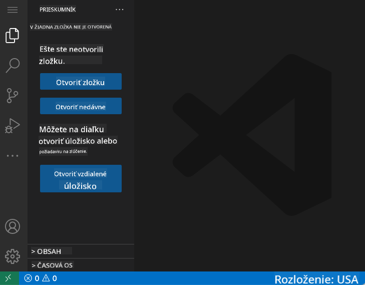
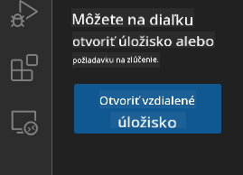
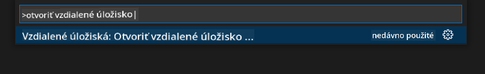
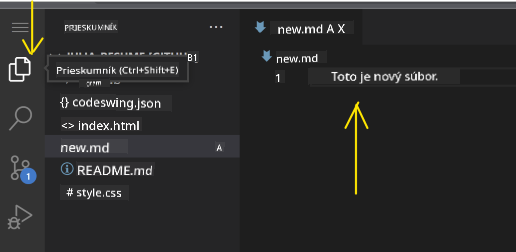
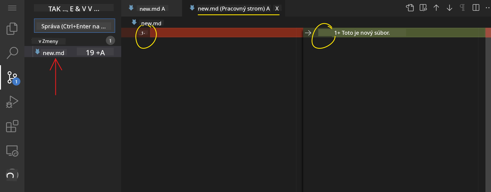
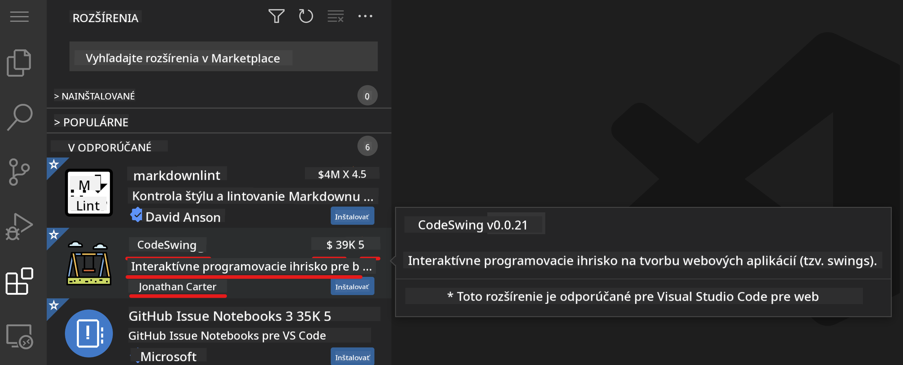
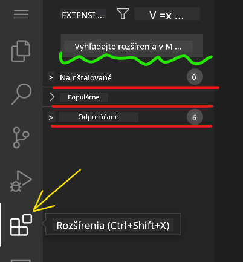
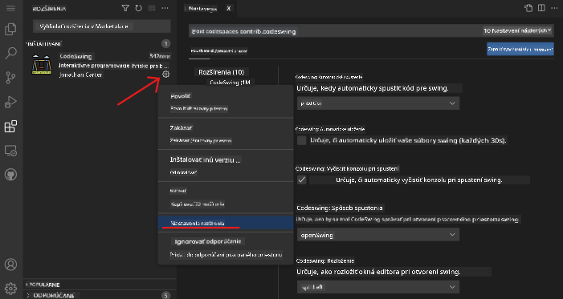

<!--
CO_OP_TRANSLATOR_METADATA:
{
  "original_hash": "7aa6e4f270d38d9cb17f2b5bd86b863d",
  "translation_date": "2025-08-28T00:07:25+00:00",
  "source_file": "8-code-editor/1-using-a-code-editor/README.md",
  "language_code": "sk"
}
-->
# Používanie editora kódu

Táto lekcia pokrýva základy používania [VSCode.dev](https://vscode.dev), webového editora kódu, aby ste mohli upravovať svoj kód a prispievať do projektu bez nutnosti inštalácie čohokoľvek na svoj počítač.

## Ciele učenia

V tejto lekcii sa naučíte:

- Používať editor kódu v projekte
- Sledovať zmeny pomocou verzionovacieho systému
- Prispôsobiť editor pre vývoj

### Predpoklady

Predtým, ako začnete, budete si musieť vytvoriť účet na [GitHub](https://github.com). Prejdite na [GitHub](https://github.com/) a vytvorte si účet, ak ho ešte nemáte.

### Úvod

Editor kódu je nevyhnutný nástroj na písanie programov a spoluprácu na existujúcich projektoch. Keď pochopíte základy editora a ako využívať jeho funkcie, budete ich môcť aplikovať pri písaní kódu.

## Začíname s VSCode.dev

[VSCode.dev](https://vscode.dev) je editor kódu na webe. Nemusíte nič inštalovať, stačí ho otvoriť ako akúkoľvek inú webovú stránku. Ak chcete začať, otvorte nasledujúci odkaz: [https://vscode.dev](https://vscode.dev). Ak nie ste prihlásení do [GitHub](https://github.com/), postupujte podľa pokynov na prihlásenie alebo vytvorenie nového účtu a potom sa prihláste.

Po načítaní by mal editor vyzerať podobne ako na tomto obrázku:



Existujú tri hlavné sekcie, odľava doprava:

1. _Panel aktivít_, ktorý obsahuje niekoľko ikon, ako lupa 🔎, ozubené koliesko ⚙️ a ďalšie.
2. Rozšírený panel aktivít, ktorý predvolene zobrazuje _Prieskumníka_, nazývaného _bočný panel_.
3. Oblasť kódu napravo.

Kliknite na každú z ikon, aby ste zobrazili rôzne menu. Po dokončení kliknite na _Prieskumníka_, aby ste sa vrátili na začiatok.

Keď začnete vytvárať alebo upravovať kód, bude sa to diať v najväčšej oblasti napravo. Túto oblasť použijete aj na zobrazenie existujúceho kódu, čo si ukážeme ďalej.

## Otvorenie GitHub repozitára

Prvým krokom je otvorenie GitHub repozitára. Existuje niekoľko spôsobov, ako otvoriť repozitár. V tejto sekcii si ukážeme dva rôzne spôsoby, ako môžete otvoriť repozitár a začať pracovať na zmenách.

### 1. Pomocou editora

Použite samotný editor na otvorenie vzdialeného repozitára. Ak prejdete na [VSCode.dev](https://vscode.dev), uvidíte tlačidlo _"Open Remote Repository"_:



Môžete tiež použiť príkazovú paletu. Príkazová paleta je vstupné pole, kde môžete napísať akékoľvek slovo, ktoré je súčasťou príkazu alebo akcie, aby ste našli správny príkaz na vykonanie. Použite menu v ľavom hornom rohu, vyberte _Zobraziť_ a potom _Príkazová paleta_, alebo použite nasledujúcu klávesovú skratku: Ctrl-Shift-P (na MacOS Command-Shift-P).



Po otvorení menu napíšte _open remote repository_ a vyberte prvú možnosť. Zobrazia sa viaceré repozitáre, ktorých ste súčasťou alebo ktoré ste nedávno otvorili. Môžete tiež použiť úplnú URL adresu GitHub repozitára. Použite nasledujúcu URL adresu a vložte ju do poľa:

```
https://github.com/microsoft/Web-Dev-For-Beginners
```

✅ Ak bolo úspešné, uvidíte všetky súbory tohto repozitára načítané v textovom editore.

### 2. Použitím URL adresy

Môžete tiež použiť priamo URL adresu na načítanie repozitára. Napríklad úplná URL adresa aktuálneho repozitára je [https://github.com/microsoft/Web-Dev-For-Beginners](https://github.com/microsoft/Web-Dev-For-Beginners), ale môžete nahradiť doménu GitHub za `VSCode.dev/github` a načítať repozitár priamo. Výsledná URL adresa by bola [https://vscode.dev/github/microsoft/Web-Dev-For-Beginners](https://vscode.dev/github/microsoft/Web-Dev-For-Beginners).

## Úprava súborov

Keď máte repozitár otvorený v prehliadači/vscode.dev, ďalším krokom je vykonanie aktualizácií alebo zmien v projekte.

### 1. Vytvorenie nového súboru

Môžete vytvoriť súbor buď v existujúcom priečinku, alebo v koreňovom adresári/priečinku. Ak chcete vytvoriť nový súbor, otvorte umiestnenie/adresár, kam chcete súbor uložiť, a vyberte ikonu _'Nový súbor ...'_ na paneli aktivít _(vľavo)_, zadajte názov a stlačte Enter.


### 2. Úprava a uloženie súboru v repozitári

Používanie vscode.dev je užitočné, keď chcete rýchlo aktualizovať svoj projekt bez nutnosti načítania akéhokoľvek softvéru lokálne.  
Ak chcete aktualizovať svoj kód, kliknite na ikonu 'Prieskumník', ktorá sa tiež nachádza na paneli aktivít, aby ste zobrazili súbory a priečinky v repozitári.  
Vyberte súbor, aby sa otvoril v oblasti kódu, vykonajte zmeny a uložte.



Po dokončení aktualizácie projektu vyberte ikonu _`verzionovanie`_, ktorá obsahuje všetky nové zmeny, ktoré ste vykonali vo svojom repozitári.

Ak chcete zobraziť zmeny, ktoré ste vykonali vo svojom projekte, vyberte súbor(y) v priečinku `Zmeny` na rozšírenom paneli aktivít. Tým sa otvorí 'Pracovný strom', kde si môžete vizuálne prezrieť zmeny, ktoré ste vykonali v súbore. Červená označuje odstránenie z projektu, zatiaľ čo zelená znamená pridanie.



Ak ste spokojní so zmenami, ktoré ste vykonali, prejdite na priečinok `Zmeny` a kliknite na tlačidlo `+`, aby ste zmeny pripravili na commit. Príprava znamená, že zmeny sú pripravené na odoslanie na GitHub.

Ak však nie ste spokojní s niektorými zmenami a chcete ich zrušiť, prejdite na priečinok `Zmeny` a vyberte ikonu `vrátiť späť`.

Potom zadajte `commit správu` _(popis zmien, ktoré ste vykonali v projekte)_, kliknite na ikonu `check` na commit a odoslanie zmien.

Po dokončení práce na projekte vyberte ikonu `hamburger menu` v ľavom hornom rohu, aby ste sa vrátili do repozitára na github.com.


## Používanie rozšírení

Inštalácia rozšírení vo VSCode umožňuje pridávať nové funkcie a prispôsobiť možnosti vývojového prostredia vo vašom editore, aby ste zlepšili svoj vývojový proces. Tieto rozšírenia tiež pomáhajú pridávať podporu pre viacero programovacích jazykov a často sú buď všeobecné, alebo jazykovo špecifické.

Ak chcete prehliadať zoznam všetkých dostupných rozšírení, kliknite na ikonu _`Rozšírenia`_ na paneli aktivít a začnite písať názov rozšírenia do textového poľa označeného _'Hľadať rozšírenia v Marketplace'_.
Zobrazí sa zoznam rozšírení, pričom každé obsahuje **názov rozšírenia, meno vydavateľa, jednovetný popis, počet stiahnutí** a **hodnotenie hviezdičkami**.



Môžete si tiež zobraziť všetky predtým nainštalované rozšírenia rozbalením priečinka _`Nainštalované`_, populárne rozšírenia používané väčšinou vývojárov v priečinku _`Populárne`_ a odporúčané rozšírenia pre vás buď od používateľov v rovnakom pracovnom priestore, alebo na základe vašich nedávno otvorených súborov v priečinku _`Odporúčané`_.



### 1. Inštalácia rozšírení

Ak chcete nainštalovať rozšírenie, zadajte jeho názov do vyhľadávacieho poľa a kliknite naň, aby ste zobrazili ďalšie informácie o rozšírení v oblasti kódu, keď sa objaví na rozšírenom paneli aktivít.

Môžete buď kliknúť na _modré tlačidlo inštalovať_ na rozšírenom paneli aktivít, alebo použiť tlačidlo inštalovať, ktoré sa zobrazí v oblasti kódu po výbere rozšírenia na načítanie ďalších informácií.


### 2. Prispôsobenie rozšírení

Po nainštalovaní rozšírenia možno budete musieť upraviť jeho správanie a prispôsobiť ho podľa svojich preferencií. Ak to chcete urobiť, vyberte ikonu Rozšírenia, a tentoraz sa vaše rozšírenie zobrazí v priečinku _Nainštalované_, kliknite na _**ikonu ozubeného kolieska**_ a prejdite na _Nastavenia rozšírenia_.



### 3. Správa rozšírení

Po nainštalovaní a používaní rozšírenia ponúka vscode.dev možnosti správy rozšírenia podľa rôznych potrieb. Napríklad môžete:

- **Deaktivovať:** _(Dočasne deaktivujete rozšírenie, keď ho už nepotrebujete, ale nechcete ho úplne odinštalovať)_

    Vyberte nainštalované rozšírenie na rozšírenom paneli aktivít > kliknite na ikonu ozubeného kolieska > vyberte 'Deaktivovať' alebo 'Deaktivovať (Pracovný priestor)' **ALEBO** Otvorte rozšírenie v oblasti kódu a kliknite na modré tlačidlo Deaktivovať.

- **Odinštalovať:** Vyberte nainštalované rozšírenie na rozšírenom paneli aktivít > kliknite na ikonu ozubeného kolieska > vyberte 'Odinštalovať' **ALEBO** Otvorte rozšírenie v oblasti kódu a kliknite na modré tlačidlo Odinštalovať.

---

## Zadanie

[Vytvorte webovú stránku životopisu pomocou vscode.dev](https://github.com/microsoft/Web-Dev-For-Beginners/blob/main/8-code-editor/1-using-a-code-editor/assignment.md)

## Prehľad a samoštúdium

Prečítajte si viac o [VSCode.dev](https://code.visualstudio.com/docs/editor/vscode-web?WT.mc_id=academic-0000-alfredodeza) a niektorých jeho ďalších funkciách.

---

**Upozornenie**:  
Tento dokument bol preložený pomocou služby AI prekladu [Co-op Translator](https://github.com/Azure/co-op-translator). Aj keď sa snažíme o presnosť, prosím, berte na vedomie, že automatizované preklady môžu obsahovať chyby alebo nepresnosti. Pôvodný dokument v jeho pôvodnom jazyku by mal byť považovaný za autoritatívny zdroj. Pre kritické informácie sa odporúča profesionálny ľudský preklad. Nie sme zodpovední za žiadne nedorozumenia alebo nesprávne interpretácie vyplývajúce z použitia tohto prekladu.