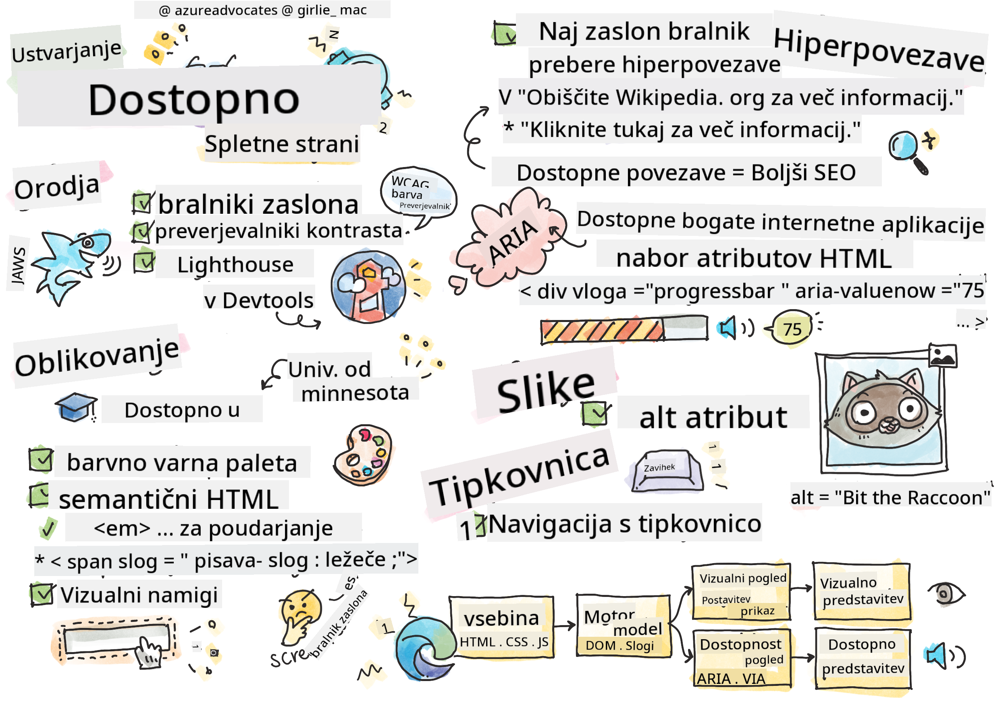

<!--
CO_OP_TRANSLATOR_METADATA:
{
  "original_hash": "e4cd5b1faed4adab5acf720f82798003",
  "translation_date": "2025-08-28T00:18:49+00:00",
  "source_file": "1-getting-started-lessons/3-accessibility/README.md",
  "language_code": "sl"
}
-->
# Ustvarjanje dostopnih spletnih strani


> Sketchnote avtorja [Tomomi Imura](https://twitter.com/girlie_mac)

## Predhodni kviz
[Predhodni kviz](https://ashy-river-0debb7803.1.azurestaticapps.net/quiz/5)

> Moč spleta je v njegovi univerzalnosti. Dostop za vse, ne glede na invalidnost, je bistven vidik.
>
> \- Sir Timothy Berners-Lee, direktor W3C in izumitelj svetovnega spleta

Ta citat popolnoma poudarja pomen ustvarjanja dostopnih spletnih strani. Aplikacija, ki ni dostopna vsem, je po definiciji izključujoča. Kot spletni razvijalci bi morali vedno imeti v mislih dostopnost. Če se na to osredotočite že od začetka, boste na dobri poti, da zagotovite, da lahko vsi dostopajo do strani, ki jih ustvarite. V tej lekciji boste spoznali orodja, ki vam lahko pomagajo zagotoviti dostopnost vaših spletnih virov, in kako graditi z mislijo na dostopnost.

> To lekcijo lahko opravite na [Microsoft Learn](https://docs.microsoft.com/learn/modules/web-development-101/accessibility/?WT.mc_id=academic-77807-sagibbon)!

## Orodja za uporabo

### Bralniki zaslona

Ena najbolj znanih orodij za dostopnost so bralniki zaslona.

[Bralniki zaslona](https://en.wikipedia.org/wiki/Screen_reader) so pogosto uporabljeni pripomočki za osebe z okvarami vida. Tako kot se trudimo, da brskalnik pravilno prikaže informacije, ki jih želimo deliti, moramo zagotoviti tudi, da bralnik zaslona to stori.

V svoji osnovni obliki bralnik zaslona zvočno prebere stran od zgoraj navzdol. Če je vaša stran sestavljena samo iz besedila, bo bralnik informacije posredoval na podoben način kot brskalnik. Seveda pa spletne strani redko vsebujejo samo besedilo; vključujejo povezave, grafike, barve in druge vizualne komponente. Poskrbeti je treba, da bralnik zaslona te informacije pravilno prebere.

Vsak spletni razvijalec bi se moral seznaniti z bralnikom zaslona. Kot je bilo poudarjeno zgoraj, je to orodje, ki ga bodo uporabljali vaši uporabniki. Tako kot poznate delovanje brskalnika, bi morali poznati tudi delovanje bralnika zaslona. Na srečo so bralniki zaslona vgrajeni v večino operacijskih sistemov.

Nekateri brskalniki imajo tudi vgrajena orodja in razširitve, ki lahko berejo besedilo na glas ali celo nudijo osnovne navigacijske funkcije, kot so [ta orodja za dostopnost v brskalniku Edge](https://support.microsoft.com/help/4000734/microsoft-edge-accessibility-features). Ta orodja so prav tako pomembna za dostopnost, vendar delujejo zelo drugače kot bralniki zaslona in jih ne smemo zamenjevati za orodja za testiranje bralnikov zaslona.

✅ Preizkusite bralnik zaslona in brskalniško orodje za branje besedila. Na Windows je privzeto vključen [Narrator](https://support.microsoft.com/windows/complete-guide-to-narrator-e4397a0d-ef4f-b386-d8ae-c172f109bdb1/?WT.mc_id=academic-77807-sagibbon), lahko pa namestite tudi [JAWS](https://webaim.org/articles/jaws/) in [NVDA](https://www.nvaccess.org/about-nvda/). Na macOS in iOS je privzeto nameščen [VoiceOver](https://support.apple.com/guide/voiceover/welcome/10).

### Povečava

Drugo orodje, ki ga pogosto uporabljajo osebe z okvarami vida, je povečava. Najosnovnejša vrsta povečave je statična povečava, ki jo nadzorujemo s kombinacijo `Control + plus (+)` ali z zmanjšanjem ločljivosti zaslona. Ta vrsta povečave povzroči, da se celotna stran poveča, zato je uporaba [odzivnega oblikovanja](https://developer.mozilla.org/docs/Learn/CSS/CSS_layout/Responsive_Design) pomembna za zagotavljanje dobre uporabniške izkušnje pri povečanih ravneh povečave.

Druga vrsta povečave temelji na specializirani programski opremi, ki poveča en del zaslona in omogoča premikanje, podobno kot pri uporabi povečevalnega stekla. Na Windows je vgrajeno orodje [Magnifier](https://support.microsoft.com/windows/use-magnifier-to-make-things-on-the-screen-easier-to-see-414948ba-8b1c-d3bd-8615-0e5e32204198), medtem ko je [ZoomText](https://www.freedomscientific.com/training/zoomtext/getting-started/) programska oprema tretjih oseb z več funkcijami in večjo uporabniško bazo. Tako macOS kot iOS imata vgrajeno programsko opremo za povečavo, imenovano [Zoom](https://www.apple.com/accessibility/mac/vision/).

### Preverjevalniki kontrasta

Barve na spletnih straneh je treba skrbno izbrati, da ustrezajo potrebam barvno slepih uporabnikov ali oseb, ki težko vidijo barve z nizkim kontrastom.

✅ Preizkusite spletno stran, ki jo radi uporabljate, glede uporabe barv z razširitvijo brskalnika, kot je [WCAG-ov preverjevalnik kontrasta](https://microsoftedge.microsoft.com/addons/detail/wcag-color-contrast-check/idahaggnlnekelhgplklhfpchbfdmkjp?hl=en-US&WT.mc_id=academic-77807-sagibbon). Kaj ste ugotovili?

### Lighthouse

V razdelku za razvijalce vašega brskalnika boste našli orodje Lighthouse. To orodje je pomembno za prvi pregled dostopnosti (in drugih analiz) spletne strani. Čeprav se ni dobro zanašati izključno na Lighthouse, je 100-odstotna ocena zelo koristna kot izhodišče.

✅ Poiščite Lighthouse v razdelku za razvijalce vašega brskalnika in izvedite analizo na katerikoli strani. Kaj ste odkrili?

## Oblikovanje za dostopnost

Dostopnost je razmeroma obsežna tema. Da bi vam pomagali, je na voljo veliko virov.

- [Accessible U - University of Minnesota](https://accessibility.umn.edu/your-role/web-developers)

Čeprav ne bomo mogli pokriti vseh vidikov ustvarjanja dostopnih strani, so spodaj navedena nekatera osnovna načela, ki jih boste želeli uvesti. Oblikovanje dostopne strani že od začetka je **vedno** lažje kot naknadno prilagajanje obstoječe strani.

## Dobri principi prikaza

### Barvno varne palete

Ljudje vidijo svet na različne načine, kar vključuje tudi barve. Pri izbiri barvne sheme za vašo stran morate zagotoviti, da je dostopna vsem. Odlično [orodje za ustvarjanje barvnih palet je Color Safe](http://colorsafe.co/).

✅ Prepoznajte spletno stran, ki je zelo problematična pri uporabi barv. Zakaj?

### Uporabite pravilni HTML

S CSS in JavaScriptom je mogoče katerikoli element narediti, da izgleda kot katerikoli tip kontrolnika. `<span>` bi lahko uporabili za ustvarjanje `<button>`, in `<b>` bi lahko postal hiperpovezava. Čeprav bi to lahko veljalo za lažje za oblikovanje, ne posreduje ničesar bralniku zaslona. Uporabite ustrezen HTML pri ustvarjanju kontrolnikov na strani. Če želite hiperpovezavo, uporabite `<a>`. Uporaba pravilnega HTML-ja za pravi kontrolnik se imenuje uporaba semantičnega HTML-ja.

✅ Obiščite katerokoli spletno stran in preverite, ali oblikovalci in razvijalci pravilno uporabljajo HTML. Ali najdete gumb, ki bi moral biti povezava? Namig: z desnim klikom izberite 'Ogled izvorne kode strani' v vašem brskalniku, da si ogledate osnovno kodo.

### Ustvarite opisno hierarhijo naslovov

Uporabniki bralnikov zaslona [se močno zanašajo na naslove](https://webaim.org/projects/screenreadersurvey8/#finding) za iskanje informacij in navigacijo po strani. Pisanje opisne vsebine naslovov in uporaba semantičnih oznak naslovov sta pomembna za ustvarjanje strani, ki jo uporabniki bralnikov zaslona zlahka pregledujejo.

### Uporabite dobre vizualne namige

CSS omogoča popoln nadzor nad videzom katerega koli elementa na strani. Lahko ustvarite besedilna polja brez obrobe ali hiperpovezave brez podčrtaja. Na žalost lahko odstranjevanje teh namigov oteži prepoznavanje vrste kontrolnika za nekoga, ki je odvisen od njih.

## Pomen besedila povezav

Hiperpovezave so ključne za navigacijo po spletu. Zato je zagotavljanje, da bralnik zaslona pravilno prebere povezave, ključnega pomena za omogočanje navigacije vsem uporabnikom.

### Bralniki zaslona in povezave

Kot bi pričakovali, bralniki zaslona berejo besedilo povezav na enak način kot katerokoli drugo besedilo na strani. S tem v mislih se lahko zdi spodnje besedilo povsem sprejemljivo.

> Mali pingvin, včasih znan kot pravljični pingvin, je najmanjši pingvin na svetu. [Kliknite tukaj](https://en.wikipedia.org/wiki/Little_penguin) za več informacij.

> Mali pingvin, včasih znan kot pravljični pingvin, je najmanjši pingvin na svetu. Obiščite https://en.wikipedia.org/wiki/Little_penguin za več informacij.

> **NOTE** Kot boste kmalu prebrali, **nikoli** ne smete ustvarjati povezav, ki izgledajo kot zgoraj navedene.

Zapomnite si, bralniki zaslona so drugačen vmesnik od brskalnikov z drugačnim naborom funkcij.

### Težava z uporabo URL-ja

Bralniki zaslona berejo besedilo. Če se URL pojavi v besedilu, ga bo bralnik zaslona prebral. Na splošno URL ne posreduje smiselnih informacij in lahko zveni moteče. To ste morda že doživeli, če vam je telefon kdaj zvočno prebral sporočilo z URL-jem.

### Težava z "kliknite tukaj"

Bralniki zaslona imajo tudi možnost branja samo hiperpovezav na strani, podobno kot bi oseba z vidom preletela stran za povezavami. Če je besedilo povezave vedno "kliknite tukaj", bo uporabnik slišal samo "kliknite tukaj, kliknite tukaj, kliknite tukaj, kliknite tukaj, kliknite tukaj, ..." Vse povezave so zdaj med seboj nerazločljive.

### Dobro besedilo povezav

Dobro besedilo povezav na kratko opiše, kaj je na drugi strani povezave. V zgornjem primeru o malih pingvinih povezava vodi na Wikipedijino stran o tej vrsti. Fraza *mali pingvini* bi bila popolno besedilo povezave, saj jasno pove, kaj bo nekdo izvedel, če klikne povezavo - mali pingvini.

> [Mali pingvin](https://en.wikipedia.org/wiki/Little_penguin), včasih znan kot pravljični pingvin, je najmanjši pingvin na svetu.

✅ Brskajte po spletu nekaj minut in poiščite strani, ki uporabljajo nejasne strategije povezovanja. Primerjajte jih z drugimi, bolje povezanimi stranmi. Kaj ste se naučili?

#### Opombe za iskalnike

Kot dodatna prednost zagotavljanja dostopnosti vaše strani boste pomagali tudi iskalnikom pri navigaciji po vaši strani. Iskalniki uporabljajo besedilo povezav za razumevanje tematik strani. Tako uporaba dobrega besedila povezav pomaga vsem!

### ARIA

Predstavljajte si naslednjo stran:

| Izdelek      | Opis              | Naročilo         |
| ------------ | ----------------- | ---------------- |
| Widget       | [Opis](../../../../1-getting-started-lessons/3-accessibility/')       | [Naročilo](../../../../1-getting-started-lessons/3-accessibility/')  |
| Super widget | [Opis](../../../../1-getting-started-lessons/3-accessibility/')       | [Naročilo](../../../../1-getting-started-lessons/3-accessibility/')  |

V tem primeru je podvajanje besedila "opis" in "naročilo" smiselno za nekoga, ki uporablja brskalnik. Vendar pa bo nekdo, ki uporablja bralnik zaslona, slišal samo besedi *opis* in *naročilo* brez konteksta.

Za podporo takšnim scenarijem HTML podpira nabor atributov, znanih kot [Accessible Rich Internet Applications (ARIA)](https://developer.mozilla.org/docs/Web/Accessibility/ARIA). Ti atributi omogočajo posredovanje dodatnih informacij bralnikom zaslona.

> **NOTE**: Tako kot pri mnogih vidikih HTML-ja se lahko podpora brskalnikov in bralnikov zaslona razlikuje. Vendar večina glavnih odjemalcev podpira ARIA atribute.

Atribut `aria-label` lahko uporabite za opis povezave, kadar format strani tega ne omogoča. Opis za widget bi lahko bil nastavljen kot

``` html
<a href="#" aria-label="Widget description">description</a>
```

✅ Na splošno uporaba semantičnega označevanja, kot je opisano zgoraj, presega uporabo ARIA, vendar včasih ni semantičnega ekvivalenta za različne HTML pripomočke. Dober primer je drevo. Za drevo ni HTML ekvivalenta, zato generični `<div>` za ta element identificirate z ustrezno vlogo in vrednostmi ARIA. [MDN dokumentacija o ARIA](https://developer.mozilla.org/docs/Web/Accessibility/ARIA) vsebuje več uporabnih informacij.

```html
<h2 id="tree-label">File Viewer</h2>
<div role="tree" aria-labelledby="tree-label">
  <div role="treeitem" aria-expanded="false" tabindex="0">Uploads</div>
</div>
```

## Slike

Samoumevno je, da bralniki zaslona ne morejo samodejno prebrati, kaj je na sliki. Zagotavljanje dostopnosti slik ne zahteva veliko dela - za to je namenjen atribut `alt`. Vse smiselne slike bi morale imeti `alt`, ki opisuje, kaj predstavljajo. Slike, ki so zgolj dekorativne, bi morale imeti atribut `alt` nastavljen na prazno vrednost: `alt=""`. To preprečuje, da bi bralniki zaslona po nepotrebnem napovedovali dekorativno sliko.

✅ Kot bi pričakovali, iskalniki prav tako ne morejo razumeti, kaj je na sliki. Tudi oni uporabljajo alt besedilo. Tako zagotavljanje dostopnosti vaše strani prinaša dodatne prednosti!

## Tipkovnica

Nekateri uporabniki ne morejo uporabljati miške ali sledilne ploščice, zato se zanašajo na interakcije s tipkovnico, da se premikajo od enega elementa do drugega. Pomembno je, da vaša spletna stran predstavi vsebino v logičnem vrstnem redu, tako da lahko uporabnik tipkovnice dostopa do vsakega interaktivnega elementa, ko se premika po dokumentu. Če gradite svoje spletne strani s semantičnim označevanjem in uporabljate CSS za oblikovanje njihovega vizualnega izgleda, bi morala biti vaša stran dostopna s tipkovnico, vendar je pomembno, da ta vidik ročno preizkusite. Več o [strategijah navigacije s tipkovnico](https://webaim.org/techniques/keyboard/) lahko izveste tukaj.

✅ Obiščite katerokoli spletno stran in poskusite navigirati po njej samo s tipkovnico. Kaj deluje, kaj ne deluje? Zakaj?

## Povzetek

Splet, ki je dostopen le nekaterim, ni resnično 'svetovni splet'. Najboljši način za zagotavljanje dostopnosti strani, ki jih ustvarite, je vključitev najboljših praks za dostopnost že od začetka. Čeprav so potrebni dodatni koraki, bo vključitev teh veščin v vaš delovni proces zdaj pomenila, da bodo vse strani, ki jih ustvarite, dostopne.

---

## 🚀 Izziv

Vzemite ta HTML in ga prepišite tako, da bo čim bolj dostopen, glede na strategije, ki ste se jih naučili.

```html
<!DOCTYPE html>
<html>
  <head>
    <title>
      Example
    </title>
    <link href='../assets/style.css' rel='stylesheet' type='text/css'>
  </head>
  <body>
    <div class="site-header">
      <p class="site-title">Turtle Ipsum</p>
      <p class="site-subtitle">The World's Premier Turtle Fan Club</p>
    </div>
    <div class="main-nav">
      <p class="nav-header">Resources</p>
      <div class="nav-list">
        <p class="nav-item nav-item-bull"><a href="https://www.youtube.com/watch?v=CMNry4PE93Y">"I like turtles"</a></p>
        <p class="nav-item nav-item-bull"><a href="https://en.wikipedia.org/wiki/Turtle">Basic Turtle Info</a></p>
        <p class="nav-item nav-item-bull"><a href="https://en.wikipedia.org/wiki/Turtles_(chocolate)">Chocolate Turtles</a></p>
      </div>
    </div>
    <div class="main-content">
      <div>
        <p class="page-title">Welcome to Turtle Ipsum. 
            <a href="">Click here</a> to learn more.
        </p>
        <p class="article-text">
          Turtle ipsum dolor sit amet, consectetur adipiscing elit, sed do eiusmod tempor incididunt ut labore et dolore magna aliqua. Ut enim ad minim veniam, quis nostrud exercitation ullamco laboris nisi ut aliquip ex ea commodo consequat. Duis aute irure dolor in reprehenderit in voluptate velit esse cillum dolore eu fugiat nulla pariatur. Excepteur sint occaecat cupidatat non proident, sunt in culpa qui officia deserunt mollit anim id est laborum
        </p>
      </div>
    </div>
    <div class="footer">
      <div class="footer-section">
        <span class="button">Sign up for turtle news</span>
      </div><div class="footer-section">
        <p class="nav-header footer-title">
          Internal Pages
        </p>
        <div class="nav-list">
          <p class="nav-item nav-item-bull"><a href="../">Index</a></p>
          <p class="nav-item nav-item-bull"><a href="../semantic">Semantic Example</a></p>
        </div>
      </div>
      <p class="footer-copyright">&copy; 2016 Instrument</span>
    </div>
  </body>
</html>
```

## Kviz po predavanju
[Kviz po predavanju](https://ashy-river-0debb7803.1.azurestaticapps.net/quiz/6)

## Pregled in samostojno učenje
Mnoge vlade imajo zakone glede zahtev za dostopnost. Preberite si zakone o dostopnosti v svoji državi. Kaj je zajeto in kaj ni? Primer je [ta vladna spletna stran](https://accessibility.blog.gov.uk/).

## Naloga

[Analizirajte nedostopno spletno stran](assignment.md)

Zasluge: [Turtle Ipsum](https://github.com/Instrument/semantic-html-sample) avtorja Instrument

---

**Omejitev odgovornosti**:  
Ta dokument je bil preveden z uporabo storitve za prevajanje z umetno inteligenco [Co-op Translator](https://github.com/Azure/co-op-translator). Čeprav si prizadevamo za natančnost, vas prosimo, da upoštevate, da lahko avtomatizirani prevodi vsebujejo napake ali netočnosti. Izvirni dokument v njegovem maternem jeziku je treba obravnavati kot avtoritativni vir. Za ključne informacije priporočamo profesionalni človeški prevod. Ne prevzemamo odgovornosti za morebitna napačna razumevanja ali napačne interpretacije, ki bi nastale zaradi uporabe tega prevoda.