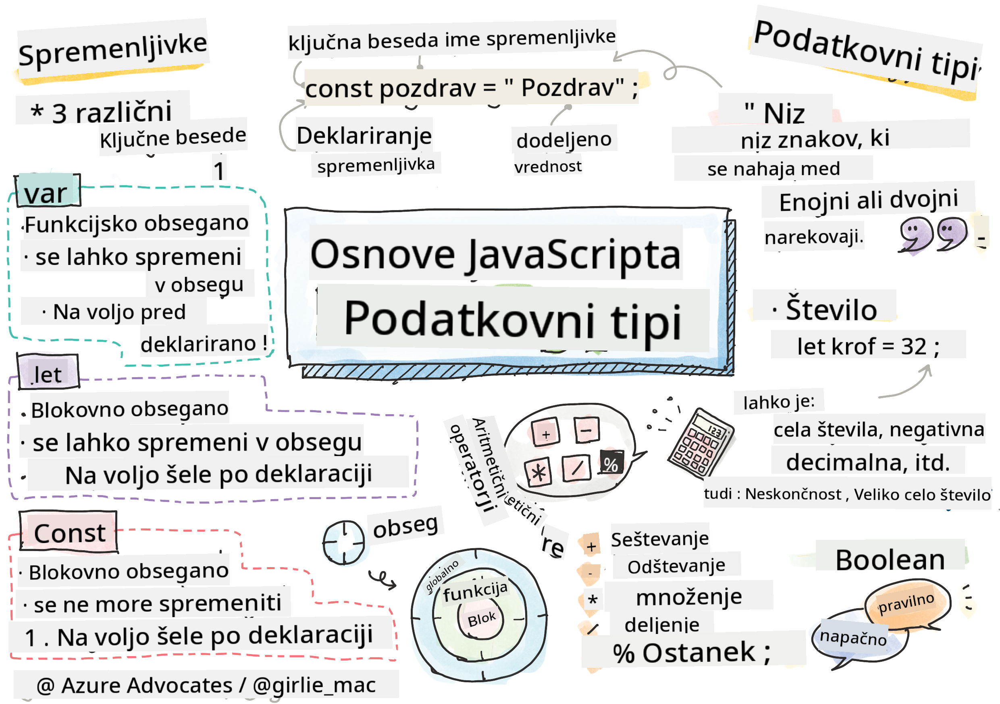

<!--
CO_OP_TRANSLATOR_METADATA:
{
  "original_hash": "fc6aef8ecfdd5b0ad2afa6e6ba52bfde",
  "translation_date": "2025-08-27T23:55:25+00:00",
  "source_file": "2-js-basics/1-data-types/README.md",
  "language_code": "sl"
}
-->
# Osnove JavaScripta: Podatkovni tipi


> Sketchnote avtorja [Tomomi Imura](https://twitter.com/girlie_mac)

## Kviz pred predavanjem
[Kviz pred predavanjem](https://ashy-river-0debb7803.1.azurestaticapps.net/quiz/7)

Ta lekcija pokriva osnove JavaScripta, jezika, ki omogoča interaktivnost na spletu.

> To lekcijo lahko opravite na [Microsoft Learn](https://docs.microsoft.com/learn/modules/web-development-101-variables/?WT.mc_id=academic-77807-sagibbon)!

[](https://youtube.com/watch?v=JNIXfGiDWM8 "Spremenljivke v JavaScriptu")

[](https://youtube.com/watch?v=AWfA95eLdq8 "Podatkovni tipi v JavaScriptu")

> 🎥 Kliknite zgornje slike za videoposnetke o spremenljivkah in podatkovnih tipih

Začnimo s spremenljivkami in podatkovnimi tipi, ki jih napolnjujejo!

## Spremenljivke

Spremenljivke shranjujejo vrednosti, ki jih lahko uporabljate in spreminjate v svoji kodi.

Ustvarjanje in **deklaracija** spremenljivke ima naslednjo sintakso **[ključna beseda] [ime]**. Sestavljena je iz dveh delov:

- **Ključna beseda**. Ključne besede so lahko `let` ali `var`.  

✅ Ključna beseda `let` je bila uvedena v ES6 in daje vaši spremenljivki tako imenovani _blokovni obseg_. Priporočljivo je, da uporabljate `let` namesto `var`. Več o blokovnih obsegih bomo obravnavali v prihodnjih delih.
- **Ime spremenljivke**, to je ime, ki ga izberete sami.

### Naloga - delo s spremenljivkami

1. **Deklarirajte spremenljivko**. Deklarirajmo spremenljivko z uporabo ključne besede `let`:

    ```javascript
    let myVariable;
    ```

   `myVariable` je zdaj deklarirana z uporabo ključne besede `let`. Trenutno nima vrednosti.

1. **Dodelite vrednost**. Shranite vrednost v spremenljivko z operatorjem `=`, ki mu sledi pričakovana vrednost.

    ```javascript
    myVariable = 123;
    ```

   > Opomba: uporaba `=` v tej lekciji pomeni, da uporabljamo "operator dodelitve", ki se uporablja za nastavitev vrednosti spremenljivki. Ne označuje enakosti.

   `myVariable` je zdaj *inicializirana* z vrednostjo 123.

1. **Preoblikujte**. Zamenjajte svojo kodo z naslednjo izjavo.

    ```javascript
    let myVariable = 123;
    ```

    Zgornje se imenuje _eksplicitna inicializacija_, ko je spremenljivka deklarirana in ji je hkrati dodeljena vrednost.

1. **Spremenite vrednost spremenljivke**. Spremenite vrednost spremenljivke na naslednji način:

   ```javascript
   myVariable = 321;
   ```

   Ko je spremenljivka deklarirana, lahko njeno vrednost kadar koli spremenite v svoji kodi z operatorjem `=` in novo vrednostjo.

   ✅ Poskusite! JavaScript lahko pišete neposredno v svojem brskalniku. Odprite okno brskalnika in pojdite na Orodja za razvijalce. V konzoli boste našli poziv; vnesite `let myVariable = 123`, pritisnite Enter, nato vnesite `myVariable`. Kaj se zgodi? Opomba: več o teh konceptih boste izvedeli v naslednjih lekcijah.

## Konstante

Deklaracija in inicializacija konstante sledi istim konceptom kot spremenljivka, z izjemo ključne besede `const`. Konstante so običajno deklarirane z velikimi črkami.

```javascript
const MY_VARIABLE = 123;
```

Konstante so podobne spremenljivkam, z dvema izjemama:

- **Morajo imeti vrednost**. Konstante morajo biti inicializirane, sicer bo prišlo do napake pri izvajanju kode.
- **Referenca se ne sme spremeniti**. Referenca konstante se ne sme spremeniti po inicializaciji, sicer bo prišlo do napake pri izvajanju kode. Poglejmo dva primera:
   - **Preprosta vrednost**. Naslednje NI dovoljeno:
   
      ```javascript
      const PI = 3;
      PI = 4; // not allowed
      ```
 
   - **Referenca objekta je zaščitena**. Naslednje NI dovoljeno.
   
      ```javascript
      const obj = { a: 3 };
      obj = { b: 5 } // not allowed
      ```

    - **Vrednost objekta ni zaščitena**. Naslednje JE dovoljeno:
    
      ```javascript
      const obj = { a: 3 };
      obj.a = 5;  // allowed
      ```

      Zgornje spreminja vrednost objekta, ne pa tudi same reference, kar je dovoljeno.

   > Opomba: `const` pomeni, da je referenca zaščitena pred ponovnim dodeljevanjem. Vrednost pa ni _nespremenljiva_ in se lahko spremeni, še posebej, če gre za kompleksno strukturo, kot je objekt.

## Podatkovni tipi

Spremenljivke lahko shranjujejo različne tipe vrednosti, kot so števila in besedilo. Ti različni tipi vrednosti so znani kot **podatkovni tipi**. Podatkovni tipi so pomemben del razvoja programske opreme, saj razvijalcem pomagajo pri odločanju, kako naj bo koda napisana in kako naj programska oprema deluje. Poleg tega imajo nekateri podatkovni tipi edinstvene lastnosti, ki pomagajo pri preoblikovanju ali pridobivanju dodatnih informacij iz vrednosti.

✅ Podatkovni tipi so znani tudi kot JavaScriptovi podatkovni primitivni tipi, saj so najnižji nivo podatkovnih tipov, ki jih zagotavlja jezik. Obstaja 7 primitivnih podatkovnih tipov: string, number, bigint, boolean, undefined, null in symbol. Vzemite si trenutek in si predstavljajte, kaj vsak od teh primitivov predstavlja. Kaj je `zebra`? Kaj pa `0`? `true`?

### Števila

V prejšnjem razdelku je bila vrednost `myVariable` podatkovni tip število.

`let myVariable = 123;`

Spremenljivke lahko shranjujejo vse vrste števil, vključno z decimalnimi ali negativnimi števili. Števila se lahko uporabljajo tudi z aritmetičnimi operatorji, ki jih bomo obravnavali v [naslednjem razdelku](../../../../2-js-basics/1-data-types).

### Aritmetični operatorji

Obstaja več vrst operatorjev za izvajanje aritmetičnih funkcij, nekateri so navedeni tukaj:

| Simbol | Opis                                                                   | Primer                          |
| ------ | ---------------------------------------------------------------------- | -------------------------------- |
| `+`    | **Seštevanje**: Izračuna vsoto dveh števil                            | `1 + 2 //pričakovani rezultat je 3`   |
| `-`    | **Odštevanje**: Izračuna razliko dveh števil                          | `1 - 2 //pričakovani rezultat je -1`  |
| `*`    | **Množenje**: Izračuna produkt dveh števil                            | `1 * 2 //pričakovani rezultat je 2`   |
| `/`    | **Deljenje**: Izračuna količnik dveh števil                           | `1 / 2 //pričakovani rezultat je 0.5` |
| `%`    | **Ostalo**: Izračuna ostanek pri deljenju dveh števil                 | `1 % 2 //pričakovani rezultat je 1`   |

✅ Poskusite! Poskusite aritmetično operacijo v konzoli svojega brskalnika. Vas rezultati presenetijo?

### Nizi

Nizi so nizi znakov, ki se nahajajo med enojnimi ali dvojnimi narekovaji.

- `'To je niz'`
- `"To je tudi niz"`
- `let myString = 'To je niz, shranjen v spremenljivki';`

Ne pozabite uporabiti narekovajev, ko pišete niz, sicer bo JavaScript domneval, da gre za ime spremenljivke.

### Oblikovanje nizov

Nizi so besedilni in jih bo treba občasno oblikovati.

Za **združevanje** dveh ali več nizov uporabite operator `+`.

```javascript
let myString1 = "Hello";
let myString2 = "World";

myString1 + myString2 + "!"; //HelloWorld!
myString1 + " " + myString2 + "!"; //Hello World!
myString1 + ", " + myString2 + "!"; //Hello, World!

```

✅ Zakaj `1 + 1 = 2` v JavaScriptu, medtem ko `'1' + '1' = 11?` Razmislite o tem. Kaj pa `'1' + 1`?

**Predloge nizov** so še en način oblikovanja nizov, le da se namesto narekovajev uporablja poševnica nazaj. Vse, kar ni navadno besedilo, mora biti postavljeno v oklepaje `${ }`. To vključuje vse spremenljivke, ki so lahko nizi.

```javascript
let myString1 = "Hello";
let myString2 = "World";

`${myString1} ${myString2}!` //Hello World!
`${myString1}, ${myString2}!` //Hello, World!
```

Svoje cilje oblikovanja lahko dosežete z obema metodama, vendar bodo predloge nizov upoštevale vse presledke in prelome vrstic.

✅ Kdaj bi uporabili predlogo niza namesto navadnega niza?

### Logične vrednosti

Logične vrednosti so lahko le dve: `true` ali `false`. Logične vrednosti pomagajo pri odločanju, katere vrstice kode naj se izvedejo, ko so določeni pogoji izpolnjeni. V mnogih primerih [operatorji](../../../../2-js-basics/1-data-types) pomagajo pri nastavitvi vrednosti logične vrednosti, pogosto pa boste opazili in pisali spremenljivke, ki so inicializirane ali katerih vrednosti se posodabljajo z operatorjem.

- `let myTrueBool = true`
- `let myFalseBool = false`

✅ Spremenljivka se lahko šteje za 'resnično', če se ovrednoti kot logična vrednost `true`. Zanimivo je, da so v JavaScriptu [vse vrednosti resnične, razen če so opredeljene kot napačne](https://developer.mozilla.org/docs/Glossary/Truthy).

---

## 🚀 Izziv

JavaScript je znan po svojih presenetljivih načinih obravnave podatkovnih tipov. Raziščite te 'zanke'. Na primer: občutljivost na velike in male črke vas lahko preseneti! Poskusite to v svoji konzoli: `let age = 1; let Age = 2; age == Age` (rezultat je `false` -- zakaj?). Katere druge zanke lahko najdete?

## Kviz po predavanju
[Kviz po predavanju](https://ashy-river-0debb7803.1.azurestaticapps.net/quiz/8)

## Pregled in samostojno učenje

Oglejte si [ta seznam vaj za JavaScript](https://css-tricks.com/snippets/javascript/) in poskusite eno. Kaj ste se naučili?

## Naloga

[Vaja za podatkovne tipe](assignment.md)

---

**Omejitev odgovornosti**:  
Ta dokument je bil preveden z uporabo storitve za prevajanje z umetno inteligenco [Co-op Translator](https://github.com/Azure/co-op-translator). Čeprav si prizadevamo za natančnost, vas prosimo, da upoštevate, da lahko avtomatizirani prevodi vsebujejo napake ali netočnosti. Izvirni dokument v njegovem maternem jeziku je treba obravnavati kot avtoritativni vir. Za ključne informacije priporočamo profesionalni človeški prevod. Ne prevzemamo odgovornosti za morebitna nesporazumevanja ali napačne razlage, ki bi nastale zaradi uporabe tega prevoda.