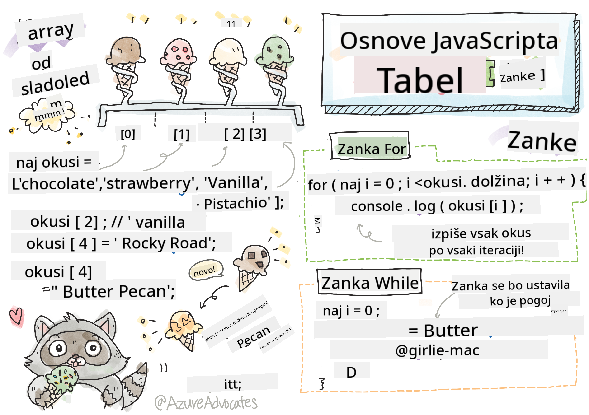

<!--
CO_OP_TRANSLATOR_METADATA:
{
  "original_hash": "3f7f87871312cf6cc12662da7d973182",
  "translation_date": "2025-08-27T23:56:55+00:00",
  "source_file": "2-js-basics/4-arrays-loops/README.md",
  "language_code": "sl"
}
-->
# Osnove JavaScripta: Tabele in Zanke

  
> Skica avtorja [Tomomi Imura](https://twitter.com/girlie_mac)

## Predavanje: Kviz
[Predavanje: kviz](https://ashy-river-0debb7803.1.azurestaticapps.net/quiz/13)

Ta lekcija pokriva osnove JavaScripta, jezika, ki omogoča interaktivnost na spletu. V tej lekciji se boste naučili o tabelah in zankah, ki se uporabljajo za manipulacijo podatkov.

[](https://youtube.com/watch?v=1U4qTyq02Xw "Tabele")

[](https://www.youtube.com/watch?v=Eeh7pxtTZ3k "Zanke")

> 🎥 Kliknite na zgornje slike za videoposnetke o tabelah in zankah.

> To lekcijo lahko opravite na [Microsoft Learn](https://docs.microsoft.com/learn/modules/web-development-101-arrays/?WT.mc_id=academic-77807-sagibbon)!

## Tabele

Delo s podatki je pogosta naloga v katerem koli programskem jeziku, in ta naloga je veliko lažja, ko so podatki organizirani v strukturirani obliki, kot so tabele. S tabelami so podatki shranjeni v strukturi, podobni seznamu. Ena glavnih prednosti tabel je, da lahko v eni tabeli shranite različne vrste podatkov.

✅ Tabele so povsod okoli nas! Ali lahko pomislite na primer tabele iz resničnega življenja, kot je na primer niz sončnih celic?

Sintaksa za tabelo je par oglatih oklepajev.

```javascript
let myArray = [];
```

To je prazna tabela, vendar so lahko tabele deklarirane že napolnjene s podatki. Več vrednosti v tabeli je ločenih z vejico.

```javascript
let iceCreamFlavors = ["Chocolate", "Strawberry", "Vanilla", "Pistachio", "Rocky Road"];
```

Vrednosti v tabeli so dodeljene z unikatno vrednostjo, imenovano **indeks**, ki je celo število, dodeljeno glede na oddaljenost od začetka tabele. V zgornjem primeru ima niz "Chocolate" indeks 0, medtem ko ima "Rocky Road" indeks 4. Indeks uporabite z oglati oklepaji za pridobivanje, spreminjanje ali vstavljanje vrednosti v tabelo.

✅ Vas preseneča, da tabele začnejo z indeksom nič? V nekaterih programskih jezikih se indeksi začnejo z 1. Zanimivo zgodovino o tem lahko [preberete na Wikipediji](https://en.wikipedia.org/wiki/Zero-based_numbering).

```javascript
let iceCreamFlavors = ["Chocolate", "Strawberry", "Vanilla", "Pistachio", "Rocky Road"];
iceCreamFlavors[2]; //"Vanilla"
```

Indeks lahko uporabite za spremembo vrednosti, kot je to:

```javascript
iceCreamFlavors[4] = "Butter Pecan"; //Changed "Rocky Road" to "Butter Pecan"
```

In lahko vstavite novo vrednost na določen indeks, kot je to:

```javascript
iceCreamFlavors[5] = "Cookie Dough"; //Added "Cookie Dough"
```

✅ Pogostejši način za dodajanje vrednosti v tabelo je uporaba operaterjev, kot je array.push().

Če želite izvedeti, koliko elementov je v tabeli, uporabite lastnost `length`.

```javascript
let iceCreamFlavors = ["Chocolate", "Strawberry", "Vanilla", "Pistachio", "Rocky Road"];
iceCreamFlavors.length; //5
```

✅ Preizkusite sami! Uporabite konzolo svojega brskalnika za ustvarjanje in manipulacijo tabele po svoji izbiri.

## Zanke

Zanke nam omogočajo izvajanje ponavljajočih se ali **iterativnih** nalog in lahko prihranijo veliko časa in kode. Vsaka iteracija se lahko razlikuje po svojih spremenljivkah, vrednostih in pogojih. Obstajajo različne vrste zank v JavaScriptu, ki imajo majhne razlike, vendar v bistvu delajo isto: ponavljajo se čez podatke.

### Zanka For

Zanka `for` zahteva 3 dele za iteracijo:
- `števec` Spremenljivka, ki je običajno inicializirana s številom, ki šteje število iteracij
- `pogoj` Izraz, ki uporablja primerjalne operaterje, da ustavi zanko, ko je `false`
- `iteracijski-izraz` Izvede se na koncu vsake iteracije, običajno za spremembo vrednosti števca

```javascript
// Counting up to 10
for (let i = 0; i < 10; i++) {
  console.log(i);
}
```

✅ Zaženite to kodo v konzoli brskalnika. Kaj se zgodi, ko naredite majhne spremembe števca, pogoja ali iteracijskega izraza? Ali lahko naredite, da se zanka izvaja nazaj, kot odštevanje?

### Zanka While

Za razliko od sintakse zanke `for`, zanke `while` zahtevajo le pogoj, ki bo ustavil zanko, ko bo pogoj postal `false`. Pogoji v zankah običajno temeljijo na drugih vrednostih, kot so števci, in jih je treba upravljati med zanko. Začetne vrednosti števcev je treba ustvariti zunaj zanke, in vsi izrazi za izpolnitev pogoja, vključno s spreminjanjem števca, morajo biti vzdrževani znotraj zanke.

```javascript
//Counting up to 10
let i = 0;
while (i < 10) {
 console.log(i);
 i++;
}
```

✅ Zakaj bi izbrali zanko for namesto while? 17 tisoč uporabnikov je imelo isto vprašanje na StackOverflow, in nekatera mnenja [bi vam lahko bila zanimiva](https://stackoverflow.com/questions/39969145/while-loops-vs-for-loops-in-javascript).

## Zanke in Tabele

Tabele se pogosto uporabljajo z zankami, ker večina pogojev zahteva dolžino tabele za ustavitev zanke, indeks pa je lahko tudi vrednost števca.

```javascript
let iceCreamFlavors = ["Chocolate", "Strawberry", "Vanilla", "Pistachio", "Rocky Road"];

for (let i = 0; i < iceCreamFlavors.length; i++) {
  console.log(iceCreamFlavors[i]);
} //Ends when all flavors are printed
```

✅ Eksperimentirajte z iteracijo čez tabelo, ki jo ustvarite sami, v konzoli brskalnika.

---

## 🚀 Izziv

Obstajajo tudi drugi načini za iteracijo čez tabele, poleg zank for in while. Obstajajo [forEach](https://developer.mozilla.org/docs/Web/JavaScript/Reference/Global_Objects/Array/forEach), [for-of](https://developer.mozilla.org/docs/Web/JavaScript/Reference/Statements/for...of) in [map](https://developer.mozilla.org/docs/Web/JavaScript/Reference/Global_Objects/Array/map). Prepišite svojo zanko za tabelo z eno od teh tehnik.

## Po predavanju: Kviz
[Po predavanju: kviz](https://ashy-river-0debb7803.1.azurestaticapps.net/quiz/14)

## Pregled in Samostojno Učenje

Tabele v JavaScriptu imajo veliko metod, ki so izjemno uporabne za manipulacijo podatkov. [Preberite o teh metodah](https://developer.mozilla.org/docs/Web/JavaScript/Reference/Global_Objects/Array) in jih preizkusite (na primer push, pop, slice in splice) na tabeli, ki jo ustvarite sami.

## Naloga

[Iteracija čez tabelo](assignment.md)

---

**Omejitev odgovornosti**:  
Ta dokument je bil preveden z uporabo storitve za prevajanje z umetno inteligenco [Co-op Translator](https://github.com/Azure/co-op-translator). Čeprav si prizadevamo za natančnost, vas prosimo, da upoštevate, da lahko avtomatizirani prevodi vsebujejo napake ali netočnosti. Izvirni dokument v njegovem izvirnem jeziku je treba obravnavati kot avtoritativni vir. Za ključne informacije priporočamo profesionalni človeški prevod. Ne prevzemamo odgovornosti za morebitna nesporazumevanja ali napačne razlage, ki bi nastale zaradi uporabe tega prevoda.