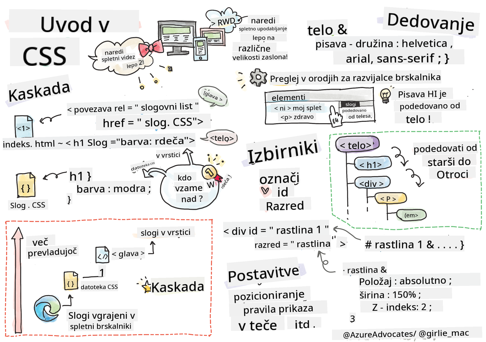
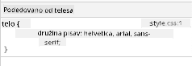

<!--
CO_OP_TRANSLATOR_METADATA:
{
  "original_hash": "e375c2aeb94e2407f2667633d39580bd",
  "translation_date": "2025-08-28T00:03:20+00:00",
  "source_file": "3-terrarium/2-intro-to-css/README.md",
  "language_code": "sl"
}
-->
# Projekt Terrarij, 2. del: Uvod v CSS


> Sketchnote avtorja [Tomomi Imura](https://twitter.com/girlie_mac)

## Predhodni kviz

[Predhodni kviz](https://ashy-river-0debb7803.1.azurestaticapps.net/quiz/17)

### Uvod

CSS ali kaskadne slogovne predloge rešujejo pomemben problem spletnega razvoja: kako narediti vašo spletno stran vizualno privlačno. Oblikovanje aplikacij jih naredi bolj uporabne in estetsko privlačne; CSS lahko uporabite tudi za ustvarjanje odzivnega spletnega oblikovanja (RWD), kar omogoča, da vaše aplikacije izgledajo dobro ne glede na velikost zaslona. CSS ni namenjen le lepemu videzu aplikacij; njegova specifikacija vključuje tudi animacije in transformacije, ki omogočajo napredne interakcije v vaših aplikacijah. Skupina za delo na CSS skrbi za vzdrževanje trenutnih specifikacij CSS; njihovo delo lahko spremljate na [spletnem mestu World Wide Web Consortium](https://www.w3.org/Style/CSS/members).

> Opomba: CSS je jezik, ki se razvija, tako kot vse na spletu, in ne vsi brskalniki podpirajo novejše dele specifikacije. Vedno preverite svoje implementacije s pomočjo [CanIUse.com](https://caniuse.com).

V tej lekciji bomo dodali sloge našemu spletnemu terariju in se naučili več o nekaterih konceptih CSS: kaskadi, dedovanju, uporabi selektorjev, pozicioniranju in uporabi CSS za gradnjo postavitev. Med tem bomo postavili terarij in ustvarili dejanski terarij.

### Predpogoj

HTML za vaš terarij mora biti že pripravljen in pripravljen za oblikovanje.

> Oglejte si video

> 
> [](https://www.youtube.com/watch?v=6yIdOIV9p1I)

### Naloga

V mapi za vaš terarij ustvarite novo datoteko z imenom `style.css`. To datoteko uvozite v razdelek `<head>`:

```html
<link rel="stylesheet" href="./style.css" />
```

---

## Kaskada

Kaskadne slogovne predloge vključujejo idejo, da se slogi 'kaskadno' uporabljajo glede na njihovo prioriteto. Slogi, ki jih določi avtor spletne strani, imajo prednost pred tistimi, ki jih določi brskalnik. Slogi, določeni 'v vrstici', imajo prednost pred tistimi, ki so določeni v zunanji slogovni predlogi.

### Naloga

Dodajte vrstični slog "color: red" v svojo oznako `<h1>`:

```HTML
<h1 style="color: red">My Terrarium</h1>
```

Nato dodajte naslednjo kodo v svojo datoteko `style.css`:

```CSS
h1 {
 color: blue;
}
```

✅ Katera barva se prikaže v vaši spletni aplikaciji? Zakaj? Ali lahko najdete način za preglasitev slogov? Kdaj bi to želeli narediti ali zakaj ne?

---

## Dedovanje

Slogi se dedujejo od slogov prednikov do potomcev, tako da gnezdeni elementi podedujejo sloge svojih staršev.

### Naloga

Nastavite pisavo telesa na določeno pisavo in preverite pisavo gnezdenega elementa:

```CSS
body {
	font-family: helvetica, arial, sans-serif;
}
```

Odprite konzolo brskalnika na zavihku 'Elements' in opazujte pisavo H1. Pisava je podedovana od telesa, kot je navedeno v brskalniku:



✅ Ali lahko naredite, da gnezden slog podeduje drugačno lastnost?

---

## Selektorji CSS

### Oznake

Do zdaj ima vaša datoteka `style.css` oblikovane le nekaj oznak, aplikacija pa izgleda precej nenavadno:

```CSS
body {
	font-family: helvetica, arial, sans-serif;
}

h1 {
	color: #3a241d;
	text-align: center;
}
```

Tak način oblikovanja oznake vam omogoča nadzor nad edinstvenimi elementi, vendar morate nadzorovati sloge mnogih rastlin v vašem terariju. Za to morate uporabiti selektorje CSS.

### ID-ji

Dodajte nekaj slogov za postavitev levega in desnega vsebnika. Ker je le en levi in en desni vsebnik, so v oznaki označeni z ID-ji. Za njihovo oblikovanje uporabite `#`:

```CSS
#left-container {
	background-color: #eee;
	width: 15%;
	left: 0px;
	top: 0px;
	position: absolute;
	height: 100%;
	padding: 10px;
}

#right-container {
	background-color: #eee;
	width: 15%;
	right: 0px;
	top: 0px;
	position: absolute;
	height: 100%;
	padding: 10px;
}
```

Tukaj ste te vsebnike postavili z absolutnim pozicioniranjem na skrajno levo in desno stran zaslona ter uporabili odstotke za njihovo širino, da se lahko prilagodijo majhnim mobilnim zaslonom.

✅ Ta koda je precej ponavljajoča, zato ni "DRY" (Don't Repeat Yourself); ali lahko najdete boljši način za oblikovanje teh ID-jev, morda z ID-jem in razredom? Spremeniti bi morali oznako in preoblikovati CSS:

```html
<div id="left-container" class="container"></div>
```

### Razredi

V zgornjem primeru ste oblikovali dva edinstvena elementa na zaslonu. Če želite, da se slogi uporabljajo za več elementov na zaslonu, lahko uporabite razrede CSS. To naredite za postavitev rastlin v levem in desnem vsebniku.

Opazite, da ima vsaka rastlina v oznaki HTML kombinacijo ID-jev in razredov. ID-ji se tukaj uporabljajo za JavaScript, ki ga boste kasneje dodali za manipulacijo postavitve rastlin v terariju. Razredi pa dajejo vsem rastlinam določen slog.

```html
<div class="plant-holder">
	
</div>
```

Dodajte naslednje v svojo datoteko `style.css`:

```CSS
.plant-holder {
	position: relative;
	height: 13%;
	left: -10px;
}

.plant {
	position: absolute;
	max-width: 150%;
	max-height: 150%;
	z-index: 2;
}
```

Pomembno v tem odlomku je mešanje relativnega in absolutnega pozicioniranja, kar bomo obravnavali v naslednjem razdelku. Oglejte si, kako so višine obravnavane z odstotki:

Višino držala za rastline nastavite na 13 %, kar je dobra številka, da se vse rastline prikažejo v vsakem navpičnem vsebniku brez potrebe po drsenju.

Držalo za rastline premaknete v levo, da so rastline bolj osredotočene znotraj vsebnika. Slike imajo veliko prozornega ozadja, da so bolj povlečljive, zato jih je treba potisniti v levo, da se bolje prilegajo zaslonu.

Rastlini sami določite največjo širino 150 %. To omogoča, da se zmanjša, ko se brskalnik zmanjša. Poskusite spremeniti velikost brskalnika; rastline ostanejo v svojih vsebnikih, vendar se zmanjšajo, da se prilegajo.

Pomembna je tudi uporaba z-indexa, ki nadzoruje relativno višino elementa (tako da rastline sedijo na vsebniku in se zdijo, kot da so v terariju).

✅ Zakaj potrebujete tako selektor za držalo rastlin kot za rastlino?

## Pozicioniranje CSS

Mešanje lastnosti pozicioniranja (obstajajo statično, relativno, fiksno, absolutno in lepljivo pozicioniranje) je lahko nekoliko zapleteno, vendar vam ob pravilni uporabi omogoča dober nadzor nad elementi na vaših straneh.

Absolutno pozicionirani elementi so pozicionirani glede na najbližje pozicionirane prednike, in če jih ni, so pozicionirani glede na telo dokumenta.

Relativno pozicionirani elementi so pozicionirani glede na navodila CSS za prilagoditev njihove postavitve glede na začetni položaj.

V našem primeru je `plant-holder` relativno pozicioniran element, ki je pozicioniran znotraj absolutno pozicioniranega vsebnika. Rezultat je, da so stranski vsebniki pripeti levo in desno, `plant-holder` pa je ugnezden, prilagaja se znotraj stranskih vsebnikov in daje prostor za postavitev rastlin v navpično vrsto.

> Tudi `plant` ima absolutno pozicioniranje, kar je potrebno, da je povlečljiv, kot boste odkrili v naslednji lekciji.

✅ Eksperimentirajte s spreminjanjem vrst pozicioniranja stranskih vsebnikov in držala za rastline. Kaj se zgodi?

## Postavitve CSS

Zdaj boste uporabili, kar ste se naučili, za izdelavo samega terarija, vse z uporabo CSS!

Najprej oblikujte otroke div-a `.terrarium` kot zaobljen pravokotnik z uporabo CSS:

```CSS
.jar-walls {
	height: 80%;
	width: 60%;
	background: #d1e1df;
	border-radius: 1rem;
	position: absolute;
	bottom: 0.5%;
	left: 20%;
	opacity: 0.5;
	z-index: 1;
}

.jar-top {
	width: 50%;
	height: 5%;
	background: #d1e1df;
	position: absolute;
	bottom: 80.5%;
	left: 25%;
	opacity: 0.7;
	z-index: 1;
}

.jar-bottom {
	width: 50%;
	height: 1%;
	background: #d1e1df;
	position: absolute;
	bottom: 0%;
	left: 25%;
	opacity: 0.7;
}

.dirt {
	width: 60%;
	height: 5%;
	background: #3a241d;
	position: absolute;
	border-radius: 0 0 1rem 1rem;
	bottom: 1%;
	left: 20%;
	opacity: 0.7;
	z-index: -1;
}
```

Opazite uporabo odstotkov tukaj. Če zmanjšate brskalnik, lahko vidite, kako se kozarec prilagaja. Prav tako opazite širine in višinske odstotke za elemente kozarca in kako je vsak element absolutno pozicioniran v središču, pripet na dno pogleda.

Uporabljamo tudi `rem` za zaobljenost robov, dolžino, ki je relativna na pisavo. Več o tej vrsti relativnih meritev preberite v [specifikaciji CSS](https://www.w3.org/TR/css-values-3/#font-relative-lengths).

✅ Poskusite spremeniti barve in prosojnost kozarca v primerjavi s tistimi pri zemlji. Kaj se zgodi? Zakaj?

---

## 🚀Izziv

Dodajte 'mehurček' sijaja na spodnji levi del kozarca, da bo videti bolj steklen. Oblikovali boste `.jar-glossy-long` in `.jar-glossy-short`, da bosta videti kot odsevni sijaj. Tukaj je, kako bi to izgledalo:


Za dokončanje kviza po predavanju preglejte ta modul Learn: [Oblikujte svojo HTML aplikacijo s CSS](https://docs.microsoft.com/learn/modules/build-simple-website/4-css-basics/?WT.mc_id=academic-77807-sagibbon)

## Kviz po predavanju

[Kviz po predavanju](https://ashy-river-0debb7803.1.azurestaticapps.net/quiz/18)

## Pregled in samostojno učenje

CSS se zdi na prvi pogled preprost, vendar se pri poskusu popolnega oblikovanja aplikacije za vse brskalnike in vse velikosti zaslonov pojavijo številni izzivi. CSS-Grid in Flexbox sta orodji, ki sta bila razvita, da bi delo naredila bolj strukturirano in zanesljivo. O teh orodjih se učite z igranjem [Flexbox Froggy](https://flexboxfroggy.com/) in [Grid Garden](https://codepip.com/games/grid-garden/).

## Naloga

[Refaktoriranje CSS](assignment.md)

---

**Omejitev odgovornosti**:  
Ta dokument je bil preveden z uporabo storitve za prevajanje z umetno inteligenco [Co-op Translator](https://github.com/Azure/co-op-translator). Čeprav si prizadevamo za natančnost, vas prosimo, da upoštevate, da lahko avtomatizirani prevodi vsebujejo napake ali netočnosti. Izvirni dokument v njegovem maternem jeziku je treba obravnavati kot avtoritativni vir. Za ključne informacije priporočamo profesionalni človeški prevod. Ne prevzemamo odgovornosti za morebitna nesporazume ali napačne razlage, ki bi nastale zaradi uporabe tega prevoda.