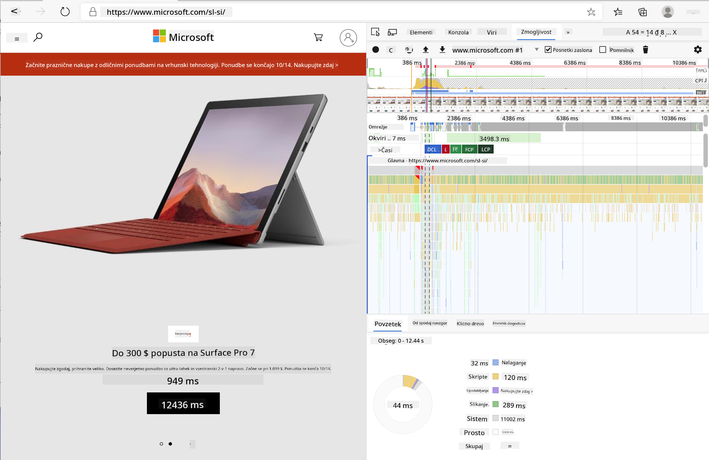
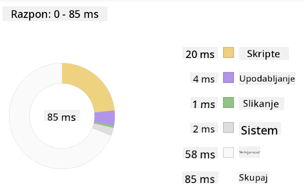
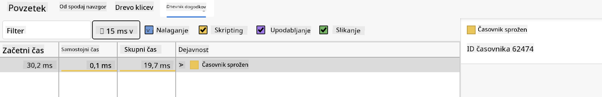

<!--
CO_OP_TRANSLATOR_METADATA:
{
  "original_hash": "f198c6b817b4b2a99749f4662e7cae98",
  "translation_date": "2025-08-27T23:31:10+00:00",
  "source_file": "5-browser-extension/3-background-tasks-and-performance/README.md",
  "language_code": "sl"
}
-->
# Projekt razširitve brskalnika, 3. del: Spoznajte ozadna opravila in zmogljivost

## Predhodni kviz

[Predhodni kviz](https://ashy-river-0debb7803.1.azurestaticapps.net/quiz/27)

### Uvod

V zadnjih dveh lekcijah tega modula ste se naučili, kako zgraditi obrazec in prikazno območje za podatke, pridobljene iz API-ja. To je zelo standarden način ustvarjanja spletne prisotnosti. Naučili ste se tudi, kako obravnavati pridobivanje podatkov asinhrono. Vaša razširitev brskalnika je skoraj končana.

Ostaja še upravljanje nekaterih ozadnih opravil, vključno z osveževanjem barve ikone razširitve, zato je to odličen trenutek, da se pogovorimo o tem, kako brskalnik upravlja tovrstna opravila. Razmislimo o teh nalogah brskalnika v kontekstu zmogljivosti vaših spletnih sredstev med njihovim razvojem.

## Osnove spletne zmogljivosti

> "Zmogljivost spletne strani je odvisna od dveh stvari: kako hitro se stran naloži in kako hitro se koda na njej izvaja." -- [Zack Grossbart](https://www.smashingmagazine.com/2012/06/javascript-profiling-chrome-developer-tools/)

Tema, kako narediti vaše spletne strani izjemno hitre na vseh vrstah naprav, za vse vrste uporabnikov in v vseh situacijah, je pričakovano obsežna. Tukaj je nekaj točk, ki jih je treba upoštevati pri gradnji standardnega spletnega projekta ali razširitve brskalnika.

Prva stvar, ki jo morate storiti, da zagotovite učinkovito delovanje vaše strani, je zbiranje podatkov o njeni zmogljivosti. Prvo mesto za to so razvojna orodja vašega spletnega brskalnika. V brskalniku Edge lahko izberete gumb "Nastavitve in več" (ikona treh pik v zgornjem desnem kotu brskalnika), nato pa se pomaknete na Več orodij > Razvojna orodja in odprete zavihek Zmogljivost. Razvojna orodja lahko odprete tudi s kombinacijo tipk `Ctrl` + `Shift` + `I` v sistemu Windows ali `Option` + `Command` + `I` v sistemu Mac.

Zavihek Zmogljivost vsebuje orodje za profiliranje. Odprite spletno stran (poskusite na primer [https://www.microsoft.com](https://www.microsoft.com/?WT.mc_id=academic-77807-sagibbon)) in kliknite gumb 'Snemaj', nato osvežite stran. Snemanje lahko kadar koli ustavite, nato pa si lahko ogledate rutine, ki se generirajo za 'skriptiranje', 'upodabljanje' in 'risanje' strani:



✅ Obiščite [Microsoftovo dokumentacijo](https://docs.microsoft.com/microsoft-edge/devtools-guide/performance/?WT.mc_id=academic-77807-sagibbon) o zavihku Zmogljivost v brskalniku Edge.

> Nasvet: za natančno merjenje časa zagona vaše spletne strani počistite predpomnilnik brskalnika.

Izberite elemente časovnice profila, da povečate dogodke, ki se zgodijo med nalaganjem vaše strani.

Pridobite posnetek zmogljivosti vaše strani tako, da izberete del časovnice profila in si ogledate povzetek:



Preverite dnevnik dogodkov, da vidite, ali je kateri dogodek trajal dlje kot 15 ms:



✅ Spoznajte svoj profiler! Odprite razvojna orodja na tej strani in preverite, ali obstajajo ozka grla. Katero sredstvo se nalaga najpočasneje? Katero najhitreje?

## Preverjanje profiliranja

Na splošno obstajajo nekatera "problematična področja", na katera bi moral biti pozoren vsak spletni razvijalec pri gradnji strani, da se izogne neprijetnim presenečenjem ob času objave v produkciji.

**Velikosti sredstev**: Splet je v zadnjih nekaj letih postal 'težji' in zato počasnejši. Del te teže je povezan z uporabo slik.

✅ Prebrskajte [Internetni arhiv](https://httparchive.org/reports/page-weight) za zgodovinski pregled teže strani in več.

Dobra praksa je zagotoviti, da so vaše slike optimizirane in dostavljene v ustrezni velikosti in ločljivosti za vaše uporabnike.

**Prehodi po DOM-u**: Brskalnik mora zgraditi svoj model dokumenta (DOM) na podlagi kode, ki jo napišete, zato je v interesu dobre zmogljivosti strani, da ohranite oznake minimalne, pri čemer uporabljate in oblikujete le tisto, kar stran potrebuje. Na tej točki bi lahko optimizirali odvečni CSS, povezan s stranjo; na primer, slogi, ki jih je treba uporabiti le na eni strani, ne potrebujejo vključitve v glavno slogovno datoteko.

**JavaScript**: Vsak razvijalec JavaScripta bi moral paziti na 'skripte, ki blokirajo upodabljanje', ki jih je treba naložiti, preden se lahko prehodi in nariše preostali DOM v brskalnik. Razmislite o uporabi `defer` z vašimi vgrajenimi skripti (kot je storjeno v modulu Terrarium).

✅ Preizkusite nekaj strani na [spletni strani za testiranje hitrosti](https://www.webpagetest.org/), da se naučite več o običajnih preverjanjih, ki se izvajajo za določanje zmogljivosti strani.

Zdaj, ko imate predstavo o tem, kako brskalnik upodablja sredstva, ki mu jih pošljete, si poglejmo zadnje stvari, ki jih morate storiti, da dokončate svojo razširitev:

### Ustvarite funkcijo za izračun barve

V datoteki `/src/index.js` dodajte funkcijo z imenom `calculateColor()` za serijo spremenljivk `const`, ki ste jih nastavili za dostop do DOM-a:

```JavaScript
function calculateColor(value) {
	let co2Scale = [0, 150, 600, 750, 800];
	let colors = ['#2AA364', '#F5EB4D', '#9E4229', '#381D02', '#381D02'];

	let closestNum = co2Scale.sort((a, b) => {
		return Math.abs(a - value) - Math.abs(b - value);
	})[0];
	console.log(value + ' is closest to ' + closestNum);
	let num = (element) => element > closestNum;
	let scaleIndex = co2Scale.findIndex(num);

	let closestColor = colors[scaleIndex];
	console.log(scaleIndex, closestColor);

	chrome.runtime.sendMessage({ action: 'updateIcon', value: { color: closestColor } });
}
```

Kaj se tukaj dogaja? Posredujete vrednost (intenzivnost ogljika) iz klica API-ja, ki ste ga dokončali v prejšnji lekciji, nato pa izračunate, kako blizu je njena vrednost indeksu, predstavljenemu v polju barv. Nato to najbližjo vrednost barve pošljete prek runtime okolja Chrome.

Runtime okolje Chrome ima [API](https://developer.chrome.com/extensions/runtime), ki obravnava vse vrste ozadnih opravil, vaša razširitev pa ga izkorišča:

> "Uporabite API runtime okolja Chrome za pridobitev ozadnih strani, vrnitev podrobnosti o manifestu ter poslušanje in odzivanje na dogodke v življenjskem ciklu aplikacije ali razširitve. Ta API lahko uporabite tudi za pretvorbo relativne poti URL-jev v popolnoma kvalificirane URL-je."

✅ Če razvijate to razširitev brskalnika za Edge, vas morda preseneča, da uporabljate API Chrome. Novejše različice brskalnika Edge delujejo na pogonu brskalnika Chromium, zato lahko izkoristite ta orodja.

> Opomba: če želite profilirati razširitev brskalnika, zaženite razvojna orodja znotraj same razširitve, saj je to ločen primerek brskalnika.

### Nastavite privzeto barvo ikone

Zdaj v funkciji `init()` nastavite ikono na generično zeleno barvo, tako da znova pokličete akcijo `updateIcon` okolja Chrome:

```JavaScript
chrome.runtime.sendMessage({
	action: 'updateIcon',
		value: {
			color: 'green',
		},
});
```

### Pokličite funkcijo, izvedite klic

Nato pokličite funkcijo, ki ste jo pravkar ustvarili, tako da jo dodate obljubi, ki jo vrne API C02Signal:

```JavaScript
//let CO2...
calculateColor(CO2);
```

In na koncu, v datoteki `/dist/background.js`, dodajte poslušalca za te klice ozadnih akcij:

```JavaScript
chrome.runtime.onMessage.addListener(function (msg, sender, sendResponse) {
	if (msg.action === 'updateIcon') {
		chrome.browserAction.setIcon({ imageData: drawIcon(msg.value) });
	}
});
//borrowed from energy lollipop extension, nice feature!
function drawIcon(value) {
	let canvas = document.createElement('canvas');
	let context = canvas.getContext('2d');

	context.beginPath();
	context.fillStyle = value.color;
	context.arc(100, 100, 50, 0, 2 * Math.PI);
	context.fill();

	return context.getImageData(50, 50, 100, 100);
}
```

V tej kodi dodajate poslušalca za vse sporočila, ki prihajajo v upravitelja ozadnih opravil. Če je klic imenovan 'updateIcon', se nato izvede naslednja koda za risanje ikone ustrezne barve z uporabo API-ja Canvas.

✅ Več o API-ju Canvas boste izvedeli v [lekcijah o vesoljski igri](../../6-space-game/2-drawing-to-canvas/README.md).

Zdaj ponovno zgradite svojo razširitev (`npm run build`), osvežite in zaženite svojo razširitev ter opazujte spremembo barve. Je pravi čas za opravilo ali pomivanje posode? Zdaj veste!

Čestitamo, zgradili ste uporabno razširitev brskalnika in se naučili več o delovanju brskalnika ter profiliranju njegove zmogljivosti.

---

## 🚀 Izziv

Raziskujte nekatere odprtokodne spletne strani, ki obstajajo že dolgo, in na podlagi njihove zgodovine na GitHubu preverite, ali so bile skozi leta optimizirane za zmogljivost, če sploh. Kaj je najpogostejša težava?

## Kviz po predavanju

[Kviz po predavanju](https://ashy-river-0debb7803.1.azurestaticapps.net/quiz/28)

## Pregled in samostojno učenje

Razmislite o prijavi na [novice o zmogljivosti](https://perf.email/).

Raziskujte nekatere načine, kako brskalniki ocenjujejo spletno zmogljivost, tako da pregledate zavihke zmogljivosti v njihovih spletnih orodjih. Ali opazite kakšne večje razlike?

## Naloga

[Analizirajte zmogljivost spletne strani](assignment.md)

---

**Omejitev odgovornosti**:  
Ta dokument je bil preveden z uporabo storitve za prevajanje z umetno inteligenco [Co-op Translator](https://github.com/Azure/co-op-translator). Čeprav si prizadevamo za natančnost, vas prosimo, da upoštevate, da lahko avtomatizirani prevodi vsebujejo napake ali netočnosti. Izvirni dokument v njegovem maternem jeziku je treba obravnavati kot avtoritativni vir. Za ključne informacije priporočamo profesionalni človeški prevod. Ne prevzemamo odgovornosti za morebitna nesporazumevanja ali napačne razlage, ki bi nastale zaradi uporabe tega prevoda.