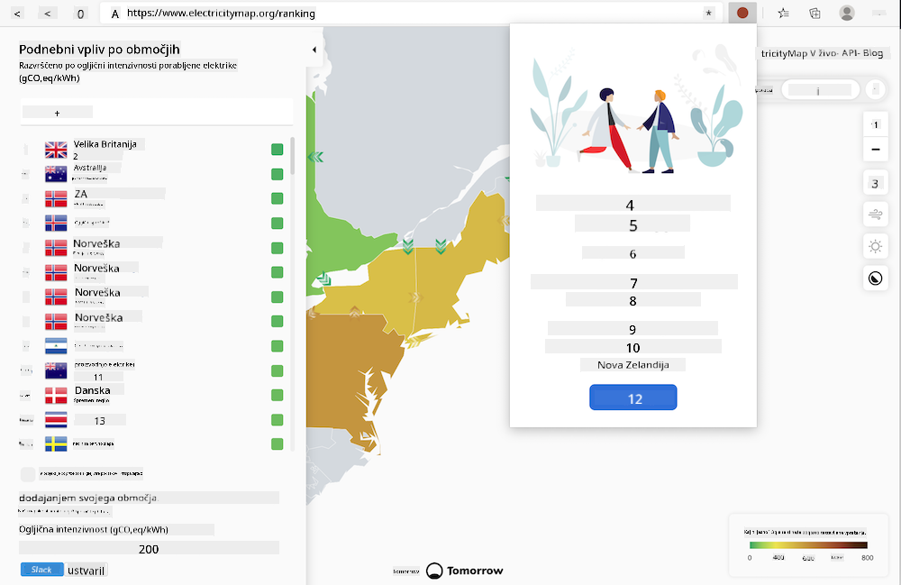
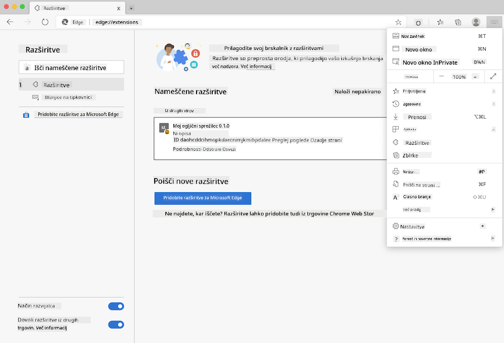

<!--
CO_OP_TRANSLATOR_METADATA:
{
  "original_hash": "3f5e6821e0febccfc5d05e7c944d9e3d",
  "translation_date": "2025-08-27T23:34:23+00:00",
  "source_file": "5-browser-extension/solution/translation/README.ja.md",
  "language_code": "sl"
}
-->
# Razširitev brskalnika Carbon Trigger: Končana koda

Z uporabo API-ja CO2 Signal podjetja tmrow lahko zgradite razširitev brskalnika, ki prikazuje opomnik o tem, kako intenzivna je poraba električne energije v vaši regiji. To vam omogoča, da spremljate porabo energije in na podlagi teh informacij sprejemate odločitve o svojih dejavnostih.



## Uvod

Potrebujete nameščen [npm](https://npmjs.com). Prenesite kopijo te kode v mapo na svojem računalniku.

Namestite vse potrebne pakete.

```
npm install
```

S pomočjo webpacka zgradite razširitev.

```
npm run build
```

Za namestitev v Edge poiščite ploščo »Razširitve« v meniju s »tremi pikami« v zgornjem desnem kotu brskalnika. Od tam izberite »Naloži razpakirano« in naložite novo razširitev. Ko se prikaže poziv, odprite mapo »dist«, da naložite razširitev. Za uporabo boste potrebovali API ključ CO2 Signal ([pridobite ga tukaj po e-pošti](https://www.co2signal.com/) - vnesite svoj e-poštni naslov v polje na tej strani) in [kodo za vašo regijo](http://api.electricitymap.org/v3/zones), ki je združljiva z [Electricity Map](https://www.electricitymap.org/map) (na primer, za Boston uporabite 'US-NEISO').



Ko vmesniku razširitve vnesete API ključ in regijo, se bo barvna pika, prikazana v orodni vrstici brskalnika, spremenila, da odraža porabo energije v vaši regiji. To vam bo pomagalo ugotoviti, katere dejavnosti, ki zahtevajo energijo, so primerne. Koncept sistema »pike« sem povzel po [Energy Lollipop extension](https://energylollipop.com/) za emisije v Kaliforniji.

---

**Omejitev odgovornosti**:  
Ta dokument je bil preveden z uporabo storitve za prevajanje z umetno inteligenco [Co-op Translator](https://github.com/Azure/co-op-translator). Čeprav si prizadevamo za natančnost, vas prosimo, da upoštevate, da lahko avtomatizirani prevodi vsebujejo napake ali netočnosti. Izvirni dokument v njegovem maternem jeziku je treba obravnavati kot avtoritativni vir. Za ključne informacije priporočamo profesionalni človeški prevod. Ne prevzemamo odgovornosti za morebitna nesporazumevanja ali napačne razlage, ki bi nastale zaradi uporabe tega prevoda.