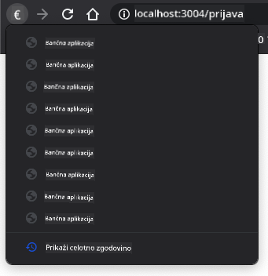

<!--
CO_OP_TRANSLATOR_METADATA:
{
  "original_hash": "8da1b5e2c63f749808858c53f37b8ce7",
  "translation_date": "2025-08-27T23:25:29+00:00",
  "source_file": "7-bank-project/1-template-route/README.md",
  "language_code": "sl"
}
-->
# Ustvarjanje bančne aplikacije, 1. del: HTML predloge in poti v spletni aplikaciji

## Predhodni kviz

[Predhodni kviz](https://ashy-river-0debb7803.1.azurestaticapps.net/quiz/41)

### Uvod

Odkar je JavaScript postal del brskalnikov, so spletne strani postale bolj interaktivne in kompleksne kot kdajkoli prej. Spletne tehnologije se zdaj pogosto uporabljajo za ustvarjanje popolnoma funkcionalnih aplikacij, ki delujejo neposredno v brskalniku, in jih imenujemo [spletne aplikacije](https://en.wikipedia.org/wiki/Web_application). Ker so spletne aplikacije zelo interaktivne, uporabniki ne želijo čakati na ponovno nalaganje celotne strani ob vsakem opravljenem dejanju. Zato se JavaScript uporablja za neposredno posodabljanje HTML-ja prek DOM-a, kar omogoča bolj gladko uporabniško izkušnjo.

V tej lekciji bomo postavili temelje za ustvarjanje bančne spletne aplikacije, pri čemer bomo uporabili HTML predloge za ustvarjanje več zaslonov, ki jih je mogoče prikazati in posodobiti brez ponovnega nalaganja celotne HTML strani.

### Predpogoji

Za testiranje spletne aplikacije, ki jo bomo ustvarili v tej lekciji, potrebujete lokalni spletni strežnik. Če ga nimate, lahko namestite [Node.js](https://nodejs.org) in uporabite ukaz `npx lite-server` iz mape vašega projekta. Ta ukaz bo ustvaril lokalni spletni strežnik in odprl vašo aplikacijo v brskalniku.

### Priprava

Na svojem računalniku ustvarite mapo z imenom `bank` in v njej datoteko z imenom `index.html`. Začeli bomo s tem HTML [osnovnim kodnim ogrodjem](https://en.wikipedia.org/wiki/Boilerplate_code):

```html
<!DOCTYPE html>
<html lang="en">
  <head>
    <meta charset="UTF-8">
    <meta name="viewport" content="width=device-width, initial-scale=1.0">
    <title>Bank App</title>
  </head>
  <body>
    <!-- This is where you'll work -->
  </body>
</html>
```

---

## HTML predloge

Če želite ustvariti več zaslonov za spletno stran, bi ena rešitev bila ustvariti eno HTML datoteko za vsak zaslon, ki ga želite prikazati. Vendar pa ta rešitev prinaša nekaj nevšečnosti:

- Ob preklopu med zasloni morate ponovno naložiti celoten HTML, kar je lahko počasno.
- Težko je deliti podatke med različnimi zasloni.

Drugi pristop je uporaba ene HTML datoteke, v kateri definirate več [HTML predlog](https://developer.mozilla.org/docs/Web/HTML/Element/template) z uporabo elementa `<template>`. Predloga je ponovno uporabljiv HTML blok, ki ga brskalnik ne prikaže, in ga je treba ustvariti med izvajanjem z uporabo JavaScripta.

### Naloga

Ustvarili bomo bančno aplikacijo z dvema zaslonoma: stran za prijavo in nadzorno ploščo. Najprej dodajmo v telo HTML element, ki bo služil kot mesto za prikaz različnih zaslonov naše aplikacije:

```html
<div id="app">Loading...</div>
```

Dodelili smo mu `id`, da ga bomo kasneje lažje našli z JavaScriptom.

> Nasvet: Ker bo vsebina tega elementa zamenjana, lahko vanj postavimo sporočilo ali indikator nalaganja, ki bo prikazan med nalaganjem aplikacije.

Nato dodajmo spodaj HTML predlogo za stran za prijavo. Za zdaj bomo vanjo postavili samo naslov in razdelek z povezavo, ki jo bomo uporabili za navigacijo.

```html
<template id="login">
  <h1>Bank App</h1>
  <section>
    <a href="/dashboard">Login</a>
  </section>
</template>
```

Potem dodajmo še eno HTML predlogo za stran nadzorne plošče. Ta stran bo vsebovala različne razdelke:

- Glavo z naslovom in povezavo za odjavo
- Trenutno stanje bančnega računa
- Seznam transakcij, prikazan v tabeli

```html
<template id="dashboard">
  <header>
    <h1>Bank App</h1>
    <a href="/login">Logout</a>
  </header>
  <section>
    Balance: 100$
  </section>
  <section>
    <h2>Transactions</h2>
    <table>
      <thead>
        <tr>
          <th>Date</th>
          <th>Object</th>
          <th>Amount</th>
        </tr>
      </thead>
      <tbody></tbody>
    </table>
  </section>
</template>
```

> Nasvet: Ko ustvarjate HTML predloge, lahko, če želite videti, kako bodo videti, zakomentirate vrstice `<template>` in `</template>` z uporabo `<!-- -->`.

✅ Zakaj menite, da uporabljamo `id` atribut na predlogah? Ali bi lahko uporabili kaj drugega, kot so razredi?

## Prikazovanje predlog z JavaScriptom

Če poskusite trenutno HTML datoteko v brskalniku, boste videli, da ostane prikazano sporočilo `Loading...`. To je zato, ker moramo dodati nekaj JavaScript kode za ustvarjanje in prikaz HTML predlog.

Ustvarjanje predloge običajno poteka v 3 korakih:

1. Pridobitev elementa predloge v DOM-u, na primer z [`document.getElementById`](https://developer.mozilla.org/docs/Web/API/Document/getElementById).
2. Kloniranje elementa predloge z [`cloneNode`](https://developer.mozilla.org/docs/Web/API/Node/cloneNode).
3. Priključitev na DOM pod vidnim elementom, na primer z [`appendChild`](https://developer.mozilla.org/docs/Web/API/Node/appendChild).

✅ Zakaj moramo klonirati predlogo, preden jo priključimo na DOM? Kaj mislite, da bi se zgodilo, če bi ta korak preskočili?

### Naloga

Ustvarite novo datoteko z imenom `app.js` v mapi vašega projekta in uvozite to datoteko v razdelek `<head>` vašega HTML-ja:

```html
<script src="app.js" defer></script>
```

Zdaj v `app.js` ustvarimo novo funkcijo `updateRoute`:

```js
function updateRoute(templateId) {
  const template = document.getElementById(templateId);
  const view = template.content.cloneNode(true);
  const app = document.getElementById('app');
  app.innerHTML = '';
  app.appendChild(view);
}
```

Tukaj izvajamo točno 3 korake, opisane zgoraj. Ustvarimo predlogo z `id` atributom `templateId` in njeno klonirano vsebino postavimo v naš element za aplikacijo. Upoštevajte, da moramo uporabiti `cloneNode(true)`, da kopiramo celotno drevo predloge.

Zdaj pokličite to funkcijo z eno od predlog in si oglejte rezultat.

```js
updateRoute('login');
```

✅ Kakšen je namen kode `app.innerHTML = '';`? Kaj se zgodi brez nje?

## Ustvarjanje poti

Ko govorimo o spletni aplikaciji, imenujemo *usmerjanje* namen preslikave **URL-jev** na določene zaslone, ki naj bi bili prikazani. Na spletni strani z več HTML datotekami se to izvaja samodejno, saj se poti datotek odražajo v URL-ju. Na primer, z naslednjimi datotekami v mapi vašega projekta:

```
mywebsite/index.html
mywebsite/login.html
mywebsite/admin/index.html
```

Če ustvarite spletni strežnik z `mywebsite` kot korenom, bo preslikava URL-jev naslednja:

```
https://site.com            --> mywebsite/index.html
https://site.com/login.html --> mywebsite/login.html
https://site.com/admin/     --> mywebsite/admin/index.html
```

Vendar pa za našo spletno aplikacijo uporabljamo eno HTML datoteko, ki vsebuje vse zaslone, zato nam ta privzeto vedenje ne bo pomagalo. To preslikavo moramo ustvariti ročno in posodobiti prikazano predlogo z uporabo JavaScripta.

### Naloga

Uporabili bomo preprost objekt za implementacijo [preslikave](https://en.wikipedia.org/wiki/Associative_array) med URL potmi in našimi predlogami. Dodajte ta objekt na vrh datoteke `app.js`.

```js
const routes = {
  '/login': { templateId: 'login' },
  '/dashboard': { templateId: 'dashboard' },
};
```

Zdaj nekoliko spremenimo funkcijo `updateRoute`. Namesto da neposredno podamo `templateId` kot argument, ga želimo pridobiti tako, da najprej pogledamo trenutni URL, nato pa uporabimo našo preslikavo za pridobitev ustrezne vrednosti `templateId`. Uporabimo lahko [`window.location.pathname`](https://developer.mozilla.org/docs/Web/API/Location/pathname) za pridobitev samo dela poti iz URL-ja.

```js
function updateRoute() {
  const path = window.location.pathname;
  const route = routes[path];

  const template = document.getElementById(route.templateId);
  const view = template.content.cloneNode(true);
  const app = document.getElementById('app');
  app.innerHTML = '';
  app.appendChild(view);
}
```

Tukaj smo preslikali poti, ki smo jih deklarirali, na ustrezne predloge. Preizkusite, ali deluje pravilno, tako da ročno spremenite URL v brskalniku.

✅ Kaj se zgodi, če vnesete neznano pot v URL? Kako bi to lahko rešili?

## Dodajanje navigacije

Naslednji korak za našo aplikacijo je dodajanje možnosti za navigacijo med stranmi, ne da bi morali ročno spreminjati URL. To vključuje dve stvari:

1. Posodabljanje trenutnega URL-ja
2. Posodabljanje prikazane predloge glede na nov URL

Drugi del smo že obravnavali s funkcijo `updateRoute`, zato moramo ugotoviti, kako posodobiti trenutni URL.

Uporabiti bomo morali JavaScript, natančneje [`history.pushState`](https://developer.mozilla.org/docs/Web/API/History/pushState), ki omogoča posodobitev URL-ja in ustvarjanje novega vnosa v zgodovini brskanja, brez ponovnega nalaganja HTML-ja.

> Opomba: Medtem ko se HTML element sidra [`<a href>`](https://developer.mozilla.org/docs/Web/HTML/Element/a) lahko uporablja samostojno za ustvarjanje hiperpovezav na različne URL-je, bo privzeto povzročil ponovno nalaganje HTML-ja. To vedenje je treba preprečiti pri obravnavi usmerjanja s prilagojenim JavaScriptom, z uporabo funkcije `preventDefault()` na dogodku klik.

### Naloga

Ustvarimo novo funkcijo, ki jo lahko uporabimo za navigacijo v naši aplikaciji:

```js
function navigate(path) {
  window.history.pushState({}, path, path);
  updateRoute();
}
```

Ta metoda najprej posodobi trenutni URL glede na podano pot, nato pa posodobi predlogo. Lastnost `window.location.origin` vrne koren URL-ja, kar nam omogoča rekonstrukcijo celotnega URL-ja iz podane poti.

Zdaj, ko imamo to funkcijo, lahko rešimo težavo, ki jo imamo, če pot ne ustreza nobeni določeni poti. Spremenili bomo funkcijo `updateRoute` tako, da dodamo nadomestno pot na eno od obstoječih poti, če ne najdemo ujemanja.

```js
function updateRoute() {
  const path = window.location.pathname;
  const route = routes[path];

  if (!route) {
    return navigate('/login');
  }

  ...
```

Če poti ni mogoče najti, bomo zdaj preusmerjeni na stran za prijavo.

Zdaj ustvarimo funkcijo za pridobitev URL-ja, ko je kliknjena povezava, in za preprečitev privzetega vedenja brskalnika za povezave:

```js
function onLinkClick(event) {
  event.preventDefault();
  navigate(event.target.href);
}
```

Dokončajmo navigacijski sistem z dodajanjem povezav za naše povezave *Prijava* in *Odjava* v HTML.

```html
<a href="/dashboard" onclick="onLinkClick(event)">Login</a>
...
<a href="/login" onclick="onLinkClick(event)">Logout</a>
```

Zgornji objekt `event` zajame dogodek `click` in ga posreduje naši funkciji `onLinkClick`.

Z uporabo atributa [`onclick`](https://developer.mozilla.org/docs/Web/API/GlobalEventHandlers/onclick) povežemo dogodek `click` z JavaScript kodo, tukaj klicem funkcije `navigate()`.

Poskusite klikniti te povezave, zdaj bi morali biti sposobni navigirati med različnimi zasloni vaše aplikacije.

✅ Metoda `history.pushState` je del standarda HTML5 in implementirana v [vseh sodobnih brskalnikih](https://caniuse.com/?search=pushState). Če gradite spletno aplikacijo za starejše brskalnike, obstaja trik, ki ga lahko uporabite namesto te API: z uporabo [hash (`#`)](https://en.wikipedia.org/wiki/URI_fragment) pred potjo lahko implementirate usmerjanje, ki deluje z običajno navigacijo sidra in ne ponovno naloži strani, saj je bil njegov namen ustvarjanje notranjih povezav znotraj strani.

## Obvladovanje gumbov za nazaj in naprej v brskalniku

Uporaba `history.pushState` ustvari nove vnose v zgodovini brskanja brskalnika. To lahko preverite tako, da držite *gumb za nazaj* v brskalniku, prikazati bi se moralo nekaj takega:



Če poskusite večkrat klikniti gumb za nazaj, boste videli, da se trenutni URL spremeni in zgodovina se posodobi, vendar se ista predloga še naprej prikazuje.

To je zato, ker aplikacija ne ve, da moramo poklicati `updateRoute()` vsakič, ko se zgodovina spremeni. Če si ogledate dokumentacijo [`history.pushState`](https://developer.mozilla.org/docs/Web/API/History/pushState), lahko vidite, da če se stanje spremeni - kar pomeni, da smo se premaknili na drug URL - se sproži dogodek [`popstate`](https://developer.mozilla.org/docs/Web/API/Window/popstate_event). To bomo uporabili za odpravo te težave.

### Naloga

Da zagotovimo, da se prikazana predloga posodobi, ko se zgodovina brskalnika spremeni, bomo dodali novo funkcijo, ki kliče `updateRoute()`. To bomo storili na dnu datoteke `app.js`:

```js
window.onpopstate = () => updateRoute();
updateRoute();
```

> Opomba: Tukaj smo uporabili [puščično funkcijo](https://developer.mozilla.org/docs/Web/JavaScript/Reference/Functions/Arrow_functions) za deklaracijo našega upravljalnika dogodkov `popstate` zaradi jedrnatosti, vendar bi običajna funkcija delovala enako.

Tukaj je osvežitveni video o puščičnih funkcijah:

[](https://youtube.com/watch?v=OP6eEbOj2sc "Puščične funkcije")

> 🎥 Kliknite zgornjo sliko za video o puščičnih funkcijah.

Zdaj poskusite uporabiti gumbe za nazaj in naprej v brskalniku ter preverite, ali se prikazana pot tokrat pravilno posodobi.

---

## 🚀 Izziv

Dodajte novo predlogo in pot za tretjo stran, ki prikazuje zasluge za to aplikacijo.

## Zaključni kviz

[Zaključni kviz](https://ashy-river-0debb7803.1.azurestaticapps.net/quiz/42)

## Pregled in samostojno učenje

Usmerjanje je eden od presenetljivo zapletenih delov spletnega razvoja, zlasti ko se splet premika od vedenja osveževanja strani k osveževanju strani v enostranskih aplikacijah. Preberite nekaj o tem, [kako storitev Azure Static Web App](https://docs.microsoft.com/azure/static-web-apps/routes/?WT.mc_id=academic-77807-sagibbon) obravnava usmerjanje. Ali lahko razložite, zakaj so nekatere odločitve, opisane v tem dokumentu, potrebne?

## Naloga

[Izboljšajte usmerjanje](assignment.md)

---

**Omejitev odgovornosti**:  
Ta dokument je bil preveden z uporabo storitve za prevajanje z umetno inteligenco [Co-op Translator](https://github.com/Azure/co-op-translator). Čeprav si prizadevamo za natančnost, vas prosimo, da upoštevate, da lahko avtomatizirani prevodi vsebujejo napake ali netočnosti. Izvirni dokument v njegovem maternem jeziku je treba obravnavati kot avtoritativni vir. Za ključne informacije priporočamo profesionalni človeški prevod. Ne prevzemamo odgovornosti za morebitna napačna razumevanja ali napačne interpretacije, ki bi nastale zaradi uporabe tega prevoda.