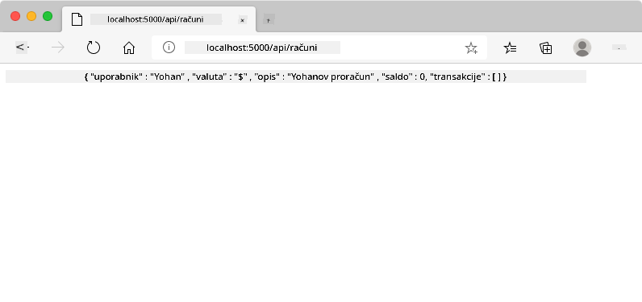
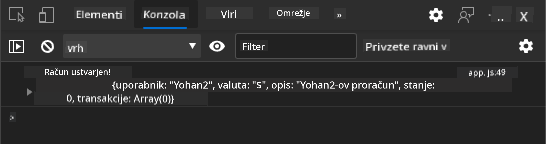
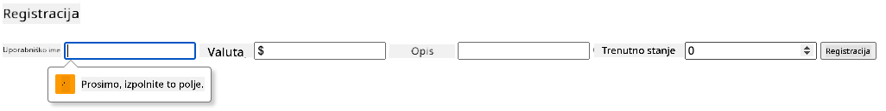
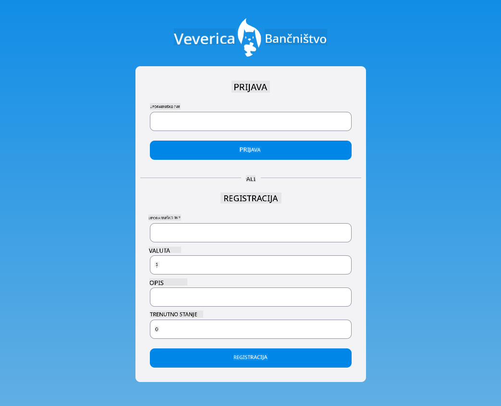

<!--
CO_OP_TRANSLATOR_METADATA:
{
  "original_hash": "b667b7d601e2ee19acb5aa9d102dc9f3",
  "translation_date": "2025-08-27T23:19:42+00:00",
  "source_file": "7-bank-project/2-forms/README.md",
  "language_code": "sl"
}
-->
# Izdelava bančne aplikacije, 2. del: Prijavni in registracijski obrazec

## Predhodni kviz

[Predhodni kviz](https://ashy-river-0debb7803.1.azurestaticapps.net/quiz/43)

### Uvod

Skoraj vse sodobne spletne aplikacije omogočajo ustvarjanje računa, da si zagotovite svoj zasebni prostor. Ker lahko več uporabnikov hkrati dostopa do spletne aplikacije, potrebujete mehanizem za ločeno shranjevanje osebnih podatkov vsakega uporabnika in izbiro, katere informacije prikazati. Ne bomo se poglabljali v [varno upravljanje identitete uporabnikov](https://en.wikipedia.org/wiki/Authentication), saj je to obsežna tema, vendar bomo poskrbeli, da bo vsak uporabnik lahko ustvaril enega (ali več) bančnih računov v naši aplikaciji.

V tem delu bomo uporabili HTML obrazce za dodajanje prijave in registracije v našo spletno aplikacijo. Naučili se bomo, kako podatke programatično poslati strežniškemu API-ju, ter kako določiti osnovna pravila za validacijo uporabniških vnosov.

### Predpogoji

Za to lekcijo morate dokončati [HTML predloge in usmerjanje](../1-template-route/README.md) spletne aplikacije. Prav tako morate namestiti [Node.js](https://nodejs.org) in [zagnati strežniški API](../api/README.md) lokalno, da lahko pošiljate podatke za ustvarjanje računov.

**Pomembno**
Hkrati boste morali imeti odprta dva terminala, kot je navedeno spodaj:
1. Za glavno bančno aplikacijo, ki smo jo izdelali v lekciji [HTML predloge in usmerjanje](../1-template-route/README.md)
2. Za [strežniški API bančne aplikacije](../api/README.md), ki smo ga pravkar nastavili zgoraj.

Oba strežnika morata biti zagnana, da lahko sledite preostanku lekcije. Poslušata na različnih vratih (vrata `3000` in vrata `5000`), zato bi moralo vse delovati brez težav.

Preverite, ali strežnik deluje pravilno, tako da v terminalu izvedete naslednji ukaz:

```sh
curl http://localhost:5000/api
# -> should return "Bank API v1.0.0" as a result
```

---

## Obrazec in kontrolniki

Element `<form>` zajema del HTML dokumenta, kjer lahko uporabnik vnese in pošlje podatke z interaktivnimi kontrolniki. Obstaja veliko različnih uporabniških vmesnikov (UI) kontrolnikov, ki jih lahko uporabite znotraj obrazca, najpogostejša pa sta elementa `<input>` in `<button>`.

Obstaja veliko različnih [tipov](https://developer.mozilla.org/docs/Web/HTML/Element/input) elementa `<input>`. Na primer, za ustvarjanje polja, kjer lahko uporabnik vnese svoje uporabniško ime, lahko uporabite:

```html
<input id="username" name="username" type="text">
```

Atribut `name` bo uporabljen kot ime lastnosti, ko bodo podatki obrazca poslani. Atribut `id` se uporablja za povezavo elementa `<label>` z kontrolnikom obrazca.

> Oglejte si celoten seznam [tipov elementa `<input>`](https://developer.mozilla.org/docs/Web/HTML/Element/input) in [drugih kontrolnikov obrazca](https://developer.mozilla.org/docs/Learn/Forms/Other_form_controls), da dobite predstavo o vseh vgrajenih UI elementih, ki jih lahko uporabite pri gradnji svojega vmesnika.

✅ Upoštevajte, da je `<input>` [prazni element](https://developer.mozilla.org/docs/Glossary/Empty_element), pri katerem *ne* smete dodati ustrezne zapiralne oznake. Lahko pa uporabite samozapiralno oznako `<input/>`, vendar to ni obvezno.

Element `<button>` znotraj obrazca je nekoliko poseben. Če ne določite njegovega atributa `type`, bo samodejno poslal podatke obrazca na strežnik, ko ga pritisnete. Tukaj so možne vrednosti atributa `type`:

- `submit`: Privzeto znotraj `<form>`, gumb sproži dejanje pošiljanja obrazca.
- `reset`: Gumb ponastavi vse kontrolnike obrazca na njihove začetne vrednosti.
- `button`: Ne dodeli privzetega vedenja, ko je gumb pritisnjen. Po želji mu lahko dodelite prilagojena dejanja z uporabo JavaScripta.

### Naloga

Začnimo z dodajanjem obrazca v predlogo `login`. Potrebovali bomo polje za *uporabniško ime* in gumb *Prijava*.

```html
<template id="login">
  <h1>Bank App</h1>
  <section>
    <h2>Login</h2>
    <form id="loginForm">
      <label for="username">Username</label>
      <input id="username" name="user" type="text">
      <button>Login</button>
    </form>
  </section>
</template>
```

Če si podrobneje ogledate, lahko opazite, da smo tukaj dodali tudi element `<label>`. Elementi `<label>` se uporabljajo za dodajanje imena UI kontrolnikom, kot je naše polje za uporabniško ime. Oznake so pomembne za berljivost vaših obrazcev, poleg tega pa prinašajo dodatne koristi:

- Z asociacijo oznake s kontrolnikom obrazca pomagajo uporabnikom, ki uporabljajo pripomočke za dostopnost (npr. bralnik zaslona), da razumejo, katere podatke morajo vnesti.
- Klik na oznako neposredno postavi fokus na povezani vnos, kar olajša dostop na napravah z zaslonom na dotik.

> [Dostopnost](https://developer.mozilla.org/docs/Learn/Accessibility/What_is_accessibility) na spletu je zelo pomembna tema, ki je pogosto spregledana. Zahvaljujoč [semantičnim HTML elementom](https://developer.mozilla.org/docs/Learn/Accessibility/HTML) ni težko ustvariti dostopne vsebine, če jih pravilno uporabljate. [Preberite več o dostopnosti](https://developer.mozilla.org/docs/Web/Accessibility), da se izognete pogostim napakam in postanete odgovoren razvijalec.

Zdaj bomo dodali drugi obrazec za registracijo, takoj pod prejšnjim:

```html
<hr/>
<h2>Register</h2>
<form id="registerForm">
  <label for="user">Username</label>
  <input id="user" name="user" type="text">
  <label for="currency">Currency</label>
  <input id="currency" name="currency" type="text" value="$">
  <label for="description">Description</label>
  <input id="description" name="description" type="text">
  <label for="balance">Current balance</label>
  <input id="balance" name="balance" type="number" value="0">
  <button>Register</button>
</form>
```

Z uporabo atributa `value` lahko določimo privzeto vrednost za določen vnos.
Opazite tudi, da ima vnos za `balance` tip `number`. Ali izgleda drugače kot drugi vnosi? Poskusite interakcijo z njim.

✅ Ali lahko obrazce navigirate in uporabljate samo s tipkovnico? Kako bi to storili?

## Pošiljanje podatkov na strežnik

Zdaj, ko imamo funkcionalni UI, je naslednji korak pošiljanje podatkov na strežnik. Naredimo hiter test z našo trenutno kodo: kaj se zgodi, če kliknete na gumb *Prijava* ali *Registracija*?

Ste opazili spremembo v URL-ju vašega brskalnika?


Privzeto dejanje za `<form>` je pošiljanje obrazca na trenutni URL strežnika z uporabo [GET metode](https://www.w3.org/Protocols/rfc2616/rfc2616-sec9.html#sec9.3), pri čemer se podatki obrazca neposredno dodajo URL-ju. Ta metoda ima nekaj pomanjkljivosti:

- Poslani podatki so zelo omejeni po velikosti (približno 2000 znakov)
- Podatki so neposredno vidni v URL-ju (ni idealno za gesla)
- Ne deluje z nalaganjem datotek

Zato jo lahko spremenite, da uporabite [POST metodo](https://www.w3.org/Protocols/rfc2616/rfc2616-sec9.html#sec9.5), ki pošlje podatke obrazca na strežnik v telesu HTTP zahteve, brez prejšnjih omejitev.

> Čeprav je POST najpogosteje uporabljena metoda za pošiljanje podatkov, [v nekaterih specifičnih scenarijih](https://www.w3.org/2001/tag/doc/whenToUseGet.html) je bolje uporabiti GET metodo, na primer pri implementaciji iskalnega polja.

### Naloga

Dodajte lastnosti `action` in `method` obrazcu za registracijo:

```html
<form id="registerForm" action="//localhost:5000/api/accounts" method="POST">
```

Zdaj poskusite registrirati nov račun z vašim imenom. Po kliku na gumb *Registracija* bi morali videti nekaj takega:



Če gre vse po načrtih, bi moral strežnik odgovoriti na vašo zahtevo z [JSON](https://www.json.org/json-en.html) odzivom, ki vsebuje podatke o ustvarjenem računu.

✅ Poskusite se ponovno registrirati z istim imenom. Kaj se zgodi?

## Pošiljanje podatkov brez osveževanja strani

Kot ste verjetno opazili, je pri pristopu, ki smo ga pravkar uporabili, majhna težava: ob pošiljanju obrazca zapustimo našo aplikacijo in brskalnik preusmeri na URL strežnika. Poskušamo se izogniti vsem osvežitvam strani v naši spletni aplikaciji, saj izdelujemo [enostransko aplikacijo (SPA)](https://en.wikipedia.org/wiki/Single-page_application).

Da pošljemo podatke obrazca na strežnik brez prisilnega osveževanja strani, moramo uporabiti JavaScript kodo. Namesto da v lastnost `action` elementa `<form>` vnesete URL, lahko uporabite katero koli JavaScript kodo, ki ji predhodite z nizom `javascript:`, da izvedete prilagojeno dejanje. Uporaba tega pomeni tudi, da boste morali implementirati nekatere naloge, ki jih je prej samodejno opravil brskalnik:

- Pridobitev podatkov obrazca
- Pretvorba in kodiranje podatkov obrazca v ustrezen format
- Ustvarjanje HTTP zahteve in pošiljanje na strežnik

### Naloga

Zamenjajte lastnost `action` obrazca za registracijo z:

```html
<form id="registerForm" action="javascript:register()">
```

Odprite `app.js` in dodajte novo funkcijo z imenom `register`:

```js
function register() {
  const registerForm = document.getElementById('registerForm');
  const formData = new FormData(registerForm);
  const data = Object.fromEntries(formData);
  const jsonData = JSON.stringify(data);
}
```

Tukaj pridobimo element obrazca z uporabo `getElementById()` in uporabimo pripomoček [`FormData`](https://developer.mozilla.org/docs/Web/API/FormData), da izvlečemo vrednosti iz kontrolnikov obrazca kot niz ključ/vrednost. Nato podatke pretvorimo v običajen objekt z uporabo [`Object.fromEntries()`](https://developer.mozilla.org/docs/Web/JavaScript/Reference/Global_Objects/Object/fromEntries) in jih na koncu serializiramo v [JSON](https://www.json.org/json-en.html), format, ki se pogosto uporablja za izmenjavo podatkov na spletu.

Podatki so zdaj pripravljeni za pošiljanje na strežnik. Ustvarite novo funkcijo z imenom `createAccount`:

```js
async function createAccount(account) {
  try {
    const response = await fetch('//localhost:5000/api/accounts', {
      method: 'POST',
      headers: { 'Content-Type': 'application/json' },
      body: account
    });
    return await response.json();
  } catch (error) {
    return { error: error.message || 'Unknown error' };
  }
}
```

Kaj počne ta funkcija? Najprej opazite ključni besedi `async` tukaj. To pomeni, da funkcija vsebuje kodo, ki se bo izvajala [**asinhrono**](https://developer.mozilla.org/docs/Web/JavaScript/Reference/Statements/async_function). Ko jo uporabimo skupaj s ključno besedo `await`, omogoča čakanje na izvajanje asinhrone kode - na primer čakanje na odgovor strežnika - preden nadaljujemo.

Tukaj je kratek video o uporabi `async/await`:

[](https://youtube.com/watch?v=YwmlRkrxvkk "Async in Await za upravljanje obljub")

> 🎥 Kliknite zgornjo sliko za video o async/await.

Uporabimo API `fetch()` za pošiljanje JSON podatkov na strežnik. Ta metoda sprejme 2 parametra:

- URL strežnika, zato tukaj ponovno vnesemo `//localhost:5000/api/accounts`.
- Nastavitve zahteve. Tukaj nastavimo metodo na `POST` in zagotovimo `body` zahteve. Ker pošiljamo JSON podatke na strežnik, moramo nastaviti tudi glavo `Content-Type` na `application/json`, da strežnik ve, kako interpretirati vsebino.

Ker bo strežnik odgovoril na zahtevo z JSON, lahko uporabimo `await response.json()` za razčlenitev JSON vsebine in vrnitev rezultirajočega objekta. Upoštevajte, da je ta metoda asinhrona, zato tukaj uporabimo ključno besedo `await`, da zagotovimo, da se morebitne napake med razčlenjevanjem ujamejo.

Zdaj dodajte nekaj kode v funkcijo `register`, da pokličete `createAccount()`:

```js
const result = await createAccount(jsonData);
```

Ker tukaj uporabljamo ključno besedo `await`, moramo dodati ključno besedo `async` pred funkcijo register:

```js
async function register() {
```

Na koncu dodajmo nekaj zapisov za preverjanje rezultata. Končna funkcija bi morala izgledati takole:

```js
async function register() {
  const registerForm = document.getElementById('registerForm');
  const formData = new FormData(registerForm);
  const jsonData = JSON.stringify(Object.fromEntries(formData));
  const result = await createAccount(jsonData);

  if (result.error) {
    return console.log('An error occurred:', result.error);
  }

  console.log('Account created!', result);
}
```

To je bilo nekoliko daljše, vendar smo prišli do cilja! Če odprete [orodja za razvijalce brskalnika](https://developer.mozilla.org/docs/Learn/Common_questions/What_are_browser_developer_tools) in poskusite registrirati nov račun, ne bi smeli opaziti nobene spremembe na spletni strani, vendar se bo v konzoli prikazalo sporočilo, ki potrjuje, da vse deluje.



✅ Ali menite, da so podatki poslani na strežnik varno? Kaj če bi nekdo lahko prestregel zahtevo? Preberite več o [HTTPS](https://en.wikipedia.org/wiki/HTTPS), da izveste več o varni komunikaciji podatkov.

## Validacija podatkov

Če poskusite registrirati nov račun brez vnosa uporabniškega imena, lahko vidite, da strežnik vrne napako s statusno kodo [400 (Slaba zahteva)](https://developer.mozilla.org/docs/Web/HTTP/Status/400#:~:text=The%20HyperText%20Transfer%20Protocol%20(HTTP,%2C%20or%20deceptive%20request%20routing).).

Pred pošiljanjem podatkov na strežnik je dobra praksa, da [validirate podatke obrazca](https://developer.mozilla.org/docs/Learn/Forms/Form_validation) vnaprej, kadar je to mogoče, da zagotovite, da pošljete veljavno zahtevo. HTML5 kontrolniki obrazcev omogočajo vgrajeno validacijo z uporabo različnih atributov:

- `required`: polje mora biti izpolnjeno, sicer obrazca ni mogoče poslati.
- `minlength` in `maxlength`: določata minimalno in maksimalno število znakov v besedilnih poljih.
- `min` in `max`: določata minimalno in maksimalno vrednost numeričnega polja.
- `type`: določa vrsto pričakovanih podatkov, kot so `number`, `email`, `file` ali [druge vgrajene vrste](https://developer.mozilla.org/docs/Web/HTML/Element/input). Ta atribut lahko spremeni tudi vizualni prikaz kontrolnika obrazca.
- `pattern`: omogoča določitev vzorca [regularnega izraza](https://developer.mozilla.org/docs/Web/JavaScript/Guide/Regular_Expressions) za preverjanje, ali so vneseni podatki veljavni.
Namig: videz kontrolnikov obrazca lahko prilagodite glede na to, ali so veljavni ali ne, z uporabo CSS psevdo-razredov `:valid` in `:invalid`.
### Naloga

Za ustvarjanje veljavnega novega računa sta potrebni dve obvezni polji: uporabniško ime in valuta, ostala polja so neobvezna. Posodobite HTML obrazca tako, da uporabite atribut `required` in besedilo v oznaki polja, da:

```html
<label for="user">Username (required)</label>
<input id="user" name="user" type="text" required>
...
<label for="currency">Currency (required)</label>
<input id="currency" name="currency" type="text" value="$" required>
```

Čeprav ta posebna strežniška implementacija ne uveljavlja specifičnih omejitev glede največje dolžine polj, je vedno dobra praksa določiti razumne omejitve za vnos besedila uporabnika.

Dodajte atribut `maxlength` v besedilna polja:

```html
<input id="user" name="user" type="text" maxlength="20" required>
...
<input id="currency" name="currency" type="text" value="$" maxlength="5" required>
...
<input id="description" name="description" type="text" maxlength="100">
```

Zdaj, če pritisnete gumb *Registriraj* in polje ne upošteva pravila za validacijo, ki smo ga določili, bi morali videti nekaj takega:



Validacija, ki se izvede *preden* se podatki pošljejo na strežnik, se imenuje **validacija na strani odjemalca**. Vendar pa ni vedno mogoče izvesti vseh preverjanj brez pošiljanja podatkov. Na primer, tukaj ne moremo preveriti, ali račun z istim uporabniškim imenom že obstaja, ne da bi poslali zahtevo na strežnik. Dodatna validacija, ki se izvede na strežniku, se imenuje **validacija na strani strežnika**.

Običajno je treba implementirati obe vrsti validacije. Medtem ko validacija na strani odjemalca izboljša uporabniško izkušnjo z zagotavljanjem takojšnjih povratnih informacij uporabniku, je validacija na strani strežnika ključna za zagotavljanje, da so uporabniški podatki, s katerimi upravljate, pravilni in varni.

---

## 🚀 Izziv

Prikažite sporočilo o napaki v HTML-ju, če uporabnik že obstaja.

Tukaj je primer, kako lahko končna stran za prijavo izgleda po nekaj oblikovanja:



## Kviz po predavanju

[Kviz po predavanju](https://ashy-river-0debb7803.1.azurestaticapps.net/quiz/44)

## Pregled in samostojno učenje

Razvijalci so postali zelo ustvarjalni pri svojih prizadevanjih za gradnjo obrazcev, še posebej glede strategij validacije. Spoznajte različne tokove obrazcev tako, da prebrskate [CodePen](https://codepen.com); ali lahko najdete zanimive in navdihujoče obrazce?

## Naloga

[Oblikujte svojo bančno aplikacijo](assignment.md)

---

**Omejitev odgovornosti**:  
Ta dokument je bil preveden z uporabo storitve za prevajanje z umetno inteligenco [Co-op Translator](https://github.com/Azure/co-op-translator). Čeprav si prizadevamo za natančnost, vas prosimo, da upoštevate, da lahko avtomatizirani prevodi vsebujejo napake ali netočnosti. Izvirni dokument v njegovem maternem jeziku je treba obravnavati kot avtoritativni vir. Za ključne informacije priporočamo profesionalni človeški prevod. Ne prevzemamo odgovornosti za morebitna napačna razumevanja ali napačne interpretacije, ki bi nastale zaradi uporabe tega prevoda.