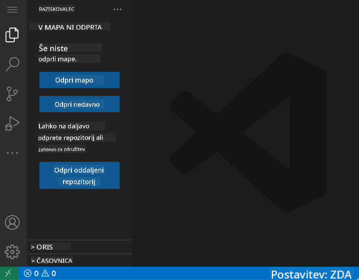
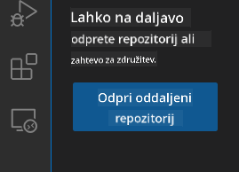
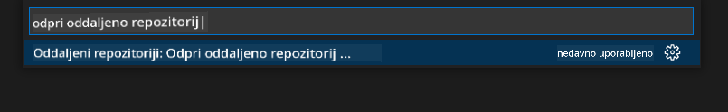
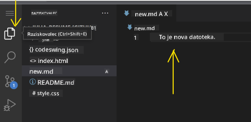
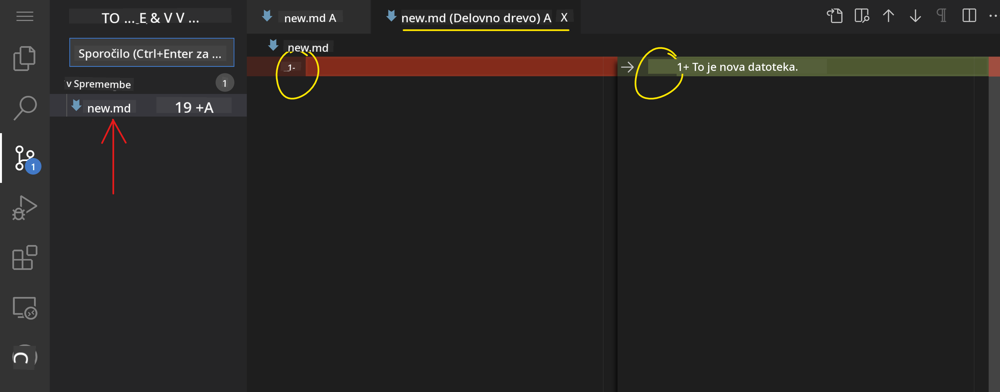
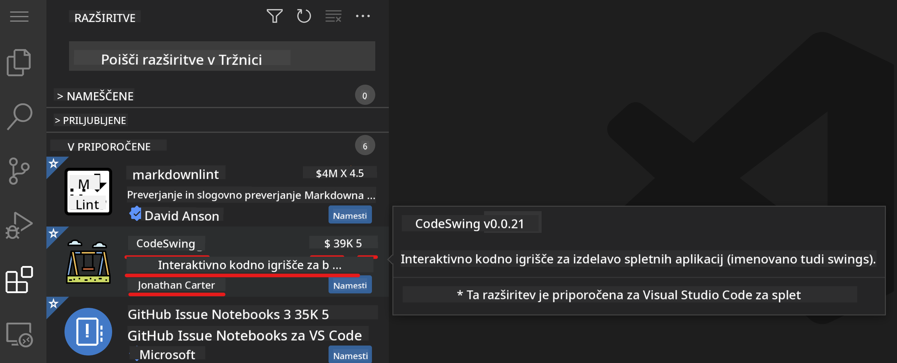
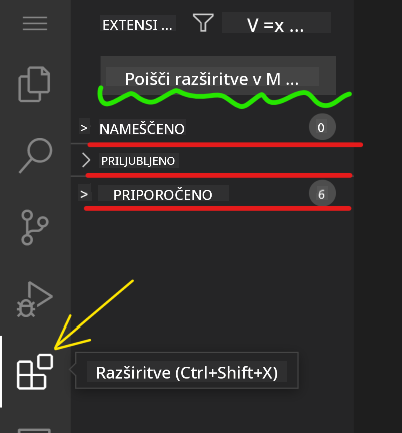
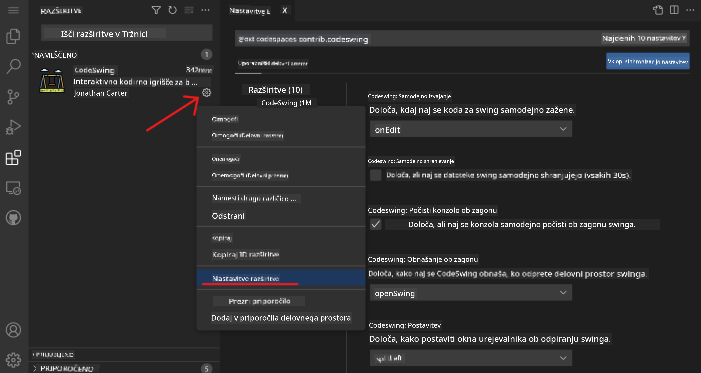

<!--
CO_OP_TRANSLATOR_METADATA:
{
  "original_hash": "7aa6e4f270d38d9cb17f2b5bd86b863d",
  "translation_date": "2025-08-28T00:08:32+00:00",
  "source_file": "8-code-editor/1-using-a-code-editor/README.md",
  "language_code": "sl"
}
-->
# Uporaba urejevalnika kode

Ta lekcija zajema osnove uporabe [VSCode.dev](https://vscode.dev), spletnega urejevalnika kode, ki vam omogoča spreminjanje kode in prispevanje k projektu brez potrebe po nameščanju programske opreme na vaš računalnik.

## Cilji učenja

V tej lekciji boste spoznali, kako:

- Uporabljati urejevalnik kode v projektu
- Spremljati spremembe z uporabo sistema za nadzor različic
- Prilagoditi urejevalnik za razvoj

### Predpogoji

Preden začnete, morate ustvariti račun na [GitHub](https://github.com). Obiščite [GitHub](https://github.com/) in ustvarite račun, če ga še nimate.

### Uvod

Urejevalnik kode je ključno orodje za pisanje programov in sodelovanje pri obstoječih projektih. Ko boste razumeli osnove urejevalnika in kako izkoristiti njegove funkcije, jih boste lahko uporabili pri pisanju kode.

## Začetek z VSCode.dev

[VSCode.dev](https://vscode.dev) je spletni urejevalnik kode. Za njegovo uporabo ni potrebno ničesar nameščati, podobno kot pri odpiranju katere koli druge spletne strani. Za začetek odprite naslednjo povezavo: [https://vscode.dev](https://vscode.dev). Če niste prijavljeni v [GitHub](https://github.com/), sledite navodilom za prijavo ali ustvarite nov račun in se nato prijavite.

Ko se stran naloži, bi morala izgledati podobno kot na tej sliki:



Obstajajo tri glavne sekcije, od leve proti desni:

1. _Aktivnostna vrstica_, ki vključuje nekaj ikon, kot so povečevalno steklo 🔎, zobnik ⚙️ in še nekaj drugih.
2. Razširjena aktivnostna vrstica, ki privzeto prikazuje _Raziskovalec_ (Explorer), imenovana _stranska vrstica_.
3. In nazadnje, območje za kodo na desni strani.

Kliknite na vsako od ikon, da prikažete različne menije. Ko končate, kliknite na _Raziskovalec_, da se vrnete na začetno točko.

Ko začnete ustvarjati ali spreminjati kodo, se to dogaja v največjem območju na desni strani. To območje boste uporabili tudi za pregled obstoječe kode, kar boste storili v naslednjem koraku.

## Odprite GitHub repozitorij

Prva stvar, ki jo potrebujete, je odpreti GitHub repozitorij. Obstaja več načinov za odpiranje repozitorija. V tem razdelku boste spoznali dva različna načina, kako lahko odprete repozitorij in začnete delati na spremembah.

### 1. Z urejevalnikom

Uporabite urejevalnik za odpiranje oddaljenega repozitorija. Če obiščete [VSCode.dev](https://vscode.dev), boste videli gumb _"Open Remote Repository"_:



Lahko uporabite tudi ukazno paleto. Ukazna paleta je vnosno polje, kjer lahko vtipkate katero koli besedo, ki je del ukaza ali dejanja, da najdete pravi ukaz za izvedbo. Uporabite meni v zgornjem levem kotu, nato izberite _View_ in nato _Command Palette_, ali pa uporabite naslednjo bližnjico na tipkovnici: Ctrl-Shift-P (na MacOS Command-Shift-P).



Ko se meni odpre, vtipkajte _open remote repository_ in nato izberite prvo možnost. Prikazali se bodo repozitoriji, katerih del ste, ali tisti, ki ste jih nedavno odprli. Uporabite lahko tudi celoten URL GitHub repozitorija. Uporabite naslednji URL in ga prilepite v polje:

```
https://github.com/microsoft/Web-Dev-For-Beginners
```

✅ Če je bilo uspešno, boste videli vse datoteke tega repozitorija naložene v urejevalniku besedila.

### 2. Z uporabo URL-ja

Lahko uporabite tudi URL neposredno za nalaganje repozitorija. Na primer, celoten URL trenutnega repozitorija je [https://github.com/microsoft/Web-Dev-For-Beginners](https://github.com/microsoft/Web-Dev-For-Beginners), vendar lahko zamenjate domeno GitHub z `VSCode.dev/github` in repozitorij naložite neposredno. Rezultirajoči URL bi bil [https://vscode.dev/github/microsoft/Web-Dev-For-Beginners](https://vscode.dev/github/microsoft/Web-Dev-For-Beginners).

## Urejanje datotek

Ko odprete repozitorij v brskalniku/vscode.dev, je naslednji korak posodobitev ali sprememba projekta.

### 1. Ustvarite novo datoteko

Datoteko lahko ustvarite znotraj obstoječe mape ali v korenskem imeniku/mapi. Za ustvarjanje nove datoteke odprite lokacijo/mapo, kamor želite shraniti datoteko, in izberite ikono _'New file ...'_ na aktivnostni vrstici _(levo)_, poimenujte datoteko in pritisnite Enter.


### 2. Uredite in shranite datoteko v repozitoriju

Uporaba vscode.dev je koristna, kadar želite hitro posodobiti svoj projekt brez nalaganja programske opreme lokalno.  
Za posodobitev kode kliknite ikono 'Raziskovalec', ki se nahaja tudi na aktivnostni vrstici, da si ogledate datoteke in mape v repozitoriju.  
Izberite datoteko, da jo odprete v območju za kodo, naredite spremembe in shranite.



Ko končate s posodabljanjem projekta, izberite ikono _`source control`_, ki vsebuje vse nove spremembe, ki ste jih naredili v repozitoriju.

Za ogled sprememb, ki ste jih naredili v projektu, izberite datoteko(-e) v mapi `Changes` na razširjeni aktivnostni vrstici. To bo odprlo 'Delovno drevo' (Working Tree), kjer boste vizualno videli spremembe, ki ste jih naredili v datoteki. Rdeča barva označuje izbris, zelena pa dodatek.



Če ste zadovoljni s spremembami, ki ste jih naredili, se pomaknite na mapo `Changes` in kliknite gumb `+`, da pripravite spremembe za oddajo (staging). Priprava pomeni, da spremembe pripravite za oddajo na GitHub.

Če pa niste zadovoljni z nekaterimi spremembami in jih želite zavreči, se pomaknite na mapo `Changes` in izberite ikono `undo`.

Nato vnesite `commit message` _(opis spremembe, ki ste jo naredili v projektu)_, kliknite ikono `check`, da oddate in potisnete spremembe.

Ko končate z delom na projektu, izberite ikono `hamburger menu` v zgornjem levem kotu, da se vrnete na repozitorij na github.com.


## Uporaba razširitev

Namestitev razširitev v VSCode omogoča dodajanje novih funkcij in prilagoditev okolja za razvoj v urejevalniku, kar izboljša vaš potek dela. Te razširitve omogočajo tudi podporo za več programskih jezikov in so pogosto bodisi splošne bodisi jezikovno specifične.

Za pregled seznama vseh razpoložljivih razširitev kliknite ikono _`Extensions`_ na aktivnostni vrstici in začnite tipkati ime razširitve v iskalno polje z oznako _'Search Extensions in Marketplace'_.  
Videli boste seznam razširitev, vsaka vsebuje **ime razširitve, ime založnika, enovrstični opis, število prenosov** in **oceno z zvezdicami**.



Prav tako si lahko ogledate vse že nameščene razširitve z razširitvijo mape _`Installed`_, priljubljene razširitve, ki jih uporablja večina razvijalcev, v mapi _`Popular`_ in priporočene razširitve za vas bodisi na podlagi uporabnikov v istem delovnem prostoru bodisi na podlagi nedavno odprtih datotek v mapi _`Recommended`_.



### 1. Namestitev razširitev

Za namestitev razširitve vtipkajte ime razširitve v iskalno polje in kliknite nanjo, da si ogledate dodatne informacije o razširitvi v območju za kodo, ko se prikaže na razširjeni aktivnostni vrstici.

Lahko kliknete _modri gumb za namestitev_ na razširjeni aktivnostni vrstici za namestitev ali uporabite gumb za namestitev, ki se prikaže v območju za kodo, ko izberete razširitev za nalaganje dodatnih informacij.


### 2. Prilagoditev razširitev

Po namestitvi razširitve boste morda morali prilagoditi njeno delovanje glede na svoje želje. To storite tako, da izberete ikono Razširitve, kjer se bo vaša razširitev zdaj pojavila v mapi _Installed_. Kliknite na _**ikono zobnika**_ in pojdite na _Extensions Setting_.



### 3. Upravljanje razširitev

Po namestitvi in uporabi razširitve vam vscode.dev ponuja možnosti za upravljanje razširitev glede na različne potrebe. Na primer, lahko izberete:

- **Onemogoči:** _(Začasno onemogočite razširitev, ko je ne potrebujete, vendar je ne želite popolnoma odstraniti.)_

    Izberite nameščeno razširitev na razširjeni aktivnostni vrstici > kliknite ikono zobnika > izberite 'Disable' ali 'Disable (Workspace)' **ALI** odprite razširitev v območju za kodo in kliknite modri gumb Disable.

- **Odstrani:** Izberite nameščeno razširitev na razširjeni aktivnostni vrstici > kliknite ikono zobnika > izberite 'Uninstall' **ALI** odprite razširitev v območju za kodo in kliknite modri gumb Uninstall.

---

## Naloga

[Ustvarite spletno stran življenjepisa z uporabo vscode.dev](https://github.com/microsoft/Web-Dev-For-Beginners/blob/main/8-code-editor/1-using-a-code-editor/assignment.md)

## Pregled in samostojno učenje

Preberite več o [VSCode.dev](https://code.visualstudio.com/docs/editor/vscode-web?WT.mc_id=academic-0000-alfredodeza) in nekaterih njegovih drugih funkcijah.

---

**Omejitev odgovornosti**:  
Ta dokument je bil preveden z uporabo storitve za prevajanje z umetno inteligenco [Co-op Translator](https://github.com/Azure/co-op-translator). Čeprav si prizadevamo za natančnost, vas prosimo, da upoštevate, da lahko avtomatizirani prevodi vsebujejo napake ali netočnosti. Izvirni dokument v njegovem maternem jeziku je treba obravnavati kot avtoritativni vir. Za ključne informacije priporočamo profesionalni človeški prevod. Ne prevzemamo odgovornosti za morebitna nesporazumevanja ali napačne razlage, ki bi nastale zaradi uporabe tega prevoda.