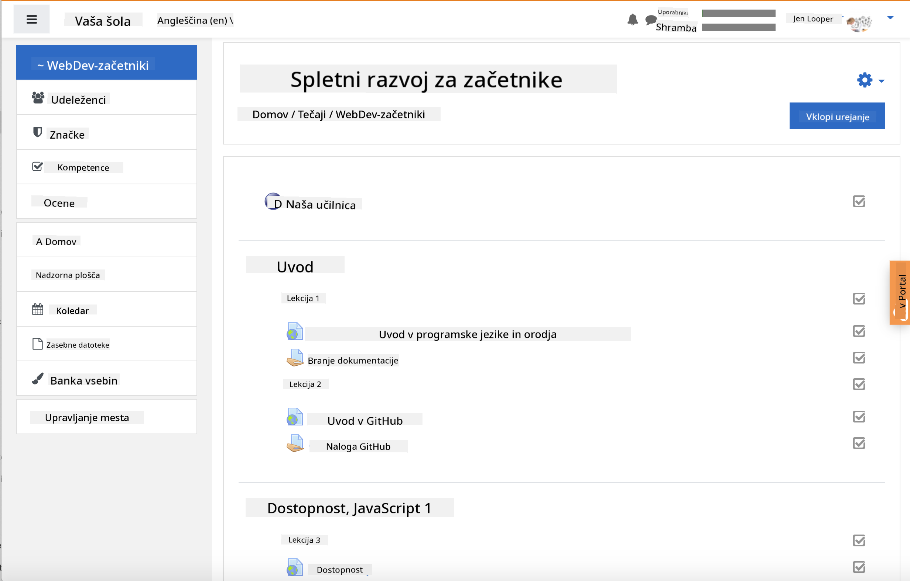
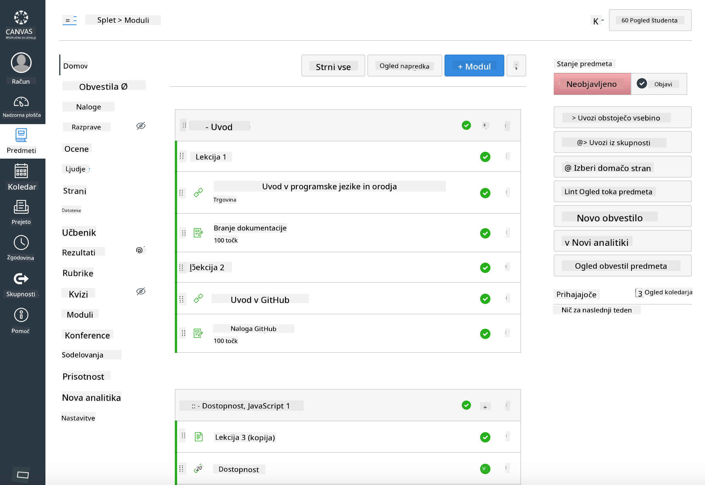

<!--
CO_OP_TRANSLATOR_METADATA:
{
  "original_hash": "75cb51f7ca9ea0b097ef4a1287e9290c",
  "translation_date": "2025-08-27T23:12:50+00:00",
  "source_file": "for-teachers.md",
  "language_code": "sl"
}
-->
## Za učitelje

Bi radi uporabili ta učni načrt v svojem razredu? Kar izvolite!

Pravzaprav ga lahko uporabite kar znotraj GitHuba, tako da uporabite GitHub Classroom.

Za to morate narediti fork tega repozitorija. Za vsako lekcijo boste morali ustvariti ločen repozitorij, zato boste morali vsako mapo izvleči v ločen repozitorij. Na ta način lahko [GitHub Classroom](https://classroom.github.com/classrooms) obravnava vsako lekcijo posebej.

Te [celovite instrukcije](https://github.blog/2020-03-18-set-up-your-digital-classroom-with-github-classroom/) vam bodo dale idejo, kako postaviti svoj razred.

## Uporaba v Moodle, Canvas ali Blackboard

Ta učni načrt se odlično obnese v teh sistemih za upravljanje učenja! Uporabite [Moodle datoteko za nalaganje](../../../../../../../teaching-files/webdev-moodle.mbz) za celotno vsebino ali pa poskusite [Common Cartridge datoteko](../../../../../../../teaching-files/webdev-common-cartridge.imscc), ki vsebuje del vsebine. Moodle Cloud ne podpira celovitih izvozov Common Cartridge, zato je bolje uporabiti Moodle datoteko za prenos, ki jo lahko naložite v Canvas. Prosimo, sporočite nam, kako lahko izboljšamo to izkušnjo.

> Učni načrt v učilnici Moodle

> Učni načrt v Canvas

## Uporaba repozitorija v trenutni obliki

Če želite uporabiti ta repozitorij v trenutni obliki, brez uporabe GitHub Classroom, je to prav tako mogoče. Svojim študentom boste morali sporočiti, katero lekcijo naj skupaj obdelajo.

V spletnem formatu (Zoom, Teams ali drugo) lahko oblikujete ločene sobe za kvize in mentorirate študente, da se pripravijo na učenje. Nato povabite študente k kvizom in naj svoje odgovore oddajo kot 'issues' ob določenem času. Enako lahko storite z nalogami, če želite, da študenti sodelujejo javno.

Če imate raje bolj zaseben format, prosite študente, naj za vsak učni načrt posebej naredijo fork v svoje GitHub repozitorije kot zasebne repozitorije in vam omogočijo dostop. Nato lahko kvize in naloge opravijo zasebno ter jih oddajo prek issues na vašem razrednem repozitoriju.

Obstaja veliko načinov, kako to prilagoditi spletnemu učnemu okolju. Prosimo, sporočite nam, kaj vam najbolj ustreza!

## Prosimo, delite svoje mnenje!

Želimo, da ta učni načrt deluje za vas in vaše študente. Povežite se z nami na [učiteljski kotiček](https://github.com/microsoft/Web-Dev-For-Beginners/discussions/categories/teacher-corner) in odprite [**novo težavo**](https://github.com/microsoft/Web-Dev-For-Beginners/issues/new/choose) za kakršnekoli zahteve, napake ali povratne informacije.

---

**Omejitev odgovornosti**:  
Ta dokument je bil preveden z uporabo storitve za prevajanje z umetno inteligenco [Co-op Translator](https://github.com/Azure/co-op-translator). Čeprav si prizadevamo za natančnost, vas prosimo, da upoštevate, da lahko avtomatizirani prevodi vsebujejo napake ali netočnosti. Izvirni dokument v njegovem izvirnem jeziku je treba obravnavati kot avtoritativni vir. Za ključne informacije priporočamo profesionalni človeški prevod. Ne prevzemamo odgovornosti za morebitna napačna razumevanja ali napačne interpretacije, ki bi nastale zaradi uporabe tega prevoda.